## VMWare

## 安装Vmware Workstation Pro 16：

[Download VMware Workstation Pro](https://dl.cra.moe/CS302-OS-2025-Spring/)

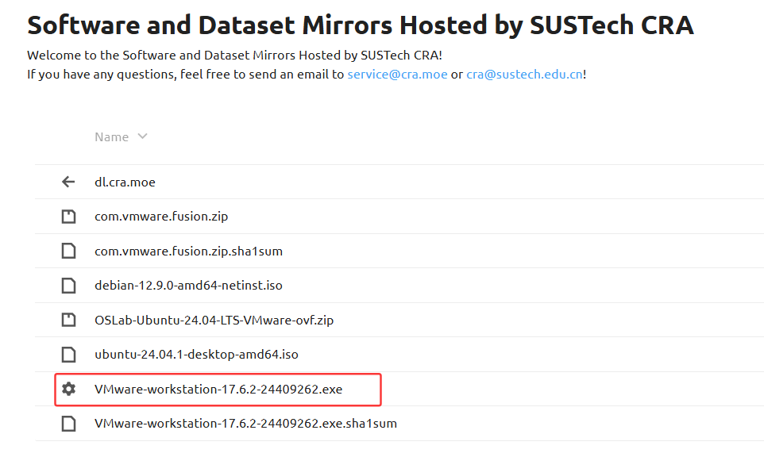

## 安装ubuntu 24.04

[Download Ubuntu 24.04](https://dl.cra.moe/CS302-OS-2025-Spring/)

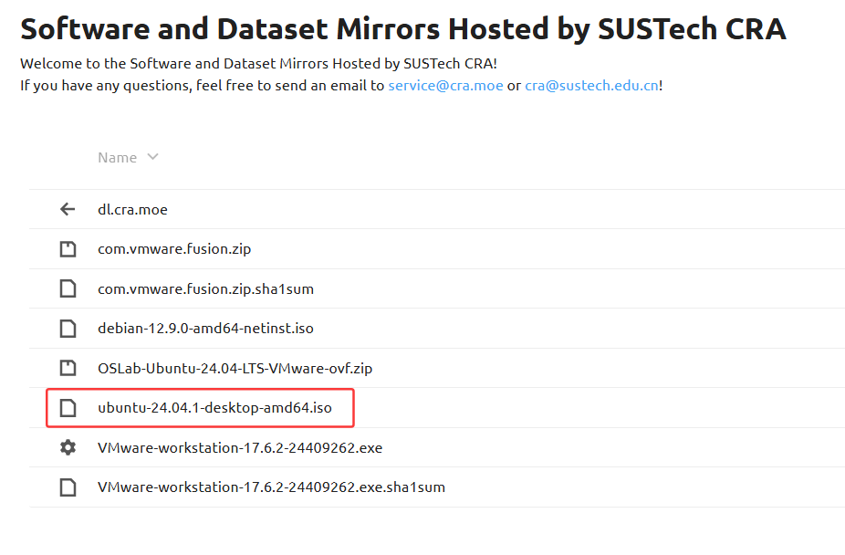

## 在Vmware中安装ubuntu虚拟机：

选择`创建新的虚拟机`

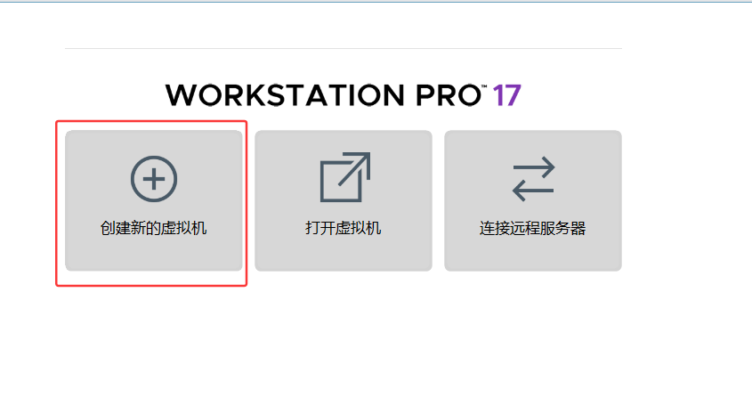

选择创建新的虚拟机：

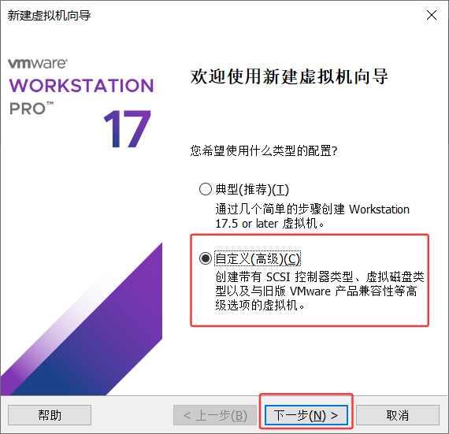

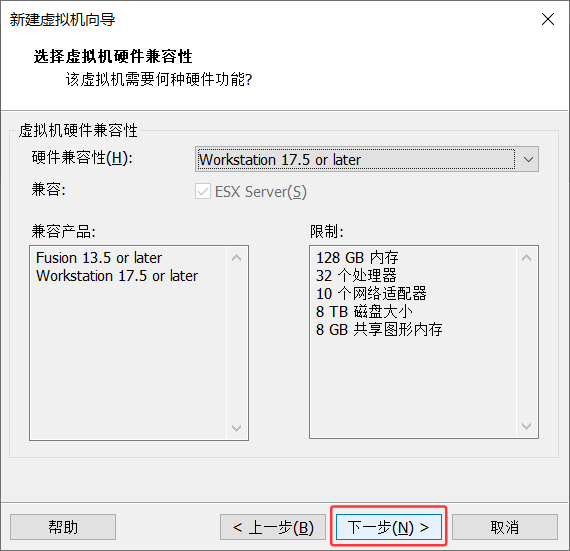

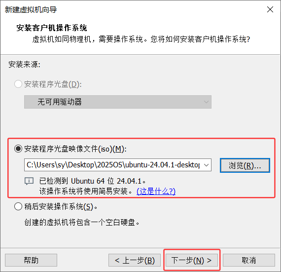

虚拟机用户名中需包含学号（用户名不接受纯数字）

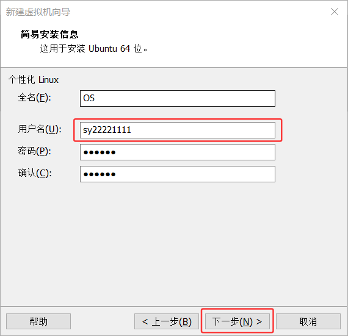

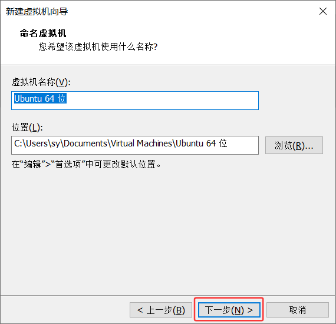

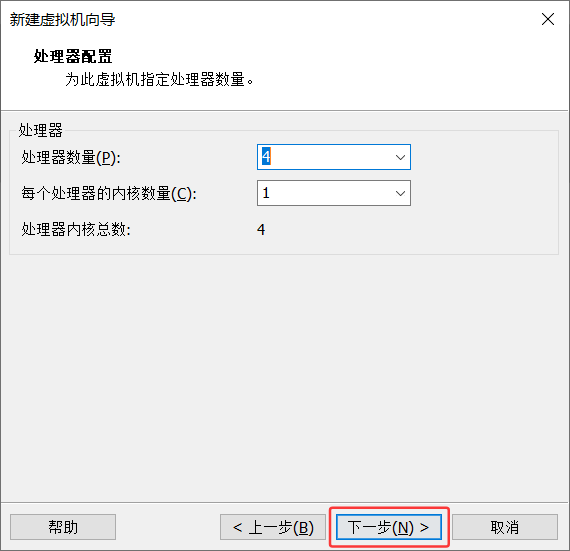

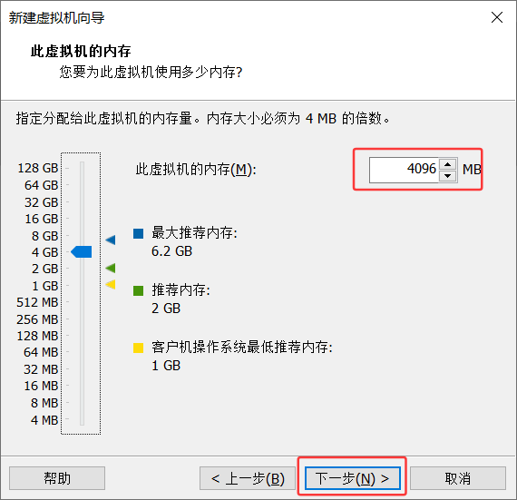

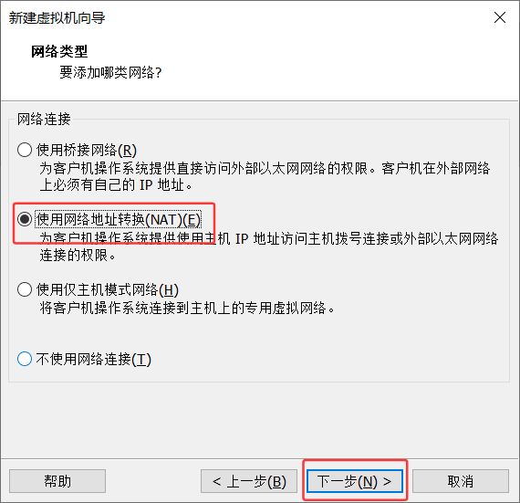

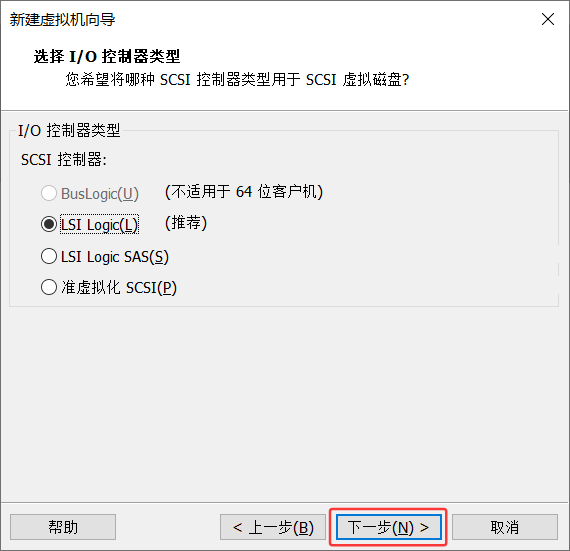

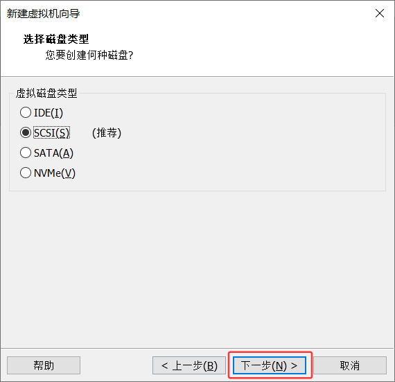

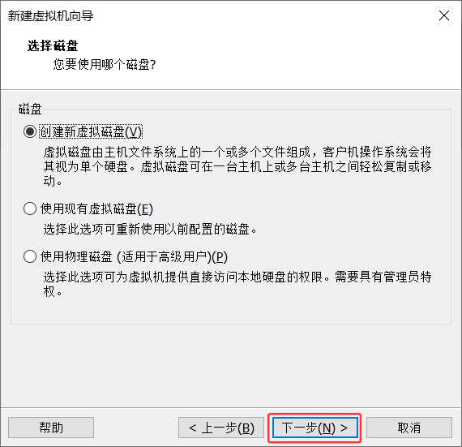

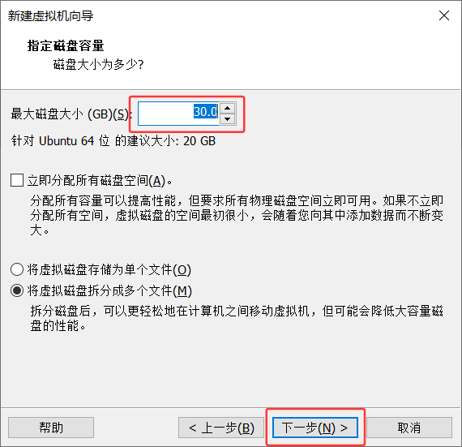

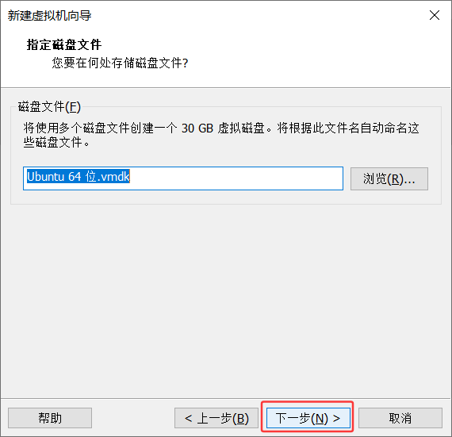

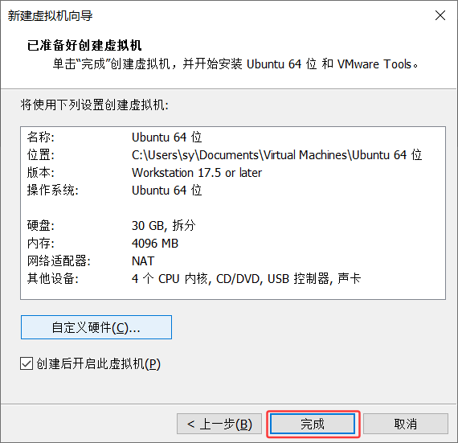

一直点下一步，直到完成。之后运行虚拟机完成虚拟机安装即可。

sudo apt update && sudo apt install gcc-riscv64-unknown-elf qemu-system-misc git make cmake python3-pip elfutils gdb-multiarch

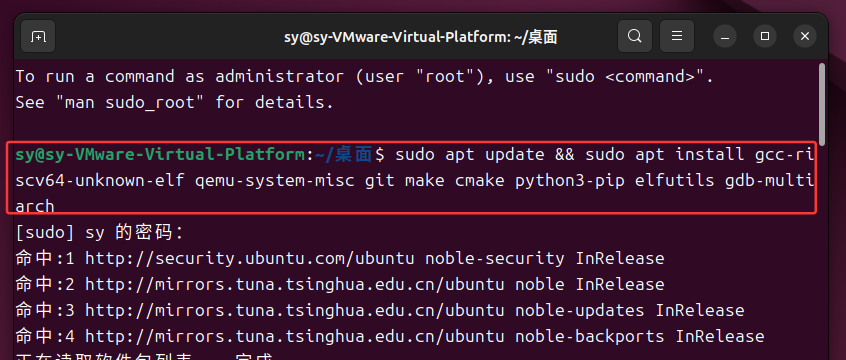

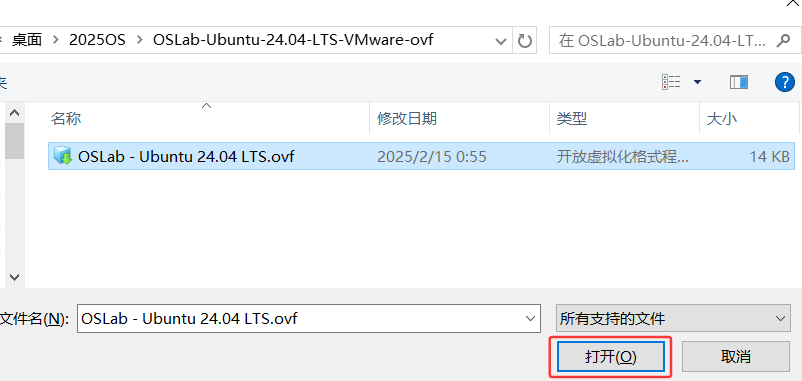

