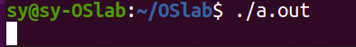

## Linux基础

!!! note

    在完成本实验前，请参照`实验环境搭建`完成实验环境的配置

本部分内容中，我们会通过实验步骤熟悉Linux的常用命令，从而对Linux系统有一个初步了解。

### Step 1. 打开terminal

Terminal（终端）是一个命令行界面，用户可以通过输入文本命令与操作系统进行交互。它是 Ubuntu 和其他基于 Linux 的操作系统的核心工具之一，允许用户执行各种任务，如文件管理、软件安装、系统配置等。

可以通过以下三种方式打开终端terminal

- 使用快捷键：`Ctrl + Alt + T`
- 在Show Applications中搜索Terminal后单击打开
- 在桌面或者文件夹内点击鼠标右键，选择Open in Terminal

下图是Terminal的一个基本界面

> 上图中：
> - sy-OSlab代表当前主机名
> - sy代表当前用户名
> - ~/Desktop代表当前工作目录，相当于你的所有命令都是在这个目录执行的
> - ~代表相对路径“/home/用户名”，相当于当前用户所属的目录
> - $代表目前用户为普通用户非管理员用户
> - 通过键盘的上、下按钮可以选择历史命令
> - 通过输入部分路径或文件名后点击Tab键可以自动补全

> ### CUI vs GUI
>
> CUI(Command User Interface)，命令行用户接口，用户通过文本命令对操作系统进行交互，如windows系统中的Command Line和我们即将使用的Linux系统的Terminal。在本课程实验中，我们主要通过CUI操作完成实验。
>
> GUI(Graphical User Interface)，图形用户接口，用户通过对图形化的界面进行多种形式（鼠标、键盘等输入设备）的操作来与系统进行交互，如我们日常使用的电脑桌面系统及手机操作。

### Step 2. 使用指令: ls, man, pwd, cd, mkdir, rm, cp, mv, history

#### ls命令，列出当前路径下的所有文件（文件夹）

请尝试"ls -l" 及 "ls -a"

##### man命令，帮助指令，通过man指令可以查看linux指令的使用帮助

请尝试"man ls"

##### pwd命令，查看当前目录完整的绝对路径

##### cd命令，跳转工作目录

"cd .."，跳转至上级目录

"cd 路径"跳转至路径的目录

"cd /"跳转至系统根目录，linux系统根目录为/

"cd ~"跳转至当前用户目录，即"/home/用户名"目录

##### mkdir命令，在当前目录创建文件夹

linux系统是严格区分大小写的，同一个字母的大小写会作为不同的两个字母

##### rm命令，删除文件或文件夹

删除文件夹时可能会碰到以下报错

这是由于文件夹与文件不同，文件夹内可能有文件或文件夹，因此我们需要“递归地”进行删除，因此在删除时增加 -r  参数以递归地删除文件夹

##### cp命令，复制文件或文件夹

请尝试通过cp命令复制文件夹

##### mv命令，移动文件或文件夹，同目录下移动相当于重命名操作

##### history命令，查看历史命令

### Step 3. 使用指令: echo, find, cat, grep, |(pipe)，>，>>，<

##### echo命令，输出内容

##### find命令，查找文件

可以指定通过文件名、文件类型、大小等信息进行查找

##### cat命令，在terminal中查看文件内容

相关的命令还有head, tail, more, less，可以实现看文件头尾，分页查看的功能

##### grep命令，查找文件中符合条件的字符串

##### | (pipe)操作符，将|符号前命令的输出作为|符号后命令的输入

##### &gt; , >>, < 操作符，重定向输入输出

&gt;可以将输出重定向到文件，上图中即将ls指令的结果输出到test文件中

请尝试>>, <操作符的功能

### Step 4. 使用指令: sudo, chmod

##### sudo指令，使用管理员权限执行后面的命令

当我们需要执行一些指令，但是没有管理员权限无法执行时，可使用sudo指令

请尽量不要尝试"sudo rm -rf /*"

##### chmod指令，修改文件或文件夹的权限

通过“ls -l”指令可以查看文件的权限

上图中文件/文件夹最前方的drwxrwxr-x代表该文件/文件夹的文件权限。其所代表的含义如下图所示：

需要修改权限可以通过chmod命令

如上图所示，u\g\o分别代表user\group\other类别用户，+、\-、\=分别代表增加、减少、设置为相应的权限。

chmod 775则可以将所有组别的权限一次设置完成，数字7和5分别代表二进制111和101，二进制位上的数字分别代表rwx的相应权限，如101即代表"1可r+0不可w+1可x"，因此chmod 775即代表将该文件权限改为user组可读可写可执行，group可读可写可执行，other可读不可写可执行。

### Step 5. 安装vim

Vim 是一个高度可配置的文本编辑器，广泛用于编程和文本编辑。它是 Vi 编辑器的改进版本（Vi IMproved 的缩写），在可以在终端中对文本进行编辑。

##### 通过`apt-get install vim`指令安装vim软件

安装完成后可以通过vim指令创建或打开文件

> 
>
> 通过vim打开文件后会进入上图的Command mode，vim一共有三种模式：
>
> - Command mode：用户所有的输入都是command而不是文本
> - Insert mode：从Command mode通过点击i键进入Insert mode，进入后可以进行文本输入；通过Esc按钮退出Insert mode回到Command mode
> - Last line mode：从Command mode通过输入冒号（shift+;）进入，terminal最后一行左侧会出现“:”，此时可以输入特殊指令，如"wq"即写入（保存）后退出（write and quit)
>
> 

### Step 6. 通过gcc运行一个c程序

##### vim hello.c

通过vim创建并完成一个简单的死循环代码

保存并退出

##### gcc hello.c

通过gcc指令对该文件进行编译并产生可执行文件，未指定输出文件名的情况下可执行文件默认文件名为a.out。更具体的gcc操作过程将在下一次实验课进行练习。本节课我们只需要能运行起一个最简单的c语言程序。

##### ./a.out

通过"./a.out"指令运行a.out文件，其中.符号代表当前路径

由于我们写的是一个死循环程序，可以观察到程序执行后进入了死循环。

### Step 7. 使用指令: ps, kill, pstree

##### 打开另一个terminal，执行ps指令，可以查看当前会话中的进程列表

由于之前运行的程序和新的terminal不在一个会话组，因此上图中没有显示，可以通过"ps -a"指令查看

该列表中PID为Process ID即进程号，每个进程拥有不同的进程号，一般为增序顺序分配。但进程号的数量是有限的，并且会回收再利用。

##### pstree指令可以查看进程之间的关系，"pstree -p"可以显示带进程号的进程树

##### kill指令可以向进程发送中断，其中“kill -9 进程号”发送的是强制终止的信号（SIGKILL）可以用来杀死该进程号代表的进程（强制结束进程）

### Step 8. 使用指令: ctrl+c, ctrl+z, fg

当我们运行了一个程序无法退出，也可以不通过其他terminal发送信号来停止该进程。

##### ctrl+c，终止前台进程

##### ctrl+z，暂停前台进程

暂停的前台进程并没有被杀死，只是进入了T暂停状态。后面的课程中我们会了解到更多进程的状态。

进程暂停时显示的号码为该进程的job号

##### 可以通过“fg job号”命令将暂停的进程恢复到前台运行。

!!! note

    在下一次实验中，我们将对c语言编程，嵌入式汇编及makefile进行介绍。下周需要提交实验报告，因此请大家带根笔。
