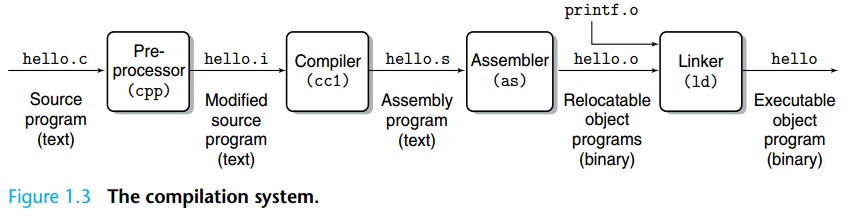

# C 语言基础及Makefile

!!! warning "C 语言基础"

    如果你没有学习过 C 语言，我们 **非常建议** 你提前观看于老师的 C/C++ 课程 https://www.bilibili.com/video/BV1Vf4y1P7pq ，观看到第 6.5 章节有助于你了解基本的 C 语言语法。

!!! warning "RISC-V 汇编"

    我们期望你已经完成了《计算机组成原理》课程，并了解 RISC-V 汇编的基础知识。

    此外，请常备 《The RISC-V Instruction Set Manual, Volume I: User-Level ISA, Version 2.1》(riscv-spec-v2.1.pdf) 与 《The RISC-V Instruction Set Manual, Volume II: Privileged Architecture, Document Version 20211203》(riscv-privileged-20211203.pdf) 作为参考 RISC-V 汇编的参考手册。

## 类型

在 C 语言中，整数类型有 long, int, short, char 等。
在绝大多数情况下，int 类型为 32 位长，而 long 类型的长度取决于 ABI（Application Binary Interface，在编译时由用户指定）。
为了避免编译目标架构的不同而导致 long、int 等类型实际长度与我们预想的不一致，在系统编程中，我们会使用定长的整形，如 uint64_t, int32_t 等。
在不同的ABI/编译器环境下，使用这一些类型保证了它们绝对是指定长度的。

例如，在 `os/types.h` 中：

```c title="os/types.h"
typedef unsigned int uint;
typedef unsigned short ushort;
typedef unsigned char uchar;
typedef unsigned char uint8;
typedef unsigned short uint16;
typedef unsigned int uint32;
typedef unsigned long uint64;
```

我们定义了 `uint64`, `uint32` 等类型分别为 `unsigned long` 和 `unsigned int`。
由于我们面向 riscv64 架构进行编程，我们可以确保在我们的 XV6 中，它们是 64 / 32 位的。

!!! warning "unsigned"

    注意在C语言中值在int类型取值范围内的整数字面量的默认类型是int。
    
    当unsigned int与有符号整数（如int）比较时，有符号整数会被提升为unsigned int。如果常数为负数，提升后可能变成一个非常大的无符号值，导致比较结果与预期不符。

    可以尝试执行以下代码，观察结果：

    

### 指针

指针是编程语言中一种变量类型，它存储了另一个变量的内存地址。通过指针，可以间接访问和操作其他变量的值。指针通常用于动态内存分配、函数参数传递、数据结构（如链表、树等）的实现等场景。

1. 指针的"内容"：它存储的是内存地址，而不是直接存储数据值。例如，指针 p 可以存储一个变量 x 的内存地址，而不是 x 的值。

2. 指针的类型：指针有一个类型，表示它指向的是哪种类型的变量。例如，`int* p` 表示 p 是一个指向 int 类型的指针。

3. 解引用：通过指针访问其指向的变量的过程叫做解引用，在 C 中，可以通过 * 操作符来解引用一个指针，获取指针所指向的值。

4. 取地址：所有保存在内存上的变量可以被取地址，我们使用 `&` 来表示取一个变量的地址。

例如：

```c
int a = 10;     // 定义一个变量 a，初始化为 10。
int *p = &a;    // 取变量 a 的内存地址，放入指针 p 中
*p = 20;        // 将 p 指向的内存地址修改为 20

int b = 30;
int **pp = &p;  // 取变量 p 的地址，放入指针 pp 中
*pp = &b;       // 将指针 p 的内容(其指向的地址)，改为变量 b 的地址。
**pp = 50;      // 两次解引用。

printf("a: %d, b:%d\n", a, b);  // 输出: a:20, b:50.
```

一张图理解指针：


### 结构体

我们使用 `struct` 关键字表明该类型是一个结构体。 **结构体是一堆打包在一起的数据**。

例如，我们声明结构体 `struct proc`，它的字段如下：

```c
struct proc {
    int pid;
    char* name;
    void* chan;
    uint64 krkr;
    uint8 dkdk;
};
```

我们使用 `.` 操作符访问一个结构体变量的字段，使用 `->` 操作符解引用一个结构体指针的字段。

```c
struct proc p1;
p1.pid = 1234;

struct proc *pProc = &p1;
pProc->name = "proc 1234";
```

## 编译系统

在计算机组成原理课程中，我们简要的介绍了 C 语言的编译系统。通常来说，编译一个程序分为以下几步：



1. 源代码 .c 文件经过 Pre-processor 预处理 cpp 得到 .i 文件

   .i 文件是 GCC 预处理阶段生成的中间文件，包含了展开的头文件、宏定义和条件编译后的代码。使用 gcc -E 可以生成 .i 文件。

2. .i 文件通过编译器 cc1 编译器得到汇编文件 .s

   编译器对.i文件进行语法检查，检查无误后将.i文件转换成机器可以理解的汇编代码（人类可阅读形式的机器代码），在此过程中优化器可以对代码进行优化。

3. .s 文件通过汇编器 as 得到 Relocatable objects (可重定位文件) .o

   在此过程中，汇编器将汇编代码转换为目标代码（机器代码-直接在机器上执行的代码，人类不可读）。
  
4. 链接器 ld 链接所有 .o 文件得到最终的可执行文件

   在 Linux 系统上，目标文件及可执行文件通常以 **ELF (Executable and Linkable Format)** 文件格式存储。
   ELF 文件分为不同的段 **Section**，用于存储特定类型的数据，如代码（.text）、数据（.data）和符号表（.symtab），每个段都有其专门的用途和属性。

通常来说，我们会用"编译器"来指代整个编译与链接过程中用到的所有工具，尽管编译器和链接器是两个不同的程序。特别的，当我们讨论编译器和链接器时，我们会将进行 预处理、汇编、编译 等步骤的工具集合统称为编译器；将最后的链接步骤所用的工具称为链接器。

<h3 style="color: orange;">实验步骤1：观察C语言编译过程</h3>

下面是一个简单的C语言代码示例，适合用于观察GCC编译过程中的 `.i`、`.s`、`.o` 文件：

```c
// main.c
#include <stdio.h>

int main() {
    int a = 10;
    int b = 20;
    int sum = a + b;
    printf("Sum: %d\n", sum);
    return 0;
}
```

#### 观察编译过程

1. **预处理（Preprocessing）**：生成 `.i` 文件
   ```bash
   gcc -E main.c -o main.i
   ```
   这会生成 `main.i` 文件，其中包含了预处理后的代码（宏展开、头文件包含等），可以通过 `cat main.i` 查看其内容。

2. **编译（Compilation）**：生成 `.s` 文件
   ```bash
   gcc -S main.i -o main.s
   ```
   这会生成 `main.s` 文件，其中包含了汇编代码，可以通过 `cat main.s` 查看其内容

4. **汇编（Assembly）**：生成 `.o` 文件
   ```bash
   gcc -c main.s -o main.o
   ```
   这会生成 `main.o` 文件，其中包含了目标代码（机器代码），可以通过 `objdump` 工具来分析 `main.o` 的内容。例如使用 `objdump -d hello.o` 可以查看机器码及其对应的汇编指令。 

5. **链接（Linking）**：生成可执行文件
   ```bash
   gcc main.o -o main
   ```
   这会生成可执行文件 `main`，可以通过 `file main` 来查看 `main` 的文件类型为ELF。可以通过GNU Binutils工具集中的 `readelf` 工具，你可以查看 ELF 文件的文件头、段信息、符号表、动态段信息等。例如使用 `readelf -h main` 可以查看 `main` 的文件头。

## Definition 和 Declaration

Definition （定义） 和 Declaration （声明） 是 C 语言中非常容易混淆的两个概念。

Declaration 声明了一个符号（变量、函数等），和它的的一些基础信息（如变量类型、函数参数类型、函数返回类型等）。这使得编译器 **在编译阶段** 能使用这些类型信息进行代码生成 (Code Generation)。

而 Definition 实际上会为该符号分配内存地址。链接器会 **在链接阶段** 为这些符号 **分配地址**（如函数地址、全局变量地址）。

!!! info "Symbol （符号）"

    在 C 语言中，符号（Symbol）是编译器用来表示程序中各种实体（如变量、函数、宏、类型名等）的名称。每个符号在编译过程中被关联到特定的内存地址或其他资源。当程序被编译时，编译器会为这些符号创建符号表 (Symbol Table)，记录它们的名称、类型、作用域以及对应的内存地址或值。

    简而言之，符号是程序中代表实体的名字，编译器通过符号表来管理和解析这些名字。

    编译器在编译某个 `.c` 文件时，它会一行一行的处理源代码，并维护一个符号表，表示当前文件中，到 **目前为止** 所有见过的符号。当编译器遇到对一个符号的引用（变量引用、函数调用）时，它会查找这个符号表；当编译器遇到一个符号的声明或定义时，它会向符号表中保存这个符号的信息。

    所以，我们要保证，在引用一个符号时，它起码被声明过，即被编译器看到过。同时，在同一个文件中，定义也是一种声明。

对于编译器而言，如果该 `.c` 文件需要引用其它 `.c` 文件中的函数或者变量，则需要提前 **声明** 它。当编译器遇到了声明 (Declaration) 过但是没有在当前文件中被定义 (Definition) 过的符号时 (如 printf)，编译器会假定该符号会在其他 object 文件中被定义，留下一些信息后交给链接器在链接阶段寻找这个符号。

例如，`a.c` **定义** 了变量 `int a`。如果 `main.c` 想要引用它，则需要使用 `extern int a` 来 **声明** 它。

```c
// a.c
int a;

// main.c
extern int a;
int main() {
    printf("%d\n", a);
}
```

编译时，我们先分别编译 `a.c` 和 `main.c` 到 `a.o` 和 `main.o`：`gcc -c a.c -o a.o`、`gcc -c main.c -o a.o`，然后链接两个 .o 文件：`gcc main.o a.o` 生成可执行文件 a.out。

编译 `a.c` 时，编译器生成的 `a.o` 会表示它有一个全局可见的符号，叫 `a`。
编译 `main.c` 时，编译器是不知道任何关于其他 .c 文件的信息的。但是我们在第一行声明了变量 `a`，所以它知道最终链接的时候会有一个符号叫 `a`。编译器产生的 `main.o` 中会表示它需要一个符号，叫 `a`。

链接器会查找所有 `.o` 文件的符号表，并根据名字和可见性匹配符号。

为了组织大型项目，我们不会在每个 `.c` 文件中手动导入其它 `.c` 文件中的符号，而是会使用头文件来声明这些会在 `.c` 中共享的符号。

## 头文件 

头文件（Header File）的作用是声明函数、变量、宏定义、常量、类型等信息， **以便在多个源文件中共享**。我们会在 `.c` 的开头使用 `#include` 宏导入头文件，它的语义是将文件内容直接复制到当前文件中，这一步是由 preprocessor 完成的。

如果某个 `.c` 文件中有些类型、函数、变量需要被其他 `.c` 文件引用，我们会创建一个对应的头文件。在给头文件取名上，我们一般使用同样的文件名，但是使用 `.h` 后缀；例如，对于 `a.c` 里面需要共享的信息，我们会创建一个它的头文件 `a.h`。

对于需要共享的函数、变量，我们通常会在 `a.h` 中 **声明**，在 `a.c` 中 **定义**：

```c
// a.h
extern int a;
int add(int x, int y);

// a.c
int a;
// or int a = 10;
int add (int x, int y) {
    return x + y;
}
```

假如 `main.c` 需要引用 `a.c` 中提供的 `a` 变量或者 `add` 函数，则可以在其开头引入 `a.h` 头文件：

```c
// main.c
#include "a.h"

int main() {
    a = 666;
    int b = 123;
    int c = add(a, b);
}
```

!!! note

    - 在一个 `.c` 文件中声明且定义的全局变量其他 `.c` 文件是无法 **直接** 使用的。例如你在一个 `.c` 文件中 `int a;` ，则在另一个文件中需要 `extern int a;` ，那么两个文件才是共享同一个 `a` 。

    - 在多个 `.c` 文件中定义全局变量时，我们要确保变量名是唯一的。否则会导致多重定义。

    - 如果我们希望定义一些仅当前 `.c` 可见的全局变量，我们可以使用 `static` 关键字。

    - `.h` 文件中仅能声明变量，如果 `.h` 定义了一个变量并且存在两个以上的 `.c` 文件 `#include` 了这个 `.h` 文件，则也会出现多重定义，因为预处理器会将被 include 的内容直接复制到当前文件中，这最终会导致两个 `.c` 都会对这个变量进行定义。
    
    - 如果你希望一个变量由多个 `.c` 共享使用，可以在 `.h` 文件中声明这个变量并且使用 `extern` 关键字进行修饰，并在任何一个 `.c` 中定义它。

## readelf 读取 Symbol Table

我们再次解释一下 Declaration 和 Definition 的区别：

- Definition 是向链接器表示，这个 .o 文件里面有一个符号，链接器需要为它分配内存地址。如果其他 .o 需要引用这个符号，则要判断这个符号是否允许被外部访问，即声明时是否使用了 static。

- Declaration 是向编译器保证，这个符号会在链接时被找到，不论是当前 `.c` 或其他 `.c` 文件中定义的。编译器只要根据声明的变量类型或函数原型进行代码生成（如变量访存时的宽度 (lb, lw, ld)，函数的参数个数），链接器会负责去找到这些符号。

我们可以通过 `llvm-readelf-19 --symbol <file>` 查看一个 ELF 文件的符号表，里面字段的意义可以参照 https://docs.oracle.com/cd/E19455-01/816-0559/chapter6-79797/index.html

```
$ llvm-readelf-19 --symbols build/os/proc.o | grep -E "FUNC|OBJECT|GLOBAL"
Symbol table '.symtab' contains 1240 entries:
   Num:    Value          Size Type    Bind   Vis       Ndx Name
     5: 0000000000000000    72 FUNC    LOCAL  DEFAULT     1 curr_proc
    23: 0000000000000048   304 FUNC    LOCAL  DEFAULT     1 freeproc
    97: 0000000000000178    92 FUNC    LOCAL  DEFAULT     1 first_sched_ret
   128: 0000000000000000     4 OBJECT  LOCAL  DEFAULT     6 proc_inited.1
   237: 0000000000000000     4 OBJECT  LOCAL  DEFAULT     7 PID.0
   663: 0000000000000000    32 OBJECT  LOCAL  DEFAULT     4 pid_lock
   664: 0000000000000020    32 OBJECT  LOCAL  DEFAULT     4 wait_lock
   665: 0000000000000040   104 OBJECT  LOCAL  DEFAULT     4 proc_allocator
  1201: 0000000000000000     0 NOTYPE  GLOBAL DEFAULT   UND push_off
  1202: 0000000000000000     0 NOTYPE  GLOBAL DEFAULT   UND mycpu
  1203: 0000000000000000     0 NOTYPE  GLOBAL DEFAULT   UND pop_off
  1210: 0000000000000000     0 NOTYPE  GLOBAL DEFAULT   UND usertrapret
  1211: 00000000000001d4   544 FUNC    GLOBAL DEFAULT     1 proc_init
  1212: 0000000000000000     0 NOTYPE  GLOBAL DEFAULT   UND spinlock_init
  1213: 0000000000000000     0 NOTYPE  GLOBAL DEFAULT   UND allocator_init
  1214: 00000000000000a8  4096 OBJECT  GLOBAL DEFAULT     4 pool
  1215: 0000000000000000     0 NOTYPE  GLOBAL DEFAULT   UND kernel_pagetable
  1216: 0000000000000000     0 NOTYPE  GLOBAL DEFAULT   UND kallocpage
  1217: 0000000000000000     0 NOTYPE  GLOBAL DEFAULT   UND kalloc
  1218: 0000000000000000     0 NOTYPE  GLOBAL DEFAULT   UND memset
  1219: 0000000000000000     0 NOTYPE  GLOBAL DEFAULT   UND kvmmap
```

Type 列表示该符号是函数 (FUNC) 还是变量 (OBJECT), Bind 表示这个符号是否允许其他 .o 找到 (LOCAL/GLOBAL)。Ndx 表示这个符号是否定义在这个 .o 里面，`UND` 表示它是外部的 `.o`，即需要从其他 .o 导入的符号，所以它的 Type 和 Size 都是未知的。

现在，你是否理解了链接中常出现的两种错误：multiple definition 和 undefined reference 的原因？

- `riscv64-unknown-elf-ld: build/os/proc.o:os/proc.c:14: multiple definition of 'idle'; build/os/main.o:os/main.c:7: first defined here`
    - 在不同的 .c 文件中定义了多次 `idle` 变量。
- `riscv64-unknown-elf-ld: build/os/proc.o: in function 'proc_init': os/proc.c:38:(.text+0xd0): undefined reference to 'idle'`
    - 在头文件中声明了 `idle` 变量，但是没有定义它。


## Make 和 Makefile介绍

考虑一下，如果我们的工程稍微大一点（比如包含多个C语言文件），每次运行一次我们都要执行很多次gcc命令，是否有一种编译工具可以简化这个过程呢？接下来我们介绍自动化编译工具make。

`Makefile` 是一个用于自动化构建（编译、链接等）程序的配置文件，通常用于管理包含多个源文件的项目。它定义了如何从源代码生成目标文件（如可执行文件、库文件等），并确保只重新编译那些需要更新的部分，从而提高构建效率。

`Makefile` 是 `make` 工具的输入文件，`make` 是一个经典的构建工具，广泛用于 Unix/Linux 系统。

<h3 style="color: orange;">实验步骤2：使用makefile进行自动化构建</h3>

首先我们创建三个文件

```c
//print.h 头文件
#include <stdio.h>
void print(void);

//print.c
#include "print.h"
void print(){
    printf("Hello, World!\n");
}

//main.c
#include "print.h"
int main(){
	print();
	return 0;
}

```

因为文件中的依赖关系，如果我们想要运行上面的代码，我们需要为每个.c文件生成.o目标文件，然后把两个.o文件生成可执行文件：

```bash
gcc -c main.c
gcc -c print.c
gcc -o main main.o print.o

./main
```


由此可见，如果我们的文件数量很多，每次运行就会变得十分的复杂。为了使整个编译过程更加容易，可以使用Makefile。

接着，我们创建一个文本文件并命名为Makefile。

Makefile文件内容：

```makefile
main : main.o print.o
	gcc -o main main.o print.o
main.o : main.c print.h
	gcc -c main.c
print.o : print.c print.h
	gcc -c print.c
clean:
	rm main main.o print.o
```

最后，我们只需要执行一句make命令，就可以完成整个编译过程：


### Makefile的基本结构

```makefile
target: dependencies
[tab] system command
```

### Makefile工作原理

在默认的方式下，也就是我们只输入 `make` 命令。那么，

1. make会在当前目录下找名字叫“Makefile”或“makefile”的文件。
2. 如果找到，它会找文件中的第一个目标文件（target），在上面的例子中，他会找到“main”这个文件，并把这个文件作为最终的目标文件。
3. 如果main文件不存在，或是main所依赖的后面的 `.o` 文件的文件修改时间要比 `main` 这个文件新，那么，他就会执行后面所定义的命令来生成 `main` 这个文件。
4. 如果 `main` 所依赖的 `.o` 文件也不存在，那么make会在当前文件中找目标为 `.o` 文件的依赖性，如果找到则再根据那一个规则生成 `.o` 文件。（这有点像一个堆栈的过程）
5. 当然，你的C文件和H文件是存在的啦，于是make会生成 `.o` 文件，然后再用 `.o` 文件生成make的终极任务，也就是执行文件 `main` 了。

### make clean

通过上述分析，我们知道，像clean这种，没有被第一个目标文件直接或间接关联，那么它后面所定义的命令将不会被自动执行，不过，我们可以显式要make执行。即命令—— `make clean` ，以此来清除所有的目标文件，以便重新编译。

参考及更多关于Makefile的知识请查看：（[跟我一起写Makefile 1.0 文档 ](https://seisman.github.io/how-to-write-makefile/introduction.html)）
