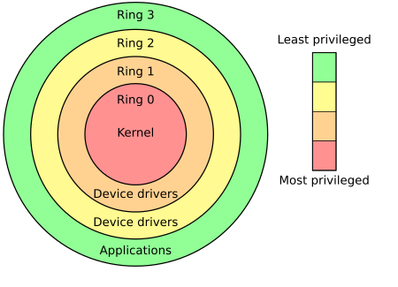

# 运行裸机程序

当我们在为 Linux 环境编程时，我们通常只需要考虑程序的逻辑、并使用和 libc 函数和其封装的系统调用完成与操作系统和用户的交互；例如使用 printf 和 scanf 在标准输入输出流上进行操作。此时，我们的用户态运行环境是由 libc 提供的，而内核是由 Linux Kernel 提供的。

当我们在写自己的操作系统时，我们并没有 Linux 或其他操作系统提供的运行环境，而是直接与 CPU 和硬件交互，这种程序被称为裸机程序 (**bare-metal program**)。

!!!info "什么是裸机程序"
    A **bare-metal program** is a type of software that runs directly on the hardware of a device without relying on an underlying operating system (OS). Essentially, it's code that interacts with the hardware at the most fundamental level, controlling the processor, memory, input/output (I/O) devices, and other components directly.

在我们的 xv6 实验中，我们在 RISC-V 体系架构上编写操作系统程序。

## 特权级 (Privilege Level)

!!!info "Privilege Levels (riscv-privileged.pdf)"
    特权级（Privilege Level）是计算机系统中用于定义不同进程或用户在系统中所拥有的访问控制和权限的概念。
    特权级的存在是为了保护系统资源、确保安全性，并根据可信度和功能对进程进行隔离。

    At any time, a RISC-V hardware thread (hart) is running at some privilege level encoded as a mode in one or more CSRs (control and status registers). 
    
    Three RISC-V privilege levels are currently defined as shown in Table 1.1. 
    
    Privilege levels are used to provide protection between different components of the software stack, and attempts to perform operations not permitted by the current privilege mode will cause an exception to be raised. 
    
    These exceptions will normally cause traps into an underlying execution environment.

特权级是CPU运行时的一个重要的状态，它表示了当前运行的程序有多高的特权来执行代码。例如，低特权状态不允许访问高特权的内存和CSR寄存器；但是高特权级允许CPU运行在低特权级时，主动或被动地切换至高特权级并执行预定的代码。

特权级的区分是在 CPU 硬件电路上实现的。在 RISC-V 上，特权级使用 2bit 进行区分，分为 M mode，S mode，和 U mode。


> The machine level has the highest privileges and is the only mandatory privilege level for a RISC-V hardware platform. Code run in machine-mode (M-mode) is usually inherently trusted, as it has low-level access to the machine implementation. M-mode can be used to manage secure execution environments on RISC-V. User-mode (U-mode) and supervisor-mode (S-mode) are intended for conventional application and operating system usage respectively.

M mode 为 RISC-V 架构中的最高特权，一般运行 OpenSBI 固件程序，拥有对物理内存的直接访问；S mode 是为操作系统设计的特选等级，可以设置虚拟内存；U mode 是为用户程序设计的特权等级，拥有最小的特权，也适用于虚拟内存。

在裸机程序中，我们需要完成对 CPU 状态的初始化，包括了页表、中断等基本功能。
这些 CPU 的状态是通过 CSR (Control and Status Registers) 控制的，这些寄存器一般只允许高特权级的用户进行访问和修改。

### AArch64 & x86

现代的指令集架构均有设置不同的特权级。

移动设备上最常使用的 arm64 (AArch64) CPU 架构定义了四种特权级(Exception Levels)，从低到高： EL0、EL1、EL2和EL3。
与 RISC-V 架构类似（~~其实是 RISC-V 抄 AArch64 的~~），最高特权级 EL3 运行最底层的固件(Secure Monitor)，EL1 特权级运行操作系统(OS)，EL0 特权级运行用户程序，而EL2特权级运行虚拟机程序(Hypervisor)。

而 x86 (IA32 & AMD64) 架构定义特权级为四个 Ring ：Ring 0 代表最高特权级，运行操作系统；而 Ring 3 代表最低特权级，运行用户程序。通常来说，x86架构上只会使用到 Ring 0 和 Ring 3 两种特权级。



!!!info "为什么要定义特权级"
    通过对比上述三种体系结构定义的特权级，我们可以发现用户程序和操作系统的运行环境被严格切分，这使得操作系统能正确隔离用户程序与操作系统，用户程序之间的访问。
    <!-- **Operating Systems: Three Easy Pieces** 教材总结操作系统的三大基本组成部分：虚拟化 (Virtualization)、并行 (Concurrency)、持久化 (Persistence)。 -->

## 运行环境

在 RISC-V 的三个特权级上，RISC-V架构定义了三种运行状态：分别是固件(M mode)、操作系统(S mode)和用户态(U mode)。

在 RISC-V 架构中，操作系统 (Supervisor) 向应用程序 (Application) 提供的运行环境被称为 ABI (Application Binary Interface)，而固件 (supervisor execution environment) 为操作系统 (Supervisor) 提供的运行环境则被称为 Supervisor Binary Interface (SBI)。

固件 (OpenSBI) 中抽象了对底层硬件的访问，并通过类似 syscall 的方式为 S Mode 的操作系统提供了一些基本的访问硬件的接口，其中就包含了基本的串口输入输出函数，`sbi_console_putchar` 和 `sbi_console_getchar`。


## 第一个裸机程序

!!!info "xv6-lab1 代码"
    https://github.com/yuk1i/SUSTech-OS-2025/tree/xv6-lab1

在 git clone 上述代码仓库后，我们可以在本地运行 `make` 来编译 xv6 内核：

```shell
$ /d/o/SUSTech-OS-2025 (xv6-lab1)> make
riscv64-unknown-elf-gcc -fPIE -fno-pic -fno-plt -Wall -Wno-unused-variable -Werror -O -fno-omit-frame-pointer -ggdb -march=rv64g -MD -mcmodel=medany -ffreestanding -fno-common -nostdlib -mno-relax -Ios -std=gnu17 -fno-stack-protector -D LOG_LEVEL_ERROR -c os/console.c -o build/os/console.o
riscv64-unknown-elf-gcc -fPIE -fno-pic -fno-plt -Wall -Wno-unused-variable -Werror -O -fno-omit-frame-pointer -ggdb -march=rv64g -MD -mcmodel=medany -ffreestanding -fno-common -nostdlib -mno-relax -Ios -std=gnu17 -fno-stack-protector -D LOG_LEVEL_ERROR -c os/main.c -o build/os/main.o
riscv64-unknown-elf-gcc -fPIE -fno-pic -fno-plt -Wall -Wno-unused-variable -Werror -O -fno-omit-frame-pointer -ggdb -march=rv64g -MD -mcmodel=medany -ffreestanding -fno-common -nostdlib -mno-relax -Ios -std=gnu17 -fno-stack-protector -D LOG_LEVEL_ERROR -c os/printf.c -o build/os/printf.o
riscv64-unknown-elf-gcc -fPIE -fno-pic -fno-plt -Wall -Wno-unused-variable -Werror -O -fno-omit-frame-pointer -ggdb -march=rv64g -MD -mcmodel=medany -ffreestanding -fno-common -nostdlib -mno-relax -Ios -std=gnu17 -fno-stack-protector -D LOG_LEVEL_ERROR -c os/sbi.c -o build/os/sbi.o
riscv64-unknown-elf-gcc -fPIE -fno-pic -fno-plt -Wall -Wno-unused-variable -Werror -O -fno-omit-frame-pointer -ggdb -march=rv64g -MD -mcmodel=medany -ffreestanding -fno-common -nostdlib -mno-relax -Ios -std=gnu17 -fno-stack-protector -D LOG_LEVEL_ERROR -c os/string.c -o build/os/string.o
riscv64-unknown-elf-gcc -fPIE -fno-pic -fno-plt -Wall -Wno-unused-variable -Werror -O -fno-omit-frame-pointer -ggdb -march=rv64g -MD -mcmodel=medany -ffreestanding -fno-common -nostdlib -mno-relax -Ios -std=gnu17 -fno-stack-protector -D LOG_LEVEL_ERROR -c os/entry.S -o build/os/entry.o
riscv64-unknown-elf-ld -z max-page-size=4096 -T os/kernel.ld -o build/kernel build/os/console.o build/os/main.o build/os/printf.o build/os/sbi.o build/os/string.o build/os/entry.o
riscv64-unknown-elf-objcopy -O binary build/kernel build/kernel.bin
riscv64-unknown-elf-objdump -S build/kernel > build/kernel.asm
riscv64-unknown-elf-objdump -t build/kernel | sed '1,/SYMBOL TABLE/d; s/ .* / /; /^$/d' > build/kernel.sym
Build kernel done
```

!!!questions "什么是 make, Makefile"
    Makefile 是一种描述编译流程的文件，而 `make` 命令则按照 Makefile 中指定的流程进行编译。

    推荐观看：https://www.bilibili.com/video/BV188411L7d2

### 编译链接参数

gcc 是我们常用的 C 语言编译器，而 `riscv64-unknown-elf-gcc` 则表示使用 RISC-V 64 位、面向未知平台、产出 ELF 格式的 gcc 套件。

剩下的编译参数我们可以分开理解：

- `-march=rv64g -mcmodel=medany -mno-relax`

    这表示我们的目标架构是 rv64g，寻址模型是 `medany`，并且链接器不要进行 Relax。

    See also: https://gcc.gnu.org/onlinedocs/gcc/RISC-V-Options.html

- `-ffreestanding -fno-common -nostdlib`

    这表示我们不使用标准库函数，也不假设一些通用函数（如 memset）的定义与标准函数库定义一致。

- `-fno-pie -no-pie -fno-plt -fno-omit-frame-pointer -fno-stack-protector`

    这表示生成的 ELF 文件不要使用位置无关代码 (Position-Independent Executable)，因为这会导致生成 got 和 plt 段，这是内核中不需要的。
    并且，保留 frame-pointer，禁用栈保护。

- `-Wall -Wno-unused-variable -Werror -ggdb`

    这表示显示所有警告、但是不提示未使用的变量警告、并将所有 warning 当作 error。最后 `-ggdb` 表示使用 gdb 调试。

- `-Ios -std=gnu17 -O2 -c os/entry.S -o build/os/entry.o`

    表示使用 os 目录作为 include 目录，使用 gnu17 C标准，启用 O2 优化。

    编译 (`-c`) 原文件 `os/entry.S`，输出到 `build/os/entry.o` 中。

ld 表示链接器，我们使用 ld 将所有编译器产生的 .o 文件链接为最终的 kernel ELF 文件。

`riscv64-unknown-elf-ld -z max-page-size=4096 -T os/kernel.ld -o build/kernel build/os/console.o build/os/main.o build/os/printf.o build/os/sbi.o build/os/string.o build/os/entry.o`

这一串命令表示：

- 使用 os/kernel.ld 作为链接脚本
- 输出为 `build/kernel`
- 输入为所有 .o 文件

### Linker Script

编译脚本表示：链接器应该如何排列所有 .o 文件中的段（Section），即内存布局 (Memory Layout)，并指明产生的 ELF 文件应该如何加载到内存中 (Program Header)。

```
OUTPUT_ARCH(riscv)
ENTRY(_entry)
BASE_ADDRESS = 0x80200000;

SECTIONS
{
    . = BASE_ADDRESS;
    skernel = .;

    s_text = .;
    .text : {
        *(.text.entry)
        *(.text .text.*)
        . = ALIGN(4K);
        e_text = .;
        s_trampolime = .;
        *(trampsec)
    }

    . = ALIGN(4K);
    s_rodata = .;
    .rodata : {
        *(.rodata .rodata.*)
    }

    . = ALIGN(4K);
    e_rodata = .;
    s_data = .;
    .data : {
        *(.data.apps)
        *(.data .data.*)
        *(.sdata .sdata.*)
    }

    . = ALIGN(4K);
    e_data = .;
    .bss : {
        *(.bss.stack)
        s_bss = .;
        *(.bss .bss.*)
        *(.sbss .sbss.*)
    }

    . = ALIGN(4K);
    e_bss = .;
    ekernel = .;

    /DISCARD/ : {
        *(.eh_frame)
    }
}
```

开头的 `OUTPUT_ARCH` 表示生成的 ELF 文件适用与 RISC-V 架构，`ENTRY` 表示 ELF 的入口点为符号 `_entry`。然后，我们定义一个常量为 `BASE_ADDRESS` 使它等于 0x80200000，这也是我们内核的起始地址。

在 `SECTIONS` 中，我们首先定义当前地址 (`.` 符号) (想象链接器正在给所有 section 安排位置) 为 0x80200000，并导出 `skernel` 和 `s_text` 符号的值为当前地址。

随后，我们定义 (.text) 段，这通常表示代码段：

```
.text : {
    *(.text.entry)
    *(.text .text.*)
    . = ALIGN(4K);
    e_text = .;
    s_trampolime = .;
    *(trampsec)
}
```

首先排列所有位于 `.text.entry` 的符号，随后排列所有位于 `.text` 的符号。

我们在 `.text` 段中首先包含了一个特殊的 Section `.text.entry`，这个 section 是在 `entry.S` 文件中定义的：

```
    .section .text.entry
    .globl _entry
_entry:
```

我们在 `entry.S` 文件中指定 `_entry` 符号应该被放置到 `.text.entry` 段，并在链接脚本中指定这个段为内核的开始地址。这样我们即可确保 _entry 会被放置到内核起始地址。当我们启动内核时，我们会从这个起始地址开始执行，也就是执行了内核的第一条指令。

我们可以通过反编译 `build/kernel` 来观察这一点：

```
$ /d/o/SUSTech-OS-2025 (xv6-lab1)> llvm-objdump-19 -d build/kernel| less
build/kernel:   file format elf64-littleriscv

Disassembly of section .text:

0000000080200000 <skernel>:
80200000: 0000100f      fence.i
80200004: 00007117      auipc   sp, 0x7
80200008: ffc10113      addi    sp, sp, -0x4
8020000c: 00000097      auipc   ra, 0x0
80200010: 164080e7      jalr    0x164(ra) <main>

```

然后，将当前地址对齐到 4K 边界，导出 `e_text` 和 `s_trampolime` 符号，最后排列位于 `trampsec` 的符号。

剩余的 `.rodata`, `.data` 和 `.bss` 则表示数据段，但是略有不同：

- `.rodata` 表示只读的数据段
- `.data` 表示可读可写的数据段
- `.bss` 表示应该在程序启动时被清0的数据段

当然，所有数据段均是不可执行的。

最后，我们可以使用 `readelf` 工具观察最后产出的 kernel ELF 文件：

```shell
$ /d/o/SUSTech-OS-2025 (xv6-lab1)> llvm-readelf-19 -a build/kernel
ELF Header:
  Magic:   7f 45 4c 46 02 01 01 00 00 00 00 00 00 00 00 00
  Class:                             ELF64
  Data:                              2's complement, little endian
  Version:                           1 (current)
  OS/ABI:                            UNIX - System V
  ABI Version:                       0
  Type:                              EXEC (Executable file)
  Machine:                           RISC-V
  Version:                           0x1
  Entry point address:               0x80200000
  Start of program headers:          64 (bytes into file)
  Start of section headers:          29280 (bytes into file)
  Flags:                             0x4, double-float ABI
  Size of this header:               64 (bytes)
  Size of program headers:           56 (bytes)
  Number of program headers:         3
  Size of section headers:           64 (bytes)
  Number of section headers:         20
  Section header string table index: 19
There are 20 section headers, starting at offset 0x7260:

Section Headers:
  [Nr] Name              Type            Address          Off    Size   ES Flg Lk Inf Al
  [ 0]                   NULL            0000000000000000 000000 000000 00      0   0  0
  [ 1] .text             PROGBITS        0000000080200000 001000 001000 00  AX  0   0  4
  [ 2] .rodata           PROGBITS        0000000080201000 002000 000181 00   A  0   0  8
  [ 3] .srodata          PROGBITS        0000000080201188 002188 000048 00   A  0   0  8
  [ 4] .data             PROGBITS        0000000080202000 003000 000008 00  WA  0   0  8
  [ 5] .bss              NOBITS          0000000080203000 003008 004000 00  WA  0   0  1
  [ 6] .debug_info       PROGBITS        0000000000000000 003008 0010a1 00      0   0  1
  [ 7] .debug_abbrev     PROGBITS        0000000000000000 0040a9 0006e5 00      0   0  1
  [ 8] .debug_loclists   PROGBITS        0000000000000000 00478e 0004f3 00      0   0  1
  [ 9] .debug_aranges    PROGBITS        0000000000000000 004c90 000130 00      0   0 16
  [10] .debug_line       PROGBITS        0000000000000000 004dc0 001003 00      0   0  1
  [11] .debug_str        PROGBITS        0000000000000000 005dc3 0003b0 01  MS  0   0  1
  [12] .debug_line_str   PROGBITS        0000000000000000 006173 0000e4 01  MS  0   0  1
  [13] .comment          PROGBITS        0000000000000000 006257 00001b 01  MS  0   0  1
  [14] .riscv.attributes RISCV_ATTRIBUTES 0000000000000000 006272 000052 00      0   0  1
  [15] .debug_frame      PROGBITS        0000000000000000 0062c8 0004b0 00      0   0  8
  [16] .debug_rnglists   PROGBITS        0000000000000000 006778 00007c 00      0   0  1
  [17] .symtab           SYMTAB          0000000000000000 0067f8 000720 18     18  32  8
  [18] .strtab           STRTAB          0000000000000000 006f18 000273 00      0   0  1
  [19] .shstrtab         STRTAB          0000000000000000 00718b 0000d5 00      0   0  1
Key to Flags:
  W (write), A (alloc), X (execute), M (merge), S (strings), I (info),
  L (link order), O (extra OS processing required), G (group), T (TLS),
  C (compressed), x (unknown), o (OS specific), E (exclude),
  R (retain), p (processor specific)

Elf file type is EXEC (Executable file)
Entry point 0x80200000
There are 3 program headers, starting at offset 64

Program Headers:
  Type           Offset   VirtAddr           PhysAddr           FileSiz  MemSiz   Flg Align
  ATTRIBUTES     0x006272 0x0000000000000000 0x0000000000000000 0x000052 0x000000 R   0x1
  LOAD           0x001000 0x0000000080200000 0x0000000080200000 0x0011d0 0x0011d0 R E 0x1000
  LOAD           0x003000 0x0000000080202000 0x0000000080202000 0x000008 0x005000 RW  0x1000

Section to Segment mapping:
  Segment Sections...
   00     .riscv.attributes 
   01     .text .rodata .srodata 
   02     .data .bss 
   None   .debug_info .debug_abbrev .debug_loclists .debug_aranges .debug_line .debug_str .debug_line_str .comment .debug_frame .debug_rnglists .symtab .strtab .shstrtab 

```

- 最终的文件类型为：`Type: EXEC (Executable file)`
- 入口地址为： `Entry point address: 0x80200000`
- 一共有 19 个 Sections：
    - Sections有自己的 Flags,其中 A 表示这一个 Section 在加载时应该被分配内存空间，W 表示可以写入，X 表示可以执行。
- 一共有 3 个 Program Headers，其中有两个 LOAD:
    - 第一个 LOAD 表示：
        - 在虚拟地址 (VirtAddr) 0x80200000处，映射物理地址 (PhysAddr) 0x80200000，分配 0x0011d0 字节的内存空间 (MemSiz)，该内存段的权限为 RE (Read & Executable)。
        - 从该 ELF 文件的 (Offset) 0x001000 处复制 0x0011d0 字节 (FileSiz) 到上述内存空间。
    - 第二个 LOAD 表示：
        - 在虚拟地址 0x80202000 处，映射物理地址 0x80202000，分配 0x005000 的内存空间，该内存段权限为 RW (Read & Write)。
        - 从该 ELF 文件的 0x3000 处，复制 0x0008 字节到该内存段。
- 在 `Section to Segment mapping:` 处我们可以看到：
    - 第一个 Program Headers 包含 .text, .rodata 和 .srodata 三个 Sections。
    - 第二个 Program Headers 包含 .data 和 .bss 段。

!!!questions "问题 1"
    我们可以发现第一个 LOAD 的 FileSiz 和 MemSiz 是相同的，而第二个是不同的。
    
    请你猜测为什么会这样？

## XX，启动！

在 `make` 编译内核成功后，我们可以使用 `make run` 调用 qemu 来运行我们的 xv6-lab1 操作系统。

`make run` 会调用以下命令：`qemu-system-riscv64 -nographic -machine virt -cpu rv64,svadu=off -m 512 -kernel build/kernel`，这表示：

- 使用 `qemu-system-riscv64` 模拟一个 RISC-V 64位 CPU
- `-nographic`：禁用图形输出
- `-machine virt`：使用 `virt` 机器模型
- `-cpu rv64,svadu=off`：使用 riscv64 位 CPU,并禁用 svadu 特性
- `-m 512`：指定内存大小 512MiB
- `-kernel build/kernel`：指定加载的内核文件为 build/kernel

```
$ /d/o/SUSTech-OS-2025 (xv6-lab1)> make run
qemu-system-riscv64 -nographic -machine virt -cpu rv64,svadu=off -m 512 -kernel build/kernel 

OpenSBI v1.5
   ____                    _____ ____ _____
  / __ \                  / ____|  _ \_   _|
 | |  | |_ __   ___ _ __ | (___ | |_) || |
 | |  | | '_ \ / _ \ '_ \ \___ \|  _ < | |
 | |__| | |_) |  __/ | | |____) | |_) || |_
  \____/| .__/ \___|_| |_|_____/|____/_____|
        | |
        |_|

Platform Name             : riscv-virtio,qemu
Platform Features         : medeleg
Platform HART Count       : 1
Platform IPI Device       : aclint-mswi
Platform Timer Device     : aclint-mtimer @ 10000000Hz
Platform Console Device   : uart8250
Platform HSM Device       : ---
Platform PMU Device       : ---
Platform Reboot Device    : syscon-reboot
Platform Shutdown Device  : syscon-poweroff
Platform Suspend Device   : ---
Platform CPPC Device      : ---
Firmware Base             : 0x80000000
Firmware Size             : 327 KB
Firmware RW Offset        : 0x40000
Firmware RW Size          : 71 KB
Firmware Heap Offset      : 0x49000
Firmware Heap Size        : 35 KB (total), 2 KB (reserved), 11 KB (used), 21 KB (free)
Firmware Scratch Size     : 4096 B (total), 416 B (used), 3680 B (free)
Runtime SBI Version       : 2.0

Domain0 Name              : root
Domain0 Boot HART         : 0
Domain0 HARTs             : 0*
Domain0 Region00          : 0x0000000000100000-0x0000000000100fff M: (I,R,W) S/U: (R,W)
Domain0 Region01          : 0x0000000010000000-0x0000000010000fff M: (I,R,W) S/U: (R,W)
Domain0 Region02          : 0x0000000002000000-0x000000000200ffff M: (I,R,W) S/U: ()
Domain0 Region03          : 0x0000000080040000-0x000000008005ffff M: (R,W) S/U: ()
Domain0 Region04          : 0x0000000080000000-0x000000008003ffff M: (R,X) S/U: ()
Domain0 Region05          : 0x000000000c400000-0x000000000c5fffff M: (I,R,W) S/U: (R,W)
Domain0 Region06          : 0x000000000c000000-0x000000000c3fffff M: (I,R,W) S/U: (R,W)
Domain0 Region07          : 0x0000000000000000-0xffffffffffffffff M: () S/U: (R,W,X)
Domain0 Next Address      : 0x0000000080200000
Domain0 Next Arg1         : 0x000000009fe00000
Domain0 Next Mode         : S-mode
Domain0 SysReset          : yes
Domain0 SysSuspend        : yes

Boot HART ID              : 0
Boot HART Domain          : root
Boot HART Priv Version    : v1.12
Boot HART Base ISA        : rv64imafdch
Boot HART ISA Extensions  : sstc,zicntr,zihpm,zicboz,zicbom,sdtrig
Boot HART PMP Count       : 16
Boot HART PMP Granularity : 2 bits
Boot HART PMP Address Bits: 54
Boot HART MHPM Info       : 16 (0x0007fff8)
Boot HART Debug Triggers  : 2 triggers
Boot HART MIDELEG         : 0x0000000000001666
Boot HART MEDELEG         : 0x0000000000f0b509

clean bss: 0x0000000080207000 - 0x0000000080207000
Kernel booted.
Hello World!
sysregs:
sstatus : 0x8000000200006000
scause  : 0x0000000000000000
sepc    : 0x0000000000000000
stval   : 0x0000000000000000
sip     : 0x0000000000000000
sie     : 0x0000000000000000
satp    : 0x0000000000000000
```

QEMU 启动后会首先加载 OpenSBI，这是运行在 M mode 的固件。随后，OpenSBI 指定下一阶段的启动是我们的内核：

```
Domain0 Next Address      : 0x0000000080200000
Domain0 Next Arg1         : 0x000000009fe00000
Domain0 Next Mode         : S-mode
```

在 OpenSBI 初始化完成后，OpenSBI会降级到 S-mode 并将 PC 指针指向我们的内核起始地址 0x80200000。该地址上保存着内核的第一个入口 _entry 的代码：

```
80200000: 0000100f      fence.i
80200004: 00007117      auipc   sp, 0x7
80200008: ffc10113      addi    sp, sp, -0x4
8020000c: 00000097      auipc   ra, 0x0
80200010: 164080e7      jalr    0x164(ra) <main>
```

源代码：

```asm
    .section .text.entry
    .globl _entry
_entry:
    fence.i

    lla sp, boot_stack_top
    call main

    .section .bss.stack
    .globl boot_stack
boot_stack:
    .space 4096 * 4
    .globl boot_stack_top
boot_stack_top:
```

- 首先执行 fence.i 指令，我们暂且不需要理解这一条指令的作用。
- 然后，我们使用 `auipc` 和 `addi` 指令，将栈指针指向 `boot_stack_top`，这是我们提前为第一个内核入口开辟的栈。
- 最后，我们通过 `auipc` 和 `jr` 指令，跳转到 main 函数继续执行。

!!!info "为什么需要使用汇编作为内核入口"
    因为在内核入口处，OpenSBI没有为我们设置 sp 栈指针，而 C 语言的运行环境要求有栈作为保存栈上变量和函数调用保存寄存器的地点，所以我们首先需要使用汇编初始化 sp 寄存器。

该 lab 的内核非常简单，观察 main.c 中的 main 函数：

```c
void main() {
    printf("\n");
    printf("clean bss: %p - %p\n", s_bss, e_bss);
    memset(s_bss, 0, e_bss - s_bss);
    printf("Kernel booted.\n");
    printf("Hello World!\n");

    printf("sysregs:\n");
    print_sysregs();
    printf("%d", global_variable);

    while (1);
}
```

- 首先清空 .bss 段（在 Linux 操作系统上，这一步是 Linux Kernel 实现的，但是现在我们就是 Kernel，所以这件事情得自己干）
- 然后用 printf 打印一些信息，随后开始死循环。

```
clean bss: 0x0000000080207000 - 0x0000000080207000
Kernel booted.
Hello World!
```

## SBI Call

在这个lab的内核中，printf 会调用 `consputc` 来向控制台打印一个字符，而这个函数最终会调用 `sbi_call(SBI_CONSOLE_PUTCHAR, c, 0, 0)`。

`运行环境` 一章已经介绍了 OpenSBI 向操作系统通过 SBI 接口提供了一个基础的运行环境。其中就包括 `sbi_console_putchar` 和 `sbi_console_getchar` 函数。

在我们的操作系统中，我们首先通过设置 a0、a1 等寄存器，然后通过 `ecall` 指令向 M Mode 的程序，即 OpenSBI,发起请求。

!!!info "Calling Convention"
    Calling Convention 表示在进行函数调用时，调用者 (Caller) 和 被调用者 (Callee) 所遵循的规范。
    
    这通常包含了：

    1. 参数与返回值是如何传递
    2. Caller 和 Callee 需要保存哪些寄存器

SBI 的 Calling Convention 定义如下 (riscv-sbi.pdf)：

All SBI functions share a single binary encoding, which facilitates the mixing of SBI extensions. The SBI specification follows the below calling convention.

- An ECALL is used as the control transfer instruction between the supervisor and the SEE.
- a7 encodes the SBI extension ID (EID),
- a6 encodes the SBI function ID (FID) for a given extension ID encoded in a7 for any SBI extension defined in or after SBI v0.2.
- All registers except a0 & a1 must be preserved across an SBI call by the callee.
- SBI functions must return a pair of values in a0 and a1, with a0 returning an error code. 

而我们要使用的 putchar 和 getchar 是来自 Legacy Extensions：

- Nothing is returned in a1 register.
- All registers except a0 must be preserved across an SBI call by the callee.
- The value returned in a0 register is SBI legacy extension specific.

按照 RISC-V 的 Calling Convention，参数是通过 a 系列寄存器保存，从 a0 开始。

### `sbi_call`

在 `sbi_call` 函数中，我们首先声明了4个变量，并且注明他们应该直接被分配到相应的寄存器上 (`register`, `asm("a0")`)。

随后，我们将 a7 赋值为我们要调用哪个 SBI 函数，三个参数分别赋值给 a0, a1 和 a2。

然后，我们使用 asm volatile 进行 ecall 调用。

最后，返回 a0 寄存器的值。

```c
const uint64 SBI_CONSOLE_PUTCHAR = 1;
const uint64 SBI_CONSOLE_GETCHAR = 2;

int inline sbi_call(uint64 which, uint64 arg0, uint64 arg1, uint64 arg2) {
    register uint64 a0 asm("a0") = arg0;
    register uint64 a1 asm("a1") = arg1;
    register uint64 a2 asm("a2") = arg2;
    register uint64 a7 asm("a7") = which;
    asm volatile("ecall" : "=r"(a0) : "r"(a0), "r"(a1), "r"(a2), "r"(a7) : "memory");
    return a0;
}

void console_putchar(int c) {
    sbi_call(SBI_CONSOLE_PUTCHAR, c, 0, 0);
}
```

`asm volatile` 表示在 C 代码中直接插入汇编代码，它分为四部分：

```
asm asm-qualifiers ( AssemblerTemplate 
                 : OutputOperands 
                 [ : InputOperands
                 [ : Clobbers ] ])
```

我们使用 `volatile` 作为 asm-qualifiers 表示禁止编译器对这一段代码进行可能的优化。

AssemblerTemplate 表示汇编的模板，OutputOperands 表示哪些 C 变量会被这一段汇编代码修改，InputOperands 表示哪些 C 变量会被这一段汇编代码读取，Clobbers 表示哪一些寄存器会被这一段汇编代码修改。

See also: https://gcc.gnu.org/onlinedocs/gcc-12.1.0/gcc/Extended-Asm.html
