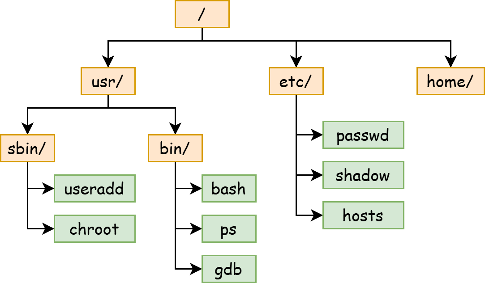
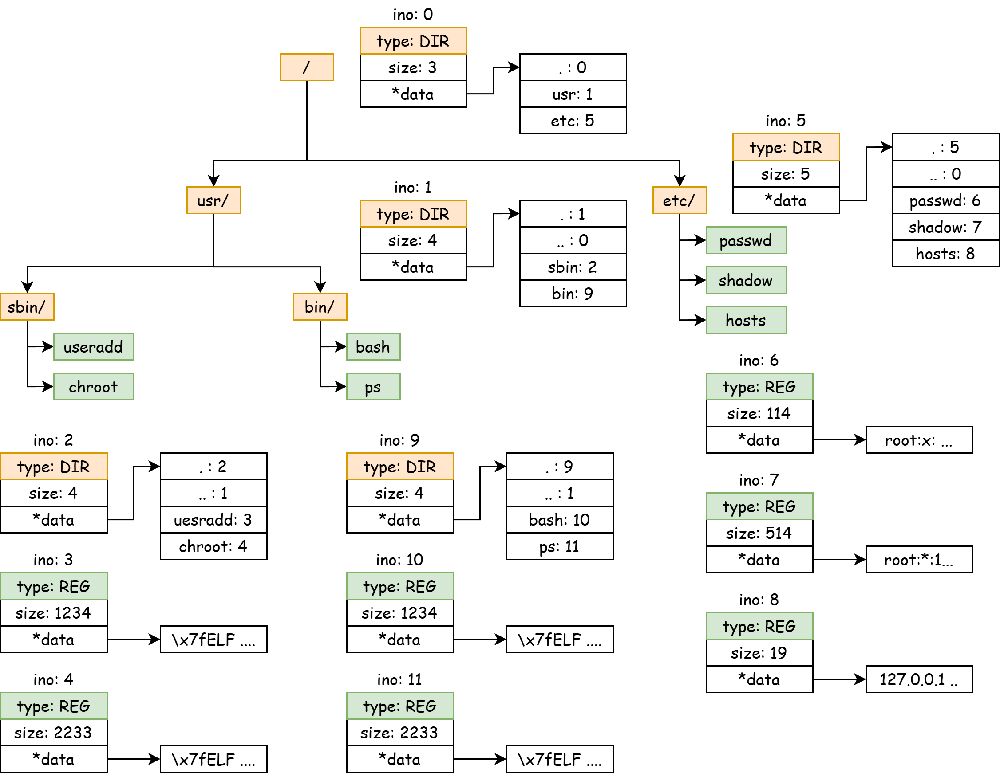

# FileSystem Design

## I/O

什么是 I/O 设备？ **I/O 设备就是一堆寄存器**。IO 设备通过寄存器完成与 CPU 的数据交换，然后根据寄存器中的要求完成任务。

CPU 怎么访问 I/O 设备的寄存器：I/O指令，或 Memory-Mapped Register。

!!!success "Recall 计组"
    我们可以先回顾一下，在计算机组成原理课的 Project 上，我们要使用 RISC-V 指令点亮一个 FPGA 板子上的一个灯泡。

    而 “FPGA 板子上的灯泡” 是通过 FPGA 芯片上的引脚连接到电路板上的 LED 灯。我们在 FPGA 上编程时，需要使用 `reg led[0:7]` 创建一些 Registers 并用它驱动 FPGA 芯片的引脚。

    而我们的 CPU 是怎么访问这些寄存器的？计组课可能会教两种方法：创建一种新的指令，专门用它来操作 LED 灯；将 LED 灯这些寄存器映射到 Address Space 上，通过普通的访存指令访问它们。

### 串口设备

在 QEMU 平台和 VisionFive2 上，串口所使用的设备模型是 uart8250。它的 MMIO 接口暴露了 8 个寄存器。具体的细节可见：https://www.lammertbies.nl/comm/info/serial-uart

uart8250 具有一个读口和一个写口，分别是 `RHR` 和 `THR`，它们都是8-bits的寄存器。在寄存器 `LSR` 中，各有一个 bit 表示读口有数据 (Bit 0, Data available) 和写口空闲（Bit 5, THR is empty）。

我们通过 Memory-mapped 地址访问设备的寄存器：

```c
#define Reg(reg) ((volatile unsigned char *)(KERNEL_UART0_BASE + (reg)))

static void set_reg(uint32 reg, uint32 val) {
    writeb(val, Reg(reg));
}

static uint32 read_reg(uint32 reg) {
    return readb(Reg(reg));
}
```

对于写入，我们使用轮询 Polling，只要 `LSR.THR` 提示 `THR` 空闲，我们就向 `THR` 中写入一个字符。

```c
static void uart_putchar(int ch) {
    while ((read_reg(LSR) & LSR_TX_IDLE) == 0);

    set_reg(THR, ch);
}
```

对于读取，我们使用中断，每当 I/O 设备填充完毕 `RHR` 后，它会发起一个中断，这个中断将由 PLIC 处理并分发到某个核心上，我们在中断处理函数中读取该字节。

```c
void uart_intr() {
    while (1) {
        int c = uartgetc();
        if (c == -1)
            break;
        // infof("uart: %c", c);
        consintr(c);
    }
}
```

### 块设备

我们对串口设备的访问是一个字节一个字节的，我们称这种设备为 Character Device。
与之对应的，块设备的访问是以一个块为单位的，块大小一般为 2的整数幂，如 512B 或 4KiB，我们称这种设备为 Block Device。
我们所使用的硬盘，包括固态硬盘和机械硬盘，都是块设备。

在 QEMU 上，块设备一般由 VirtIO Block-Device 提供。

VirtIO 是一种在虚拟化平台上非常常用的设备模型。它也定义了一堆寄存器接口，并通过 Memory-mapped register 进行访问。

!!!info "virtio"
    VirtIO 代码位于 `fs/virtio.c`，你可以参照 VirtIO 手册了解具体的细节。

    https://docs.oasis-open.org/virtio/virtio/v1.3/csd01/virtio-v1.3-csd01.pdf

## FileSystem

**文件系统是一个树状结构**。每个节点（统称为 **文件** ）要么是一个目录（directory）要么是一个普通文件（regular file）。树根称为 **根目录**，文件的路径名是从根目录到某个文件的路径上所有文件名的 concat。



每个文件拥有一个全局唯一的id，我们称之为 inode number (ino)。每个文件包含一些元信息（metadata），如大小、访问日期、权限等。

每个文件也包含一些内容：对于普通文件，它是一连串字节（字节数组）；对于目录，它是目录的内容，其中包含每个子文件的文件名和 inode number。

```c
struct file_content {
    union {
        char content[];
        struct {
            long ino;
            char name[32];
        } dirs[];
    };
}
```

如果用我们熟悉的 Java 语言来表示文件系统中的对象之间的关系：

```java
abstract class File {
    public long ino;
    public long size;
    // ...

    protected abstract byte[] getRawContent();
}

class RegularFile extends File {
    public byte[] getRegFileContent();
}

class Directory extends File {
    public Map<String, Long> getDirectoryContent();
}
```

### FileSystem API

文件系统 API 就是对这个树的查询、修改等操作。

对于目录结构，我们可以使用 `creat` 来创建一个文件、用 `mkdir` 来创建一个目录、用 `unlink` 来删除一个文件、用 `rmdir` 来删除一个目录。

```c
int creat(const char *pathname, mode_t mode);
int mkdir(const char *pathname, mode_t mode);
int unlink(const char *pathname);
int rmdir(const char *pathname);
```

我们可以使用 `read`, `write` 来读写一个普通文件的内容，其返回值包含成功读写的字节数。

```c
ssize_t read(int fd, void buf[.count], size_t count);
ssize_t write(int fd, const void buf[.count], size_t count);
```

如果要列出一个目录，我们可以使用 `getdents64`，内核会在用户的缓冲区中填充多个 `struct linux_dirent64` 结构体。

```c
ssize_t getdents64(int fd, void dirp[.count], size_t count);

struct linux_dirent64 {
    ino64_t        d_ino;    /* 64-bit inode number */
    off64_t        d_off;    /* Not an offset; see getdents() */
    unsigned short d_reclen; /* Size of this dirent */
    unsigned char  d_type;   /* File type */
    char           d_name[]; /* Filename (null-terminated) */
};
```

### In-Memory File System

我们可以试着在内存中构建一个文件系统。在数据结构课程上，我们学习到可以使用指针或者数组下标来构建一颗树。

构建文件系统实际上也就是构建一棵树，我们将每个节点称为 `inode`，并且用“下标”即 `inode number` 来表示对 `inode` 的指针。

每个 `inode` 拥有一个全局唯一的 id：`inode number` (`ino`)，但是我们可以不将它囊括在它自己的结构体 `struct inode` 中，因为我们永远是通过父级 inode 来找到子级的 inode.

```c
struct inode {
    long size;
    enum { Regular, Directory } type;

    void* data;
};
```

在 `struct inode` 中，它包含这个文件的类型、大小以及一个数据指针。我们规定：

1. 对于类型为 Regular 的普通文件，`*data` 指针指向一个 `char[]` 数组，其长度为 `size`

2. 对于类型为 Directory 的路径，`*data` 指针指向一个 `struct dirent[]` 数组，其具有 `size` 个 `struct dirent` 元素，总共大小为 `sizeof(struct dirent) * size`。

```c
struct dirent {
    long ino;
    char name[32];
};
```

每个 `struct dirent` 表示这个目录下的一个文件，它可能是一个普通文件、也可能是一个目录。

对于目录，它的子文件列表包含两个特殊的 `struct dirent`： `.` 和 `..`。前者表示一个指向它自己的目录，后者表示一个指向它上级目录的目录。



### Memory v.s. Disk

当我们尝试将上面这个树（即文件系统）保存到磁盘上时，我们必须先理解磁盘上存储数据结构的限制：

TODO

我们将在下一节课学习如何在磁盘上存储一个文件系统。

## Virtual File System

在进入文件系统一章前，我们可以先试着了解：**什么是文件？**

1. 当讨论文件系统上存储的文件时，**文件是一个字节序列**。

    不管是二进制文件（如 ELF 格式的可执行文件）还是 Markdown 格式的文本文件，它们本质上都是一串字节序列，只不过我们解读 (interpret) 它们的方式不同。

    内存空间也是一个字节序列，所以，能不能将文件的一部分映射到内存空间呢？这就是 `mmap(2)` 系统调用。

2. 当讨论操作系统中内核与用户模式交互时，**文件是内核中一个可以和用户程序交互的对象**。

    当我们使用 `open(2)` 系统调用打开一个文件路径时，内核返回了一个 `int` 类型的值，它是文件描述符 file descriptor。

    我们可以使用 `read(2)`、`write(2)`、`fcntl(2)` 等系统调用对这个文件进行读写等操作，它们的原型中均带有一个 `fd` 参数。

    ```c
    ssize_t read(int fd, void buf[.count], size_t count);
    ssize_t write(int fd, const void buf[.count], size_t count);
    int fcntl(int fd, int op, ... /* arg */ );
    off_t lseek(int fd, off_t offset, int whence);
    ```

    Unix 哲学中 Everything is a file. 当然内核可以创建一个不是代表着“文件系统上的文件”的文件描述符。

    例如，我们可以创建一个 fd 来接收 signal！（就是我们project的那个signal）

    ```c
    int signalfd(int fd, const sigset_t *mask, int flags);
    // signalfd() creates a file descriptor that can be used to accept signals targeted at the caller.  
    // This provides an alternative to the use of a signal handler or sigwaitinfo(2), and has the advantage that the
    //   file descriptor may be monitored by select(2), poll(2), and epoll(7).
    ```

    以及一种特殊的对象 epoll，它可以以非常低的性能代价监控超多 file descriptor 的状态变化。

    ```c
    // epoll_create, epoll_create1 - open an epoll file descriptor. 
    //  epoll_create() returns a file descriptor referring to the new epoll instance.
    int epoll_create(int size);

    // This  system call is used to add, modify, or remove entries in the interest list of the epoll(7) instance
    //    referred to by the file descriptor epfd.  It requests that the operation op be performed for  the  target
    //    file descriptor, fd.
    int epoll_ctl(int epfd, int op, int fd, struct epoll_event *_Nullable event);

    // epoll_wait - wait for an I/O event on an epoll file descriptor
    int epoll_wait(int epfd, struct epoll_event *events, int maxevents, int timeout);
    ```

    我们的控制台对应的文件描述符 0 (stdin), 1 (stdout), 2 (stderr) 也不是存储在磁盘上的文件系统中的一个文件。
    
    在xv6启动第一个进程时，它会创建两个文件 stdin 和 stdout，分别绑定(install) 到第一个进程的 0 号 fd 和 1 号 fd。

    在第一个进程(init)通过 fork exec 创建第二个进程 `sh` 时，`sh` 从 `init` 手里继承了这两个文件，并且仍然通过 0 和 1 这两个文件描述符索引它们。

总而言之，**文件描述符是用户程序操作内核对象的一个标识符**。当内核创建一个对象后（它可能不是一个“存储在磁盘上的文件”），内核将它绑定到文件描述符表 (File Descriptor Table, fdt) 中的某个整数上，用户可以通过一些系统调用对这个文件进行操作，通过文件描述符来指定操作哪个文件。

## Lab Report

1. 我们在哪里存储文件名？为什么？

