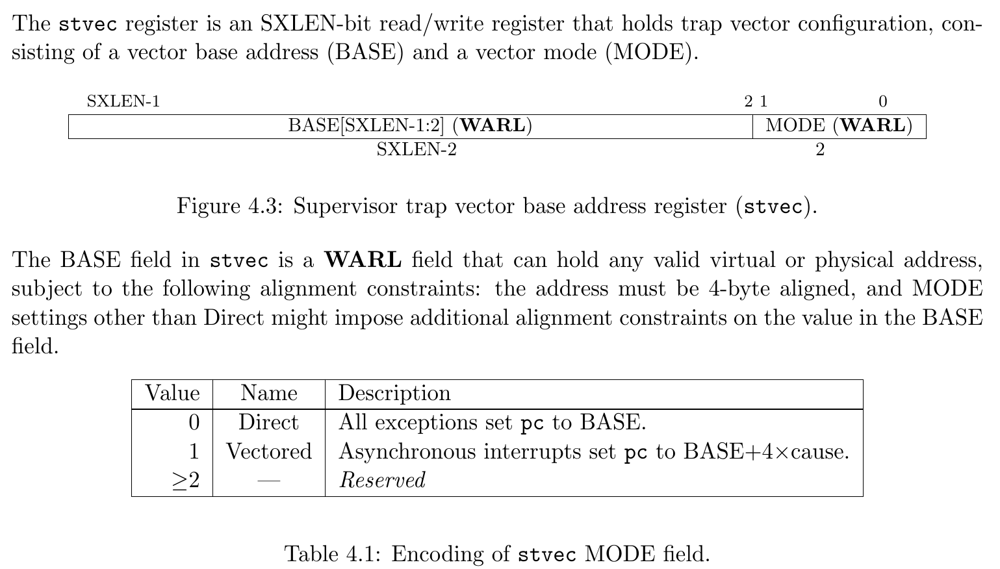
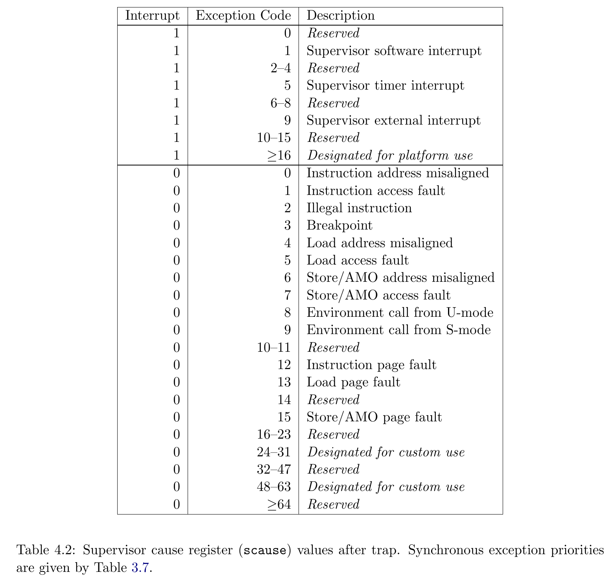

# Trap, Exception and Interrupt

## 实验目的

1. 了解异常控制流
2. 了解RISC-V架构是如何支持CPU中断的
3. 掌握trap处理流程

!!!warning "xv6-lab2 代码分支"
    
    https://github.com/yuk1i/SUSTech-OS-2025/tree/xv6-lab2

    使用命令 `git clone https://github.com/yuk1i/SUSTech-OS-2025 -b xv6-lab2 xv6lab2` 下载 xv6-lab2 代码。

    使用 `make run` 运行本次 Lab 的内核，你将会看到一次 Kernel Panic。

!!!info "推荐阅读"
    
    CSAPP, Chapter 8, Exceptional Control Flow.

    https://csapp.cs.cmu.edu/2e/ch8-preview.pdf

## Exceptional Control Flow

在正常的程序运行状态下，控制流 (可以认为是 pc 指针的序列) 是按照程序所预定的顺序一步步执行的。但是，操作系统不可避免地需要处理一些在“预定之外的”情况，例如程序出错、或者外部状态有所改变，比如有数据包抵达网卡、用户敲击键盘等事件。现代操作系统通过改变控制流来处理这些事件，我们将这种控制流称为 Exceptional Control Flow (异常控制流)。

## Exceptions, Traps, and Interrupts

在 RISC-V 体系架构中，我们将 Exception (异常)、 Interrupt (中断)和 Trap (陷阱，陷入) 定义如下：

- Exception: 一种不寻常的情况，出现在指令执行的时刻。
- Interrupt: 一种外部的事件，与当前 RISC-V 核心指令执行是异步的。
- Trap: 一种同步的、由于异常或中断导致的控制流转移。**我们可以将 Trap 认为是对 Exception 和 Interrupt 的处理行为。**

!!!info "什么是同步/异步 (Synchronous / Asynchronous)"
    
    回想在数字逻辑课程上实现的单周期 RISC-V CPU，我们有时钟信号 clk (clock)，每(n)个时钟周期执行一条指令。

    同步的异常是由于指令执行时产生的，所以异常的产生是与 clk 对齐的；而异步的异常则完全与当前指令、clk无关。

    

所以，很显然为什么 Trap 所指的控制流转移是“同步”的：我们起码需要等待时钟周期来临才能进行控制流转移。

We use the term **exception** to refer to an unusual condition occurring at run time associated with an instruction in the current RISC-V thread.
We use the term **trap** to refer to the synchronous transfer of control to a trap handler caused by an exceptional condition occurring within a RISC-V thread.
Trap handlers usually execute in a more privileged environment.

We use the term **interrupt** to refer to an external event that occurs asynchronously to the current RISC-V thread.
When an interrupt that must be serviced occurs, some instruction is selected to receive an interrupt exception and subsequently experiences a trap.

Source: riscv-spec-v2.1.pdf, Section 1.3 "Exceptions, Traps, and Interrupts".

!!!info "RISC-V 与 x86 的不同："
    
    在不同的教材中，我们对 Exception (异常)、Trap (陷阱) 和 Interrupt (中断) 有着类似的定义，例如 CSAPP 参照 x86 模型描述了如下四种类型的控制流中断：主要区别在于异常控制流产生是否与指令流同步、以及跳转至异常控制流后是否会返回到原来程序的控制流。

    

    例如，x86 中的异常类型： Page Fault (缺页异常)，Machine Check (Abort) (内存或硬件错误)。

    但是，在 RISC-V 模型下，上述的返回行为均是可以通过软件模拟的，所以在 RISC-V 硬件模型上，导致控制流改变的原因只有两种：异常 (Exception) 和中断 (Interrupt)。而导致控制流改变的结果就是进入 Trap。

    Note: RISC-V 硬件层面有一种极其精简的设计语言：只要软件能处理的事情，硬件一概不管。

## CSR: mstatus/sstatus

!!!info "CSR"
    
    如果你不清楚 CSR 是什么，请重新阅读上一节 Lab 课的课件。

    你可能会对 CSR Field 定义中的 WPRI, WLRL, WARL 等关键字感到迷惑，请查阅 riscv-privilege.pdf, Section 2.3 CSR Field Specifications.

mstatus/sstatus: Machine/Supervisor Status Register. 该寄存器保存着 RISC-V 核心的控制状态，sstatus 实际上是 mstatus 的一个 Restricted View.


由于 RISC-V 的手册对 CSR 寄存器每个 Field 的定义实在是太难找，我们在此处提供一个用于快速查找的表：

| Field | 全称 (猜的)                           | 意义                                         |
| ----: | :------------------------------------ | -------------------------------------------- |
|   SPP | Supervisor Previous Privilege         | 进入 Supervisor mode 前，Hart 所处的特权级。 |
|   SIE | Supervisor Interrupt Enabled          | Supervisor 下，中断启用标志位。              |
|  SPIE | Supervisor Previous Interrupt Enabled | 进入 Supervisor 前的中断启用状态。           |
|   SUM | Supervisor User-Memory                | 允许 Supervisor 模式下访问带 U-bit 的页面    |

其他我们目前用不到的在此不做解释。

## Trap 相关寄存器：

我们首先列举一下在 Trap 处理流程中用到的寄存器：

- stvec : Supervisor Trap Vector Base Address Register
    - 存储 Trap 处理函数地址。一般称之“中断向量”，我们会在后续讲解。
- sip : Supervisor Interrupt Pending
    - 表示有哪些中断等待处理
- sie : Supervisor Interrupt Enabled
    - 表示可以处理那些中断
    - 注意不要与 sstatus.SIE 搞混。
- sepc: Supervisor Exception Program Counter
    - 发生中断时的 PC 指针
- scause: Supervisor Cause
    - 发生中断的原因
- stval: Supervisor Trap Value
    - 发生中断的额外信息

### stvec
在异常或中断产生后，应该有个 **Trap处理程序** 来处理这些异常和中断。`stvec`(Supervisor Trap Vector Base Address Register)即是所谓的`Trap向量表基址`。
向量表的作用就是把不同种类的 Trap 映射到对应的 Trap 处理程序。
如果只有一个处理程序，那么可以让`stvec`直接指向那个处理程序的地址。

!!!note "stvec"

    stvec 规定 Trap 处理函数入口一定是对齐到 4 bytes (即最后两 bit 为 0)；同时，用这最后两位表示两种模式：

    1. Direct 模式：所有 Trap 的入口均为 pc <= BASE
    2. Vectored 模式：对于异步的中断，pc <= BASE + 4 * cause

    在我们的代码中，我们使用 Direct 模式。



### scause

当一个陷阱（trap）被捕获并进入 S 模式（Supervisor Mode）时，`scause` 寄存器会被写入一个代码，该代码指示导致陷阱的事件。




### sie & sip

`sip` 寄存器是一个 64 位的读写寄存器，用于存储有关挂起中断的信息，而 `sie` 则是相应的 64 位读写寄存器，包含中断使能位。

中断原因编号 `i`（如 CSR `scause` 中所示）对应于 `sip` 和 `sie` 寄存器中的第 `i` 位。
第 15:0 位仅分配给标准中断原因，而第 16 位及以上的位则保留给平台或自定义用途。


### sepc

当一个 Trap 被捕获并进入 S 模式（Supervisor Mode）时，
`sepc` 寄存器会被写入 **被中断或遇到异常** 的指令的虚拟地址。

### stval

当一个 Trap 被捕获并进入 S 模式（Supervisor Mode）时，
`stval` 寄存器会被写入与异常相关的特定信息，以协助软件处理该陷阱。

在取指、加载或存储操作中发生断点、地址不对齐、访问错误或页错误异常时，
`stval` 会被写入一个非零值，并且 `stval` 将包含导致异常的虚拟地址。

## CPU 如何处理 Trap

Trap处理过程可以分为三个主要部分：

1. 进入Trap
2. Trap处理程序
3. Trap处理返回 

### 1. 进入 Trap

**当一个 Exception 发生时，或者 Hart 准备好处理 Interrupt 时，** Trap 发生，CPU 在硬件电路上完成以下几件事情：

1. scause <= {1b'Is_Interrupt, 63b'Cause}
2. stavl <= Trap_Value
3. sepc <= pc
4. sstatus.SPP <= Current_Privilege_Level
5. sstatus.SPIE <= sstatus.SIE
6. sstatus.SIE <= 0
7. pc <= stvec

即设置 `scause` 与 `stval` => 保存 PC 到 `spec` => 保存当前特权级(U/S)到 `sstatus.SPP` => 保存当前中断状态到 `sstatus.SPIE` => 将中断关闭 `sstatus.SIE = 0`，防止在 Trap 处理函数中遇到中断 => 跳转到 `stvec`

### 2. Trap 处理程序

`stvec` 中存储了 Trap 处理程序的地址，当CPU记录完导致Trap的异常或中断的相关信息后，`pc` 会指向 `stvec` 中存储的地址，从而执行相应的 `Trap` 处理程序.
`Trap` 处理程序会根据寄存器中存储的异常或中断的相关信息，采用不同的软件行为进行相应的处理。

### 3. Trap处理返回 `sret`

RISC-V 使用 `sret` 指令从 Supervisor 的 Trap 中退出，该指令会执行以下步骤：

1. sstauts.SIE <= sstatus.SPIE
2. Current_Privilege_Level <= sstauts.SPP
3. pc <= epc

即还原 `sstatus.SIE` 为 `sstatus.SPIE` => 将特权级(U/S)设置为 `sstauts.SPP` => 将 PC 设置为 `sepc`

实际上 sret 就是 Trap 时三步保存的逆步骤：还原 `SIE`、特权级和 PC 寄存器。

## 代码解读

在操作系统启动之后，我们将对 `stvec` 寄存器的值进行初始化，将它指向 `kernel_trap_entry`。

```C
//trap.c
void set_kerneltrap() {
    assert(IS_ALIGNED((uint64)kernel_trap_entry, 4));
    w_stvec((uint64)kernel_trap_entry);  // DIRECT
}
```

接着，当 Trap 发生后，CPU在做完相应信息的存储后，跳转到 `stvec` 指向的 `kernel_trap_entry` 方法开始执行，它是适用于 S mode 的中断向量入口点。

```asm
    .globl kernel_trap_entry
    .align 2
kernel_trap_entry:
    // we store all registers in the stack
    add sp, sp, -0x100
    sd x0, 0x00(sp)
    sd x1, 0x08(sp)
    sd x2, 0x10(sp)
    // ...
    sd x30, 0xf0(sp)
    sd x31, 0xf8(sp)

    // ...
```

入口点会在栈上申请 0x100 bytes 的空间，并保存所有通用寄存器到栈上。
此时，栈上保存了 32 个寄存器，每个占用空间 8 bytes，总共占用 0x100 bytes，从低地址到高地址分别是从 x0 到 x31。
我们定义一个结构体 `struct ktrapframe`，并使它的内存布局和此时栈上的寄存器布局一致。
这样的话，我们在 C 语言中就可以直接对一个 `struct ktrapframe*` 的指针进行解引用，来访问到此时在栈上保存的所有 GPR。

```C
struct ktrapframe {
    uint64 x0;  // x0
    uint64 ra;
    uint64 sp;
    uint64 gp;
    uint64 tp;
    uint64 t0;
    uint64 t1;
    uint64 t2;
    uint64 s0;
    uint64 s1;
    uint64 a0;
    uint64 a1;
    uint64 a2;
    uint64 a3;
    uint64 a4;
    uint64 a5;
    uint64 a6;
    uint64 a7;
    uint64 s2;
    uint64 s3;
    uint64 s4;
    uint64 s5;
    uint64 s6;
    uint64 s7;
    uint64 s8;
    uint64 s9;
    uint64 s10;
    uint64 s11;
    uint64 t3;
    uint64 t4;
    uint64 t5;
    uint64 t6;

    // 32 * 8 bytes = 256 (0x100) bytes
};
```

!!!note "栈"

    在一进入 Trap Handler 时，我们可以假定之前的程序是在执行 C 代码，以及它拥有一个合法的栈。
    
    我们当然希望 Trap 处理函数能是 C 语言写的，而这也需要一个合法的栈空间。 
    **所以，我们可以直接借用原来正在执行的程序所用的栈空间** ，只要我们确保 sp 指针能被复原即可。
    并且， C 语言编译器在使用栈时，借多少空间就会还多少空间。
    
    所以我们只需要保证我们在汇编层面对栈的操作是平衡的，就可以直接使用现有的栈进行上下文的保存，剩下的就可以放心地交给编译器了。

!!! note "上下文"

    Trap 的处理需要“放下当前的事情但之后还能回来接着之前往下做”，对于CPU来说，实际上只需要把原先的寄存器保存下来，做完其他事情把寄存器恢复回来就可以了。

    在刚刚进入 Trap 处理函数时，31 个 GPR（General Purpose Register，通用寄存器） x1-x31 均是原来的程序正在使用中的寄存器。Trap Handler 需要保证在控制流回到原先的程序后， GPR 应该与产生 Trap 前一致。所以，我们需要一些内存空间来保存这些寄存器，并在从 Trap 中返回时恢复它们原来的值。我们可以将这些寄存器称为原先程序的 **Context (上下文)** 。

    因此，我们使用汇编实现上下文切换(context switch)机制，这包含两步：

    - 保存CPU的寄存器（上下文）到内存中（栈上）
    - 从内存中（栈上）恢复CPU的寄存器


接着，我们将 `a0` 设置为 `sp`，调用 `kernel_trap` ，进入 C 代码继续处理 Trap。


```asm
    .globl kernel_trap_entry
    .align 2
kernel_trap_entry:
    // ...

    mv a0, sp   // make a0 point to the ktrapframe structure
    call kernel_trap

    // ...
```

由于 RISC-V 使用 a0 作为传递第一个参数的寄存器，a0 此时指向栈上的 `struct ktrapframe` 结构体，所以 `kernel_trap` 函数的第一个参数的值即为a0的值 `struct ktrapframe* ktf`。

```c
void kernel_trap(struct ktrapframe *ktf) {
    assert(!intr_get());

    if ((r_sstatus() & SSTATUS_SPP) == 0)
        panic("kerneltrap: not from supervisor mode");

    uint64 cause = r_scause();
    uint64 exception_code = cause & SCAUSE_EXCEPTION_CODE_MASK;
    if (cause & SCAUSE_INTERRUPT) {
        // handle interrupt
        switch (exception_code) {
            case SupervisorTimer:
                debugf("s-timer interrupt, cycle: %d", r_time());
                set_next_timer();
                break;
            case SupervisorExternal:
                debugf("s-external interrupt.");
                plic_handle();
                break;
            default:
                errorf("unhandled interrupt: %d", cause);
                goto kernel_panic;
        }
    } else {
        // kernel exception, unexpected.
        goto kernel_panic;
    }

    assert(!intr_get());
    return;

kernel_panic:
    panicked = 1;

    errorf("=========== Kernel Panic ===========");
    print_sysregs(true);
    print_ktrapframe(ktf);

    panic("kernel panic");
}
```

在进入 `kernel_trap` 时，CPU 的中断位 `sstatus.SIE` 应该是保持关闭的，并且 Previous Privilege 应该是 Supervisor 模式，我们使用 assert（断言）来确保代码是按照预期执行的。

!!!info "为什么我们要写 assert"
    断言（Assertions）在操作系统开发中是一个非常重要的调试和错误检测工具。
    断言可以帮助开发者在程序执行的早期阶段捕获可能的逻辑错误。
    通过在代码中插入断言，我们可以立即检测到不符合预期的状态或条件，而不是等到程序崩溃或产生不可预测的行为后，再来猜测问题可能出在哪里。

    换句话说，如果我们在某个点上能探测到程序的运行状态偏离了我们的预期，那我们就可以让它尽量崩溃在第一现场，以提供更加有效的调试信息。

然后，我们读取 `scause` 寄存器判断 Trap 是因为中断还是异常陷入的，并且我们处理时钟中断和 PLIC 管理的外部中断，对于其他预期之外的 Trap 原因，我们可以打印栈上保存的 `ktramframe` 结构体帮助调试，并使用 `panic` 宏表示内核遇到了不可恢复的错误并停机。

最后，我们从 `kernel_trap` 离开，回到 `kernel_trap_entry` 继续执行。

```asm
    .globl kernel_trap_entry
    .align 2
kernel_trap_entry:
    // ...
    call kernel_trap

    // restore all registers
    //ld x0, 0x00(sp) // do not write to x0
    ld x1, 0x08(sp)
    ld x2, 0x10(sp)
    // ...
    ld x30, 0xf0(sp)
    ld x31, 0xf8(sp)

    // restore stack
    add sp, sp, 0x100

    // return from trap
    sret
```

从 C 语言环境退出后，我们从栈上恢复所有通用寄存器，恢复栈空间，然后使用 `sret` 退出 Trap。

sret 将把 `sepc` 的值还原至 PC 寄存器

下图展示了 进入 Trap，构造 ktrapframe，然后恢复并 sret 过程的栈结构：


## Lab 实验报告

!!!question "Question 1"

    结合本周的实验内容。通过gdb调试器写出上一周实验代码运行到main函数时stvec的值。并结合这个值进一步解释为何读取 CSR mvendorid的值失败后会操作系统的表现是无限重启。

    你可能需要用到gdb指令 `until main` 和 `print $stvec` 。

!!!question "Question 2"

    在 `main.c` 中， `ebreak` 指令会主动触发一次异常。使用 `make run` 运行内核，你将会看到 `Kernel Panic`，以及它打印的一些 CSR.

    对照 RISC-V 特权级手册 Section `4.1.1 Supervisor Status Register (sstatus)`，查阅 Kernel Panic 日志中打印的 CSR，请你从 sstatus 的值中提取的 SIE, SPIE, SPP 三个 bit 的值，并解释其意思。

    对照 scause 中关于 Interrupt/Exception Code 的描述， **写下当前 scause 的意思** 。

    接着，在 `trap.c` 中的 `kernel_trap` 函数中，修改 else 分支，使 `ebreak` 造成的异常不要进入 `kernel_panic` 标签，而是退出 `kernel_trap` 处理函数：

    ```c
    if (cause & SCAUSE_INTERRUPT) {
        // handle interrupt
        // ...
    } else {
        if (exception_code == ?) {
            debugf("breakpoint");
        } else {
            // kernel exception, unexpected.
            goto kernel_panic;
        }
    }
    ```

    写下 ? 处应该填什么。使用 `make run` 运行内核，你观察到了什么？并解释运行结果。

!!!question "Question 3"

    RISC-V 特权级手册，Section `3.3.1 Environment Call and Breakpoint` 解释 `ecall` 和 `ebreak` 指令如下：

    > ECALL and EBREAK cause the receiving privilege mode’s epc register to be set to the address of
    > the ECALL or EBREAK instruction itself, not the address of the following instruction. As ECALL
    > and EBREAK cause synchronous exceptions, they are not considered to retire, and should not
    > increment the minstret CSR.

    请你在 `debugf("breakpoint");` 后面加一条代码，实现在退出 Trap 后能执行后续的指令，而不是重复执行 `ebreak`。

    Note: 你可以在 `build/kernel.asm` 里面查阅整个内核镜像的反汇编结果，即每个地址上是什么指令。

## Interrupt

RISC-V 规范定义了每个 Hart 的 M/S mode 各有三种标准的中断：时钟中断 (Timer)、软件中断 (Software) 和外部中断 (External)。

### 什么时候能处理 Interrupt

RISC-V 定义了三种标准的中断：Software Interrupt, Timer Interrupt 和 External Interrupt，对应 scause 中的 Exception Code 1, 5, 9， 对应 sip/sie 中的第 1, 5, 9 bit。

<!-- 中断源会拉高 Hart 的 sip 中的 bit，Hart 会判断当前能否进入中断。 -->

当 Interrupt 到来时，RISC-V 核心会检测当前是否能够处理中断，即是否能进入 Trap：

- (当前运行在 S 模式，且 `sstatus.SIE` == 1) 或者 当前运行在 U 模式。
- 中断类型 bit i 在 `sie` 和 `sip` 中均为 1.

> An interrupt i will trap to S-mode if both of the following are true:
>
> (a) either the current privilege mode is S and the SIE bit in the sstatus register is set, or the current privilege mode has less privilege than S-mode; and
>
> (b) bit i is set in both sip and sie.

当 Software/Timer/External Interrupt 到达 CPU 时，`sip` 中对应的 bit 会被拉高，然后 CPU 会按照如上条件进行检查，如果符合条件，则会进入 Trap。

### 时钟中断

时钟中断可以理解为每隔一段时间执行一次的程序。即每隔一段时间，会固定触发一次的中断。在时钟中断的处理时，我们可以完成进程调度等操作。

RISC-V 平台提供了一个实时的时间计数器: `time` 寄存器，该寄存器以恒定的频率增长，并且在所有核心之间共享。另外，RISC-V 对每个核心的提供了一个 `timecmp` 寄存器，每当 `time >= timecmp` 时，该核心就会拉高时钟中断的 `sip.STIP` bit，如果核心满足进入中断 Trap 的条件，则会进入 Trap 。

SBI 提供了一个 SBI call：`SBI_SET_TIMER` 允许 Supervisor 软件设置 `timecmp` 寄存器。在已知 time 寄存器的增长频率后，我们可以计算一定时间 (如 10ms) 内 time 会增长多少，并设置 timecmp 为该值，我们即可在 10ms 后收到一次时钟中断。在每次进入时钟中断时，我们再次计算并设置下次的 timecmp，由此实现每 10ms 收到一次时间中断。

时钟部分的代码位于 `timer.c`。

在初始化时钟中断时，我们通过 SBI call `SET_TIMER` 设置 `timecmp`，并在 `sie` 中启用时钟中断 `SIE_STIE`。

在 `kernel_trap` 中处理时钟中断时，我们计算下一次的 `timecmp`，并再次 SBI call `SET_TIMER`，循环往复。

!!!question "Lab 实验报告 - Question 4"
    将 `main.c` 中的 `asm volatile("ebreak" ::: "s11");` 一行代码注释掉，并将 `intr_on()` 取消注释。
    
    使用 `make run` 后观察每次触发时钟中断时的 cycle 读数。

    注释掉 `trap.c` 中 `kernel_trap` 调用 `set_next_timer()`，并再次 `make run` 观察每次触发时钟中断时的 cycle 读数。

    请解释现象和为什么会这样。

!!!info "mtimecmp 和 stimecmp"
    实际上，标准的 RISC-V 特权级手册只定义了 M-mode 的 `mtimecmp` 寄存器。S mode 的软件需要使用 SBI call 设置时钟中断，这实际上是通过 OpenSBI 设置 `mtimecmp` ，并在 `mtvec` 中将 `STIP` 置 1 来实现为 S mode 设置时钟中断的。这也体现了 RISC-V 硬件设计上能不管就不管的原则，以及 M mode 通过 emulate 来为上层软件模拟行为。

    实际上，特权级切换是一个相当耗时的操作，为了改进 Supervisor 时间中断的性能，RISC-V 规定了 Sstc 扩展，创建了 `stimecmp` CSR，允许 Supervisor 直接设置其时钟中断计数器。

    我们可以在 QEMU 的 CPU flags 中将 Sstc 扩展禁用掉（`-cpu rv64,sstc=off`），来观察 OpenSBI 在没有 Sstc 时的行为。我们可以直接使用命令 `qemu-system-riscv64 -nographic -machine virt -cpu rv64,svadu=off,sstc=off -m 512 -kernel build/kernel  -S -gdb tcp::3333` 来启动一个带调试器的 qemu。

    挂载 GDB 后，我们是用 `c` (continue) 命令继续执行，当 QEMU 输出出现 `kernel_trap: s-timer interrupt` 时，在 GDB 终端中按 Ctrl-C 中断执行，使用`print $mtvec` 得到 M mode 的中断向量地址，并使用 `b *0x800004f0` 在中断向量上打断点。

    使用 `c` 继续执行，在命中 `0x800004f0` 的断点时，我们使用 `print $mcause` 查询 M mode 的 Trap 原因。

    我们应该会看到，在没有 `Sstc` 时，mcause 会有两个值 `0x8000000000000007` 和 `0x9`，分别对应着 M-mode Timer Interrupt 和来自 S-mode 的 `ecall`。如果有 `Sstc` 扩展，我们会发现 `mcause` 只会有 `0x9` 一种值。这种情况下，使用 SBI_SET_TIMER 时，OpenSBI 会直接设置 `stimecmp` 寄存器，避免了 S mode 的时钟中断通过 OpenSBI 路由。


### 外部中断

我们之前描述中断与 Trap 时，我们说的是 "当 Interrupt 到来时，RISC-V 核心..."。所以，外部中断是如何来到每个核心的？

PLIC (Platform-Level Interrupt Controller) 是 RISC-V 平台上用于管理外部中断的 IP 核，每个 RISC-V 平台拥有多个核心 (Hart)，而每个平台一般只有一个 PLIC。

简而言之，每个外设均会向 PLIC 通报自己有中断需要处理，而每个设备的中断均有一个中断号，PLIC 会根据预先配置的规则，将该中断路由 (Routing) 给某(些)核心处理，并拉起该核心的 mip.MEIP/sip.SEIP 以请求中断核心。

核心需要向 PLIC 声明 (Claim) 自己来负责处理这个中断，并在处理完毕后声明自己完成了这个中断的处理 (Complete)。

Specification: https://github.com/riscv/riscv-plic-spec/blob/master/riscv-plic.adoc

!!!info "AMD64 和 Aarch64"
    x86 (IA32)，x86-64 (AMD64) 和 ARM 平台上也有类似的全局中断处理器：[PIC](https://wiki.osdev.org/8259_PIC), [APIC](https://wiki.osdev.org/APIC), [GIC](https://developer.arm.com/documentation/198123/0302/What-is-a-Generic-Interrupt-Controller-)

#### PLIC 结构

PLIC 可以管理 1~1023 个中断源，每个中断源拥有一个优先级 Priority 。PLIC 将能够接收中断的对象 (Interrupt Targets) 称为 Hart Context (where a hart context is a given privilege mode on a given hart)，每个 Context 可以视为一个二元组 (Hart ID, Privilege Level) 对应着一个 Hart 和一个特权级别。由于目前 RISC-V 没有规定 User-Mode Interrupt，（RISC-V privilege spec 只规定了 mie/mip 和 sie/sip，对应着 Machine Mode 和 Supervisor Mode 的中断），我们可以认为每个核心拥有两个 Context，分别对应着该 Hart 的 M mode 和 S mode 的外部中断。

PLIC 能够管理 0~15871 个 Context，能设置每个中断源是否允许路由至某个 Context (Enabled Bit)，每个 Context 能接收的 Priority Threshold。

PLIC 会拉起 Hart 的 mip.MEIP/sip.SEIP bit，而该 hart 是否进入 Interrupt 的 Trap 由上述 `进入中断的条件` 决定。


#### Memory-Mapped Register

PLIC 使用 Memory-Mapped Register 向系统暴露管理接口。对于每个寄存器，我们使用偏移量来定位每个寄存器。通常，这种 IP 核有着固定的基地址，在 QEMU 上，对于 PLIC 这个基地址是 `0x0c00_0000`。

!!!info "Memory-Mapped Register, MMIO"
    Memory Mapped Register（内存映射寄存器）是一种在计算机体系结构中用于外围设备和硬件控制的重要技术。

    Memory-Mapped Register 是指将硬件设备的寄存器直接映射到处理器的内存地址空间中。这意味着 CPU 可以像访问内存那样访问某个地址，而该地址实际上对应着某个设备内部的寄存器。

    使用 Memory-Mapped Register 进行的 IO 操作即称为 Memory-Mapped I/O (MMIO)

    ```
    gef > monitor info mtree
        000000000c000000-000000000c5fffff (prio 0, i/o): riscv.sifive.plic
    ```

例如，Specification 中的 Memory Map 规定，`base + 0x4 * i` 是第 i 个中断源的

```
base + 0x000000: Reserved (interrupt source 0 does not exist)
base + 0x000004: Interrupt source 1 priority
base + 0x000008: Interrupt source 2 priority
...
base + 0x000FFC: Interrupt source 1023 priority
```

在 `plicinit` 中，我们向 `base + 10*4 = 1` 设置 UART0 (10号中断) 的 Interrupt Priority 为 1。在 `plicinithart` 中，我们将该 Hart 的 S-mode Context 允许来自 10 号中断、并设置 Priority Threshold 为 0。最后，启用该核心的 `sie.SEIE` 位，表示该核心允许 Supervisor-Mode External Interrupt。在 `main.c` 的 `while(1)` 循环前，我们使用 `intr_on` 打开整个 CPU 的 S mode 中断。

#### Claim & Complete

在 Hart 因为 External Interrupt 陷入 Trap 后，Hart 需要向 PLIC 申请处理该中断。在处理完成后，Hart 还需要向 PLIC 申明该中断处理完毕。


#### 串口中断

在 QEMU 平台上，串口所使用的设备模型是 uart8250。它的 MMIO 接口暴露了 8 个寄存器。具体的细节可见：https://www.lammertbies.nl/comm/info/serial-uart

uart8250 具有一个读口和一个写口，分别是 `RHR` 和 `THR`，它们在寄存器 `LSR` 中各有一个 bit 表示读口有数据和写口空闲。读取和写入的函数位于 `uartgetc` 和 `uart_putchar`。

在串口初始化函数 `console_init` 中，我们向 uart8250 的 MMIO 地址中的 `IER` 寄存器写入特殊的标志位，表示我们允许 uart8250 设备在有输入的时候产生中断。随后，我们向 PLIC 注册该设备的中断号 10，将其路由到当前核心的 S mode 下，并在 `kernel_trap` 中对其处理。

```c
if (cause & SCAUSE_INTERRUPT) {
    // handle interrupt
    switch (exception_code) {
        case SupervisorExternal:
            debugf("s-external interrupt.");
            plic_handle();
            break;
    }
}
```

`plic_handle` 函数会从 PLIC Claim 得到当前外部中断来源的中断号，如果它是 UART0 的中断号 10，那么就交给 `uart_intr()` 函数处理。