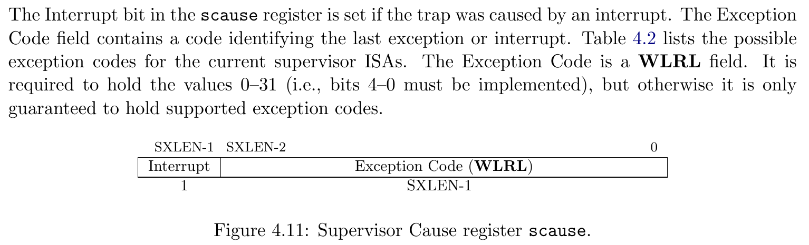
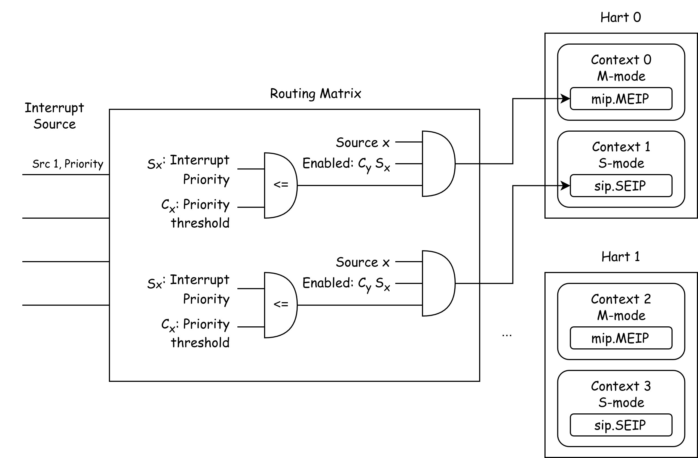
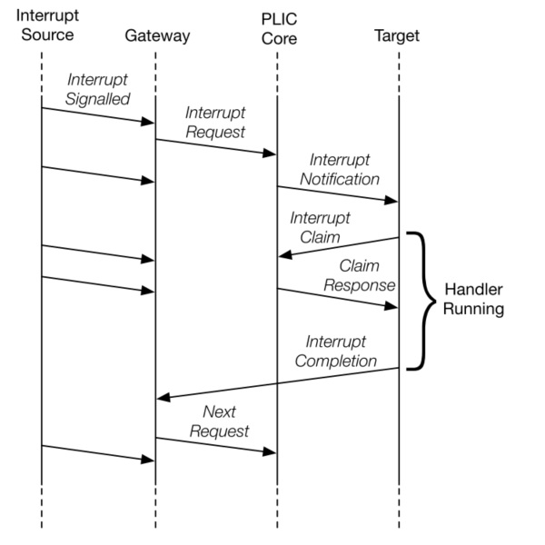

# 中断 & 异常处理

!!!info "推荐阅读"
    CSAPP, Chapter 8, Exceptional Control Flow.

    https://csapp.cs.cmu.edu/2e/ch8-preview.pdf

## Exceptional Control Flow

在正常的程序运行状态下，控制流 (可以认为是 pc 指针的序列) 是按照程序所预定的顺序一步步执行的。但是，操作系统不可避免地需要处理一些在“预定之外的”情况，例如程序出错、或者外部状态有所改变，比如有数据包抵达网卡、用户敲击键盘等事件。现代操作系统通过改变控制流来处理这些事件，我们将这种控制流称为 Exceptional Control Flow (异常控制流)。

## Exceptions, Traps, and Interrupts

在 RISC-V 体系架构中，我们将 Exception (异常)、Trap (陷阱) 和 Interrupt (中断) 定义如下：

- Exception: 一种不寻常的情况，出现在指令执行的时刻。
- Interrupt: 一种外部的事件，与当前 RISC-V 核心指令执行是异步的。
- Trap: 一种同步的、由于异常导致的控制流转移。我们可以将 Trap 认为是对 Exception 和 Interrupt 的处理行为。

!!!info "什么是同步/异步 (Synchronous / Asynchronous)"
    回想在数字逻辑课程上实现的单周期 RISC-V CPU，我们有时钟信号 clk，每(n)个时钟周期执行一条指令。

    同步的异常是由于指令执行时产生的，所以异常的产生是与 clk 对齐的；而异步的异常则完全与当前指令、clk无关。

    

所以，很显然为什么 Trap 所指的控制流转移是“同步”的：我们起码需要等待时钟周期来临才能进行控制流转移。

We use the term **exception** to refer to an unusual condition occurring at run time associated with an instruction in the current RISC-V thread.
We use the term **trap** to refer to the synchronous transfer of control to a trap handler caused by an exceptional condition occurring within a RISC-V thread.
Trap handlers usually execute in a more privileged environment.

We use the term **interrupt** to refer to an external event that occurs asynchronously to the current RISC-V thread.
When an interrupt that must be serviced occurs, some instruction is selected to receive an interrupt exception and subsequently experiences a trap.

Source: riscv-spec-v2.1.pdf, Section 1.3 "Exceptions, Traps, and Interrupts".

!!!info "RISC-V 与 x86 的不同："
    在不同的教材中，我们对 Exception (异常)、Trap (陷阱) 和 Interrupt (中断) 有着类似的定义，例如 CSAPP 参照 x86 模型描述了如下四种类型的控制流中断：主要区别在于异常控制流产生是否同步与指令流、以及跳转至异常控制流后时候会返回到原来程序的控制流。

    

    例如，x86 中的异常类型： Page Fault (缺页异常)，Machine Check (Abort) (内存或硬件错误)。

    但是，在 RISC-V 模型下，上述的返回行为均是可以通过软件模拟的，所以在 RISC-V 硬件模型上，导致控制流改变的原因只有两种：异常 (Exception) 和中断 (Interrupt)。

## CSR: mstatus/sstatus

!!!info "CSR"
    如果你不清楚 CSR 是什么，请参照：[QRH - CSR](../../qrh/csr.md)

mstatus/sstatus: Machine/Supervisor Status Register. 该寄存器保存着 RISC-V 核心的控制状态，sstaus 实际上是 mstatus 的一个 Restricted View.


由于 RISC-V 的手册对 CSR 寄存器每个 Field 的定义实在是太难找，我们在此处提供一个用于快速查找的表：

| Field | 全称 (猜的)                           | 意义                                         |
| ----: | :------------------------------------ | -------------------------------------------- |
|   SPP | Supervisor Previous Privilege         | 进入 Supervisor mode 前，Hart 所处的特权级。 |
|   SIE | Supervisor Interrupt Enabled          | Supervisor 下，中断启用标志位。              |
|  SPIE | Supervisor Previous Interrupt Enabled | 进入 Supervisor 前的中断启用状态。           |
|   SUM | Supervisor User-Memory                | 允许 Supervisor 模式下访问带 U-bit 的页面    |

其他我们目前用不到的：

|       Field | 全称 (猜的)                                                | 意义                                                                       |
| ----------: | :--------------------------------------------------------- | -------------------------------------------------------------------------- |
|    FS/VS/XS | Float-Point Status / Vector Status / user-eXtension Status | 浮点模块/向量模块/用户自定义模块的状态，表示是否需要在中断处理器中保存它们 |
|          SD | Status Dirty                                               | FS/VS/XS 是否有 Dirty                                                      |
| MBE/SBE/UBE | Machine/Supervisor/User Big-Endianess                      | Machine / Supervisor / User 模式下是否使用大端序进行非取值的访存           |
|     SXL/UXL | Supervisor/User XLEN                                       | Supervisor/User 使用 32 位/64 位。                                         |
|        MPRV | Modify PRiVilege                                           |                                                                            |
|         MXR | Make eXecutable Readable                                   |                                                                            |

## Trap 相关寄存器：

我们首先列举一下在 Trap 处理流程中用到的寄存器：

- stvec : Supervisor Trap Vector Base Address Register
  - 存储中断处理函数地址。一般称之“中断向量”，我们会在后续讲解。
- sip : Supervisor Interrupt Pending
  - 表示有哪些中断等待处理
- sie : Supervisor Interrupt Enabled
  - 表示可以处理那些中断
  - 注意不要与 sstatus.SIE 搞混。
- sepc: Supervisor Exception Program Counter
  - 发生中断时的 PC 指针
- scause: Supervisor Cause
  - 发生中断的原因
- stval: Supervisor Trap Value
  - 发生中断的额外信息

### stvec


### scause

When a trap is taken into S-mode, scause is written with a code indicating the event that caused the trap.




### sie & sip

The sip register is an 64-bit read/write register containing information on pending interrupts,
while sie is the corresponding 64-bit read/write register containing interrupt enable bits.

Interrupt cause number i (as reported in CSR scause, Section 4.1.8) corresponds with bit i in both sip and sie. Bits 15:0 are allocated to standard interrupt causes only, while bits 16 and above are designated for platform or custom use.


### sepc

When a trap is taken into S-mode, sepc is written with the virtual address of the instruction that **was interrupted or that encountered the exception**.

### stval

When a trap is taken into S-mode, stval is written with exception-specific information to assist software in handling the trap.

If stval is written with a nonzero value when a breakpoint, address-misaligned, access-fault, or page-fault exception occurs on an instruction fetch, load, or store, then stval will contain the faulting virtual address.

## 硬件处理流程

### 进入 Trap

**当一个 Exception 发生时，或者 Hart 准备好处理 Interrupt 时，** Trap 发生，CPU 在硬件电路上完成以下几件事情：

1. scause <= {1b'Is_Interrupt, 63b'Cause}
2. stavl <= Trap_Value
3. sepc <= pc
4. sstatus.SPP <= Current_Privilege_Level
5. sstatus.SPIE <= sstatus.SIE
6. sstatus.SIE <= 0
7. pc <= stvec

用中文：设置 `scause` 与 `stval`，保存 PC 到 `spec`，保存当前特权级(U/S)到 `sstatus.SPP`，保存当前中断状态到 `sstatus.SPIE`，将中断关闭 `sstatus.SIE = 0`，跳转到 `stvec`。

### sret

RISC-V 使用 `sret` 指令从 Supervisor 的 Trap 中退出，该指令会执行以下步骤：

1. sstauts.SIE <= sstatus.SPIE
2. Current_Privilege_Level <= sstauts.SPP
3. pc <= epc

用中文：还原 `sstatus.SIE` 为 `sstatus.SPIE`，将特权级(U/S)设置为 `sstauts.SPP`，将 PC 设置为 `sepc`。

实际上 sret 就是 Trap 时三步保存的逆步骤：还原 `SIE`、特权级和 PC 寄存器。

### 什么时候能处理 Interrupt

RISC-V 定义了三种标准的中断：Software Interrupt, Timer Interrupt 和 External Interrupt，对应 scause 中的 Exception Code 1, 5, 9, 对应 sip/sie 中的第 1, 5, 9 bit.

<!-- 中断源会拉高 Hart 的 sip 中的 bit，Hart 会判断当前能否进入中断。 -->

进入中断的条件：

- (当前运行在 S 模式，且 `sstatus.SIE` == 1) 或者 当前运行在 U 模式。
- 中断类型 bit i 在 `sie` 和 `sip` 中均为 1.

> An interrupt i will trap to S-mode if both of the following are true:
>
> (a) either the current privilege mode is S and the SIE bit in the sstatus register is set, or the current privilege mode has less privilege than S-mode; and
>
> (b) bit i is set in both sip and sie.

当 Software/Timer/External Interrupt 到达 CPU 时，`sip` 中对应的 bit 会被拉高，然后 CPU 会按照如上条件进行检查，如果符合条件，则会进入 Trap。

## Trap Handler

### 中断向量

stvec 规定中断向量入口一定是对齐到 4 bytes (即最后两 bit 为 0)；同时，用这两位表示两种模式：

1. Direct 模式：所有 Trap 的入口均为 pc <= BASE
2. Vectored 模式：对于异步的中断，pc <= BASE + 4 * cause

在我们的代码中，我们使用 Direct 模式。

我们在 `entry.S` 中定义了适用于S mode 的中断向量入口点 `kernel_trap_entry` ：

```asm
    .globl kernel_trap_entry
    .align 2
kernel_trap_entry:
    // we store all registers in the stack
    add sp, sp, -0x100
    sd x0, 0x00(sp)
    sd x1, 0x08(sp)
    sd x2, 0x10(sp)
    // ...
    sd x30, 0xf0(sp)
    sd x31, 0xf8(sp)

    mv a0, sp   // make a0 point to the ktrapframe structure
    call kernel_trap

    // restore all registers
    //ld x0, 0x00(sp) // do not write to x0
    ld x1, 0x08(sp)
    ld x2, 0x10(sp)
    // ...
    ld x30, 0xf0(sp)
    ld x31, 0xf8(sp)

    // restore stack
    add sp, sp, 0x100

    // return from trap
    sret
```

入口点在栈上申请 0x100 bytes 的空间，并保存所有通用寄存器到栈上，此时，栈上形成了结构体 `struct ktrapframe`，用于快速索引栈上保存的寄存器。然后，将 `a0` 设置为 `sp`，调用 `kernel_trap` ，进入 C 代码继续处理 Trap。

由于 RISC-V 使用 a0 作为传递第一个参数的寄存器，a0 此时指向栈上的 `struct ktrapframe` 结构体，`kernel_trap` 函数可以直接将第一个参数设为 `struct ktrapframe* ktf`。


```c
void kernel_trap(struct ktrapframe *ktf) {
    assert(!intr_get());

    if ((r_sstatus() & SSTATUS_SPP) == 0)
        panic("kerneltrap: not from supervisor mode");

    if (mycpu()->inkernel_trap) {
        print_sysregs(true);
        print_ktrapframe(ktf);
        panic("nested kerneltrap");
    }
    mycpu()->inkernel_trap = 1;

    uint64 cause          = r_scause();
    uint64 exception_code = cause & SCAUSE_EXCEPTION_CODE_MASK;
    if (cause & SCAUSE_INTERRUPT) {
        switch (exception_code) {
            case SupervisorTimer:
                tracef("kernel timer interrupt");
                set_next_timer();
                // we never preempt kernel threads.
                goto free;
            case SupervisorExternal:
                tracef("s-external interrupt from kerneltrap!");
                plic_handle();
                goto free;
            default:
                panic("kerneltrap entered with unhandled interrupt. %p", cause);
        }
    }

    print_sysregs(true);
    print_ktrapframe(ktf);

    panic("trap from kernel");

free:
    assert(!intr_get());
    mycpu()->inkernel_trap = 0;
    return;
}
```

在进入 `kernel_trap` 时，CPU 的中断位 `sstatus.SIE` 应该是保持关闭的，并且 Previous Privilege 应该是 Supervisor 模式。

然后，我们读取 `scause` 寄存器判断 Trap 是因为中断还是异常陷入的，并且我们处理时钟中断和 PLIC 管理的外部中断，对于其他预期之外的行为，我们可以打印栈上保存的 `ktramframe` 结构体帮助调试，并使用 `panic` 宏中断 CPU 执行。

最后，我们从 `kernel_trap` 离开。

从 C 语言环境退出后，我们从栈上恢复所有通用寄存器，恢复栈空间，然后使用 `sret` 退出 Trap。

下图展示了 进入 Trap，构造 ktrapframe，然后恢复并sret过程的栈结构：


!!!questions "Lab TODO: "
    修改 `main.c`，在启动流程中加入 `asm volatile("ebreak")`，并在 `kernel_trap` 中处理该异常，并将 s0 寄存器的值改为 0x114514，使之后的 `printf` 输出该寄存器的值。


## Interrupt

RISC-V spec 定义了每个 Hart 有三个标准的中断：时钟中断、软件中断和外部中断。

### 时钟中断

时钟中断可以理解为每隔一段时间执行一次的程序。即每隔一段时间，会固定触发一次的中断。在时钟中断的处理时，我们可以完成进程调度等操作。

RISC-V 平台提供了一个实时的时间计数器: `mtime` 寄存器，该寄存器以恒定的频率增长，并且在所有核心之间共享。另外，RISC-V 对每个核心提供了一个 `mtimecmp` 寄存器，每当 `mtime >= mtimecmp` 时，该核心就会拉高时钟中断的 `sip.STIP` bit，如果核心满足进入中断 Trap 的条件，则会进入时钟中断。

SBI 提供了一个 SBI call：`SBI_SET_TIMER` 允许 Supervisor 软件设置 `mtimecmp` 寄存器。在已知 mtime 寄存器的增长频率后，我们可以计算 10ms 后 mtime 会增长多少，并设置 mtimecmp 为该值，我们即可在 10ms 后收到一次时钟中断。在每次进入时钟中断时，我们再次计算下次的 mtimecmp，即可实现每 10ms 收到一次时间中断。

时钟部分的代码位于 `timer.c`。

在初始化时钟中断时，我们通过 SBI call `SET_TIMER` 设置 `mtimecmp`，并在 `sie` 中启用时钟中断 `SIE_STIE`。

在 `kernel_trap` 中处理时钟中断时，我们计算下一次的 `mtimecmp`，并再次 SBI call `SET_TIMER`，循环往复。

!!!question "Lab 实验"
    请你将 `TICKS_PER_SEC` 宏修改为 1，`make run` 后观察每次触发时钟中断时的 cycle 读数。

    注释掉 `trap.c` 中 `kernel_trap` 调用 `set_next_timer`，并再次 `make run` 观察每次触发时钟中断时的 cycle 读数。

    请解释你的发现。


### PLIC (Platform-Level Interrupt Controller)

PLIC 是 RISC-V 平台上用于管理外部中断的 IP 核，每个 RISC-V 平台拥有多个核心 (Hart)，而每个平台一般只有一个 PLIC。

Specification: https://github.com/riscv/riscv-plic-spec/blob/master/riscv-plic.adoc

#### PLIC 结构

PLIC 管理 1~1023 个中断源，每个中断源拥有一个优先级 Priority 。PLIC 将能够接收中断的对象 (Interrupt Targets) 称为 Hart Context (where a hart context is a given privilege mode on a given hart)，每个 Context 对应着一个 Hart 和一个特权级别。由于目前 RISC-V 没有规定 User-Mode Interrupt，（例如 RISC-V privilege spec 只规定了 mie/mip 和 sie/sip，对应着 Machine Mode 和 Supervisor Mode 的中断），我们可以认为每个核心拥有两个 Context。

PLIC 能够管理 0~15871 个 Context，能设置每个中断源是否允许路由至某个 Context (Enabled Bit)，每个 Context 能接收的 Priority Threshold。

PLIC 会拉起 Hart 的 mip.MEIP/sip.SEIP bit，而该 hart 是否进入 Interrupt 的 Trap 由上述 `进入中断的条件` 决定。



#### Memory-Mapped Register

PLIC 使用 Memory-Mapped Register 向系统暴露管理接口。对于每个寄存器 (消歧义：此处的寄存器不是特指 RISC-V 核心的 x0 - x31 General Purpose Registers)，我们使用偏移量来定位每个寄存器。通常，这种 IP 核有着固定的基地址，在 QEMU 上，这个地址是 `0x0c00_0000`

```
gef > monitor info mtree
    000000000c000000-000000000c5fffff (prio 0, i/o): riscv.sifive.plic
```

例如，Specification 中的 Memory Map 规定，`base + 0x4 * i` 是第 i 个中断源的

```
base + 0x000000: Reserved (interrupt source 0 does not exist)
base + 0x000004: Interrupt source 1 priority
base + 0x000008: Interrupt source 2 priority
...
base + 0x000FFC: Interrupt source 1023 priority
```

在 `plicinit` 中，我们向 `base + 10*4 = 1` 设置 UART0 (10号中断) 的 Interrupt Priority 为 1，在 `plicinithart` 中，我们将该 Hart 的 S-mode Context 允许来自 10 号中断、并设置 Priority Threshold 为 0，最后，启用该核心的 `sie.SEIE` 位，表示该核心允许 Supervisor-Mode External Interrupt。

!!!question "Lab 练习"
    请对照 PLIC Specification 中的 Memory Map 解释 `plic.c` 中对所有 PLIC 的 Memory-Mapped Register 的访问，并解释它们的意义。

#### Claim & Complete

在 Hart 因为 External Interrupt 陷入 Trap 后，Hart 需要向 PLIC 申请处理该中断。在处理完成后，Hart 还需要向 PLIC 申明该中断处理完毕。

