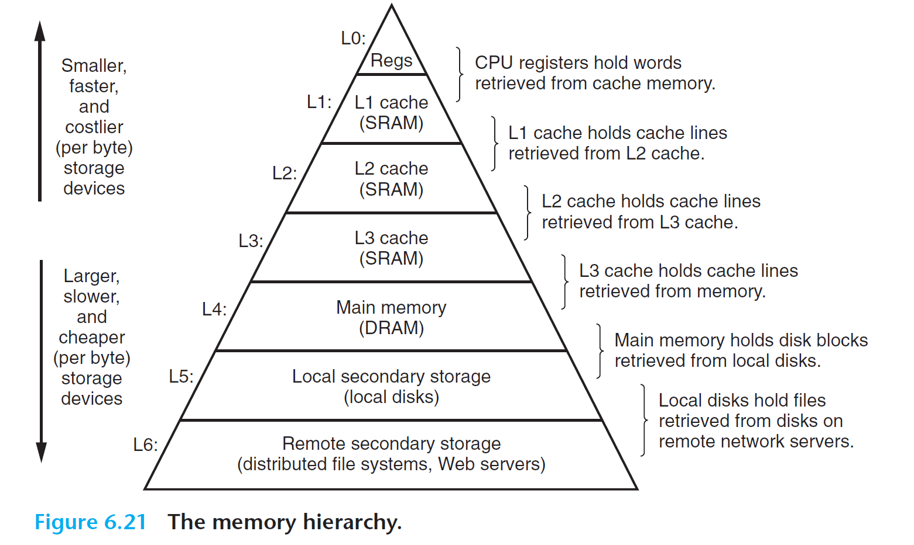

# Page Fault

## Page Fault

Page Fault 是一种异常。若给定的虚拟地址请求（取指、读取、写入）与页表中描述的不一致，MMU 就会发起 Page Fault 异常。scause 中的 `Exception Code` 规定了三种 Page Fault：`Instruction page fault`, `Load page fault`, `Store/AMO page fault`。

在特权级手册中，章节 `4.3.2 Virtual Address Translation Process` 规定了在地址翻译过程中，所有可能造成 page fault 的情况。

在发生异常时，`stval` 会被写入造成 Page Fault 的虚拟地址：

> If stval is written with a nonzero value when a breakpoint, address-misaligned, access-fault, or
> page-fault exception occurs on an instruction fetch, load, or store, then stval will contain the
> faulting virtual address.

## Demand Paging

在现代操作系统中， **需求分页（Demand Paging）** 是一种内存管理策略，它只有在程序访问某一内存页时才将该页加载到内存。与传统的将整个程序的所有页一次性加载到内存的策略不同，需求分页可以更有效地利用内存资源，避免浪费。

在当前的 xv6 中，每个用户进程的栈分配了 8 个物理页面。我们要思考一个问题：用户进程真的会使用到所有 8 个页面吗？
栈是从高地址向低地址生长的，因此程序在运行时栈会逐渐扩展。这种动态扩展意味着在进程的初期，它可能并不会使用到所有分配的栈空间。这样，一开始就为栈分配大量内存，可能会造成资源浪费。

所以，在分配栈的时候，我们可以先只分配 2 个物理页面，等 **用户进程需要剩下的页面时，我们再进行分配物理页面** 。
当用户进程访问某个虚拟地址时，CPU 会发现该地址在页表中没有映射，于是会触发一个 Page Fault 异常。

尽管这个虚拟地址对 CPU 来说是非法的，但实际上，内核已经为该虚拟地址预留了空间。收到 Page Fault 异常后，内核知道用户进程确实需要使用这个页面，因此会在异常处理过程中分配相应的物理页面，并更新页表。随后，内核会让程序从发生 Page Fault 的位置继续执行，CPU 这时会发现该虚拟地址已经合法。对用户进程而言，程序执行被短暂暂停了一下，整个过程是无感知的。

### 实现

在 xv6 中，我们对 **用户的虚拟地址空间** 有两种表示方式：VMA 结构体和页表。后者是 CPU 进行地址翻译所需的，而前者对于操作系统代码较为友好。

在给用户分配虚拟地址空间时，我们将其保存到 VMA 结构体中，但是先不给它映射物理页面；并等待用户真正用到这个地址时（即发生 Page Fault时）再映射物理页面。

当 Page Fault 发生时，我们可以检查 `stval` 中的虚拟地址是否在 VMA 结构体中。如果不在，则说明该异常真的是用户程序进行了非法内存访问；否则，则说明该地址是一个合法的用户虚拟地址，我们在这时再给它分配物理页面并在页表中映射。

!!!info "另一种方式"
    此外，我们需要了解还有一种方法来表示“该虚拟地址是一个合法的、但是未分配的虚拟地址”：回顾 PTE 的结构，在第0位上有一个 `V` 标志位，MMU 在进行地址翻译时会检查这个bit，如果是0，则会认为该 PTE 不可用，即会忽略所有高63位。

    操作系统中有什么东西最低位一定是0呢：一个内存对齐的指针。所以，我们可以在页表上的 PTE 中放置一个指针，而不是一个合法的 PTE。我们可以利用此特点将一个“合法但是未分配”的虚拟地址指向一个内核的对象，在 Page Fault 时我们就可以从该对象中抽取相关信息。

!!!info "相关实现"
    如果你有兴趣，可以参考 MIT 6.828 原版的 mmap 作业，在我们的 xv6 （较原版xv6有所改动）上实现 mmap。

    https://pdos.csail.mit.edu/6.828/2024/labs/mmap.html

## 页面置换 Swap

当需要分配物理页面时，我们需要调用 `kallocpage` 的方法。但是，当系统中没有空闲物理页面时会发生什么？

对于这种资源分配失败的情况，我们可以简单地回到最开始的情况，并对调用者返回一个错误。如 `fork` 和 `exec` 在内存分配失败时会返回一个负数表示错误。

有时候，我们希望内核中尽量有足够的物理页面。所以，当内核中可用物理页面过低时（理论课上，我们称之为低水位/高水位, low/high watermark），内核可以将一些页面丢出内存 (swap out)，存储到次级的存储空间（如硬盘，回顾 CSAPP: Memory Hierarchy），以此腾出空间。

**CSAPP: Memory Hierarchy**

回顾之前的 Demand Paging 思想：只有在 Page Fault 时，用户进程在真正引用了某虚拟地址。对于那些被丢出去的物理页面，我们也可以这样做，在它们遇到 Page Fault 时才从次级存储空间读取到内存 (swap in)，并重新建立页表映射。

还是回顾 Memory Hierarchy，对于次级存储空间（硬盘），它的访问速度和访问延迟肯定是不如内存的。所以我们要尽量减少 swap 的次数。那么，我们该如何选择 **被丢出去的页面** ？

### 页面置换算法

在对于一个总数有限、需要抽选一些项目踢出去的问题时，我们通常有两种实现上比较友好的算法：FIFO 和 LRU。（例如 CPU 中的 L1/L2/L3 Cache, TLB）

- 先进先出(First In First Out, **FIFO**)页替换算法：该算法总是淘汰最先进入内存的页，即选择在内存中驻留时间最久的页予以淘汰。只需把一个应用程序在执行过程中已调入内存的页按先后次序链接成一个队列，队列头指向内存中驻留时间最久的页，队列尾指向最近被调入内存的页。这样需要淘汰页时，从队列头很容易查找到需要淘汰的页。FIFO 算法只是在应用程序按线性顺序访问地址空间时效果才好，否则效率不高。因为那些常被访问的页，往往在内存中也停留得最久，结果它们因变“老”而不得不被置换出去。FIFO 算法的另一个缺点是，它有一种异常现象（Belady 现象），即在增加放置页的物理页帧的情况下，反而使页访问异常次数增多。

- 最久未使用(least recently used, **LRU**)算法：利用局部性 (Locality)，通过过去的访问情况预测未来的访问情况，我们可以认为最近还被访问过的页面将来被访问的可能性大，而很久没访问过的页面将来不太可能被访问。于是我们比较当前内存里的页面最近一次被访问的时间，把上一次访问时间离现在最久的页面置换出去。

- 时钟（Clock）页替换算法：是 LRU 算法的一种近似实现。时钟页替换算法把各个页面组织成环形链表的形式，类似于一个钟的表面。然后把一个指针（简称当前指针）指向最老的那个页面，即最先进来的那个页面。另外，时钟算法需要在页表项（PTE）中设置了一位访问位来表示此页表项对应的页当前是否被访问过。当该页被访问时，CPU 中的 MMU 硬件将把访问位置“1”。当操作系统需要淘汰页时，对当前指针指向的页所对应的页表项进行查询，如果访问位为“0”，则淘汰该页，如果该页被写过，则还要把它换出到硬盘上；如果访问位为“1”，则将该页表项的此位置“0”，继续访问下一个页。该算法近似地体现了 LRU 的思想，且易于实现，开销少，需要硬件支持来设置访问位。时钟页替换算法在本质上与 FIFO 算法是类似的，不同之处是在时钟页替换算法中跳过了访问位为 1 的页。

- 改进的时钟（Enhanced Clock）页替换算法：在时钟置换算法中，淘汰一个页面时只考虑了页面是否被访问过，但在实际情况中，还应考虑被淘汰的页面是否被修改过。因为淘汰修改过的页面还需要写回硬盘，使得其置换代价大于未修改过的页面，所以优先淘汰没有修改的页，减少磁盘操作次数。改进的时钟置换算法除了考虑页面的访问情况，还需考虑页面的修改情况。即该算法不但希望淘汰的页面是最近未使用的页，而且还希望被淘汰的页是在主存驻留期间其页面内容未被修改过的。这需要为每一页的对应页表项内容中增加一位引用位和一位修改位。当该页被访问时，CPU 中的 MMU 硬件将把访问位置“1”。当该页被“写”时，CPU 中的 MMU 硬件将把修改位置“1”。这样这两位就存在四种可能的组合情况：（0，0）表示最近未被引用也未被修改，首先选择此页淘汰；（0，1）最近未被使用，但被修改，其次选择；（1，0）最近使用而未修改，再次选择；（1，1）最近使用且修改，最后选择。该算法与时钟算法相比，可进一步减少磁盘的 I/O 操作次数，但为了查找到一个尽可能适合淘汰的页面，可能需要经过多次扫描，增加了算法本身的执行开销。

### PTE A/D

操作系统是怎么知道“一个页面最近被访问过”的？

PTE 中有两个标志位 A (Access), D (Dirty)，分别表示该虚拟地址映射是否被读取过、被写入过，MMU 会在进行地址翻译时设置这两个 bit，这样操作系统就能知道“一个页面被访问过”。

对于 “最近”，操作系统可以采用一种近似的方式。例如每 10ms 清除所有页表中的 A/D bits，如果在下次检查它们的时候不为0，则表示在这 10ms 内有访问过。