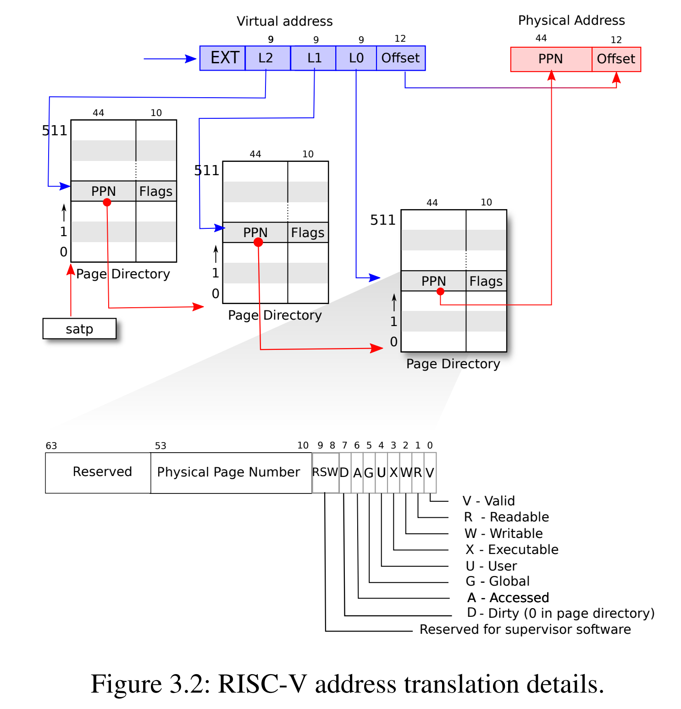

# RISC-V 页表模型 & xv6 内核页表

## 实验目的

1. 了解RISC-V页表模型SV39
2. 掌握虚拟地址到物理地址的转换机制
3. 掌握XV6如何管理内存并创建页表

!!!warning "xv6-lab4 代码"
    
    https://github.com/yuk1i/SUSTechOS/tree/main

    使用命令 `git clone https://github.com/yuk1i/SUSTechOS -b main xv6lab4` 下载 xv6-lab4 代码。


## Segmentation

从对内存访问保护而言，我们希望对内存的访问是带有权限保护的。这包括两个层面：

1. 该内存地址是否可读、可写、可执行。
2. 该内存地址是否允许低特权级访问。

也就是说，对于每个内存地址，我们都希望能检查它的操作权限是否符合原先的程序设计。

在 CPU 实现上，内存是以字节为单位来寻址的。如果要实现对每个字节的访问权限都能进行管理，这样的代价是难以现象的。
但是，我们可以让相同权限的代码、数据排布在一起，这样即可将整个程序的内存空间分为几个大块，每个块均有自己的起始地址(Base)和大小限制(Limit)，以及权限设置，这就是使用 Segmentation 进行内存保护的方式。 

Segmentation 在内存空间的管理上有着诸多劣势，例如难以动态调节大小、存在碎片化的问题。所以，现代 CPU 和操作系统均使用页表（Paging）机制来实现内存管理。

## Paging

分页机制，是将程序空间（虚拟地址）切割成相同大小的若干个页面，同时将物理内存也切割成同样大小的多个页面，从而可以在物理地址不连续的情况下，给进程分配足够的内存空间，并且从虚拟地址的角度看这个空间是连续的。

!!!note "为什么需要虚拟地址空间？"
    如果我们只有物理内存空间，那么我们也可以写程序，但是所有的程序，包括内核，包括用户程序，都在同一个地址空间里，用户程序访问的`0x80200000`和内核访问的`0x80200000`是同一个地址。这样好不好？如果只有一个程序在运行，那也无所谓。但很多程序使用同一个内存空间，就会有问题：怎样防止程序之间互相干扰，甚至互相搞破坏？
    
    比较粗暴的方式就是，我让用户程序访问的`0x80200000`和内核访问的`0x80200000`不是一个地址。但是我们只有一块内存，为了创造两个不同的地址空间，我们可以引入一个”翻译“机制：程序使用的地址（虚拟地址）需要经过一步”翻译“才能变成真正的内存的物理地址。这个”翻译“过程，我们用一个”词典“（页表）实现---给出翻译之前的地址，可以在词典里查找翻译后的地址。
    
    每个程序都有唯一的一本”词典“，而它能使用的内存也就只有他的”词典“所包含的。
    
    "词典"是否对能使用的每个字节都进行翻译？我们可以想象，存储每个字节翻译的结果至少需要一个字节，那么使用1MB的内存将至少需要构造1MB的”词典“，这效率太低了。观察到，一个程序使用内存的数量级通常远大于字节，至少以KB为单位（所以上古时代的人说的是"640K对每个人都够了"而不是"640B对每个人都够了"）。那么我们可以考虑，把连续的很多字节合在一起翻译，让他们翻译前后的数值之差相同，这就是"页"。

## 虚拟地址 => 物理地址

分页机制很重要的一点是如何建立和解析虚拟地址到物理地址的映射，下面我们从“如何从虚拟地址获得相应的物理地址”的角度进行介绍：

如图所示是一个一级页表分页机制（一级对应于后面的多级，一级页表只需要查询一层页表即可得到物理地址）：


以上图为例，我们首先得到一个**虚拟地址（Virtual Address）**，这个地址长度为6位，其中5~4位（高2位）为**页号（VPN，Virtual Page Number）**，3~0位（低4位）为**偏移量（Offset）**。

通过虚拟地址，我们可以查询**页表**（**Page Table**），页表存在于**页表基地址**（**PageTablePtr，Page Table Pointer**，是个物理地址）所指向的内存空间中，由连续存储的若干个**页表项（PTE，Page Table Entry）**构成。在一级页表中，每个页表项内容即为**物理页号（Page Frame #）+部分标志位**。尽管图中每个页表项看似包含**页号（Page #）**但是在实际的设计中，**页号并不写在页表项中**，由于页表项是连续分布的，我们只需要知道页表项的大小（有多少位）以及虚拟地址页号（VPN，代表要查询第几个页表项），就可以通过`页表首地址+页号×页表项大小`得到对应的页表项地址，查询该地址对应内容即可得到物理页号。页表首地址是存储在架构指定的寄存器中的。

得到物理页号后，通过`物理页号×页面大小`即可得到所在页的物理地址（物理空间首地址为0x0）。一页可能很大，如何得到一页中具体某个字节的地址呢？通过偏移量，`页物理地址+偏移量`即可得到具体虚拟地址对应的具体物理地址。

以上图为例，我们首先得到一个**虚拟地址（Virtual Address）**，这个地址长度为6位，其中5~4位（高2位）为**页号（VPN，Virtual Page Number）**，3~0位（低4位）为**偏移量（Offset）**。

通过虚拟地址，我们可以查询**页表**（**Page Table**），页表存在于**页表基地址**（**PageTablePtr，Page Table Pointer**，是个物理地址）所指向的内存空间中，由连续存储的若干个**页表项（PTE，Page Table Entry）**构成。在一级页表中，每个页表项内容即为**物理页号（Page Frame #）+部分标志位**。尽管图中每个页表项看似包含**页号（Page #）**但是在实际的设计中，**页号并不写在页表项中**，由于页表项是连续分布的，我们只需要知道页表项的大小（有多少位）以及虚拟地址页号（VPN，代表要查询第几个页表项），就可以通过`页表首地址+页号×页表项大小`得到对应的页表项地址，查询该地址对应内容即可得到物理页号。页表首地址是存储在架构指定的寄存器中的。

得到物理页号后，通过`物理页号×页面大小`即可得到所在页的物理地址（物理空间首地址为0x0）。一页可能很大，如何得到一页中具体某个字节的地址呢？通过偏移量，`页物理地址+偏移量`即可得到具体虚拟地址对应的具体物理地址。

!!!note "一个例子"
    假设页面大小为4KB，如果想要定位到页面的每一个Byte，我们的偏移量则需能表示4096个不同的位置，因此对于4KB大小的页面来说，偏移量的位数为12位（2^12^=4096）。或者说，偏移量的位数为12位可以推出页面大小为2^12^个Byte。
    
    在图片的一级页表中，Offset为4位，可以得知页面大小为2^4^=16B。如果给定虚拟地址100100~2~，可以得出其页号为10~2~，即2~10~，通过页号2~10~可以查到对应的页表项内容为5~10~。5是物理页号，可以求得物理页面地址： 物理首地址+物理页号×页面大小=0+5×16=80~10~。100100中低四位偏移量为0100，因此查询的是该页面的第5个字节对应的地址（地址0也是一个字节），则该物理地址为80+4=84~10~（5*16+4=0101左移四位+0100=0101 0100~2~）。需要注意运算过程中是2进制还是10进制还是16进制数（存储肯定是2进制）。


## satp

satp (Supervisor Address Translation and Protection) 寄存器是控制 S mode 和 U mode 下地址翻译的寄存器，其中包含三个属性：`MODE`, `ASID` 和 `PPN`。

> This register holds the physical page number (PPN) of the root page table, i.e., its supervisor physical address divided by 4 KiB; an address space identifier (ASID), which facilitates address-translation fences on a per-address-space basis; and the MODE field, which selects the current address-translation scheme. Further details on the access to this register are described in Section 3.1.6.5.


Mode 表示使用的地址翻译模式，0 则表示禁用地址翻译，所有请求的地址均作为物理地址看待，`PPN` 表示根页表的基地址。在我们的课程中，我们将使用 Sv39 作为页表模式。

我们暂且不需要理解 ASID 的作用。


## Sv39

RISC-V 的 Sv39 模式支持了 39-bit 的虚拟地址空间，每个页面大小 4KiB。

RISC-V CPU 的虚拟地址为64位。Sv39模式下，有效的虚拟地址为 39 位，并规定虚拟地址的 63-39 位必须与第 38 位相同，否则会产生 Page Fault 异常。所以，Sv39 的虚拟地址空间一共为 `(1 << 39) = 512 GiB` 的空间，其中分为高地址和低地址各 `256 GiB` 的空间，低地址空间为 `0x0000_0000_0000_0000` - `0x0000_003f_xxxx_xxxx` ，而高地址空间为 `0xffff_ffc0_0000_0000` - `0xffff_ffff_xxxx_xxxx`。

> Sv39 implementations support a 39-bit virtual address space, divided into 4 KiB pages.
> An Sv39 address is partitioned as shown in Figure 4.19.
> Instruction fetch addresses and load and store effective addresses, which are 64 bits, must have bits 63–39 all equal to bit 38, or else a page-fault exception will occur.
> The 27-bit VPN is translated into a 44-bit PPN via a three-level page table, while the 12-bit page offset is untranslated.


虚拟地址分为四部分：VPN[2-0] (Virtual Page Number) 和 page offset。三级 VPN 表示在三级页表中的 index, 而 page offset 表示当前地址在被翻译的页面中的偏移量。

Sv39 中的 PTE 长度为 8-byte，分为两部分：PPN 和 Flags。PPN (Physical Page Number) 和虚拟地址中的 page offset 组成最终的物理地址，Flags 则表示该虚拟地址页面的访问权限等信息。

Flags 定义如下：

- D, A: Dirty, Accessed。表示该页面最近被访问 / 写入过。
- G: Global。表示该映射关系在所有页表中均存在。
- U: User。表示该映射关系允许在用户权限下访问。
- V: Valid。该 bit 表示此 PTE 为有效 PTE，否则整个 PTE 视为无效。
- R, W, X: Read, Write, Executable 权限

RWX 定义如下图所示：
注意 `XWR == 3'b000` 的情况表示物理地址 [PPN: 12b0] 为下一级页表的基地址。


地址翻译的过程如下图所示：



See also: riscv-privilege.pdf, 4.3.2 Virtual Address Translation Process

文字描述，以下 `{xx | yy}` 表示在 `xx` bit 右边并上 `yy` bit，类似于 Verilog 的写法。

1. 分解 Virtual Address: `{ 25'signed_ext, 9'VPN2, 9'VPN1, 9'VPN0, 12'pgoff} = 64'VirtualAddress`
2. 将 satp 寄存器中第二级页表的基地址取出
3. 使用 VPN2 作为 index 在第二级页表中找到 PTE。

   这一步等效于 C 代码：`uint64 pte2 = *(uint64*)(satp.base + VPN2 * 8);`

4. 如果 `pte2.WXR != 3'b000`，则表示该 PTE 为 1GiB 大页映射。

   检查 PPN 是否对齐到 1GiB，aka：`pte2.PPN1 == 9'b0 && pte2.PPN0 == 9'b0`。如果满足，则跳转至 10.，否则 Page Fault。

5. 否则，`{pte2.PPN, 12'b0}` 为第一级页表的基地址
6. 使用 VPN1 作为 index 在第一级页表中找到 PTE。

   这一步等效于 C 代码：`uint64 pte1 = *(uint64*)((pte2.ppn << 12) + VPN1 * 8);`

7. 如果 `pte1.WXR != 3'b000`，则表示该 PTE 为 2MiB 大页映射。

   检查 PPN 是否对齐到 2MiB，aka：`pte2.PPN0 == 9'b0`。如果满足，则跳转至 10.，否则 Page Fault。

8. 否则，`{pte1.PPN | 12'b0}` 为第零级页表的基地址
9. 使用 VPN0 作为 index 在第零级页表中找到 PTE。

   这一步等效于 C 代码：`uint64 pte0 = *(uint64*)((pte1.ppn << 12) + VPN0 * 8);`

10. 得到最终的物理地址：`PA = (final_pte.ppn << 12) | final_page_offset`，

    如果为 2MiB 大页映射，`final_page_offset = {9'bVPN0, 12'bpgoff}`。

    如果为 1GiB 大页映射，`final_page_offset = {9'bVPN1, 9'bVPN0, 12'bpgoff}`

    否则，`final_page_offset = pgoff`

11. 权限检查：检查 `final_pte.rwx` 是否与访存请求相同。

### A & D

每个叶 PTE 包含 Accessed 和 Dirty 两个 bits：

- A 表示：自从上次 A bit 被清零，该虚拟页面曾经被读取、写入、取指 （Instruction Fetch）。
- D 表示：自从上次 D bit 被清零，该虚拟页面曾经被写入。

当访问的虚拟页面被访问时，A bit 是 0、或被写入时，D bit 是 0 是，RISC-V 规范实现允许两种方式来更新 A & D bits：

1. 发出 PageFault，Supervisor 的异常处理函数需要手动设置 A / D bits.
2. 由硬件设置 A / D bits.

Supervisor 软件应当正确处理以上两种情况。

### 权限检查

凭直觉的，读取的页面要带有 R bit，写入的页面要带有 W bit，执行的页面要带有 X bit。

但是，如果一个页面的权限带有 U bit，并且现在 CPU 核心运行在 S mode 下，我们需要对 SUM (permit Supervisor User Memory access) bit 进行额外检查：如果 `sstatus.SUM == 1` 则访问被允许，否则导致 Page Fault.

通常来说，S mode 一般运行在 `sstatus.SUM == 0` 的情况下，如果我们需要通过页表去访问用户数据时，我们会将该 flag 置 1，并在访问结束后清零。该过程一般被称为 **uaccess** 原语 (primitive).

See also: https://github.com/torvalds/linux/blob/master/arch/riscv/include/asm/uaccess.h

<!-- !!!questions "AArch64 架构下的虚拟内存模型"

    AArch64 显著地将虚拟地址分为低地址部分和高地址部分。（简单理解就是 0x0000_xxxx 开头的地址，和 0xffff_xxxx 开头的地址）

    对于低地址，使用 `TTBR0_EL1` (Translation Table Base Register 0 (EL1)) 寄存器作为类似 satp 寄存器的基地址寄存器进行地址翻译。
    对于高地址，使用 `TTBR1_EL1` 进行地址翻译。

    显然，这一种模型天生适合将内核页表和用户页表隔离。 -->

## RISC-V 物理地址布局

RISC-V 将物理内存 (DDR / DRAM) 的起始地址映射到物理地址 `0x8000_0000` 上，而不是物理地址 `0x0000_0000` 处。

也就是说，如果我们有 128 MiB (0x0800_0000) 的 DRAM 大小，RISC-V 核心会将 DRAM 空间映射到 `[0x8000_0000, 0x8800_0000)` 上面。

对于 QEMU 的 virt 机子，我们可以翻阅 qemu 的源代码找到其物理地址的映射：

```c
static const MemMapEntry virt_memmap[] = {
    [VIRT_DEBUG] =        {        0x0,         0x100 },
    [VIRT_MROM] =         {     0x1000,        0xf000 },
    [VIRT_TEST] =         {   0x100000,        0x1000 },
    [VIRT_RTC] =          {   0x101000,        0x1000 },
    [VIRT_CLINT] =        {  0x2000000,       0x10000 },
    [VIRT_ACLINT_SSWI] =  {  0x2F00000,        0x4000 },
    [VIRT_PCIE_PIO] =     {  0x3000000,       0x10000 },
    [VIRT_PLATFORM_BUS] = {  0x4000000,     0x2000000 },
    [VIRT_PLIC] =         {  0xc000000, VIRT_PLIC_SIZE(VIRT_CPUS_MAX * 2) },
    [VIRT_APLIC_M] =      {  0xc000000, APLIC_SIZE(VIRT_CPUS_MAX) },
    [VIRT_APLIC_S] =      {  0xd000000, APLIC_SIZE(VIRT_CPUS_MAX) },
    [VIRT_UART0] =        { 0x10000000,         0x100 },
    [VIRT_VIRTIO] =       { 0x10001000,        0x1000 },
    [VIRT_FW_CFG] =       { 0x10100000,          0x18 },
    [VIRT_FLASH] =        { 0x20000000,     0x4000000 },
    [VIRT_IMSIC_M] =      { 0x24000000, VIRT_IMSIC_MAX_SIZE },
    [VIRT_IMSIC_S] =      { 0x28000000, VIRT_IMSIC_MAX_SIZE },
    [VIRT_PCIE_ECAM] =    { 0x30000000,    0x10000000 },
    [VIRT_PCIE_MMIO] =    { 0x40000000,    0x40000000 },
    [VIRT_DRAM] =         { 0x80000000,           0x0 },
};
```

或者，我们可以在 gdb 连接到 qemu 上时，输入 `monitor info mtree -f` 查看 Memory Tree 的结构：

```
(qemu) gef➤  monitor info mtree -f
FlatView #0
 AS "memory", root: system
 AS "cpu-memory-0", root: system
 Root memory region: system
  0000000000001000-000000000000ffff (prio 0, rom): riscv_virt_board.mrom
  0000000000100000-0000000000100fff (prio 0, i/o): riscv.sifive.test
  0000000000101000-0000000000101023 (prio 0, i/o): goldfish_rtc
  0000000002000000-0000000002003fff (prio 0, i/o): riscv.aclint.swi
  0000000002004000-000000000200bfff (prio 0, i/o): riscv.aclint.mtimer
  0000000003000000-000000000300ffff (prio 0, i/o): gpex_ioport_window
  000000000c000000-000000000c5fffff (prio 0, i/o): riscv.sifive.plic
  0000000010000000-0000000010000007 (prio 0, i/o): serial
  0000000010001000-00000000100011ff (prio 0, i/o): virtio-mmio
  0000000010002000-00000000100021ff (prio 0, i/o): virtio-mmio
  0000000010003000-00000000100031ff (prio 0, i/o): virtio-mmio
  0000000010004000-00000000100041ff (prio 0, i/o): virtio-mmio
  0000000010005000-00000000100051ff (prio 0, i/o): virtio-mmio
  0000000010006000-00000000100061ff (prio 0, i/o): virtio-mmio
  0000000010007000-00000000100071ff (prio 0, i/o): virtio-mmio
  0000000010008000-00000000100081ff (prio 0, i/o): virtio-mmio
  0000000010100000-0000000010100007 (prio 0, i/o): fwcfg.data
  0000000010100008-0000000010100009 (prio 0, i/o): fwcfg.ctl
  0000000010100010-0000000010100017 (prio 0, i/o): fwcfg.dma
  0000000020000000-0000000021ffffff (prio 0, romd): virt.flash0
  0000000022000000-0000000023ffffff (prio 0, romd): virt.flash1
  0000000030000000-000000003fffffff (prio 0, i/o): pcie-mmcfg-mmio
  0000000040000000-000000007fffffff (prio 0, i/o): gpex_mmio_window @0000000040000000
  0000000080000000-000000009fffffff (prio 0, ram): riscv_virt_board.ram
  0000000400000000-00000007ffffffff (prio 0, i/o): gpex_mmio_window @0000000400000000

```

在我们的操作系统实验中，我们只需要关注 DRAM 空间和一些外设(PLIC, UART)即可

| `Base`        | Size          | Description |
| :------------ | :------------ | ----------- |
| `0x0000_1000` | `0x0000_f000` | BootROM     |
| `0x0c00_0000` | `0x0060_0000` | PLIC        |
| `0x1000_0000` | `0x0000_0100` | Serial UART |
| `0x8000_0000` | DRAM Size     | DRAM        |

实际上 OpenSBI 在加载时也会占用一部分 DRAM 空间，我们可以在 gdb 下用 `monitor info roms` 查看 QEMU 启动时所加载的文件：

```
(qemu) gef➤  monitor info roms
addr=0000000000001000 size=0x000028 mem=rom name="mrom.reset"
addr=0000000000001028 size=0x000030 mem=rom name="mrom.finfo"
addr=0000000080000000 size=0x042868 mem=ram name="/usr/share/qemu/opensbi-riscv64-generic-fw_dynamic.bin"
addr=0000000080200000 size=0x002790 mem=ram name="build/kernel ELF program header segment 1"
addr=0000000080203000 size=0x009048 mem=ram name="build/kernel ELF program header segment 2"
addr=000000009fe00000 size=0x0012b8 mem=ram name="fdt"
```

其中，`0x1000` 上放置的是 BootROM，是 CPU 上电后的执行的第一块代码。（类似于在组成原理课程里面使用的 BlockRAM）
OpenSBI 被加载到 DRAM 空间开始的 `0x8000_0000`。（这也是为什么我们内核的 BASE_ADDRESS 不能是 `0x8000_0000` 而得是 `0x8020_0000`）
内核 ELF 被加载到 `0x8020_0000` 的地址。

| `Base`        | Size          | Description      |
| :------------ | :------------ | ---------------- |
| `0x8000_0000` | `0x0004_2868` | OpenSBI          |
| `0x8020_0000` | `0x0000_2790` | kernel segment 1 |
| `0x8020_3000` | `0x0000_9048` | kernel segment 2 |


## xv6 内核内存布局

Sv39 虚拟地址的高位是 Sign-Extension 的，在 `< 256 GiB` 和 `256 GiB ~ 512 GiB` 之间有着巨大的 gap，我们利用此特性在地址上区分用户地址（低，以 `0x0000` 开头）和内核地址（高，以 `0xffff` 开头）。

|          `Base Address` | Description                                           |
| ----------------------: | ----------------------------------------------------- |
| `0x0000_0000_xxxx_xxxx` | Userspace                                             |
| `0x0000_003f_ffff_e000` | Trapframe                                             |
| `0x0000_003f_ffff_f000` | Trampoline                                            |
| `0xffff_ffc0_0000_0000` | Kernel Direct Mapping of all available physical pages |
| `0xffff_fffd_0000_0000` | Kernel Heap (fixed-size object)                       |
| `0xffff_ffff_8020_0000` | Kernel Image (.text, .data, .bss)                     |
| `0xffff_ffff_a000_0000` | Device Memory-Mapped IO                               |
| `0xffff_ffff_d000_0000` | Kernel stack for processes                            |
| `0xffff_ffff_ff00_0000` | Kernel stack for per-cpu scheduler                    |

- Trampoline (n. 蹦床) 是用户空间和内核空间的跳板，所以我们将它放在低 128 GiB 的最高处。
- 然后，我们将内核的镜像，即 `build/kernel` ELF 文件，映射到 `0xffff_ffff_8020_0000`。
- 其次，映射一些内核所需要的页面，如每个 CPU 的 scheduler 所用的栈，以及外设所需要的 MMIO。
- 最后，剩下的所有可用的物理页面将被 Direct Mapping 到 `0xffff_ffc0_80xx_xxxx`，并交给 kalloc 管理。


Direct Mapping 的作用是让 Kernel 能直接操纵所有可用的物理内存，但是除了内核本身镜像以外。

如果没有 Direct Mapping，我们每次都需要将新分配的页面映射到内核虚拟地址空间上，才能通过虚拟地址去访问该物理页面。
而有了 Direct Mapping 后，我们可以直接将物理地址加上一个常量偏移量，即可得到一个内核可访问的虚拟地址：

```c
#define KERNEL_DIRECT_MAPPING_BASE 	0xffffffc000000000ull

#define KVA_TO_PA(x) (((uint64)(x)) - KERNEL_DIRECT_MAPPING_BASE)
#define PA_TO_KVA(x) (((uint64)(x)) + KERNEL_DIRECT_MAPPING_BASE)
```

## kalloc 模块

`kalloc.c` 会在启动后接管 Direct Mapping，其负责两个功能：

1. 对剩余可分配的物理页面的管理
2. 对固定大小对象的动态分配和回收 (对象分配器管理)

在 kalloc 接管内核启动后剩余的物理内存（即上图紫色部分）后，我们需要从它分配：

1. 每个 object allocator（对象分配器）的内存池
2. 每个 process 的 kernel stack
3. 每个 cpu scheduler 的 kernel stack

随后，用户空间所需要的页面和配置页表所需要的页面均由 `kalloc` 模块管理。

## 重定位（Relocation）

对于内核本身（即编译出来的 ELF 文件：`build/kernel`，也称为内核镜像），我们也需要把它映射到高地址上。我们采用固定偏移量来映射整个 ELF 文件。

也就是说，内核中定义 (Defined) 的符号（变量、函数），它们会被 OpenSBI 加载到指定的物理地址 `0x0000_0000_8020_abcd`，而我们最终会将该符号加载到虚拟地址 `0xffff_ffff_8020_abcd` 上。对于所有符号，这两个地址之间永远相差一个固定的值。我们将该值定义为内核偏移量 (kernel offset)。

我们将该值定义为宏 `KERNEL_OFFSET`，并定义宏 `KIVA_TO_PA` 和 `PA_TO_KIVA` 在便于两者之间转换。(KIAV: Kernel Image Virtual Address)

```c
#define KERNEL_VIRT_BASE 0xffffffff80200000ull
#define KERNEL_PHYS_BASE 0x80200000ull
#define KERNEL_OFFSET	 ((uint64)(KERNEL_VIRT_BASE - KERNEL_PHYS_BASE))

// (Kernel Image Virtual Address) TO (Physical Address)
#define KIVA_TO_PA(x) (((uint64)(x)) - KERNEL_OFFSET)
#define PA_TO_KIVA(x) (((uint64)(x)) + KERNEL_OFFSET)
```

我们注意到，偏移整个镜像文件加载的基地址并不会改变两个符号之间的距离，也就是说：

1. 符号 a 被加载到 PA_a `0x0000_0000_8020_dead`，符号 b 被加载到 PA_b `0x0000_0000_8020_beef`。
2. 符号 a 将会被映射到 VA_a `0xffff_ffff_8020_dead`，符号 b 将会被映射到 VA_b `0xffff_ffff_8020_beef`
3. `PA_a - PA_b = VA_a - VA_b`

这个性质允许我们在使用 `PC-relative` 寻址时，对整个内核镜像进行重定位。使用 `PC-relative` 寻址时，我们会通过当前 PC 与目标符号的偏移量来计算目标符号的地址，具体而言，在汇编上使用 `auipc` 和 `addi` 来计算 `target = pc + offset`，而不是 `target = immediate`（立即数寻址）。
所以，我们可以将整个内核镜像整体重定位到任何起始地址，只需要保证所有符号之间的偏移量在编译期间和被加载时是固定的即可。这一条性质也是 Linux Kernel 能实现对自身镜像的 KASLR (Kernel address space layout randomization, See also: https://lwn.net/Articles/569635/) 的原理。

因此，我们只需要完成两步即可实现内核镜像的重定位：

1. 将内核镜像映射到虚拟地址 `0xffff_ffff_8020_0000` 上。
2. 将 PC 跳转到 `0xffff_ffff_8020_xxxx` 的高地址上。

我们期望内核会运行在 `0xffff_ffff_8020_0000` 的高地址上。所以，我们需要修改 `kernel.ld` 使链接器能正确链接内核。

```
OUTPUT_ARCH(riscv)
ENTRY(_entry)
BASE_ADDRESS = 0xffffffff80200000;
```

但是，此时 OpenSBI 无法正确加载 kernel ELF 到物理地址上，因为 kernel ELF 的 Program Header 的预计加载的物理地址 (PhysAddr) 是 `0xffff_ffff_8020_0000` 的高地址，然而这个地址在 OpenSBI 转交至我们的内核时是非法的。

所以，我们在第一个段 `.text` 后面注明 `AT(0x80200000)`，表示这个段应该被加载到物理地址 `0x8020_0000`。这样能使链接器产生的 ELF 的 Program Headers 拥有 `VirtAddr = 0xffff_ffff_8020_0000`，以及 `PhysAddr = 0x8020_0000`。

```
BASE_ADDRESS = 0xffffffff80200000;
SECTIONS
{
    . = BASE_ADDRESS;
    skernel = .;
    s_text = .;

    .text : AT(0x80200000) {
        *(.text.entry)
        // ...
    }
    // ...
}
```

此时再 `make run` 运行内核，我们可以发现 OpenSBI 正确找到了我们内核的入口点：

```
Domain0 Next Address      : 0x0000000080200000
Domain0 Next Arg1         : 0x000000009fe00000
Domain0 Next Mode         : S-mode
...
clean bss: 0x00000000802ac000 - 0x00000000802b3000
Kernel is Relocating...
```

!!!warning "Question"
    我们在 `kernel.ld` 里面指定的虚拟地址是 `0xffff_ffff_8020_0000`，但是 `entry.S` 中仍然使用的是

    ```
    _entry:
        lla sp, boot_stack_top
        call main
    ```

    请思考：为什么在程序运行在 `0x0000_0000_8020_0000` 的地址上时，使用 `lla` 加载符号和 `call main` 跳转 main **能找到正确的物理地址，而不是在此时为非法的虚拟地址** `0xffff_ffff_8020_0000`？

    Hint: 我们是如何寻址的？回忆计算机组成原理课上学习的寻址模式。

    上述 `_entry` 中两行汇编代码被编译后的汇编是：

    ```
    ────────────────────────────────────────────────────────────────────────── code:riscv:RISCV ────
    ●→  0x80200000 <skernel+0000>   auipc  sp, 0xac
        0x80200004 <skernel+0004>   mv     sp, sp
        0x80200008 <skernel+0008>   auipc  ra, 0x2
        0x8020000c <skernel+000c>   jalr   488(ra)
    ─────────────────────────────────────────────────────────────────────── source:os/entry.S+4 ────
        3  _entry:
    →   4      lla sp, boot_stack_top
        5      call main
    ```

如果我们直接构建上图的页表，我们需要两条或更多指令来完成切换页表+跳转到高地址：

1. `csrw satp`: 设置 satp 寄存器，启用 Sv39 地址翻译
2. `...`

当执行第一条指令时，我们的 PC 指向在 `0x8020_xxxx` 的物理地址上。
但是，当我们执行完第 1 条指令设置完 satp 后，即将开始执行第二条指令，我们的 PC 还指向着该指令的物理地址，而这个物理地址的 PC 在当前的页表中是非法的。
所以，我们的第 2 条指令就会发生 Instruction Page Fault 异常。

也就是说，在我们设置完内核页表后，我们并不能直接切换到仅包含高地址的页表上，因为此时我们的 PC 指针还指向低地址，而我们无法在同时完成切换 PC + 切换 satp 两件事情。
所以，我们需要一个临时页表，其中包含了两份映射：

1. VA `0x0000_0000_8020_0000` -> PA `0x8020_0000`
1. VA `0xffff_ffff_8020_0000` -> PA `0x8020_0000`

当执行完上述第 1 条指令启用 Sv39 后，我们目前的 PC 虽然是下一条指令的物理地址，但是它是一个合法的虚拟地址。我们可以加载一个立即数到寄存器中，然后使用 `jr` 指令跳转到该寄存器的值，从而进入到高地址。

我们将这一系列步骤称为 Relocate (重定位)。

See also: https://0xax.gitbooks.io/linux-insides/content/Booting/linux-bootstrap-6.html

### `relocation_start`

在 relocation_start 的临时页表中，我们使用 2 MiB 的大页映射。我们先开辟四个对齐的物理页面：

```c
static char relocate_pagetable[PGSIZE] __attribute__((aligned(PGSIZE)));
static char relocate_pagetable_level1_ident[PGSIZE] __attribute__((aligned(PGSIZE)));
static char relocate_pagetable_level1_direct_mapping[PGSIZE] __attribute__((aligned(PGSIZE)));
static char relocate_pagetable_level1_high[PGSIZE] __attribute__((aligned(PGSIZE)));
```

然后，我们计算内核镜像的终止点 `ekernel` 向上对齐到 2MiB 的大小。这是因为 2 MiB 的大页映射要求虚拟地址和物理地址同时对齐到 2MiB 上。

```c
// Kernel Start Point must be aligned to 2MiB
assert(IS_ALIGNED(KERNEL_PHYS_BASE, PGSIZE_2M));

// Calculate Kernel image size, and round up to 2MiB.
uint64 kernel_size = (uint64)ekernel - (uint64)skernel;
uint64 kernel_size_4K = ROUNDUP_2N(kernel_size, PGSIZE);
uint64 kernel_size_2M = ROUNDUP_2N(kernel_size, PGSIZE_2M);

kernel_image_end_4k = KERNEL_PHYS_BASE + kernel_size_4K;
kernel_image_end_2M = KERNEL_PHYS_BASE + kernel_size_2M;

printf("Kernel size: %p, Rounded to 2MiB: %p\n", kernel_size, kernel_size_2M);
```

在 `kernel_image_end_2M` 后面，我们再开辟一个 2MiB 的页面作为 Kernel Direct Mapping 的第一个内存池，这是为了在第二阶段中，在最终的 `kallocpage` 还未能使用时，给 `kvmmake` 提供构建页表时所需要的物理页面。

```c
// Calculate Kernel Mapping Base & End
uint64 kernel_phys_base = KERNEL_PHYS_BASE;
uint64 kernel_phys_end = kernel_phys_base + kernel_size_2M;
uint64 kernel_virt_base = KERNEL_VIRT_BASE;
uint64 kernel_virt_end = kernel_virt_base + kernel_size_2M;

// Calculate the first Direct Mapping Base & End
uint64 kernel_la_phy_base = kernel_image_end_2M;
uint64 kernel_la_base = KERNEL_DIRECT_MAPPING_BASE + kernel_la_phy_base;
uint64 kernel_la_end = kernel_la_base + PGSIZE_2M;
```

然后，我们开始映射：VA `0x0000_0000_8020_0000` -> PA `0x8020_0000`

1. 在 `pgt_root` 上添加一条 PTE，使其指向第一级页表 `pgt_ident`。
2. 从 `kernel_phys_base` 到 `kernel_phys_end`，每 2 MiB 添加一个 PTE 映射
3. 计算该物理地址应该被映射到哪个虚拟地址上，在这个映射中，`va = pa`。
4. 计算 `VPN1`，并在 `pgt_ident` 中添加映射。

```c
// We will still have some instructions executed on pc 0x8020xxxx before jumping to KIVA.
// Step 2. Setup Identity Mapping for 0x80200000 -> 0x80200000, using 2MiB huge page.
{
    uint64 VPN2 = PX(2, kernel_phys_base);
    pgt_root[VPN2] = MAKE_PTE((uint64)pgt_ident, 0);

    for (uint64 pa = kernel_phys_base; pa < kernel_phys_end; pa += PGSIZE_2M) {
        uint64 va = pa;
        uint64 vpn1 = PX(1, va);
        pgt_ident[vpn1] = MAKE_PTE(pa, PTE_R | PTE_W | PTE_X | PTE_A | PTE_D);
        printf("Mapping Identity: %p to %p\n", va, pa);
    }
}
```

然后，我们开始映射内核 ELF 的虚拟地址：VA `0xffff_ffff_8020_0000` -> PA `0x8020_0000`。
此时 `va = pa + KERNEL_OFFSET`。

最后，我们映射第一块 Direct Mapping：VA `0xffff_ffc0_80xx_0000` -> 第一个空闲的 2 MiB 物理页 `0x80xx_0000`。

### 跳转

> code: os/main.c

在 `bootcpu_entry` 的末尾，我们会调用 `bootcpu_start_relocation`，而在它的末尾，我们会使用汇编完成跳转 PC 到 `bootcpu_relocating`。

`bootcpu_relocating` 会调用 `kvm_init` 完成对内核页表的设置与切换，它最终会跳转函数 `bootcpu_init`，并使用最终的栈 scheduler kernel stack(`mycpu()->sched_kstack_top`)。

`bootcpu_init` 会完成接下来的内核初始化，包括启动其他 CPU，设置 Kernel Trap，初始化 kernel page manager 等。最终，它会调用 `scheduler()` 函数并永不返回。

```c
void bootcpu_entry(int mhartid) {
    printf("\n\n=====\nHello World!\n=====\n\nBoot stack: %p\nclean bss: %p - %p\n", boot_stack, s_bss, e_bss);
    memset(s_bss, 0, e_bss - s_bss);

    // ...
    
    printf("Kernel Starts Relocating...\n");
    bootcpu_start_relocation();

    // We will jump to kernel's real pagetable in bootcpu_start_relocation.
    __builtin_unreachable();
}

static void bootcpu_start_relocation() {
    // ...

    uint64 fn = (uint64)&bootcpu_relocating + KERNEL_OFFSET;
    uint64 sp = (uint64)&boot_stack_top + KERNEL_OFFSET;

    asm volatile(
        "mv a1, %0 \n \
        mv sp, %1 \n \
        jr a1" ::"r"(fn),"r"(sp));
 
    __builtin_unreachable();
}

static void bootcpu_relocating() {
    printf("Boot HART Relocated. We are at high address now! PC: %p\n", r_pc());

    // Step 4. Rebuild final kernel pagetable
    kvm_init();

    uint64 new_sp = mycpu()->sched_kstack_top;
    uint64 fn     = (uint64)&bootcpu_init;

    asm volatile(
        "mv a1, %0 \n \
        mv sp, %1 \n \
        jr a1" ::"r"(fn),"r"(new_sp));
    __builtin_unreachable();
}
```

## 内核页表

> code: `os/kvm.c`

在完成 Relocation 后，我们调用 `kvm_init()` 来构造最终的内核页表，并切换到该页表上。

Relocation 时，我们会在 Direct Mapping 区间先借用一个 2M 的区域，即 `e_kernel` (0x802x_0000) 对齐到 2MiB (0x8040_0000) 后的下一个 2MiB 区域 `[0x8040_0000, 0x8060_0000)`。
在构建内核页表时，我们会需要申请物理页面来放置次级页表，我们称之为 `boot-stage page allocator`，这些页面的生命周期是持久的，永远不会被释放。

```
[INFO  0,-1] kvm_init: boot-stage page allocator: base 0xffffffc080400000, end 0xffffffc080600000
```

`kvmmake` 函数会调用 `kvmmap` 依次映射每个区域。

```c
static pagetable_t kvmmake() {
    pagetable_t kpgtbl;
    kpgtbl = (pagetable_t)allocsetuppage();
    memset(kpgtbl, 0, PGSIZE);

    // Step.1 : Kernel Image
    // Step.2 : Kernel Trampoline
    // Step.3 : Kernel Device MMIO :
    // Step.4 : Kernel Scheduler stack:
    // Step.5 : Kernel Direct Mapping
}
```

`kvmmap` 的原型为 `void kvmmap(pagetable_t kpgtbl, uint64 va, uint64 pa, uint64 sz, int perm)`，表示将 `[va, va+sz)` 映射到 `[pa, pa+sz)` 的区域上。

1. 对于 Kernel Image，我们映射三个分区：`.text` (RX), `.rodata` (RO), `.data (.bss)` (RW)。我们可以引用在 `kernel.ld` 中导出的地址符号 `e_text` 等来得到每个分区的起始地址和结束地址。注意我们直接引用符号 `s_text` 时，我们会解析得到它的虚拟地址；而它的物理地址则可以通过 `KIVA_TO_PA` 转换得到。

在 `kernel.ld` 中的 `.text` 存在另一个特殊的页面，称为 trampoline，我们会在下一节课讲到它。我们将它映射到虚拟地址 `0x3f_ffff_f000` 上。

```c
    // map kernel text executable and read-only.
    // 0xffff_ffff_8020_0000 -> 0x8020_0000
    kvmmap(kpgtbl, (uint64)s_text, KIVA_TO_PA(s_text), (uint64)e_text - (uint64)s_text, PTE_A | PTE_R | PTE_X);

    // map kernel ro_data: s_rodata to e_rodata
    kvmmap(kpgtbl, (uint64)s_rodata, KIVA_TO_PA(s_rodata), (uint64)e_rodata - (uint64)s_rodata, PTE_A | PTE_R);

    // map kernel .s_data to .e_bss,
    uint64 kimage_data_size = KIVA_TO_PA(e_bss) - KIVA_TO_PA(s_data);
    kvmmap(kpgtbl, (uint64)s_data, KIVA_TO_PA(s_data), kimage_data_size, PTE_A | PTE_D | PTE_R | PTE_W);

    // map trampoline
    kvmmap(kpgtbl, (uint64)TRAMPOLINE, KIVA_TO_PA(trampoline), PGSIZE, PTE_A | PTE_R | PTE_X);
```

此时，`kernel_pagetable` 的结构如下所示：

```
=== PageTable at 0xffffffc080400000 ===
[ff], pte[0xffffffc0804007f8]: 0x0000003fc0000000 -> 0x0000000080403000 -------V
  [1ff], pte[0xffffffc080403ff8]: 0x0000003fffe00000 -> 0x0000000080404000 -------V
    [1ff], pte[0xffffffc080404ff8]: 0x0000003ffffff000 -> 0x000000008020a000 -A--X-RV
[1fe], pte[0xffffffc080400ff0]: 0xffffffff80000000 -> 0x0000000080401000 -------V
  [1], pte[0xffffffc080401008]: 0xffffffff80200000 -> 0x0000000080402000 -------V
    [0], pte[0xffffffc080402000]: 0xffffffff80200000 -> 0x0000000080200000 -A--X-RV
    ...
    [9], pte[0xffffffc080402048]: 0xffffffff80209000 -> 0x0000000080209000 -A--X-RV
    [b], pte[0xffffffc080402058]: 0xffffffff8020b000 -> 0x000000008020b000 -A----RV
    ...
    [20], pte[0xffffffc080402100]: 0xffffffff80220000 -> 0x0000000080220000 -A----RV
    [21], pte[0xffffffc080402108]: 0xffffffff80221000 -> 0x0000000080221000 DA---WRV
    ...
    [2c], pte[0xffffffc080402160]: 0xffffffff8022c000 -> 0x000000008022c000 DA---WRV
=== END ===
``` 

2. 然后，我们映射外设的 MMIO 区域，目前我们会使用到 PLIC 和 UART0 两个外设。

```c
    // Step.3 : Kernel Device MMIO :
    kvmmap(kpgtbl, KERNEL_PLIC_BASE, PLIC_PHYS, KERNEL_PLIC_SIZE, PTE_A | PTE_D | PTE_R | PTE_W);
    kvmmap(kpgtbl, KERNEL_UART0_BASE, UART0_PHYS, KERNEL_UART0_SIZE, PTE_A | PTE_D | PTE_R | PTE_W);
```

3. 然后，我们映射每个 cpu 的 scheduler 所用的栈。我们令每个 scheduler 的内核为两个 `PGSIZE`，并且相邻的两个栈空间相隔一段非法的地址，我们称之为 `guard page`。如果我们在内核栈上发生栈溢出，我们会得到一个 Page Fault 而不是内核带着错误悄无声息的继续运行。

```c
    // Step.4 : Kernel Scheduler stack:
    uint64 sched_stack = KERNEL_STACK_SCHED;
    for (int i = 0; i < NCPU; i++) {
        struct cpu *c = getcpu(i);
        // allocate #KERNEL_STACK_SIZE / PGSIZE pages
        for (uint64 va = sched_stack; va < sched_stack + KERNEL_STACK_SIZE; va += PGSIZE) {
            uint64 __pa newpg = KVA_TO_PA(allockernelpage());
            debugf("map halt %d, va:%p, pa:%p", i, va, newpg);
            kvmmap(kpgtbl, va, newpg, PGSIZE, PTE_A | PTE_D | PTE_R | PTE_W);
        }
        c->sched_kstack_top = sched_stack + KERNEL_STACK_SIZE;
        // double the sched_stack to make a significant gap between different cpus.
        //  if any kernel stack overflows, it will page fault.
        sched_stack += 2 * KERNEL_STACK_SIZE;
    }
```

内核 scheduler 栈的结构如下所示，尽管所分配的页面在物理地址上是连续的，但是在虚拟地址上我们可以故意令它不连续。

```
[1ff], pte[0xffffffc080400ff8]: 0xffffffffc0000000 -> 0x0000000080405000 -------V
  [1f8], pte[0xffffffc080405fc0]: 0xffffffffff000000 -> 0x0000000080408000 -------V
    [0], pte[0xffffffc080408000]: 0xffffffffff000000 -> 0x0000000080407000 DA---WRV
    [1], pte[0xffffffc080408008]: 0xffffffffff001000 -> 0x0000000080409000 DA---WRV
    [4], pte[0xffffffc080408020]: 0xffffffffff004000 -> 0x000000008040a000 DA---WRV
    [5], pte[0xffffffc080408028]: 0xffffffffff005000 -> 0x000000008040b000 DA---WRV
    [8], pte[0xffffffc080408040]: 0xffffffffff008000 -> 0x000000008040c000 DA---WRV
    [9], pte[0xffffffc080408048]: 0xffffffffff009000 -> 0x000000008040d000 DA---WRV
    [c], pte[0xffffffc080408060]: 0xffffffffff00c000 -> 0x000000008040e000 DA---WRV
    [d], pte[0xffffffc080408068]: 0xffffffffff00d000 -> 0x000000008040f000 DA---WRV
```

4. 最后，计算系统中所有应该被 Direct Mapping 管理的页面，即 `kernel_image_end_2M` 开始到物理内存空间的结束，从 `0xffffffc0_80400000 -> 0x00000000_80400000` 处开始映射。注意到 `boot-stage page allocator` 所用的区域（`[0x8040_0000, 0x8060_0000)`）也会在这个映射范围之内。

之后，将剩下的空间交给 `kalloc.c` 中的 `kpgmgr` 管理：

```c
    // So page allocator should starts after these used pages.
    kpage_allocator_base = init_page_allocator;
    kpage_allocator_size = available_mems - (init_page_allocator - init_page_allocator_base);
```

### kvmmap

`kvmmap` 的逻辑非常简单，按照 Sv39 的三级页表格式对 `vaddr` 展开到三个 index：`vpn2`, `vpn1`, 和 `vpn0`，随后开始逐级往下走 `pgtbl_level1`, `pgtbl_level0`。当遇到未被分配的次级页表时，从 `allockernelpage` 处分配一个，并设置上级到次级的 PTE (`RWX=000`) 即可。最后，在最后一级按照给定的 `perm` 设置 PTE ：`pgtbl_level0[vpn0] = MAKE_PTE(paddr, perm)`。

当然，当我们映射一大片对齐到 2MiB 的内存区域时，我们可以使用一个 2MiB 的大页映射，而不是多个 4KiB 的映射。这需要满足大页映射的条件： `IS_ALIGNED(vaddr, PGSIZE_2M) && IS_ALIGNED(paddr, PGSIZE_2M) && sz >= PGSIZE_2M`。

```c
void kvmmap(pagetable_t kpgtbl, uint64 va, uint64 pa, uint64 sz, int perm) {
    assert(PGALIGNED(va));
    assert(PGALIGNED(pa));
    assert(PGALIGNED(sz));

    debugf("va:%p, pa:%p, sz:%x", va, pa, sz);

    pagetable_t __kva pgtbl_level1, pgtbl_level0;
    uint64 vpn2, vpn1, vpn0;

    uint64 __kva vaddr     = va;
    uint64 __kva paddr     = pa;
    uint64 __kva vaddr_end = vaddr + sz;

    while (vaddr < vaddr_end) {
        // try to add mapping: vaddr -> pa
        vpn2 = PX(2, vaddr);
        vpn1 = PX(1, vaddr);
        vpn0 = PX(0, vaddr);

        if (!(kpgtbl[vpn2] & PTE_V)) {
            // kpgtbl[vpn2] is not a valid PTE, allocate the level 1 pagetable.
            uint64 __kva newpg = allockernelpage();
            memset((void *)newpg, 0, PGSIZE);
            pgtbl_level1 = (pagetable_t)newpg;
            kpgtbl[vpn2] = MAKE_PTE(KVA_TO_PA(newpg), 0);
        } else {
            pte_t pte = kpgtbl[vpn2];
            // check validity: pte must points to next level page table.
            if ((pte & PTE_R) || (pte & PTE_W) || (pte & PTE_X))
                panic("kvmmap: vaddr %p already mapped at level 2", vaddr);
            pgtbl_level1 = (pagetable_t)PA_TO_KVA(PTE2PA(kpgtbl[vpn2]));
        }
        if (!(pgtbl_level1[vpn1] & PTE_V)) {
            // pgtbl_level1[vpn1] is not a valid PTE.
            //   try to allocate 2M page
            //   , or allocate the level 1 pagetable.
            if (IS_ALIGNED(vaddr, PGSIZE_2M) && IS_ALIGNED(paddr, PGSIZE_2M) && sz >= PGSIZE_2M) {
                // it's ok for a huge page.
                pgtbl_level1[vpn1] = MAKE_PTE(paddr, perm);
                vaddr += PGSIZE_2M;
                paddr += PGSIZE_2M;
                sz -= PGSIZE_2M;
                continue;
            }
            uint64 __kva newpg = allockernelpage();
            memset((void *)newpg, 0, PGSIZE);
            pgtbl_level0       = (pagetable_t)newpg;
            pgtbl_level1[vpn1] = MAKE_PTE(KVA_TO_PA(newpg), 0);
        } else {
            pte_t pte = pgtbl_level1[vpn1];
            // check validity: pte must points to next level page table.
            if ((pte & PTE_R) || (pte & PTE_W) || (pte & PTE_X))
                panic("kvmmap: vaddr %p already mapped at level 1", vaddr);
            pgtbl_level0 = (pagetable_t)PA_TO_KVA(PTE2PA(pgtbl_level1[vpn1]));
        }
        // check validity: pte must points to next level page table.
        if (pgtbl_level0[vpn0] & PTE_V)
            panic("kvmmap: vaddr %p already mapped at level 0", vaddr);
        pgtbl_level0[vpn0] = MAKE_PTE(paddr, perm);
        vaddr += PGSIZE;
        paddr += PGSIZE;
        sz -= PGSIZE;
    }
    assert(vaddr == vaddr_end);
    assert(sz == 0);
}
```

## 固定大小对象分配器


TODO
