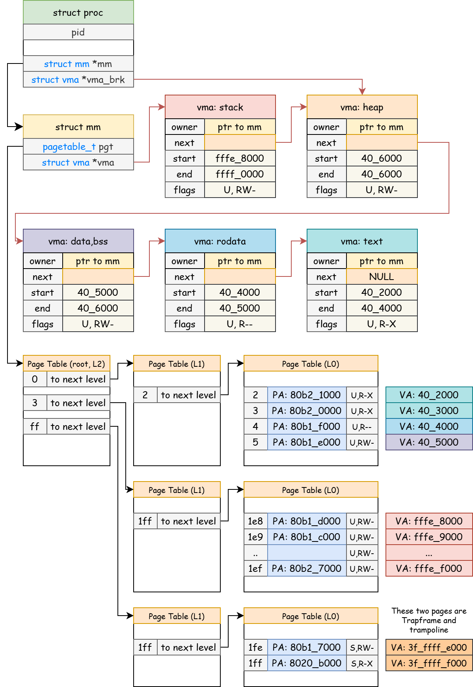

# 用户进程

!!!warning "xv6-lab6 代码分支"
    
    https://github.com/yuk1i/SUSTech-OS-2025/tree/xv6-lab6

    使用命令 `git clone https://github.com/yuk1i/SUSTech-OS-2025 -b xv6-lab6 xv6lab6` 下载 xv6-lab6 代码。

    使用 `make run` 运行本次 Lab 的内核，它会启动第一个用户进程 `init`，`init` 会启动 Shell 进程 `sh`。

    你会看到 `sh` 进程的用户空间结构。

    ```
    init: starting sh
    [INFO  0,2] exec: exec-ed sh, mm structure:
    mm 0xfffffffd000fff48:
    pgt: 0xffffffc080d25000
    ref: 1
    vma: 0xfffffffd010bfd38
        [0x00000000fffe8000, 0x00000000ffff0000), flags: ---U-WR-
        [0x0000000000406000, 0x0000000000406000), flags: ---U-WR-
        [0x0000000000405000, 0x0000000000406000), flags: ---U-WR-
        [0x0000000000404000, 0x0000000000405000), flags: ---U--R-
        [0x0000000000402000, 0x0000000000404000), flags: ---UX-R-
    === PageTable at 0xffffffc080d25000 ===
    ...
    ```

    **注：** 本次 Lab 的 `struct mm` 初始化代码和上次 Lab 代码中有所变动。

## Address Space

我们首先回顾一下，在内核和 CPU 的视角下 U-mode 下的地址空间是如何进行描述的。

对于 CPU 而言，U-mode 下的所有访存，包括取指 (IF)、内存读 (LD)、内存写 (ST) 都是要通过页表进行地址翻译的。而 CPU 是通过 CSR `satp` 作为页表基地址来进行地址翻译的。

所以，内核需要为用户进程设置页表结构。在内核中，我们使用 `struct mm` 管理用户内存，每个 PCB `struct proc` 中均有一个指向 `struct mm` 的指针 `*mm`。

```c
// os/vm.h
struct mm {
    spinlock_t lock;

    pagetable_t __kva pgt;
    struct vma* vma;
};
```

每个 `struct mm` 中有一张页表 `pgt`，它就是用户进程使用的 `satp`，我们可以在 `usertrapret` 和 trampoline 中观察到这一点：

```c
// os/trap.c
void usertrapret() {
    // ...

    // tell trampoline.S the user page table to switch to.
    uint64 satp  = MAKE_SATP(KVA_TO_PA(curr_proc()->mm->pgt));      // <--
    uint64 stvec = (TRAMPOLINE + (uservec - trampoline)) & ~0x3;

    // jump to userret in trampoline.S at the top of memory, which
    // switches to the user page table, restores user registers,
    // and switches to user mode with sret.
    uint64 fn = TRAMPOLINE + (userret - trampoline);
    ((void (*)(uint64, uint64, uint64))fn)(TRAPFRAME, satp, stvec);
}

// os/trampoline.S
.globl userret
userret:
        # userret(TRAPFRAME, pagetable, stvec)
        # switch from kernel to user.
        # usertrapret() calls here.
        # a0: TRAPFRAME, in user page table.
        # a1: user page table, for satp.
        # a2: uservec

        # switch to the user page table.
        csrw satp, a1
        sfence.vma zero, zero
```

在内核的视角下， **用户的内存空间是几个连续的虚拟地址区域**。我们将每个连续的区域用 `struct vma` (Virtual Memory Area) 结构体表示，并使用链表将它们串起来。每个 `vma` 中有这一个区域的起始地址和结束地址（要求对齐到页边界），以及该区域的权限。

```c
// os/vm.h
struct vma {
    struct mm* owner;
    struct vma* next;   // linked list   
    uint64 vm_start;    // start address (user virtual address)
    uint64 vm_end;      // end address   (user virtual address)
    uint64 pte_flags;   // flags
};
```

注意到 `struct vma` 中有一个 `struct mm*` 指针，这表示每个 VMA 都下属于某个 `struct mm`。

### Loading

用户 **程序** 会指定它在加载时，需要加载哪几个连续的区域（也成为段 Segment）。
以下是 `llvm-readelf-19 -a user/build/sh` 的输出，表示 `sh` 程序加载（LOAD）时会需要三个连续的区域：

```
Elf file type is EXEC (Executable file)
Entry point 0x402000
There are 4 program headers, starting at offset 64

Program Headers:
  Type           Offset   VirtAddr           PhysAddr           FileSiz  MemSiz   Flg Align
  ATTRIBUTES     0x00c3dc 0x0000000000000000 0x0000000000000000 0x000061 0x000000 R   0x1
  LOAD           0x001000 0x0000000000402000 0x0000000000402000 0x0011f4 0x0011f4 R E 0x1000
  LOAD           0x003000 0x0000000000404000 0x0000000000404000 0x0000cd 0x0000cd R   0x1000
  LOAD           0x004000 0x0000000000405000 0x0000000000405000 0x000020 0x0007d0 RW  0x1000
```

我们可以在 `os/proc.c` 中的 `exec` 函数中，使用 `mm_print` 打印 `sh` 加载完成后 **进程** 的 `struct mm` 结构以及 `pgt` 页表。

```
mm 0xfffffffd000fff88:
  pgt: 0xffffffc080b14000
  ref: 1
  vma: 0xfffffffd010bfe28
    [0x00000000fffe8000, 0x00000000ffff0000), flags: ---U-WR-
    [0x0000000000406000, 0x0000000000406000), flags: ---U-WR-
    [0x0000000000405000, 0x0000000000406000), flags: ---U-WR-
    [0x0000000000404000, 0x0000000000405000), flags: ---U--R-
    [0x0000000000402000, 0x0000000000404000), flags: ---UX-R-
=== PageTable at 0xffffffc080b14000 ===
[0], pte[0xffffffc080b14000]: 0x0000000000000000 -> 0x0000000080b22000 -------V
  [2], pte[0xffffffc080b22010]: 0x0000000000400000 -> 0x0000000080b23000 -------V
    [2], pte[0xffffffc080b23010]: 0x0000000000402000 -> 0x0000000080b21000 ---UX-RV
    [3], pte[0xffffffc080b23018]: 0x0000000000403000 -> 0x0000000080b20000 ---UX-RV
    [4], pte[0xffffffc080b23020]: 0x0000000000404000 -> 0x0000000080b1f000 ---U--RV
    [5], pte[0xffffffc080b23028]: 0x0000000000405000 -> 0x0000000080b1e000 ---U-WRV
[3], pte[0xffffffc080b14018]: 0x00000000c0000000 -> 0x0000000080b18000 -------V
  [1ff], pte[0xffffffc080b18ff8]: 0x00000000ffe00000 -> 0x0000000080b19000 -------V
    [1e8], pte[0xffffffc080b19f40]: 0x00000000fffe8000 -> 0x0000000080b1d000 ---U-WRV
    [1e9], pte[0xffffffc080b19f48]: 0x00000000fffe9000 -> 0x0000000080b1c000 ---U-WRV
    [1ea], pte[0xffffffc080b19f50]: 0x00000000fffea000 -> 0x0000000080b1b000 ---U-WRV
    [1eb], pte[0xffffffc080b19f58]: 0x00000000fffeb000 -> 0x0000000080b1a000 ---U-WRV
    [1ec], pte[0xffffffc080b19f60]: 0x00000000fffec000 -> 0x0000000080b24000 ---U-WRV
    [1ed], pte[0xffffffc080b19f68]: 0x00000000fffed000 -> 0x0000000080b25000 ---U-WRV
    [1ee], pte[0xffffffc080b19f70]: 0x00000000fffee000 -> 0x0000000080b26000 ---U-WRV
    [1ef], pte[0xffffffc080b19f78]: 0x00000000fffef000 -> 0x0000000080b27000 ---U-WRV
[ff], pte[0xffffffc080b147f8]: 0x0000003fc0000000 -> 0x0000000080b15000 -------V
  [1ff], pte[0xffffffc080b15ff8]: 0x0000003fffe00000 -> 0x0000000080b16000 -------V
    [1fe], pte[0xffffffc080b16ff0]: 0x0000003fffffe000 -> 0x0000000080b17000 DA---WRV
    [1ff], pte[0xffffffc080b16ff8]: 0x0000003ffffff000 -> 0x000000008020b000 -A--X-RV
=== END === 
```

我们可以发现，在 vma 链表中，有三个区域是和 ELF 中的 LOAD 段相同的，它们分别是 `.text`, `.rodata`, `.data/.bss` 段。
```
    [0x0000000000402000, 0x0000000000404000), flags: ---UX-R-
    [0x0000000000404000, 0x0000000000405000), flags: ---U--R-
    [0x0000000000405000, 0x0000000000406000), flags: ---U-WR-
```

另一个以 `0xfffe` 开始的地址则是进程的栈区。
```
    [0x00000000fffe8000, 0x00000000ffff0000), flags: ---U-WR-
```

此外，还有一个大小为0的区域，它跟随在所有 LOAD 段后面，这是进程的堆区 (Heap，在远古的操作系统上我们称之为 `Program Break`)。进程需要使用 `sbrk` 系统调用来扩展或收缩堆区。

```
    [0x0000000000406000, 0x0000000000406000), flags: ---U-WR-
```

### 概览图

该图展示了内核中用于管理 `sh` 进程的用户地址空间的数据结构。



## fork

fork 系统调用是操作系统中用于创建一个新进程的函数。当一个进程调用 fork 时，它会创建一个与父进程几乎完全相同的新进程（称为子进程）。子进程会复制父进程的地址空间、所有寄存器值。唯一不同的是，fork 调用返回的值：

- 父进程：fork 返回子进程的 PID（进程ID）。

- 子进程：fork 返回 0。

xv6 中的 `fork` 实现位于 `os/proc.c` 中的 `fork` 函数。以下为简化版本：

```c
int fork() {
    int ret;
    struct proc *np = allocproc();  // child process
    struct proc *p = curr_proc();   // parent process

    // create a new struct mm for child process
    np->mm = mm_create(np->trapframe);

    // Copy user memory from parent to child.
    mm_copy(p->mm, np->mm);

    // copy saved user registers.
    *(np->trapframe) = *(p->trapframe);

    // Cause fork to return 0 in the child.
    np->trapframe->a0 = 0;
    np->parent        = p;

    // add the child process to scheduler
    np->state         = RUNNABLE;
    add_task(np);

    return np->pid; // return value for the parent process
}
```

`fork` 的调用者即为父进程，其中用 `allocproc` 申请的新 PCB 即为子进程。我们通过修改 `np` 的 trapframe 来实现两者拥有不同的返回值。注意到我们并没有改 `p` 的 trapframe，这是因为 `syscall` 函数在分发系统调用时，会为我们将 `fork` 函数的返回值写入 trapframe 中的 `a0`，我们只需让 `fork` 返回子进程的 PID 即可。

`mm_copy` (位于 `os/vm.c`) 函数最终实现了对所有 `vma` 的复制：实际上就是在新的 `mm` 下面创建新的 `struct vma`，赋值 `vma` 中的属性，调用 `mm_mappages` 映射该 `vma`，最后复制实际的内存数据。

!!!warning "Trapframe 和 Trampoline"
    在概览图中我们可以发现，用户页表中包含 Trapframe 和 Trampoline，而 `vma` 链表中并不包含这两个页面。这样的设计是刻意的而非bug。

    考虑 `vma` （用户的 Virtual Memory Area） 的 **生命周期** (Lifecycle)，`exec` 系统调用会删除所有现有的用户内存映射并替换为新的，但是 PCB (即 `struct proc`) 对象是不需要销毁重建的，Trapframe 似乎也不需要重新分配物理页面。
    
    所以，Trapframe 和 Trampoline 的生命周期实际上与该进程一致，而不是与任何一个 `vma` 条目一致。

    在实现上，我们在系统初始化时，即 `proc_init` 中申请 Trapframe 页面，在 `create_mm` 中映射 Trampoline 和 Trapframe.

## exec

exec 系统调用用于执行一个新的程序，并用新的程序替换当前进程的内存空间。与 fork 不同，exec 不会创建一个新的进程，而是用一个新程序替换当前进程的代码、数据和堆栈。

调用 exec 时，当前进程的地址空间会被新的程序的代码和数据替换掉。原先进程的代码、数据、堆栈都会被清空，并且加载新的程序。随后，当前进程的执行流将跳转到新程序的入口点，继续执行新的程序代码。

```c
int exec(char *name, char *args[]) {
    struct user_app *app = get_elf(name);

    struct proc *p = curr_proc();

    // execve does NOT preserve memory mappings:
    //  free VMAs including program_brk, and ustack
    // load_user_elf() will create a new mm for the new process and free the old one
    //  , if page allocations all succeed.
    // Otherwise, we will return to the old process.
    // However, keep the phys page of trapframe, because it belongs to struct proc.
    load_user_elf(app, p, args);

    // syscall() will overwrite trapframe->a0 to the return value.
    return p->trapframe->a0;
}
```

`load_user_elf` 函数相较于上次 Lab 有所变动。我们需要注意到， **申请物理页面是有可能失败的**。在系统没有足够的内存时，`exec` 函数执行失败，我们需要回到原来的进程中继续执行，并且要释放掉分配到一半的内存。

所以，我们创建一个新的 `struct mm`，并向其中加载 ELF 中的段和进程栈等。只有不再需要进行内存分配后 (`mm_mappages`)，我们才将 `p->mm` 给清空并覆盖掉。

```c
// os/loader.c, Simpilfied version.
int load_user_elf(struct user_app *app, struct proc *p, char *args[]) {

    // create a new mm for the process, including trapframe and trampoline mappings
    struct mm *new_mm = mm_create(p->trapframe);
    
    Elf64_Ehdr *ehdr      = (Elf64_Ehdr *)app->elf_address;
    for (int i = 0; i < ehdr->e_phnum; i++) {
        struct vma *vma = mm_create_vma(new_mm);
        // Load Segment from phdr.
        if (mm_mappages(vma) < 0)   // if page allocation fails, jump to bad.
            goto bad;
    }
    // setup brk: zero
    mm_mappages(vma_brk);
    // setup stack
    mm_mappages(vma_ustack);

    // from here, we are done with all page allocation 
    // (including pagetable allocation during mapping the trampoline and trapframe).

    // free the old mm.
    if (p->mm)
        mm_free(p->mm);    
    
    // we can modify p's fields because we will return to the new exec-ed process.
    p->mm      = new_mm;
    // setup trapframe
    p->trapframe->epc = ehdr->e_entry;
    
    return 0;

    // otherwise, page allocations fails. we will return to the old process.
bad:
    warnf("load (%s) failed: %d", app->name, ret);
    mm_free(new_mm);
    return ret;
}
```

## 生命周期

## exit

`exit` 系统调用用于终止当前进程，并返回一个退出状态给操作系统。`exit` 系统调用永远不会返回。调用 `exit` 后，进程的 **一些资源不会被操作系统立刻回收**。并且，`exit` 不会使其立刻从父进程的视野中消失。它仍然存在于“僵尸进程”状态，直到父进程通过 `wait` 系统调用获取到子进程的退出状态并回收该进程。

以下是简化版本的 `exit`。注意到在这里面我们并没有回收用户资源：到目前的 Lab 为止，我们只介绍过一种用户资源，即用户内存。

在 `exit` 中，我们只将自己的状态设为 `ZOMBIE`，并把退出代码保存到 `p->exit_code` 中。然后，我们使用 `wakeup` **唤醒** 自己的父进程。

```c
// Exit the current process.
void exit(int code) {
    int wakeinit = 0;
    struct proc *p = curr_proc();

    acquire(&wait_lock);
    // reparent

    // wakeup wait-ing parent.
    wakeup(p->parent);

    acquire(&p->lock);
    p->exit_code = code;
    p->state     = ZOMBIE;
    release(&wait_lock);

    sched();
    panic_never_reach();
}
```

!!!warning "wakeup"
    我们会在后续的同步 Lab 具体讲解锁和同步，以及上述代码中的 `wait_lock` 是什么。

    在这节 Lab，我们只需要知道父进程在 `wait` 找不到处于 `ZOMBIE` 的子进程时会陷入 **睡眠**。而子进程 `exit` 会把自己设为 `ZOMBIE`，这打破了 **父进程陷入 Sleeping 的条件**，所以我们唤醒父进程使其不再睡眠。


### reparent

"reparent"是指当一个进程的父进程终止时，操作系统会将该进程的父进程更改为 init 进程（PID 为 1 的进程）。这是一个系统级的管理机制，用于确保在父进程终止时，子进程仍然有一个父进程来进行资源回收、进程管理等必要操作。

reparent 机制主要是为了避免“孤儿进程”问题，并确保系统资源得到适当回收。在 xv6 中，`init` 就像是一个"孤儿院"，负责回收子进程们创建的孙子进程。

## wait

TODO

## 课堂报告

1. Trampoline 和 Trapframe 的物理页面是哪里来的？

    参照上述我们打印的 `sh` 进程的用户页表，注意其中最后两条映射的物理地址：

    ```
    [ff], pte[0xffffffc080b147f8]: 0x0000003fc0000000 -> 0x0000000080b15000 -------V
    [1ff], pte[0xffffffc080b15ff8]: 0x0000003fffe00000 -> 0x0000000080b16000 -------V
        [1fe], pte[0xffffffc080b16ff0]: 0x0000003fffffe000 -> 0x0000000080b17000 DA---WRV
        [1ff], pte[0xffffffc080b16ff8]: 0x0000003ffffff000 -> 0x000000008020b000 -A--X-RV
    ```

    参照 "Week 6 - 内核页表 Kernel Paging" 中的 "xv6 内核内存布局" 一章，找出这两个物理地址分别位于哪个物理地址区域。对照源代码 `trampoline.S` 和 linker script `os/kernel.ld` 验证你的答案。

2. 在不同的进程中，它们的 Trapframe 及 Trampoline 是同一张物理页面吗？

    在 `sh >>` 下执行命令 `test_arg 123 asd`，`sh` 会 fork&exec 启动 `test_arg` 程序。内核也会打印 `test_arg` 的页表。观察它的页表和 `sh` 的页表中的 Trapframe 和 Trampoline。

3. 在使用 `exec` 系统调用时，我们会传入进程的参数，即 `int exec(char *path, char *argv[])`。我们会在 `main` 函数中收到 `argv` 数组：`int main(int argc, char *argv[])`，其中 `argv` 是一个 `char*` （字符串指针）的数组，它的最后一项是 NULL，`argc` 表示这个数组中有多少个字符串指针。

    我们知道 `exec` 会删除所有内存映射。那么，旧进程进行 `exec` 系统调用时传入的 `argv` 是怎么传入到新进程的？

    Hint: 在 `make run` 后，applists 中有 `test_arg`。你可以在 `sh >> ` 中测试它。

    TODO：Debugger。

## 推荐阅读

回顾上周的课堂报告问题：Trapframe 和 Trampoline 是两个页面，这两个页面应该允许 U-mode 访问吗？

请你亲自做实验验证。

对于 Trampoline，修改 `kvm.c` 中 `kvmmake` 函数，调用 `kvmmap` 映射 trampoline 处，在权限中 OR 上 PTE_U。

对于 Trapframe，修改 `proc.c` 中 `allocproc` 中，调用 `mm_mappage_at` 函数处，在权限中 OR 上 PTE_U。：

使用 `make debug` 以及 `gdb-multiarch` 挂载调试器。使用 `b kernel_trap_entry` 和 `b *0x3ffffff000` 在内核 Trap 入口处和 `uservec` 处打断点，使用 `print $scause` 手动查看 Trap 相关的 CSR。