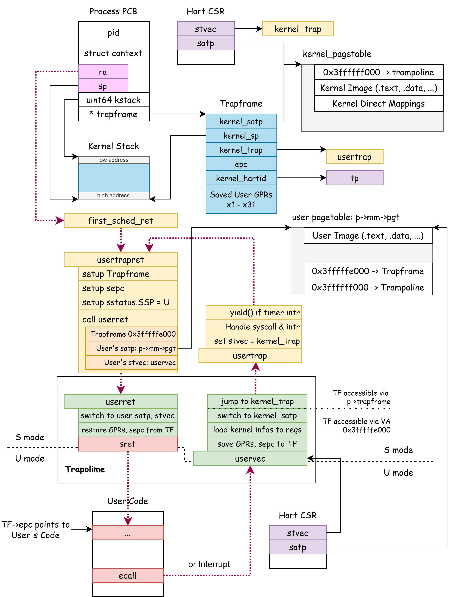

# 用户空间

用户空间 (Userspace) 是操作系统为用户程序提供的一个受限制的运行环境。操作系统通过 CPU 的硬件功能辅助来实现用户空间和内核的隔离，这通常包括：

- 特权级的隔离。用户空间一般使用低特权级运行，使用高特权级指令会触发异常。
- 内存空间的隔离。内核通过页表为用户空间设置地址空间，而用户空间不能直接访问内核地址。

## 实验目的

1. 掌握如何建立用户空间
2. 掌握trampoline原理
3. 理解第一个用户进程的执行过程
4. 理解uaccess的作用

## 概览

本次 Lab 中，我们将第一次把 CPU 运行在 U-mode，并运行第一个用户程序。

在第一次作业中，我们亲自实验发现，如果 CPU 在执行 `sret` 时 `sstatus.SPP == 0`，那么 CPU 将降级到 U-mode。
当 CPU 降级到 U-mode 后，CPU 只能通过 Trap 回到 S-mode。而 Trap 分为两种：异常（Exception）和中断（Interrupt）。

- 用户程序可以主动地使用 `ecall` 发起一种异常 Exception: Code 8 (Environment call from U-mode)，这就是 RISC-V 平台上实现系统调用（syscall）的方式。
- U-mode 下，**中断永远是开启的**。回顾 `Trap, Exception and Interrupt` 一章中，我们对 `中断到来时，能否进入 Trap` 这件事情的描述：（当前运行在 S 模式，且 `sstatus.SIE` == 1） 或者 当前运行在 U 模式。

当你完成这节 Lab 中所描述的细节后，你可以通过下图理解 xv6 中的 userspace 结构。

下图中，蓝色方块表示由 `kallocpage` 分配的页面，黄色方块表示内核中的代码，绿色方块表示 Trampoline 中的代码。该图展示了内核中的众多数据结构之间的指针关系（黑色箭头），以及内核态用户态之间进行切换时的代码调用过程（红色虚线箭头）。



!!!warning "xv6-lab5 代码分支"
    
    https://github.com/yuk1i/SUSTech-OS-2025/tree/xv6-lab5

    使用命令 `git clone https://github.com/yuk1i/SUSTech-OS-2025 -b xv6-lab5 xv6lab5` 下载 xv6-lab5 代码。

    使用 `make run` 运行本次 Lab 的内核，它会启动第一个用户进程 `init`，其源代码为 `user/src/init.c`。

## 用户态和内核态的切换

RISC-V CPU 运行时会处于某个特权级状态。操作系统运行在 S mode，而用户模式处于 U mode。

我们将分别讲解如何从 S mode 降级到 U mode，以及如何从 U mode 回到 S mode。

### Kernel -> User

在 Interrupts 一章中，我们学习了 sret 指令完成的三件事情：

1. sstauts.SIE <= sstatus.SPIE
2. Current_Privilege_Level <= sstauts.SPP
3. pc <= epc

用中文：还原 `sstatus.SIE` 为 `sstatus.SPIE`，将特权级(U/S)设置为 `sstauts.SPP`，将 PC 设置为 `sepc`。

在 CSR `sstatus` 中，`SPP` 的描述如下：

The SPP bit indicates the privilege level at which a hart was executing before entering supervisor mode.
When a trap is taken, SPP is set to 0 if the trap originated from user mode, or 1 otherwise.
When an SRET instruction (see Section 3.3.2) is executed to return from the trap handler, the privilege level is set to user mode if the SPP bit is 0, or supervisor mode if the SPP bit is 1; SPP is then set to 0.

所以说，只要在 `sret` 执行时，`sstatus.SPP` 为 0，我们即可降级到 U mode 下。（这其实并不要求我们一定处于 Trap Handler 中）

### User -> Kernel

若 CPU 运行在 U mode 下，CPU 通过触发 Trap 来回到 S mode，这通常包括：

- 中断。包含时钟中断、外部中断等。
- 异常通常包括：

    - Illegal Instruction
    - (Load, Store, Fetch) Page Fault
    - Environment call (**这是 RISC-V 的 syscall 方式**， 即 ecall )

当需要进行系统调用时，用户程序可以使用 `ecall` 指令主动触发一次 Trap，而这将使 CPU 通过 Trap 回到 S mode.

!!! note "ecall"

    还记得吗，之前我们曾在 S mode 使用 `ecall` 指令调用 M mode 提供的接口。

    环境调用即通过引发环境调用异常来请求执行环境。

## 用户页表 / 内核页表

在上一节 Lab 中，我们介绍了 RISC-V 的页表模型，并且为内核设置了页表。在 PTE 中的第 4 个 bit U 表示该映射关系是否允许在用户模式下访问。

本次lab中，我们引入用户空间，用户进程需要运行在用户空间上。
因此，我们将 512 GiB 的地址切分为用户地址（低地址）和内核地址（高地址），用户地址为 `0x0000_00` 开头，而内核地址以 `0xffff_ff` 开头。

每一个用户进程都需要有自己独立的地址空间，所以，对于每一个用户程序，我们都为它创建一个单独的页表。我们将其称为 **用户页表** 。

在 xv6 中，用户页表并不包含内核页表项目，也就是说不包含内核镜像的代码、数据和 Direct Mapping 等。那么在需要在 S mode 和 U mode 之前切换时，就产生了一个问题：

想象一下，目前用户进程使用的是用户页表，此时在用户进程运行过程中发生了一个 Trap ，将要进入 S mode 。而在进入 Trap Handler 前，CPU 需要将 pc 跳转为 `stvec`，但是此时 CPU 仍然还使用着原来的 `satp`，即 U mode 时所用的用户页表，该页表并不包含内核空间的地址映射，即内核的中断处理入口函数的地址 `stvec` 在用户空间下是不可用的。这就出现了问题。

因此，我们不能直接在 U mode 下使用内核所用的 `stvec` (`0xffff_ffff_8020_xxxx`)。这个问题与我们在实现 Relocation 时所遇到的问题类似。

所以，我们需要为 U mode 设置一个专门的 Trap Handler，并且，我们使其在内核页表和用户页表中都具有 **相同的虚拟地址** 。这样，我们在从 U mode 通过 Trap 回到 S mode 时，能在内核态 + 用户页表的环境下执行代码。

<!-- 在我们需要 S mode -> U mode 时，我们切换到用户页表，并设置用户的 `stvec` 为该代码页面中的一个简易 Trap Handler。而在进入该 Trap Handler 时，即 U mode -> S mode 时，我们切换回内核的页表和内核的 `stvec`，保存用户的执行环境，并恢复内核的运行环境。 -->

我们将包含这段代码的特殊页面称为 Trampoline，并将其映射到 `0x0000_003f_ffff_f000`。

## Trampoline （trampoline.S）

> Trampoline n. 蹦床

在 xv6 中，Trampoline 是两段特殊的代码 `uservec` 和 `userret`，分别用于从用户态切换回内核态（即用户态下的 `stvec`），和从内核切换到用户态。

Trampoline 的虚拟地址 `0x0000_003f_ffff_f000` 在 **内核页表和每个用户页表** 中都是存在的，所以我们可以放心的切换用户和内核的 `satp` 而不用担心当前 pc 会变得非法了（回忆我们在上一章 Relocation 中遇到的问题）。

### Trampoline - 用户态到内核态 

当我们需要从 U mode 进入 S mode（通过 Trap ），我们需要通过 `uservec` 切换内核页表，并运行用户的 Trap Handler -- usertrap 。

#### uservec（trampoline.S）

```asm
	.section trampsec
.globl trampoline
trampoline:

.globl uservec
uservec:
        # trap.c sets stvec to point here, so
        # traps from user space start here,
        # in supervisor mode, but with a user page table.
        #
        # sscratch points to where the process's p->trapframe is
        # mapped into user space, at TRAPFRAME.

	# swap a0 and sscratch, so that a0 is TRAPFRAME
        csrrw a0, sscratch, a0

        # save the user registers (x1 - x31) in TRAPFRAME
        sd ra, 40(a0)
        sd sp, 48(a0)
        # ...
        sd t5, 272(a0)
        sd t6, 280(a0)

        # we have saved t0, so we can smash it
        # resotre a0 from sscratch, and save it
        csrr t0, sscratch
        sd t0, 112(a0)

        # save epc
        csrr t1, sepc
        sd t1, 24(a0)

        # load kernel's satp, sp, usertrap handler, tp(cpuid)
        ld t1, 0(a0)
        ld sp, 8(a0)
        ld t0, 16(a0)
        ld tp, 32(a0)

        csrw satp, t1
        sfence.vma zero, zero

        jr t0
```

在 Trampoline 的 `uservec` 中，所有 GPR (x1-x31) 均为用户程序正在使用的，我们需要在执行 `userret` 中的 `sret` 时保持所有 GPR 与我们进入 `uservec` 时一致，这个要求与我们处理内核 Trap 时是一致的。

在处理内核的 Trap 时，我们直接在内核栈上构建了 `struct ktrapframe` 结构体，用于保存所有 GPR。类似的，我们将保存用户寄存器的地方称为 `Trapframe` ，大小小于一个页面。并且，我们将其映射到用户页表中的一个固定地址 `0x0000_003f_ffff_e000` ，即 trampoline 下一个页面。

`struct trapframe` 定义在 `proc.h` 中：

```c
struct trapframe {
    /*   0 */ uint64 kernel_satp;    // kernel page table
    /*   8 */ uint64 kernel_sp;      // top of process's kernel stack
    /*  16 */ uint64 kernel_trap;    // usertrap()
    /*  24 */ uint64 epc;            // saved user program counter
    /*  32 */ uint64 kernel_hartid;  // saved kernel tp
    /*  40 */ uint64 ra;
    /*  48 */ uint64 sp;
    /*  ... */
    /* 272 */ uint64 t5;
    /* 280 */ uint64 t6;
};
```

由于 RISC-V 的指令的 destination 均为寄存器，不能是立即数，而我们在保存用户寄存器前不能修改寄存器的内容，所以我们起码需要一个能修改的寄存器来表示 `0x0000_003f_ffff_e000` 这个 trapframe 的地址。RISC-V 提供了一个 `sscratch` 寄存器来给 Trap Handler 一个暂存寄存器的地方。我们可以使用 `csrrw a0, sscratch, a0` 交换 `sscratch` 和 `a0` 寄存器。这样，用户的 a0 寄存器就被保存到了 `sscratch` 中，而 `sscratch` 中的内容就来到 `a0` 中。

我们规定，在操作系统初始化完成后， `sscratch` 寄存器保存着用户页表中 Trapframe 所映射的虚拟地址，即 `0x0000_003f_ffff_e000`。
在进入 `uservec` 后，我们交换 a0 和 sscratch，此时 a0 为 `0x0000_003f_ffff_e000`。
随后，我们用 `sd ra, 40(a0)` 等汇编指令来保存除了 a0 以外的所有用户寄存器。在保存用户寄存器后，我们能够修改所有寄存器了，我们将保存在 `sscratch` 中的用户 `a0` 读取到 `t0`，并写入 trapframe 中，至此我们成功保存了所有用户寄存器。然后，我们保存 `sepc` 到 trapframe 结构体中。

最后，我们从 `trapframe` 中读取内核相关的数据，如内核页表 `t1` (`kernel_satp`)，内核栈 `sp` (`kernel_sp`)，内核的 cpuid `tp` (`kernel_hartid`)，以及下一阶段的用户 Trap 处理函数 t0 (`kenrel_trap`)。
在切换回内核的页表后，我们即可跳转 `tf->kernel_trap` 进入C语言环境处理 `usertrap`。

!!!info 内核栈
    内核栈有如下几种：

    - `boot_stack`：内核启动时所用的栈。
    - `sched_kstack`：每个 CPU 的 scheduler 所用的栈。
    - `p->kstack`: 每个进程的 **内核线程** 的内核栈。当从 U-mode 来到 S-mode 时，用户模式下的 sp 是不可用的，我们需要切换到该进程的内核栈。

### Trampoline - 内核态到用户态 

当我们需要从 S mode 进入 U mode（如用户进程第一次运行或用户进程从 Trap 中返回），我们需要调用 `usertrapret` 方法进行内核态信息的保存并加载用户态的相关信息，再通过 `userret` 切换到用户页表，并回到sepc记录的地方继续执行。

#### usertrapret（trap.c）

`usertrapret` 先将内核的信息保存到 `trapframe`，修改 `sepc` 为中断帧中的sepc ，设置 `sstatus` 的SPP位 ，计算出用户页表的 `satp` 和 `stvec` 值，并跳转到 Trampoline 中的 `userret` 函数。

在调用 `userret` 时，我们传入了3个参数，分别是用户的 `trapframe` 地址，用户页表 `satp` 值，和 `stvec` 值。在汇编中，我们可以使用 a0, a1, a2 引用它们。

```c
//
// return to user space
//
void usertrapret() {
    if (intr_get())
        panic("usertrapret entered with intr on");

    struct trapframe *trapframe = curr_proc()->trapframe;
    trapframe->kernel_satp      = r_satp();                                 // kernel page table
    trapframe->kernel_sp        = curr_proc()->kstack + KERNEL_STACK_SIZE;  // process's kernel stack
    trapframe->kernel_trap      = (uint64)usertrap;
    trapframe->kernel_hartid    = r_tp();

    w_sepc(trapframe->epc);
    // set up the registers that trampoline.S's sret will use to get to user space.

    // set S Previous Privilege mode to User.
    uint64 x = r_sstatus();
    x &= ~SSTATUS_SPP;  // clear SPP to 0 for user mode
    x |= SSTATUS_SPIE;  // enable interrupts in user mode
    w_sstatus(x);

    // tell trampoline.S the user page table to switch to.
    uint64 satp  = MAKE_SATP(KVA_TO_PA(curr_proc()->mm->pgt));
    uint64 stvec = (TRAMPOLINE + (uservec - trampoline)) & ~0x3;

    uint64 fn = TRAMPOLINE + (userret - trampoline);
    tracef("return to user @%p, fn %p", trapframe->epc);
    ((void (*)(uint64, uint64, uint64))fn)(TRAPFRAME, satp, stvec);
}
```
#### userret（trampoline.S）

在 userret 中，我们首先通过 usertrapret 中传递的 a1 寄存器内容切换回用户页表，此时我们即可使用 `0x0000_003f_ffff_e000` 访问到 trapframe，然后将 `stvec` 从内核的中断处理入口 `kernel_trap_entry` 设置为用户的中断处理入口 `uservec` 。

之后，我们将用户的 a0 存入 `sscratch`，然后从 trapframe 中恢复了其他用户寄存器。最后，我们使用 `csrrw a0, sscratch, a0` 交换 a0 和 `sscratch`，此时 a0 为用户的 a0，`sscratch` 是 trapframe 的虚拟地址 `0x0000_003f_ffff_e000`。

在 userret 的最后，我们执行 sret ，切换至 U mode，跳转至 sepc 存储的位置继续执行。

```asm
.globl userret
userret:
        # userret(TRAPFRAME, pagetable, stvec)
        # switch from kernel to user.
        # usertrapret() calls here.
        # a0: TRAPFRAME, in user page table.
        # a1: user page table, for satp.

        # switch to the user page table.
        csrw satp, a1
        sfence.vma zero, zero

        # switch to the user stvec.
        csrw stvec, a2

        # put the saved user a0 in sscratch, so we
        # can swap it with our a0 (TRAPFRAME) in the last step.
        ld t0, 112(a0)
        csrw sscratch, t0

        # restore all but a0 from TRAPFRAME
        ld ra, 40(a0)
        ld sp, 48(a0)
        # ...
        ld t5, 272(a0)
        ld t6, 280(a0)

        # restore user a0, and save TRAPFRAME in sscratch
        csrrw a0, sscratch, a0

        # return to user mode and user pc.
        # usertrapret() set up sstatus and sepc.
        sret
```


## 第一个用户进程

在这个部分，我们需要理解操作系统在启动后，如何由 S mode 切换到 U mode 运行起第一个用户进程，并理解如何在用户进程中对 Trap 进行相应。

### 创建用户进程

操作系统启动后，通过在 `bootcpu_init` 中调用 `load_init_app` 函数会加载第一个用户进程，我们称之为 `init` 进程。`allocproc` 会创建并初始化 init 进程的 PCB，`load_user_elf` 会将加载 init 进程的 ELF 文件到 PCB `p` 中，`add_task` 将它丢进 `scheduler` 的队列中，等待第一次调度。

```c
int load_init_app() {
    struct user_app *app = get_elf(INIT_PROC);
    struct proc *p = allocproc();
    load_user_elf(app, p, argv);
    add_task(p);
    init_proc = p;
    release(&p->lock);
    return 0;
}
```

在 Context Switch 一章，`allocproc` 会初始化 `struct proc` 中的 pid, state 等字段，以及初始化 context 为 `sched_first_ret`。而在本章中，我们多了用户模式，`allocproc` 额外完成了：在用户内存地址映射 trampoline 到内核源代码中的特殊页面，创建 trapframe 的空间，将其映射到用户内存地址，并保存其 KVA（内核虚拟地址）到 `p->trapframe`。

```c
struct proc *allocproc() {
    // ...
found:
    // ==== Resources Allocation ====

    p->pid   = allocpid();
    p->state = USED;
    // create struct mm for user memory management.
    p->mm    = mm_create();
    
    // map trampoline to user address `TRAMPOLINE`
    mm_mappageat(p->mm, TRAMPOLINE, KIVA_TO_PA(trampoline), PTE_A | PTE_R | PTE_X);

    // allocate a physical page for trapframe.
    uint64 __pa tf = (uint64)kallocpage();
    mm_mappageat(p->mm, TRAPFRAME, tf, PTE_A | PTE_D | PTE_R | PTE_W);

    // ==== Resources Allocation Ends ====

    // prepare trapframe and the first return context.
    p->trapframe = (struct trapframe *)PA_TO_KVA(tf);
    memset(&p->context, 0, sizeof(p->context));
    memset((void *)p->kstack, 0, KERNEL_STACK_SIZE);
    memset((void *)p->trapframe, 0, PGSIZE);
    p->context.ra = (uint64)first_sched_ret;
    p->context.sp = p->kstack + KERNEL_STACK_SIZE;

    return p;
}
```
`load_user_elf` 中，会将用户程序的 `epc` 等信息写入进程的中断帧中。
```c
    // setup trapframe
    p->trapframe->sp  = sp;
    p->trapframe->epc = ehdr->e_entry;
    p->trapframe->a0  = argc;
    p->trapframe->a1  = uargv_ptr;
    p->state          = RUNNABLE;
```

至此，第一个用户进程加载并创建完成。

### 第一次到用户空间

与 Context Switch 章节中类似，在 `scheduler` 通过 `swtch` 切换到用户进程后， `first_sched_ret` 是一个进程第一次被 scheduler 调度到时执行的函数，它会按照 scheduler 规范释放 `p->lock`，并且跳转到 `usertrapret` 继续执行（见Trampoline部分）。由于我们在用户进程的中断帧中已经存储了用户程序的入口等相关信息，在 `userret` ‘恢复’用户进程的状态后， sret 将让用户进程正式开始在用户空间运行。

### 用户空间的第一条代码

用户空间的代码并不是 `init.c` 的入口代码，我们在 `user/lib/user.ld` 定义了用户程序的 Linker Script，里面指定了 ELF 入口 entry 是 `__start_main` 函数，该函数在 `user/lib/start_main.c` 中被定义。

该函数会调用 main 函数，并将其返回值作为 exit 的退出状态码，这允许我们在 main 函数中使用 `return` 来退出程序而不要求用户使用 exit 系统调用来保证进程的正常结束。

```c
#include "syscall.h"

extern int main(int, char **);

__attribute__((section(".text.entry"))) int __start_main(int argc, char *argv[])
{
	exit(main(argc, argv));
	return 0;
}
```
### 用户空间的退出

用户进程运行结束后将在用户空间调用 `exit` 系统调用使得进程正常退出，并唤醒父进程进行资源的回收。

`exit` 将执行 `user\lib\usys.pl` 生成的代码，通过将 exit 系统调用对应的system call number 放入 a7 寄存器后，执行 ecall 指令，触发环境调用 Trap 切换入 S mode 进行系统调用的相关内核代码执行流程。（如用户进程执行过程中发生 Trap ，也是同样的流程）

ecall 指令执行后，由于用户 `stvec` 寄存器中存储的是 `uservec` ，因而跳转至 Trampoline 的 uservec 部分代码进入 S mode (详细介绍见Trampoline部分)，uservec 的最后将跳转至用户中断处理程序 usertrap 进行相应的中断处理。

#### usertrap（trap.c）

在 `usertrap` 中，我们先将 stvec 设置为 `kerneltrap`，以此捕捉之后在内核态可能出现的中断和异常。随后读取 scause 处理异常。最后，使用 `usertrapret` 返回用户空间。

```c
void usertrap() {
    set_kerneltrap();

    assert(!intr_get());
    if ((r_sstatus() & SSTATUS_SPP) != 0)
        panic("usertrap: not from user mode");
    
    struct trapframe *trapframe = curr_proc()->trapframe;
    uint64 cause = r_scause();
    
    // handle usertrap according to scause

    assert(!intr_get());
    usertrapret();
}
```

exit 作为一个系统调用会通过中断处理的 ecall 分支调用 syscall() 方法执行相应的系统调用。由于它是一个不会返回的方法，自此操作系统回到 S mode 进行相应的回收处理，并准备下一次调度。用户进程正式结束。 

#### 系统调用 Syscall

系统调用（System Call）是操作系统提供给应用程序的接口，允许用户程序请求操作系统内核的服务。系统调用也有自己的调用规定（calling convention），你可以使用 `man 2 syscall` 查看不同平台上 Linux 的 syscall 调用规约。

RISC-V 上，系统调用由 `ecall` 指令发起，syscall number 即调用哪个 syscall 在 a7 寄存器中指定，6个参数在 a0-a5 中指定，系统调用的返回值则在 a0 与 a1 中。

`ecall` 指令会发起一个异常，导致 CPU 进入 Trap，其 trap cause (scause) 为 8 (ecall from U-mode)。我们在 `usertrap` 中处理这种异常，并转交 `syscall.c` 中的 `syscall` 函数处理。

```c
void usertrap() {
    // ...
    struct proc *p              = curr_proc();
    struct trapframe *trapframe = p->trapframe;

    uint64 cause = r_scause();
    if (cause & SCAUSE_INTERRUPT) {
        // handle interrupt
    } else if (cause == UserEnvCall) {
        // sepc points to the ecall instruction,
        // but we want to return to the next instruction.
        trapframe->epc += 4;

        // an interrupt will change sepc, scause, and sstatus,
        // so enable only now that we're done with those registers.
        intr_on();
        syscall();
        intr_off();
    }
    // ...
    assert(!intr_get());
    usertrapret();
}
```

`syscall` 函数从当前进程的 Trapframe 中读取用户执行 `ecall` 时的寄存器值，并调用对应的 syscall 处理函数。

```c
void syscall() {
    struct trapframe *trapframe = curr_proc()->trapframe;
    int id                      = trapframe->a7;
    uint64 ret;
    uint64 args[6] = {trapframe->a0, trapframe->a1, trapframe->a2, trapframe->a3, trapframe->a4, trapframe->a5};
    switch (id) {
        case SYS_read:
            ret = sys_read(args[0], args[1], args[2]);
            break;
        case SYS_write:
            ret = sys_write(args[0], args[1], args[2]);
            break;
        default:
            ret = -1;
            errorf("unknown syscall %d", id);
    }
    trapframe->a0 = ret;
    tracef("syscall ret %d", ret);
}
```

## uaccess

### read & write

`read` 和 `write` 是 Linux 下重要的两个系统调用，它们的原型如下：

```c
ssize_t read(int fd, void buf[.count], size_t count);
ssize_t write(int fd, const void buf[.count], size_t count);
```

read 表示用户程序希望从内核读取数据，它负责从 fd （文件描述符，File Descriptor）读取 **至多** count 字节，写入到 buf中，并返回读取了多少字节。
而 write 则表示用户程序希望往内核写入数据，它负责将 **至多** count 字节的数据从 buf 写入到 fd 中。

在我们这节课所用的 xv6 上，我们还尚未引入文件的概念。所以，我们假定 read & write 系统调用即是对标准输入输出的 read & write，这两个系统调用最终会被 `user_console_write` 和 `user_console_read` 处理。

所以，在目前的 xv6 中，read 和 write 的语义也很简单了：write 即是从用户空间将 `buf` 中的数据打印到串口，read 即是等待串口的数据并拷贝到 `buf` 中。

这两个系统调用背后均有一个问题：**操作系统如何对用户内存进行读写？**，毕竟用户内存使用的是用户页表而非内核页表。

### uaccess

在内核下访问用户进程是一种非常常见的需求，以至于我们为此专门创建了一系列函数，我们将这系列函数称为 **用户访问原语** (uaccess primitive)。

在考虑 “uaccess 如何实现 **在内核读写用户内存** ”前，我们似乎已经干过这件事了：在 `loader.c` 中的 `load_user_elf` 通过 ELF 加载用户程序时，我们就是在修改用户内存。

我们重新回顾一下，在 `load_user_elf` 中是如何分配并写入用户内存的：

1. 对于每个 `PT_LOAD` 段，我们得到它要加载的起始地址和范围，并使用一个 `struct vma` 来表示这个范围。

```c
    Elf64_Phdr *phdr = &phdr_base[i];

    struct vma *vma = mm_create_vma(p->mm);
    vma->vm_start   = PGROUNDDOWN(phdr->p_vaddr);  // The ELF requests this phdr loaded to p_vaddr;
    vma->vm_end     = PGROUNDUP(vma->vm_start + phdr->p_memsz);
    vma->pte_flags  = pte_perm;
```

2. 我们使用 `mm_mappages` 映射该 vma 区域。`mm_mappages` 会对 vma 中的每个页面使用 `kallocpage()` 分配物理页面。

```c
mm_mappages(vma);
```

3. 使用 `walkaddr` 在页表结构上找到 va 所对应的 pa。注意到 `kallocpage` 返回的页面是 Kernel Direct Mapping 区域中的页面，所以我们可以使用 `PA_TO_KVA` 转换地址为 KVA 并直接对用户内存背后的物理页面进行访问。

```c
void *__kva pa = (void *)PA_TO_KVA(walkaddr(p->mm, va));
void *src      = (void *)(app->elf_address + phdr->p_offset + file_off);
uint64 copy_size = MIN(file_remains, PGSIZE);

memmove(pa, src, copy_size);
```

所以，uaccess 也是完全在做同样的事情，它通过 `walk` 系列函数 `walkaddr` ，通过 `p->mm->pgt` 将用户地址转换为物理地址，然后通过物理地址来进行内存访问。

我们定义了如下三种原语：

```c
int copy_to_user(struct mm *mm, uint64 __user dstva, char *src, uint64 len);
int copy_from_user(struct mm *mm, char *dst, uint64 __user srcva, uint64 len);
int copystr_from_user(struct mm *mm, char *dst, uint64 __user srcva, uint64 max);
```

我们将通过作业2对 uaccess 进行进一步的理解。

## Lab 练习

1. 请你写出：当 `init` 进程第一次回退到用户模式时，它的所有寄存器状态（包含 pc，只列出值不为0的）

    Hint: 在 `first_sched_ret` 中，`usertrapret` 前，使用 `print_trapframe` 打印 `curr_proc()` 的 trapframe。

2. 在 `user/src/init.c` 中，取消注释：`asm volatile(" csrw stvec, %0" : : "r"(0x80000000));`。

    `make run` 运行内核，`init` 应该触发异常并导致 `[PANIC 0,1] os/proc.c:337: init process exited`。

    请你写出 `init` 触发了什么异常，以及为什么会触发异常。

3. Trapframe 和 Trampoline 是两个页面，这两个页面应该允许 U-mode 访问吗？即用户页表中，这两个页面的 PTE 的 Flags 中是否应该拥有 `PTE_U`。请解释你的答案，不超过 50 字。

## 相关阅读

### `struct mm`

`struct mm` 结构体用于管理用户的内存空间，其源代码位于 `vm.c`。（内核的内存空间管理源代码为 `kvm.c`）

`struct vma` 结构体用于表示一片连续的虚拟地址，每个 `struct mm` 下面有多个 `struct vma` 结构体，每个 `struct vma` 所有于某个 `struct mm`，它们使用链表 `vma->next` 串联在一起。

```c
struct vma {
    struct mm* owner;
    struct vma* next;
    uint64 vm_start;
    uint64 vm_end;
    uint64 pte_flags;
};

struct mm {
    spinlock_t lock;

    pagetable_t __kva pgt;
    struct vma* vma;
    int refcnt;
};

// vm.c
void uvm_init();

pte_t* walk(struct mm* mm, uint64 va, int alloc);
uint64 __pa walkaddr(struct mm* mm, uint64 va);
uint64 useraddr(struct mm* mm, uint64 va);

struct mm* mm_create();
struct vma* mm_create_vma(struct mm* mm);
void mm_free_pages(struct mm* mm);
void mm_free(struct mm* mm);
int mm_mappages(struct vma* vma);
int mm_remap(struct vma *vma, uint64 start, uint64 end, uint64 pte_flags);
int mm_mappageat(struct mm *mm, uint64 va, uint64 __pa pa, uint64 flags);
int mm_copy(struct mm* old, struct mm* new);
struct vma* mm_find_vma(struct mm* mm, uint64 va);
```

当我们要为用户映射一段空间时：

1. 使用 `mm_create_vma` 新建一个 `struct vma` 结构体，然后填充它的 `vma_start`, `vma_end` 和 `pte_flags` 字段。
2. 使用 `mm_mappages` 映射该 vma。
3. 如果要对该地址进行访问，使用 `walkaddr` 将其转换为物理地址。由于用户所用的物理页面均是由 `kallocpage` 动态分配的，我们可以使用 `PA_TO_KVA` 宏将其转换为 KVA 即可正常访问该虚拟地址。

```c
// loader.c, load_user_elf

// setup stack
struct vma *vma_ustack   = mm_create_vma(p->mm);
vma_ustack->vm_start  = USTACK_START - USTACK_SIZE;
vma_ustack->vm_end    = USTACK_START;
vma_ustack->pte_flags = PTE_R | PTE_W | PTE_U;
mm_mappages(vma_ustack);

for (uint64 va = vma_ustack->vm_start; va < vma_ustack->vm_end; va += PGSIZE) {
    void *__kva pa = (void *)PA_TO_KVA(walkaddr(p->mm, va));
    memset(pa, 0, PGSIZE);
}
```

### mm_mappages

函数原型：`int mm_mappages(struct vma *vma)`。

该函数会在页表 `vma->owner->pgt`中，映射 `vma` 中的虚拟地址范围。注意到，该页表就是用户进程的页表 `p->mm->pgt`。

具体而言，对于每个页面：从 `kallocpage()` 分配页面，并在 `mm->pgt` 页表中映射它。

```c
int mm_mappages(struct vma *vma) {  // simplified
    // sanity checking
    struct mm *mm = vma->owner;
    for (uint64 va = vma->vm_start; va < vma->vm_end; va += PGSIZE) {
        pte_t *pte = walk(mm, va, 1);
        void* pa = kallocpage();
        *pte = PA2PTE(pa) | vma->pte_flags | PTE_V;
    }
}
```

`mm_mappages` 会使用 `walk` 函数，得到 `mm->pgt` 中虚拟地址 va 所对应的 PTE 的地址，并构造 PTE。

### walk

`walk` 函数会返回在页表中的 PTE 地址。如果指定了 `alloc`，则会对中间缺少的页表进行分配。

```c
// Return the address of the PTE in page table pagetable
// that corresponds to virtual address va.  
// If alloc!=0, create any required page-table pages.
pte_t *walk(struct mm *mm, uint64 va, int alloc) {
    assert(holding(&mm->lock));

    pagetable_t pagetable = mm->pgt;

    if (!IS_USER_VA(va))
        return NULL;

    for (int level = 2; level > 0; level--) {
        pte_t *pte = &pagetable[PX(level, va)];
        if (*pte & PTE_V) {
            pagetable = (pagetable_t)PA_TO_KVA(PTE2PA(*pte));
        } else {
            if (!alloc)
                return 0;
            void *pa = kallocpage();
            if (!pa)
                return 0;
            pagetable = (pagetable_t)PA_TO_KVA(pa);
            memset(pagetable, 0, PGSIZE);
            *pte = PA2PTE(KVA_TO_PA(pagetable)) | PTE_V;
        }
    }
    return &pagetable[PX(0, va)];
}
```

### 程序的加载

`loader.c` 的 `load_user_elf` 实现了加载一个ELF文件到用户空间。`load_user_elf` 会根据 ELF 的 Program Header 进行加载，每个 LOAD 段会包含：

- p_vaddr：这个段应该被加载到哪个虚拟地址
- p_paddr：这个段应该被加载到哪个物理地址，该值在加载用户程序时不起作用，因为用户只能看到虚拟地址，并且用户的页面是由内核动态分配的。
- p_memsz：这个段应该占用多少内存空间
- p_filesz：这个段在 ELF 文件中占据多少空间
- p_offset：这个段的开始地址在 ELF 文件中哪个位置
- p_flags：段的权限

以下是 `init` 的 ELF 文件中的 phdr:

```
Elf file type is EXEC (Executable file)
Entry point 0x402400
There are 4 program headers, starting at offset 64

Program Headers:
  Type           Offset   VirtAddr           PhysAddr           FileSiz  MemSiz   Flg Align
  ATTRIBUTES     0x0074ed 0x0000000000000000 0x0000000000000000 0x000061 0x000000 R   0x1
  LOAD           0x001000 0x0000000000402000 0x0000000000402000 0x000f30 0x000f30 R E 0x1000
  LOAD           0x002000 0x0000000000403000 0x0000000000403000 0x0000b9 0x0000b9 R   0x1000
  LOAD           0x003000 0x0000000000404000 0x0000000000404000 0x000028 0x000440 RW  0x1000
```

!!!info "内核是怎么找到用户 ELF 文件的"
    用户空间的程序位于 `user/` 目录下，`make user` 会编译所有用户程序，编译产物位于 `user/build/stripped/` 目录下。
    
    内核的 Makefile 会调用 `scripts/pack.py` 脚本生成一个 `link_app.S`，而它负责最终将所有用户的 ELF 打包进内核镜像的 rodata 段。
