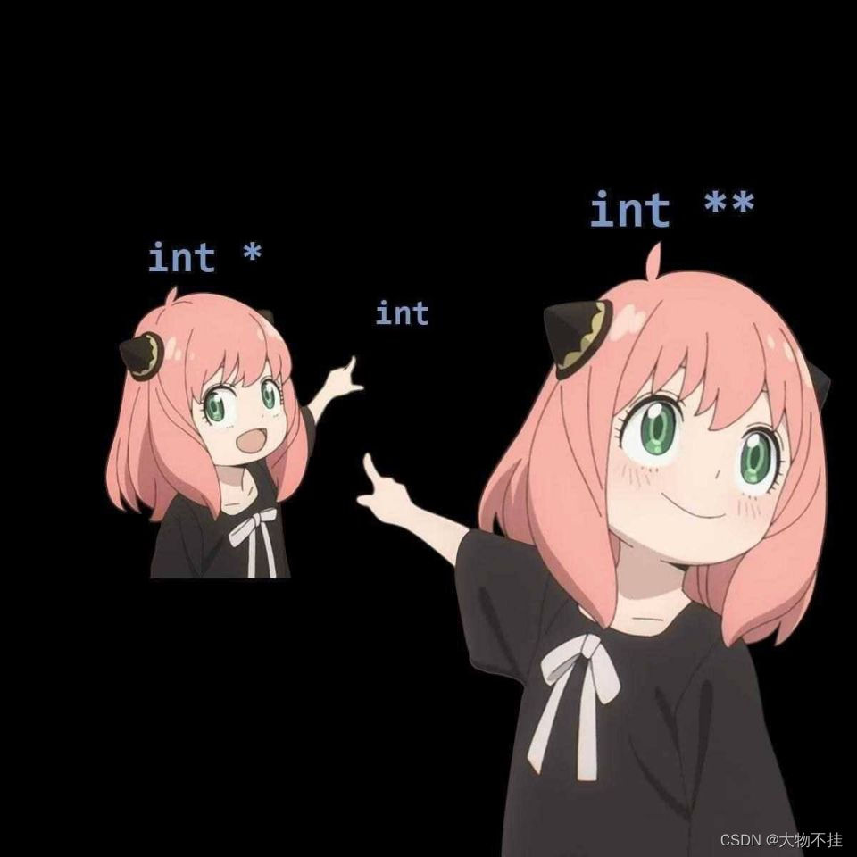

# C Language Basics & Makefile

!!! warning "C Language Basics"

    If you haven't learned C, we **strongly recommend** that you watch Teacher Yu's C/C++ course in advance: https://www.bilibili.com/video/BV1Vf4y1P7pq. Watching up to Chapter 6.5 will help you understand the basic syntax of C.

!!! warning "RISC-V Assembly"

    We expect that you have completed the "Computer Organization" course and understand the basics of RISC-V assembly.

    Additionally, always keep "The RISC-V Instruction Set Manual, Volume I: User-Level ISA, Version 2.1" (riscv-spec-v2.1.pdf) and "The RISC-V Instruction Set Manual, Volume II: Privileged Architecture, Document Version 20211203" (riscv-privileged-20211203.pdf) as reference manuals for RISC-V assembly.

## Types

In C, integer types include long, int, short, char, etc.
In most cases, the int type is 32 bits long, while the length of the long type depends on the ABI (Application Binary Interface, specified by the user during compilation).
To avoid inconsistencies in the actual length of long, int, etc., due to differences in compilation target architectures, we use fixed-length integer types such as uint64_t, int32_t, etc., in system programming.
In different ABI/compiler environments, using these types ensures they are of the specified length.

For example, in `os/types.h`:

```c title="os/types.h"
typedef unsigned int uint;
typedef unsigned short ushort;
typedef unsigned char uchar;
typedef unsigned char uint8;
typedef unsigned short uint16;
typedef unsigned int uint32;
typedef unsigned long uint64;
```

We define `uint64`, `uint32`, etc., as `unsigned long` and `unsigned int`, respectively.
Since we are programming for the riscv64 architecture, we can ensure that in our XV6, they are 64/32 bits.

!!! warning "unsigned"

    Note that in C, the default type for integer literals within the range of the int type is int.
    
    When an unsigned int is compared with a signed integer (e.g., int), the signed integer is promoted to unsigned int. If the constant is negative, it may become a very large unsigned value after promotion, leading to unexpected comparison results.

    Try executing the following code and observe the result:

    

### Pointers

A pointer is a variable type in programming languages that stores the memory address of another variable. Through pointers, you can indirectly access and manipulate the values of other variables. Pointers are commonly used in dynamic memory allocation, function parameter passing, and the implementation of data structures (e.g., linked lists, trees, etc.).

1. Pointer "content": It stores a memory address, not the data value directly. For example, pointer p can store the memory address of variable x, not the value of x.

2. Pointer type: A pointer has a type, indicating the type of variable it points to. For example, `int* p` means p is a pointer to an int.

3. Dereferencing: The process of accessing the variable a pointer points to is called dereferencing. In C, you can dereference a pointer using the * operator to get the value it points to.

4. Address-of: All variables stored in memory can have their addresses taken. We use `&` to denote taking the address of a variable.

For example:

```c
int a = 10;     // Define a variable a, initialized to 10.
int *p = &a;    // Take the memory address of variable a and store it in pointer p.
*p = 20;        // Modify the memory address pointed to by p to 20.

int b = 30;
int **pp = &p;  // Take the address of variable p and store it in pointer pp.
*pp = &b;       // Change the content of pointer p (the address it points to) to the address of variable b.
**pp = 50;      // Double dereference.

printf("a: %d, b:%d\n", a, b);  // Output: a:20, b:50.
```

A diagram to understand pointers:



### Structs

We use the `struct` keyword to indicate that the type is a struct. **A struct is a collection of data packed together**.

For example, we declare a struct `struct proc` with the following fields:

```c
struct proc {
    int pid;
    char* name;
    void* chan;
    uint64 krkr;
    uint8 dkdk;
};
```

We use the `.` operator to access a field of a struct variable and the `->` operator to dereference a field of a struct pointer.

```c
struct proc p1;
p1.pid = 1234;

struct proc *pProc = &p1;
pProc->name = "proc 1234";
```

## Compilation System

In the "Computer Organization" course, we briefly introduced the compilation system of C. Typically, compiling a program involves the following steps:


1. The source code .c file is preprocessed by the Pre-processor cpp to generate the .i file.

   The .i file is an intermediate file generated during the preprocessing stage of GCC, containing expanded header files, macro definitions, and conditionally compiled code. Use `gcc -E` to generate the .i file.

2. The .i file is compiled by the cc1 compiler to generate the assembly file .s.

   The compiler performs syntax checking on the .i file. If no errors are found, it converts the .i file into assembly code (human-readable machine code). During this process, the optimizer can optimize the code.

3. The .s file is assembled by the assembler as to generate the Relocatable objects (relocatable file) .o.

   During this process, the assembler converts assembly code into object code (machine code—code that can be directly executed by the machine, not human-readable).
  
4. The linker ld links all .o files to generate the final executable.

   On Linux systems, object files and executables are typically stored in the **ELF (Executable and Linkable Format)** file format.
   ELF files are divided into different **sections**, which store specific types of data, such as code (.text), data (.data), and the symbol table (.symtab). Each section has its specific purpose and attributes.

Typically, we use "compiler" to refer to all the tools used in the compilation and linking process, even though the compiler and linker are two different programs. Specifically, when discussing the compiler and linker, we collectively refer to the tools that perform preprocessing, assembly, and compilation as the compiler; the tool used in the final linking step is called the linker.

### Experiment Step 1: Observing the C Compilation Process

Below is a simple C code example suitable for observing the `.i`, `.s`, and `.o` files during the GCC compilation process:

```c
// main.c
#include <stdio.h>

int main() {
    int a = 10;
    int b = 20;
    int sum = a + b;
    printf("Sum: %d\n", sum);
    return 0;
}
```

#### Observing the Compilation Process

1. **Preprocessing**: Generate the `.i` file
   ```bash
   gcc -E main.c -o main.i
   ```
   This generates the `main.i` file, which contains the preprocessed code (macro expansion, header file inclusion, etc.). You can view its contents using `cat main.i`.

2. **Compilation**: Generate the `.s` file
   ```bash
   gcc -S main.i -o main.s
   ```
   This generates the `main.s` file, which contains the assembly code. You can view its contents using `cat main.s`.

3. **Assembly**: Generate the `.o` file
   ```bash
   gcc -c main.s -o main.o
   ```
   This generates the `main.o` file, which contains the object code (machine code). You can analyze the contents of `main.o` using the `objdump` tool. For example, use `objdump -d hello.o` to view the machine code and its corresponding assembly instructions.

4. **Linking**: Generate the executable
   ```bash
   gcc main.o -o main
   ```
   This generates the executable `main`. You can check the file type of `main` using `file main`, which should be ELF. You can use the `readelf` tool from the GNU Binutils toolset to view the ELF file's header, section information, symbol table, dynamic section information, etc. For example, use `readelf -h main` to view the file header of `main`.

## Definition and Declaration

Definition and Declaration are two concepts in C that are easily confused.

Declaration declares a symbol (variable, function, etc.) and some basic information about it (e.g., variable type, function parameter types, function return type). This allows the compiler to use this type information for code generation **during the compilation phase**.

Definition, on the other hand, actually allocates a memory address for the symbol. The linker **during the linking phase** assigns addresses to these symbols (e.g., function addresses, global variable addresses).

!!! info "Symbol"

    In C, a symbol is a name used by the compiler to represent various entities in a program (e.g., variables, functions, macros, type names, etc.). Each symbol is associated with a specific memory address or other resource during compilation. When a program is compiled, the compiler creates a symbol table (Symbol Table) to record the names, types, scopes, and corresponding memory addresses or values of these symbols.

    In short, a symbol is a name representing an entity in a program, and the compiler manages and resolves these names through the symbol table.

    When the compiler compiles a `.c` file, it processes the source code line by line and maintains a symbol table representing all symbols seen so far in the current file. When the compiler encounters a reference to a symbol (variable reference, function call), it looks up this symbol table; when the compiler encounters a declaration or definition of a symbol, it saves information about this symbol in the symbol table.

    Therefore, we must ensure that when referencing a symbol, it has at least been declared, i.e., seen by the compiler. At the same time, in the same file, a definition is also a declaration.

For the compiler, if a `.c` file needs to reference functions or variables from other `.c` files, it must **declare** them in advance. When the compiler encounters a symbol that has been declared but not defined in the current file (e.g., printf), the compiler assumes that the symbol will be defined in other object files, leaves some information, and lets the linker find the symbol during the linking phase.

For example, `a.c` **defines** the variable `int a`. If `main.c` wants to reference it, it needs to **declare** it using `extern int a`.

```c
// a.c
int a;

// main.c
extern int a;
int main() {
    printf("%d\n", a);
}
```

During compilation, we first compile `a.c` and `main.c` into `a.o` and `main.o`, respectively: `gcc -c a.c -o a.o`, `gcc -c main.c -o a.o`, then link the two .o files: `gcc main.o a.o` to generate the executable a.out.

When compiling `a.c`, the compiler-generated `a.o` indicates that it has a globally visible symbol named `a`.
When compiling `main.c`, the compiler does not know anything about other .c files. However, we declared the variable `a` in the first line, so it knows that there will be a symbol named `a` during linking. The compiler-generated `main.o` indicates that it needs a symbol named `a`.

The linker will search the symbol tables of all `.o` files and match symbols based on names and visibility.

To organize large projects, we do not manually import symbols from other `.c` files in each `.c` file. Instead, we use header files to declare these shared symbols.

## Header Files

The purpose of a header file (Header File) is to declare functions, variables, macro definitions, constants, types, etc., **to be shared across multiple source files**. We use the `#include` macro at the beginning of `.c` files to import header files. Its semantics is to directly copy the file content into the current file, a step performed by the preprocessor.

If a `.c` file has types, functions, or variables that need to be referenced by other `.c` files, we create a corresponding header file. When naming header files, we generally use the same filename but with a `.h` suffix; for example, for shared information in `a.c`, we create its header file `a.h`.

For shared functions and variables, we typically **declare** them in `a.h` and **define** them in `a.c`:

```c
// a.h
extern int a;
int add(int x, int y);

// a.c
int a;
// or int a = 10;
int add (int x, int y) {
    return x + y;
}
```

If `main.c` needs to reference the `a` variable or `add` function provided by `a.c`, it can include the `a.h` header file at the beginning:

```c
// main.c
#include "a.h"

int main() {
    a = 666;
    int b = 123;
    int c = add(a, b);
}
```

!!! note

    - A global variable declared and defined in a `.c` file cannot be **directly** used by other `.c` files. For example, if you have `int a;` in one `.c` file, you need `extern int a;` in another file for the two files to share the same `a`.

    - When defining global variables in multiple `.c` files, we must ensure the variable names are unique. Otherwise, it will lead to multiple definitions.

    - If we want to define global variables visible only to the current `.c` file, we can use the `static` keyword.

    - Header files can only declare variables. If a header file defines a variable and more than one `.c` file includes this header file, it will also result in multiple definitions because the preprocessor directly copies the included content into the current file, causing both `.c` files to define the variable.
    
    - If you want a variable to be shared across multiple `.c` files, you can declare the variable in the header file using the `extern` keyword and define it in any one `.c` file.

## readelf to Read the Symbol Table

Let's explain the difference between Declaration and Definition again:

- Definition tells the linker that this .o file contains a symbol, and the linker needs to allocate a memory address for it. If other .o files need to reference this symbol, it must check whether the symbol allows external access, i.e., whether `static` was used during declaration.

- Declaration assures the compiler that the symbol will be found during linking, whether it is defined in the current `.c` file or other `.c` files. The compiler only needs to generate code based on the declared variable type or function prototype (e.g., the width of variable access (lb, lw, ld), the number of function parameters), and the linker is responsible for finding these symbols.

We can use `llvm-readelf-19 --symbol <file>` to view the symbol table of an ELF file. The meaning of the fields can be referenced at https://docs.oracle.com/cd/E19455-01/816-0559/chapter6-79797/index.html.

```
$ llvm-readelf-19 --symbols build/os/proc.o | grep -E "FUNC|OBJECT|GLOBAL"
Symbol table '.symtab' contains 1240 entries:
   Num:    Value          Size Type    Bind   Vis       Ndx Name
     5: 0000000000000000    72 FUNC    LOCAL  DEFAULT     1 curr_proc
    23: 0000000000000048   304 FUNC    LOCAL  DEFAULT     1 freeproc
    97: 0000000000000178    92 FUNC    LOCAL  DEFAULT     1 first_sched_ret
   128: 0000000000000000     4 OBJECT  LOCAL  DEFAULT     6 proc_inited.1
   237: 0000000000000000     4 OBJECT  LOCAL  DEFAULT     7 PID.0
   663: 0000000000000000    32 OBJECT  LOCAL  DEFAULT     4 pid_lock
   664: 0000000000000020    32 OBJECT  LOCAL  DEFAULT     4 wait_lock
   665: 0000000000000040   104 OBJECT  LOCAL  DEFAULT     4 proc_allocator
  1201: 0000000000000000     0 NOTYPE  GLOBAL DEFAULT   UND push_off
  1202: 0000000000000000     0 NOTYPE  GLOBAL DEFAULT   UND mycpu
  1203: 0000000000000000     0 NOTYPE  GLOBAL DEFAULT   UND pop_off
  1210: 0000000000000000     0 NOTYPE  GLOBAL DEFAULT   UND usertrapret
  1211: 00000000000001d4   544 FUNC    GLOBAL DEFAULT     1 proc_init
  1212: 0000000000000000     0 NOTYPE  GLOBAL DEFAULT   UND spinlock_init
  1213: 0000000000000000     0 NOTYPE  GLOBAL DEFAULT   UND allocator_init
  1214: 00000000000000a8  4096 OBJECT  GLOBAL DEFAULT     4 pool
  1215: 0000000000000000     0 NOTYPE  GLOBAL DEFAULT   UND kernel_pagetable
  1216: 0000000000000000     0 NOTYPE  GLOBAL DEFAULT   UND kallocpage
  1217: 0000000000000000     0 NOTYPE  GLOBAL DEFAULT   UND kalloc
  1218: 0000000000000000     0 NOTYPE  GLOBAL DEFAULT   UND memset
  1219: 0000000000000000     0 NOTYPE  GLOBAL DEFAULT   UND kvmmap
```

The Type column indicates whether the symbol is a function (FUNC) or a variable (OBJECT). Bind indicates whether the symbol allows other .o files to find it (LOCAL/GLOBAL). Ndx indicates whether the symbol is defined in this .o file. `UND` means it is an external `.o`, i.e., a symbol that needs to be imported from other .o files, so its Type and Size are unknown.

Now, do you understand the reasons for the two common linking errors: multiple definition and undefined reference?

- `riscv64-unknown-elf-ld: build/os/proc.o:os/proc.c:14: multiple definition of 'idle'; build/os/main.o:os/main.c:7: first defined here`
    - The `idle` variable was defined multiple times in different .c files.
- `riscv64-unknown-elf-ld: build/os/proc.o: in function 'proc_init': os/proc.c:38:(.text+0xd0): undefined reference to 'idle'`
    - The `idle` variable was declared in the header file but not defined.

## Make and Makefile Introduction

Consider a scenario where our project is slightly larger (e.g., containing multiple C files). Every time we run it, we have to execute many gcc commands. Is there a compilation tool that can simplify this process? Next, we introduce the automated build tool, make.

`Makefile` is a configuration file used for automating the build process (compilation, linking, etc.) of programs, typically used to manage projects with multiple source files. It defines how to generate target files (e.g., executables, library files) from source code and ensures that only the parts that need updating are recompiled, improving build efficiency.

`Makefile` is the input file for the `make` tool, a classic build tool widely used in Unix/Linux systems.

### Experiment Step 2: Using Makefile for Automated Build

First, we create three files:

```c
//print.h header file
#include <stdio.h>
void print(void);

//print.c
#include "print.h"
void print(){
    printf("Hello, World!\n");
}

//main.c
#include "print.h"
int main(){
	print();
	return 0;
}
```

Due to the dependencies in the files, if we want to run the above code, we need to generate .o object files for each .c file and then link the two .o files to generate the executable:

```bash
gcc -c main.c
gcc -c print.c
gcc -o main main.o print.o

./main
```


As you can see, if we have many files, running the program becomes very complex. To make the compilation process easier, we can use a Makefile.

Next, we create a text file named Makefile.

Makefile content:

```makefile
main : main.o print.o
	gcc -o main main.o print.o
main.o : main.c print.h
	gcc -c main.c
print.o : print.c print.h
	gcc -c print.c
clean:
	rm main main.o print.o
```

Finally, we only need to execute the `make` command to complete the entire compilation process:


### Basic Structure of Makefile

```makefile
target: dependencies
[tab] system command
```

### How Makefile Works

By default, when we only enter the `make` command:

1. make looks for a file named "Makefile" or "makefile" in the current directory.
2. If found, it looks for the first target file (target) in the file. In the example above, it finds the "main" file and uses it as the final target file.
3. If the main file does not exist, or if the modification time of the `.o` files it depends on is newer than the `main` file, it executes the commands defined later to generate the `main` file.
4. If the `.o` files that `main` depends on do not exist, make looks for the dependencies of the `.o` files in the current file. If found, it generates the `.o` files according to that rule. (like a stack process)
5. Obviously, your C and Header files exist, so make generates the `.o` files and then uses them to generate make's ultimate task, the executable `main`.

### make clean

From the above analysis, we know that commands like clean, which are not directly or indirectly associated with the first target file, will not be executed automatically. However, we can explicitly ask make to execute them. For example, the command `make clean` clears all object files for recompilation.

For more information about Makefile, refer to: [How to Write Makefile 1.0 Documentation](https://seisman.github.io/how-to-write-makefile/introduction.html)