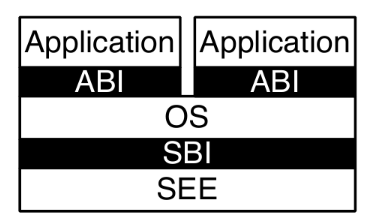
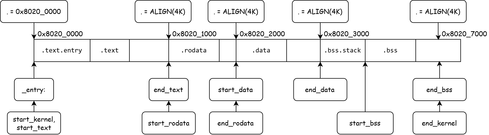

# Bare Metal Programming

When programming in a Linux environment, the `libc` functions and well-encapsulated system calls provided by the Linux environment allow us to focus primarily on the logic of our program to interact with the operating system. For instance, when we use `printf` and `scanf` to operate on standard input/output streams, the user-space runtime environment is provided by `libc`, while the kernel environment is supplied by the Linux Kernel.

However, when writing our own operating system, we lack the runtime environment provided by Linux or any other operating system. Instead, we interact directly with the CPU and hardware. Such programs, which directly interface with the CPU and hardware, are called **bare-metal programs**.

!!!info "What is a Bare-Metal Program"
    A **bare-metal program** is a type of software that runs directly on the hardware of a device without relying on an underlying operating system (OS). Essentially, it's code that interacts with the hardware at the most fundamental level, controlling the processor, memory, input/output (I/O) devices, and other components directly.

In our xv6 experiments, we will write operating system programs on the RISC-V architecture.

<h3 style="color: orange;">Lab Step 1: Running the First Bare-Metal Program</h3>

!!!info "xv6-lab1 Code Branch"
    https://github.com/yuk1i/SUSTech-OS-2025/tree/xv6-lab1

    Use the command `git clone https://github.com/yuk1i/SUSTech-OS-2025 -b xv6-lab1 xv6lab1` to download the xv6-lab1 code.

    It is recommended to download the code for each lab in a separate location.

After cloning the repository, you can run `make` locally to compile the xv6 kernel. Once the kernel is successfully compiled with `make`, you can use `make run` to invoke QEMU and run our first xv6 operating system.

The `make run` command executes the following:  
`qemu-system-riscv64 -nographic -machine virt -cpu rv64 -m 512 -kernel build/kernel`, which means:

- Use `qemu-system-riscv64` to emulate a RISC-V 64-bit CPU.
- `-nographic`: Disable graphical output.
- `-machine virt`: Use the `virt` machine model.
- `-cpu rv64`: Use a RISC-V 64-bit CPU.
- `-m 512`: Specify 512 MiB of memory.
- `-kernel build/kernel`: Load the kernel file from `build/kernel`.

!!! info "What is QEMU?"
    QEMU is an open-source virtual machine software that can emulate various hardware platforms, including x86, ARM, MIPS, SPARC, and more. It supports running multiple operating systems such as Linux, Windows, macOS, FreeBSD, etc. QEMU is widely used for virtualization, emulation, debugging, and testing in various scenarios. It supports full-system emulation and user-mode emulation, allowing users to run operating systems and programs designed for one architecture on a different architecture.

    In our operating system course, we use a virtual machine running a Linux system on an existing OS. Within this Linux system, we use QEMU to emulate a RISC-V 64-bit architecture virtual machine, on which we run the operating system we develop.

The output of running the program is as follows:

```
$ make run
qemu-system-riscv64 -nographic -machine virt -cpu rv64 -m 512 -kernel build/kernel 

OpenSBI v1.5
   ____                    _____ ____ _____
  / __ \                  / ____|  _ \_   _|
 | |  | |_ __   ___ _ __ | (___ | |_) || |
 | |  | | '_ \ / _ \ '_ \ \___ \|  _ < | |
 | |__| | |_) |  __/ | | |____) | |_) || |_
  \____/| .__/ \___|_| |_|_____/|____/_____|
        | |
        |_|

Platform Name             : riscv-virtio,qemu
Platform Features         : medeleg
Platform HART Count       : 1
Platform IPI Device       : aclint-mswi
Platform Timer Device     : aclint-mtimer @ 10000000Hz
Platform Console Device   : uart8250
Platform HSM Device       : ---
Platform PMU Device       : ---
Platform Reboot Device    : syscon-reboot
Platform Shutdown Device  : syscon-poweroff
Platform Suspend Device   : ---
Platform CPPC Device      : ---
Firmware Base             : 0x80000000
Firmware Size             : 327 KB
Firmware RW Offset        : 0x40000
Firmware RW Size          : 71 KB
Firmware Heap Offset      : 0x49000
Firmware Heap Size        : 35 KB (total), 2 KB (reserved), 11 KB (used), 21 KB (free)
Firmware Scratch Size     : 4096 B (total), 416 B (used), 3680 B (free)
Runtime SBI Version       : 2.0

Domain0 Name              : root
Domain0 Boot HART         : 0
Domain0 HARTs             : 0*
Domain0 Region00          : 0x0000000000100000-0x0000000000100fff M: (I,R,W) S/U: (R,W)
Domain0 Region01          : 0x0000000010000000-0x0000000010000fff M: (I,R,W) S/U: (R,W)
Domain0 Region02          : 0x0000000002000000-0x000000000200ffff M: (I,R,W) S/U: ()
Domain0 Region03          : 0x0000000080040000-0x000000008005ffff M: (R,W) S/U: ()
Domain0 Region04          : 0x0000000080000000-0x000000008003ffff M: (R,X) S/U: ()
Domain0 Region05          : 0x000000000c400000-0x000000000c5fffff M: (I,R,W) S/U: (R,W)
Domain0 Region06          : 0x000000000c000000-0x000000000c3fffff M: (I,R,W) S/U: (R,W)
Domain0 Region07          : 0x0000000000000000-0xffffffffffffffff M: () S/U: (R,W,X)
Domain0 Next Address      : 0x0000000080200000
Domain0 Next Arg1         : 0x000000009fe00000
Domain0 Next Mode         : S-mode
Domain0 SysReset          : yes
Domain0 SysSuspend        : yes

Boot HART ID              : 0
Boot HART Domain          : root
Boot HART Priv Version    : v1.12
Boot HART Base ISA        : rv64imafdch
Boot HART ISA Extensions  : sstc,zicntr,zihpm,zicboz,zicbom,sdtrig
Boot HART PMP Count       : 16
Boot HART PMP Granularity : 2 bits
Boot HART PMP Address Bits: 54
Boot HART MHPM Info       : 16 (0x0007fff8)
Boot HART Debug Triggers  : 2 triggers
Boot HART MIDELEG         : 0x0000000000001666
Boot HART MEDELEG         : 0x0000000000f0b509

clean bss: 0x0000000080207000 - 0x0000000080207000
Kernel booted.
Hello World!
sysregs:
sstatus : 0x8000000200006000
scause  : 0x0000000000000000
sepc    : 0x0000000000000000
stval   : 0x0000000000000000
sip     : 0x0000000000000000
sie     : 0x0000000000000000
satp    : 0x0000000000000000
0x00000000deadbeef
kernel ends, parking...
```

!!!info "How to Exit QEMU"

    Press `Ctrl` and `A` simultaneously, release them, then press `X`.

    If this method doesn’t work due to prior key presses, you can directly close the terminal.

<p style="color: orange;">Lab Step 1 Completed</p>

The above lab process demonstrates the boot process of a minimal kernel. Next, we will explain how an operating system starts running from the perspective of **privilege levels**. First, let’s understand what privilege levels are.

## Privilege Levels

!!!info "Privilege Levels (riscv-privileged.pdf)"
    Privilege levels is a concept in computer systems used to define the access control and permissions that different processes or users have within the system.  
    The existence of privilege levels aims to protect system resources, ensure security, and isolate processes based on trust and functionality.

    At any time, a RISC-V hardware thread (hart) is running at some privilege level encoded as a mode in one or more CSRs (control and status registers). 
    
    Three RISC-V privilege levels are currently defined as shown in Table 1.1. 
    
    Privilege levels are used to provide protection between different components of the software stack, and attempts to perform operations not permitted by the current privilege mode will cause an exception to be raised. 
    
    These exceptions will normally cause traps into an underlying execution environment.

Privilege levels are a critical state of the CPU during execution, indicating the level of privilege the currently running code possesses. Code with the highest privilege level has unrestricted access to all resources, such as all physical memory and peripherals. Higher privilege levels can restrict the resources accessible to lower privilege levels. For example, a lower privilege level cannot access memory or CSR registers owned by a higher privilege level. However, when the CPU is running at a lower privilege level, the program can actively or passively switch to a higher privilege level and execute predefined code.

!!! info "Why Privilege Levels Are Needed"
    The primary purpose of introducing privilege levels in CPU design is to ensure system security and stability. In modern computer systems, the operating system needs to strictly manage and control hardware resources. Privilege levels help the operating system isolate the kernel from user programs, preventing untrusted code or applications from improperly manipulating critical system components.

    For example, CPU time is an important "hardware resource." Modern operating systems achieve the illusion that multiple user programs are running simultaneously by scheduling them to execute in turns. The operating system (running at a high privilege level) manages CPU time by forcing an application to pause after executing for a certain period, switching to the next application.  

    Without privilege levels to enforce this, relying on applications to voluntarily yield CPU time would allow a malicious program to monopolize the CPU, causing all other applications on the system to become unresponsive.

Privilege levels are **implemented in the CPU hardware circuitry**, not simulated through software. In RISC-V, privilege levels are distinguished using 2 bits, defining three modes: **M mode**, **S mode**, and **U mode**.


> The machine level has the highest privileges and is the only mandatory privilege level for a RISC-V hardware platform. Code run in machine-mode (M-mode) is usually inherently trusted, as it has low-level access to the machine implementation. M-mode can be used to manage secure execution environments on RISC-V. User-mode (U-mode) and supervisor-mode (S-mode) are intended for conventional application and operating system usage respectively.

- **M mode**: The highest privilege level in the RISC-V architecture, typically running firmware like OpenSBI, with direct access to physical memory.
- **S mode**: Designed for operating systems, capable of setting up virtual memory.
- **U mode**: Designed for user programs, with the least privileges, also supporting virtual memory.

In bare-metal programming, we need to initialize the CPU state, including basic functionalities like page tables and interrupts. 
These CPU states are controlled via **CSRs (Control and Status Registers)**, which are generally only accessible and modifiable by higher privilege levels.

### AArch64 & x86

Modern instruction set architectures all define different privilege levels.

The **AArch64** (ARM64) architecture, commonly used in mobile devices, defines four privilege levels (Exception Levels) from lowest to highest: **EL0**, **EL1**, **EL2**, and **EL3**. 
Similar to RISC-V, the highest privilege level, **EL3**, runs low-level firmware (Secure Monitor), **EL1** runs the operating system (OS), **EL0** runs user programs, and **EL2** runs virtual machine programs (Hypervisor).

The **x86** (IA32 & AMD64) architecture defines privilege levels as four **Rings**: **Ring 0** is the highest privilege level, running the operating system, while **Ring 3** is the lowest, running user programs. Typically, x86 systems only use **Ring 0** and **Ring 3**.


<!-- !!!info "Why Define Privilege Levels Needed"
    By comparing the privilege levels defined in the three architectures mentioned above, we can see that the execution environments of user programs and the operating system are strictly separated. This allows the operating system to effectively isolate access between user programs and the operating system, as well as between different user programs. -->
<!-- **Operating Systems: Three Easy Pieces** three fundamental components of an operating system：Virtualization、Concurrency、Persistence. -->

## CSR (Control and Status Registers)

Unlike the 32 general-purpose registers, CSRs are special registers.

**CSR (Control and Status Registers)** are critical register sets used to control CPU behavior, store system state, and manage exceptions and interrupts. CSRs require special instructions to access.

Each CSR has privilege-level restrictions. For example:The `time` and `cycle` registers can be read by **U mode** but cannot be modified.S-mode CSRs like `sstatus` can be read and written by **S mode** and **M mode**.M-mode CSRs like `mstatus` can only be read and written by **M mode**.  Attempting to access a higher-privilege CSR from a lower privilege level will trigger an exception.

Each CSR contains defined fields that occupy specific bits, representing particular meanings. We’ll explore CSRs further in subsequent lessons.

## Runtime Environment

Across the three privilege levels in RISC-V, the architecture defines three runtime states: **Firmware (Machine mode)**, **Operating System (Supervisor mode)**, and **User Mode (User mode)**.

In RISC-V, the runtime environment provided by the operating system (Supervisor) to applications is called the **ABI (Application Binary Interface)**, while the runtime environment provided by the firmware (Machine mode, SEE) to the operating system (Supervisor, OS) is called the **SBI (Supervisor Binary Interface)**.



OpenSBI provides access interfaces to basic hardware and offers services to **S mode** through a syscall-like mechanism known as **SBI Calls**. These include basic serial I/O functions like `sbi_console_putchar` and `sbi_console_getchar`.

## Boot Process Overview

The boot process of an operating system involves initializing each level of the runtime environment. Typically, we start initializing from the highest privilege level and progressively descend to lower privilege levels.

From the moment the CPU powers on and resets, it begins executing the first instruction. At this point, the CPU typically executes code from a small ROM area, either internal or external to the chip, known as the **Bootloader**. The bootloader can be considered "Stage 0" of the boot process, with its primary tasks being to locate the next stage’s image, copy it into memory, and jump to it.

On the RISC-V platform, the next stage is the initialization of the **SBI (Supervisor Binary Interface)**, which we implement using **OpenSBI**. Thus, in Stage 0, the OpenSBI image and our kernel image are loaded into memory. The bootloader then jumps the CPU to the OpenSBI load address, starting its execution and entering the next stage.


In this stage, OpenSBI initializes critical system devices. Once OpenSBI completes the **M mode** initialization, it downgrades the CPU privilege to **S mode** and jumps to the kernel’s entry point, officially starting kernel code execution.

Below, we’ll explain the tasks of each stage in detail:

### Stage 0: From CPU Power-On

Upon powering on, the CPU undergoes a hardware-level reset. Recall how, in digital logic courses, we reset a `reg` variable when `rst_n` is triggered.

The reset sets the **Program Counter (PC)** to a fixed value called the **Reset Vector**, the address of the first instruction executed after power-on.
This address typically points to a **Block ROM** on the RISC-V chip, a read-only code region. After executing the Reset Vector code, control flow jumps to the next stage.
In QEMU, this next stage is the **M mode** OpenSBI.

<!-- The code of the Reset Vector will jump to the loading address of OpenSBI at `0x8000_0000` to continue execution. This is the firmware running in M mode. -->

!!!info "What is Implementation-Defined Behavior?"
    The Reset Vector value for each RISC-V hardware is determined by its implementation. The RISC-V manual does not mandate a specific Reset Vector value, making it **Implementation-Defined**.

<h3 style="color: orange;">Lab Step 2: GDB Debugging to Observe the Boot Process</h3>

!!!info "GDB Debugging"
    GDB (GNU Debugger) is a powerful open-source debugging tool, primarily used for debugging programs written in languages like C and C++. It helps developers identify and fix errors by supporting features such as setting breakpoints, stepping through code, inspecting variable values, and checking memory states.

    Using GDB, we can set breakpoints and observe the operating system’s execution process while running it in QEMU.

First, add the line `set auto-load safe-path /` to your `~/.gdbinit` file to allow GDB to automatically load the `.gdbinit` file in the current directory.

In one terminal, run `make debug`. This launches `qemu-system-riscv64` with the parameters `-S -gdb tcp::3333`, indicating that it will wait for a debugger to attach.  
Then, in another terminal (ensuring the working directory matches the first terminal), run `gdb-multiarch`. This starts the GDB debugger and automatically loads the `.gdbinit` file in the current directory.

If everything works correctly, GDB will pause at address `0x1000`, the Reset Vector address for the QEMU platform.


Use the command `x/10i $pc` to print the next 10 instructions pointed to by the current PC.

!!!question "Lab Report 1"
    Find the instruction address that QEMU’s bootloader jumps to after completing execution.  

    Use `si` to step to the next instruction. When you reach `jr t0`, use `print $t0` to print the value of the `t0` register.  

    Record the value of the `t0` register in your lab report.


!!!question "Lab Report 2"
    Determine what content QEMU loads into memory during startup.  

    Referring to Lab Report 1, open a GDB terminal and run the command `monitor info roms`. Fill the output information into the table in your lab report.  

    In each output line, `addr` indicates the starting address of the loaded content, `size` indicates the length of the content, and `mem=rom/ram` indicates whether the segment is read-only ROM or writable RAM.

<p style="color: orange;">Lab Step 2 Completed</p>

### Next Stage: OpenSBI

In computing, **firmware** is a specific type of software that provides low-level control for a device’s hardware and can load additional software. For complex software (like an operating system), firmware provides a standardized operating environment.
For simpler devices, firmware may act as the complete operating system, handling all control, monitoring, and data manipulation functions.  
In x86-based systems, the firmware is **BIOS** or **UEFI**; in RISC-V-based systems, it is **OpenSBI**. OpenSBI runs in **M mode** because firmware requires direct hardware access.

At this stage, OpenSBI initializes critical system devices, referred to as **platform-level devices**. These are shared across the system, meaning multiple CPUs (or HARTs) see the same device.


```
Platform Name             : riscv-virtio,qemu
Platform Features         : medeleg
Platform HART Count       : 1
Platform IPI Device       : aclint-mswi
Platform Timer Device     : aclint-mtimer @ 10000000Hz
Platform Console Device   : uart8250
Platform HSM Device       : ---
Platform PMU Device       : ---
Platform Reboot Device    : syscon-reboot
Platform Shutdown Device  : syscon-poweroff
Platform Suspend Device   : ---
```

Next, OpenSBI designates the next stage as our kernel:

```
Domain0 Next Address      : 0x0000000080200000
Domain0 Next Arg1         : 0x000000009fe00000
Domain0 Next Mode         : S-mode
```

It also initializes HART-related configurations:

```
Boot HART ID              : 0
Boot HART Domain          : root
Boot HART Priv Version    : v1.12
Boot HART Base ISA        : rv64imafdch
```

### Following Stage: Kernel Boot

After OpenSBI completes initialization, it downgrades to **S mode** and sets the PC to our kernel’s starting address, `0x80200000`. This address holds the first instruction of the kernel’s entry point, `_entry`, marking the point where CPU control is handed over to our xv6 kernel.

The `_entry` code is located in the `entry.S` file. But **how does this code end up at the kernel’s starting address, `0x80200000`?**

#### Compilation Process

Let’s examine the kernel compilation process:

```shell
$ /d/o/SUSTech-OS-2025 (xv6-lab1)> make
riscv64-unknown-elf-gcc -fPIE -fno-pic -fno-plt -Wall -Wno-unused-variable -Werror -O -fno-omit-frame-pointer -ggdb -march=rv64g -MD -mcmodel=medany -ffreestanding -fno-common -nostdlib -mno-relax -Ios -std=gnu17 -fno-stack-protector -D LOG_LEVEL_ERROR -c os/console.c -o build/os/console.o
riscv64-unknown-elf-gcc -fPIE -fno-pic -fno-plt -Wall -Wno-unused-variable -Werror -O -fno-omit-frame-pointer -ggdb -march=rv64g -MD -mcmodel=medany -ffreestanding -fno-common -nostdlib -mno-relax -Ios -std=gnu17 -fno-stack-protector -D LOG_LEVEL_ERROR -c os/main.c -o build/os/main.o
riscv64-unknown-elf-gcc -fPIE -fno-pic -fno-plt -Wall -Wno-unused-variable -Werror -O -fno-omit-frame-pointer -ggdb -march=rv64g -MD -mcmodel=medany -ffreestanding -fno-common -nostdlib -mno-relax -Ios -std=gnu17 -fno-stack-protector -D LOG_LEVEL_ERROR -c os/printf.c -o build/os/printf.o
riscv64-unknown-elf-gcc -fPIE -fno-pic -fno-plt -Wall -Wno-unused-variable -Werror -O -fno-omit-frame-pointer -ggdb -march=rv64g -MD -mcmodel=medany -ffreestanding -fno-common -nostdlib -mno-relax -Ios -std=gnu17 -fno-stack-protector -D LOG_LEVEL_ERROR -c os/sbi.c -o build/os/sbi.o
riscv64-unknown-elf-gcc -fPIE -fno-pic -fno-plt -Wall -Wno-unused-variable -Werror -O -fno-omit-frame-pointer -ggdb -march=rv64g -MD -mcmodel=medany -ffreestanding -fno-common -nostdlib -mno-relax -Ios -std=gnu17 -fno-stack-protector -D LOG_LEVEL_ERROR -c os/string.c -o build/os/string.o
riscv64-unknown-elf-gcc -fPIE -fno-pic -fno-plt -Wall -Wno-unused-variable -Werror -O -fno-omit-frame-pointer -ggdb -march=rv64g -MD -mcmodel=medany -ffreestanding -fno-common -nostdlib -mno-relax -Ios -std=gnu17 -fno-stack-protector -D LOG_LEVEL_ERROR -c os/entry.S -o build/os/entry.o
riscv64-unknown-elf-ld -z max-page-size=4096 -T os/kernel.ld -o build/kernel build/os/console.o build/os/main.o build/os/printf.o build/os/sbi.o build/os/string.o build/os/entry.o
riscv64-unknown-elf-objdump -S build/kernel > build/kernel.asm
riscv64-unknown-elf-objdump -t build/kernel | sed '1,/SYMBOL TABLE/d; s/ .* / /; /^$/d' > build/kernel.sym
Build kernel done
```

Let’s break down the compilation parameters:

`gcc` is the familiar C compiler, while `riscv64-unknown-elf-gcc` specifies a GCC suite for RISC-V 64-bit, targeting an unknown platform and producing ELF-format output.

Key compilation flags:

- `-march=rv64g -mcmodel=medany -mno-relax`:  

  Targets the `rv64g` architecture, uses the `medany` addressing model, and disables linker relaxation.  

  See: https://gcc.gnu.org/onlinedocs/gcc/RISC-V-Options.html

- `-ffreestanding -fno-common -nostdlib`:  

  Indicates no reliance on standard library functions and avoids assuming standard definitions for common functions (e.g., `memset`).

- `-fno-pie -no-pie -fno-plt -fno-omit-frame-pointer -fno-stack-protector`:  

    This indicates that the generated ELF file should not use Position-Independent Executable (PIE) code, as it would result in the creation of the Global Offset Table (GOT) and Procedure Linkage Table (PLT) sections. Our kernel is currently unable to handle such complex structures.  
    `-fno-omit-frame-pointer -fno-stack-protector` means retaining the frame-pointer and disabling stack protection.

- `-Wall -Wno-unused-variable -Werror -ggdb`: 

  Enables all warnings except for unused variables, treats warnings as errors, and includes GDB debugging info.

- `-Ios -std=gnu17 -O2 -c os/entry.S -o build/os/entry.o`:  

  Uses the `os` directory for includes, adheres to the GNU17 C standard, enables O2 optimization

  compiles (`-c`) `os/entry.S` into `build/os/entry.o`.

The linker (`ld`) combines all `.o` files into the final kernel ELF file. 

`riscv64-unknown-elf-ld -z max-page-size=4096 -T os/kernel.ld -o build/kernel build/os/console.o build/os/main.o build/os/printf.o build/os/sbi.o build/os/string.o build/os/entry.o`

following series of commands indicates:

- `-T os/kernel.ld`: Specifies `os/kernel.ld` as the linker script.
- `-o build/kernel`: Outputs to `build/kernel`.
- Inputs are all `.o` files.

#### Linker Script

The `kernel.ld` linker script dictates how the linker arranges sections from the `.o` files (Memory Layout) and how the resulting ELF file is loaded into memory (Program Headers).

!!!info "Memory Layout"
    **Memory Layout** refers to the organization and structure of a program’s data and code in memory during execution.

Here’s the content of `kernel.ld`:

```
OUTPUT_ARCH(riscv)
ENTRY(_entry)
BASE_ADDRESS = 0x80200000;

SECTIONS
{
    . = BASE_ADDRESS;
    skernel = .;

    s_text = .;
    .text : {
        *(.text.entry)
        *(.text .text.*)
        . = ALIGN(4K);
        e_text = .;
    }

    . = ALIGN(4K);
    s_rodata = .;
    .rodata : {
        *(.rodata .rodata.*)
    }

    . = ALIGN(4K);
    e_rodata = .;
    s_data = .;
    .data : {
        *(.data.apps)
        *(.data .data.*)
    }

    . = ALIGN(4K);
    e_data = .;
    .bss : {
        *(.bss.stack)
        s_bss = .;
        *(.bss .bss.*)
    }

    . = ALIGN(4K);
    e_bss = .;
    ekernel = .;

    /DISCARD/ : {
        *(.eh_frame)
    }
}
```

The `OUTPUT_ARCH` at the beginning specifies that the generated ELF file is compatible with the RISC-V architecture, and `ENTRY` indicates that the entry point of the ELF file is the symbol `_entry`. Then, we define a constant `BASE_ADDRESS` and set it equal to `0x80200000`, which is also the starting address of our kernel.

In the `SECTIONS` block, we first define the current address (represented by the `.` symbol) (imagine the linker is assigning locations to all sections starting from a certain address) as `0x80200000`, and export the values of the symbols `skernel` and `s_text` as the current address.

Subsequently, we define the `.text` section, which typically represents the code segment:

  ```
  .text : {
      *(.text.entry)
      *(.text .text.*)
      . = ALIGN(4K);
      e_text = .;
  }
  ```

Places `.text.entry` first (defined in `entry.S`), followed by other `.text` sections.

The `.text.entry` section is defined in `entry.S`:

```
    .section .text.entry
    .globl _entry
_entry:
```

By placing `_entry` in `.text.entry` and prioritizing it in the linker script, **we ensure `_entry` is at the kernel’s starting address, `0x80200000`, where execution begins**.

Verify this via disassembly:

```
$ llvm-objdump-19 -d build/kernel | less
build/kernel:   file format elf64-littleriscv

Disassembly of section .text:

0000000080200000 <skernel>:
80200000: 00007117      auipc   sp, 0x7
80200004: 00010113      mv      sp, sp
80200008: 00000097      auipc   ra, 0x0
8020000c: 174080e7      jalr    0x174(ra) <main>
```

Then, we align the current address to a 4K boundary and export the `e_text` symbol.

Remaining sections:

- `.rodata`: Read-only data.
- `.data`: Read-write data.
- `.bss`: Data initialized to zero at startup.

All data sections are non-executable. 

Here’s a diagram of the kernel image’s memory layout:



Finally, inspect the ELF file with `readelf`:

```shell
$ /d/o/SUSTech-OS-2025 (xv6-lab1)> llvm-readelf-19 -a build/kernel
ELF Header:
  Magic:   7f 45 4c 46 02 01 01 00 00 00 00 00 00 00 00 00
  Class:                             ELF64
  Data:                              2's complement, little endian
  Version:                           1 (current)
  OS/ABI:                            UNIX - System V
  ABI Version:                       0
  Type:                              EXEC (Executable file)
  Machine:                           RISC-V
  Version:                           0x1
  Entry point address:               0x80200000
  Start of program headers:          64 (bytes into file)
  Start of section headers:          29208 (bytes into file)
  Flags:                             0x4, double-float ABI
  Size of this header:               64 (bytes)
  Size of program headers:           56 (bytes)
  Number of program headers:         4
  Size of section headers:           64 (bytes)
  Number of section headers:         19
  Section header string table index: 18
There are 19 section headers, starting at offset 0x7218:

Section Headers:
  [Nr] Name              Type            Address          Off    Size   ES Flg Lk Inf Al
  [ 0]                   NULL            0000000000000000 000000 000000 00      0   0  0
  [ 1] .text             PROGBITS        0000000080200000 001000 001000 00  AX  0   0  4
  [ 2] .rodata           PROGBITS        0000000080201000 002000 0001f0 00   A  0   0  8
  [ 3] .data             PROGBITS        0000000080202000 003000 000008 00  WA  0   0  8
  [ 4] .bss              NOBITS          0000000080203000 003008 004000 00  WA  0   0  1
  [ 5] .debug_info       PROGBITS        0000000000000000 003008 0010c0 00      0   0  1
  [ 6] .debug_abbrev     PROGBITS        0000000000000000 0040c8 0006e5 00      0   0  1
  [ 7] .debug_loclists   PROGBITS        0000000000000000 0047ad 0004b5 00      0   0  1
  [ 8] .debug_aranges    PROGBITS        0000000000000000 004c70 000130 00      0   0 16
  [ 9] .debug_line       PROGBITS        0000000000000000 004da0 000fe7 00      0   0  1
  [10] .debug_str        PROGBITS        0000000000000000 005d87 0003bc 01  MS  0   0  1
  [11] .debug_line_str   PROGBITS        0000000000000000 006143 0000d3 01  MS  0   0  1
  [12] .comment          PROGBITS        0000000000000000 006216 00001a 01  MS  0   0  1
  [13] .riscv.attributes RISCV_ATTRIBUTES 0000000000000000 006230 000065 00      0   0  1
  [14] .debug_frame      PROGBITS        0000000000000000 006298 0004c8 00      0   0  8
  [15] .debug_rnglists   PROGBITS        0000000000000000 006760 00007f 00      0   0  1
  [16] .symtab           SYMTAB          0000000000000000 0067e0 0006f0 18     17  31  8
  [17] .strtab           STRTAB          0000000000000000 006ed0 000279 00      0   0  1
  [18] .shstrtab         STRTAB          0000000000000000 007149 0000cc 00      0   0  1
Key to Flags:
  W (write), A (alloc), X (execute), M (merge), S (strings), I (info),
  L (link order), O (extra OS processing required), G (group), T (TLS),
  C (compressed), x (unknown), o (OS specific), E (exclude),
  R (retain), p (processor specific)

Elf file type is EXEC (Executable file)
Entry point 0x80200000
There are 4 program headers, starting at offset 64

Program Headers:
  Type           Offset   VirtAddr           PhysAddr           FileSiz  MemSiz   Flg Align
  ATTRIBUTES     0x006230 0x0000000000000000 0x0000000000000000 0x000065 0x000000 R   0x1
  LOAD           0x001000 0x0000000080200000 0x0000000080200000 0x0011f0 0x0011f0 R E 0x1000
  LOAD           0x003000 0x0000000080202000 0x0000000080202000 0x000008 0x005000 RW  0x1000
  GNU_STACK      0x000000 0x0000000000000000 0x0000000000000000 0x000000 0x000000 RW  0x10

 Section to Segment mapping:
  Segment Sections...
   00     .riscv.attributes 
   01     .text .rodata 
   02     .data .bss 
   03     
   None   .debug_info .debug_abbrev .debug_loclists .debug_aranges .debug_line .debug_str .debug_line_str .comment .debug_frame .debug_rnglists .symtab .strtab .shstrtab
```

- The final file type is: `Type: EXEC (Executable file)`  
- The entry point address is: `Entry point address: 0x80200000`  
- There are a total of 19 Sections:  
    - Each Section has its own Flags, where `A` indicates that this Section should be allocated memory space during loading, `W` indicates it is writable, and `X` indicates it is executable.  
- There are a total of 4 Program Headers, two of which are LOAD:  
    - The first LOAD indicates:  
        - At virtual address (VirtAddr) `0x80200000`, it maps to physical address (PhysAddr) `0x80200000`, allocating a memory space of `0x0011d0` bytes (MemSiz). This memory segment has the permission `RE` (Read & Executable).  
        - It copies `0x0011d0` bytes (FileSiz) from the ELF file's offset `0x001000` to the above memory space.  
    - The second LOAD indicates:  
        - At virtual address `0x80202000`, it maps to physical address `0x80202000`, allocating a memory space of `0x005000` bytes. This memory segment has the permission `RW` (Read & Write).  
        - It copies `0x0008` bytes from the ELF file's offset `0x3000` to this memory segment. However, the memory segment allocates `0x5000` bytes of space, **indicating that the remaining unfilled space is entirely zero, which is the bss segment**.  
- In the `Section to Segment mapping:` section, we can see:  
    - The first Program Header includes the `.text` and `.rodata` Sections.  
    - The second Program Header includes the `.data` and `.bss` segments.

Continue Kernel Execution

The first few instructions executed:

```
80200000: 00007117      auipc   sp, 0x7
80200004: 00010113      mv      sp, sp
80200008: 00000097      auipc   ra, 0x0
8020000c: 174080e7      jalr    0x174(ra) <main>
```

Source code (`entry.S`):

```asm
    .section .text.entry
    .globl _entry
_entry:
    lla sp, boot_stack_top
    call main

    .section .bss.stack
    .globl boot_stack
boot_stack:
    .space 4096 * 4
    .globl boot_stack_top
boot_stack_top:
```

In this segment of code:

- We utilize the `auipc` and `addi` instructions to direct the stack pointer towards `boot_stack_top`, a stack we have pre-allocated for the initial kernel entry.
- Through the `auipc` and `jalr` instructions, we execute a jump to the main function to continue the program's execution.

!!!info "Why Use Assembly for Kernel Entry?"
    At the kernel entry, OpenSBI does not set the stack pointer (`sp`). Since C requires a stack for local variables and function calls, we use assembly to initialize `sp`.

The kernel then jumps to `main` in `main.c`:

observe main function in file main.c

```c
void main() {
    printf("\n");
    printf("clean bss: %p - %p\n", s_bss, e_bss);
    memset(s_bss, 0, e_bss - s_bss);
    printf("Kernel booted.\n");
    printf("Hello World!\n");

    printf("sysregs:\n");
    print_sysregs();
    printf("%d\n", global_variable);

    printf("kernel ends, parking...\n");
    while (1);
}
```

- Clears the `.bss` section (normally done by the Linux kernel, but we’re the kernel now).
- Prints messages and enters an infinite loop.

```
clean bss: 0x0000000080207000 - 0x0000000080207000
Kernel booted.
Hello World!
```

!!!question "Lab Report 3"
    Attempt to read the `mvendorid` CSR.  

    In `main.c`, add before the `while(1);` loop:

    ```c
    uint64 x;
    asm volatile("csrr %0, mvendorid" : "=r"(x));
    printf("csr: %p\n", x);
    ```

    Compile and run with `make run`. Can your program read the `mvendorid` CSR value?  

    Refer to the RISC-V Privileged Manual (riscv-privileged.pdf), Sections 2.1 (CSR Address Mapping Conventions) and 2.2 (CSR Listing), and explain why your program might restart infinitely.

#### SBI Call

In this lab’s kernel, `printf` calls `consputc` to print characters to the console, which ultimately invokes `sbi_call(SBI_CONSOLE_PUTCHAR, c, 0, 0)`.

To access hardware functions (e.g., `sbi_console_putchar` and `sbi_console_getchar`), we set registers like `a0` and `a1`, then use the `ecall` instruction to request service from OpenSBI in **M mode**. OpenSBI processes the request and returns.

!!!info "Inline Assembly"
    **ecall** (environment call): When we execute this instruction in S-mode, it triggers an `ecall-from-s-mode-exception`, entering the interrupt handling process in M-mode (e.g., setting a timer, etc.); when we execute this instruction in U-mode, it triggers an `ecall-from-u-mode-exception`, entering the interrupt handling process in S-mode (commonly used for system calls).

    Note that C language cannot directly invoke `ecall`; it needs to be implemented using inline assembly.

!!!info "Calling Convention"
    A **Calling Convention** defines the rules for function calls between the caller and callee.
    
    including:  

    1. How parameters and return values are passed.  
    2. Which registers the caller and callee must preserve.

SBI’s calling convention (riscv-sbi.pdf):  

All SBI functions share a single binary encoding, which facilitates the mixing of SBI extensions. The SBI specification follows the below calling convention.

- An ECALL is used as the control transfer instruction between the supervisor and the SEE.
- a7 encodes the SBI extension ID (EID),
- a6 encodes the SBI function ID (FID) for a given extension ID encoded in a7 for any SBI extension defined in or after SBI v0.2.
- All registers except a0 & a1 must be preserved across an SBI call by the callee.
- SBI functions must return a pair of values in a0 and a1, with a0 returning an error code. 

For legacy extensions (e.g., `putchar`/`getchar`):  

- Nothing is returned in a1 register.
- All registers except a0 must be preserved across an SBI call by the callee.
- The value returned in a0 register is SBI legacy extension specific.

According to the RISC-V Calling Convention, parameters are passed through the `a` series of registers, starting from `a0`.  

In the `sbi_call_legacy` function, we first declare four variables and specify that they should be directly assigned to the corresponding registers (`register`, `asm("a0")`).  

Next, we assign the value of `a7` to indicate which SBI function we want to call, and assign the three parameters to `a0`, `a1`, and `a2` respectively.  

Then, we use `asm volatile` to perform the `ecall` instruction.  

Finally, we return the value of the `a0` register.

```c
const uint64 SBI_CONSOLE_PUTCHAR = 1;
const uint64 SBI_CONSOLE_GETCHAR = 2;

static int inline sbi_call_legacy(uint64 which, uint64 arg0, uint64 arg1, uint64 arg2)
{
    register uint64 a0 asm("a0") = arg0;
    register uint64 a1 asm("a1") = arg1;
    register uint64 a2 asm("a2") = arg2;
    register uint64 a7 asm("a7") = which;
    asm volatile("ecall" : "=r"(a0) : "r"(a0), "r"(a1), "r"(a2), "r"(a7) : "memory");
    return a0;
}

void console_putchar(int c) {
    sbi_call_legacy(SBI_CONSOLE_PUTCHAR, c, 0, 0);
}
```

`asm volatile` is used to directly insert assembly code (inline assembly) into C code. It consists of four parts:

```
asm asm-qualifiers ( AssemblerTemplate 
                 : OutputOperands 
                 [ : InputOperands
                 [ : Clobbers ] ])
```

We use `volatile` as an asm-qualifier to indicate that the compiler should not perform any potential optimizations on this segment of code.  

`AssemblerTemplate` represents the template of the assembly code.  `OutputOperands` specifies which C variables should be treated as the output of this assembly segment.  `InputOperands` specifies which C variables should be treated as the input of this assembly segment.  `Clobbers` indicates which registers or system states will be modified by this assembly code.

- See: https://gcc.gnu.org/onlinedocs/gcc-12.1.0/gcc/Extended-Asm.html

!!!question "Lab Report 4"
    Call the newer SBI function `sbi_get_spec_version()`.  

    In `main.c`, add before the `while(1);` loop:
    
    ```c
    struct sbiret ret = sbi_call(?, ?, 0, 0, 0);
    printf("sbicall: err: %d, ret: %p\n", ret.error, ret.value);
    ```

    Refer to the SBI manual (riscv-sbi.pdf) to fill in the `?` values. Compile and run with `make run`, then explain the output values.

