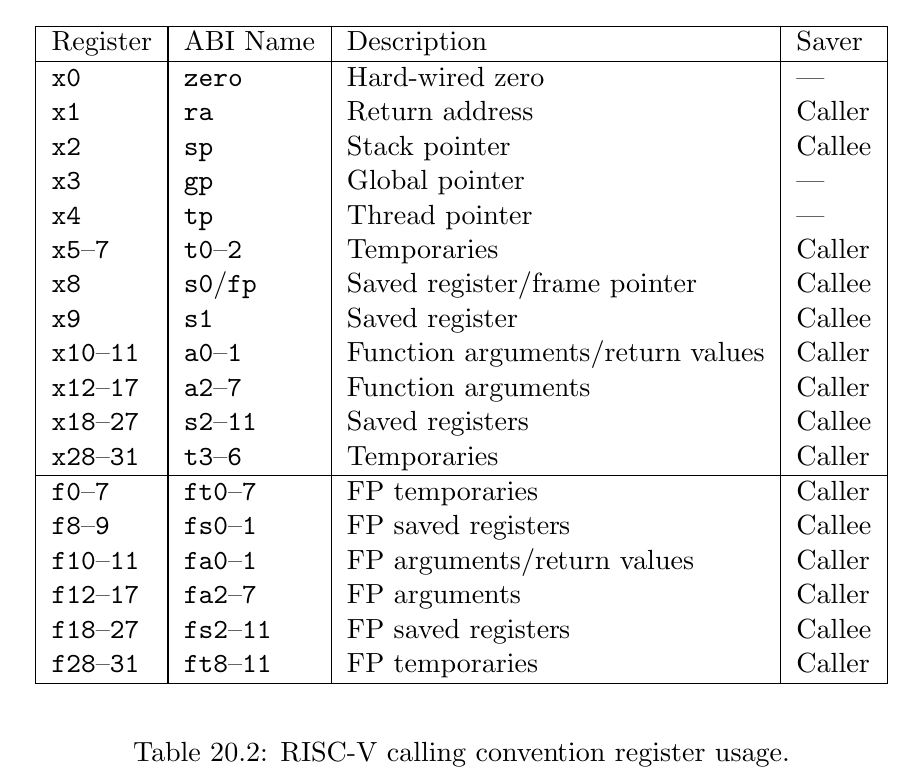
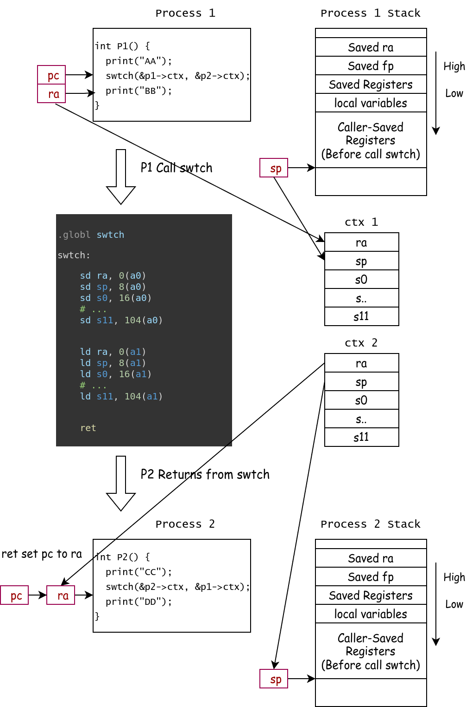
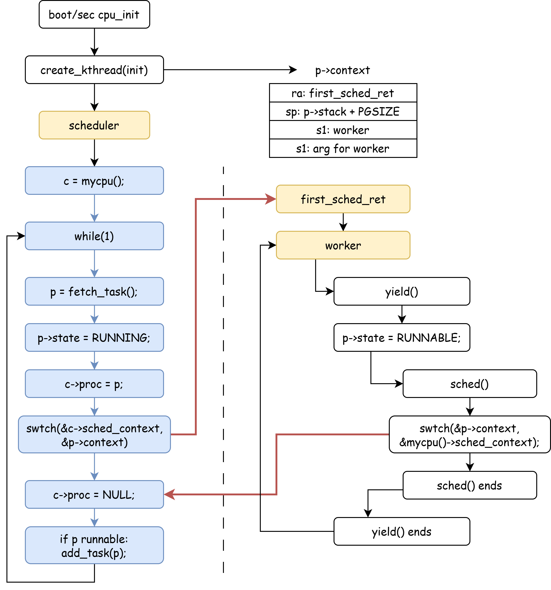
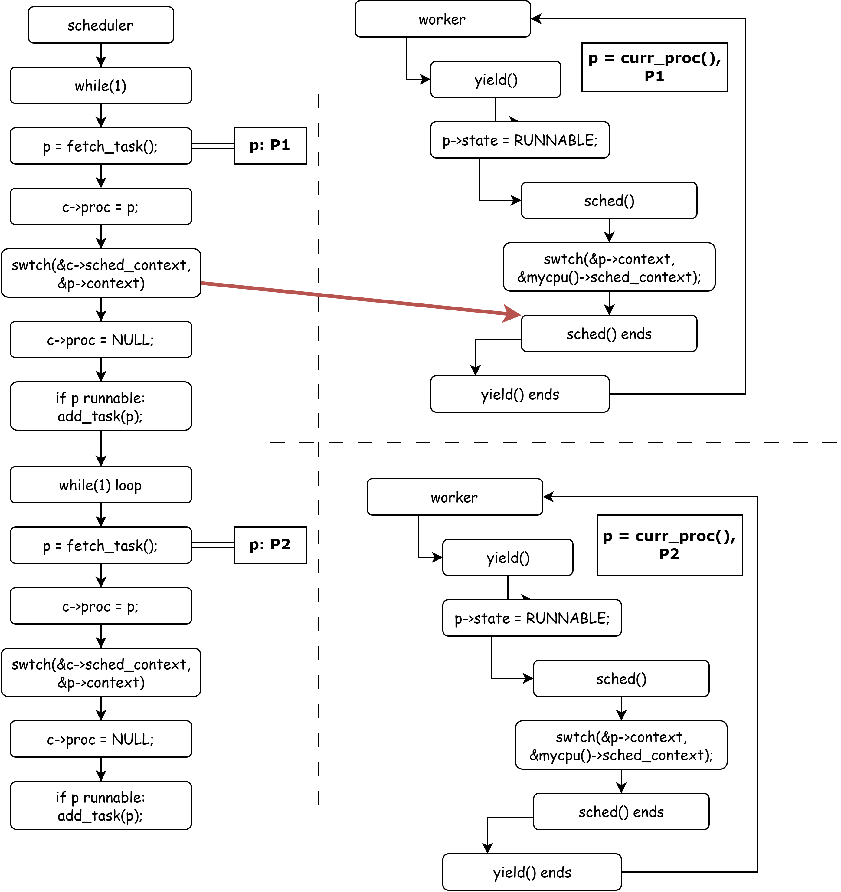
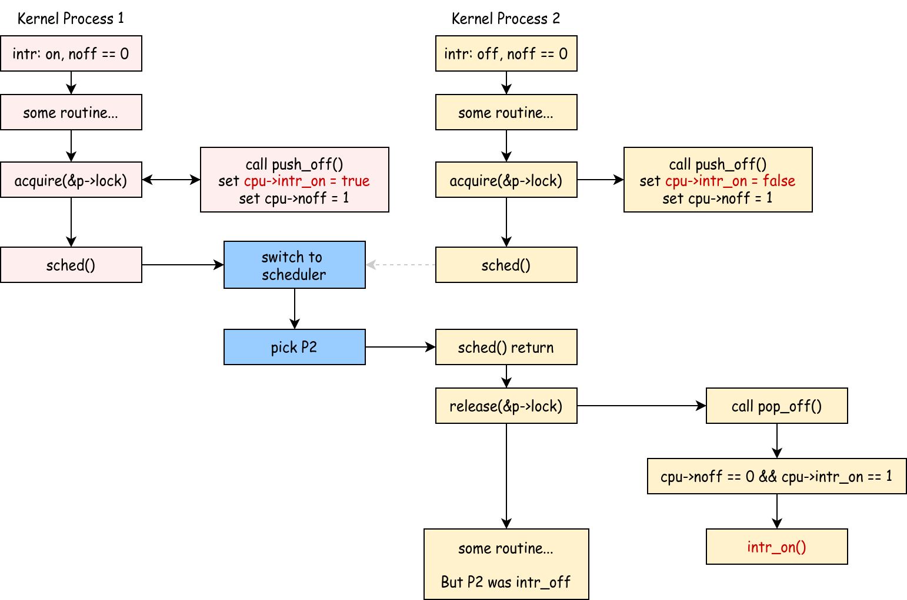

# Context Switch

## Experiment Objectives

1. Understand process management.
2. Understand context switching.
3. Master the process of multi-core process switching in xv6.

!!!warning "xv6-lab3 Code Branch"
    
    https://github.com/yuk1i/SUSTech-OS-2025/tree/xv6-lab3

    Use the command `git clone https://github.com/yuk1i/SUSTech-OS-2025 -b xv6-lab3 xv6lab3` to download the xv6-lab3 code.

    Run the kernel for this lab with `make runsmp` **using multiple cores (4)**. You should see the following output:

    ```
    Boot another cpus.
    ...
    System has 4 cpus online
    ...
    kthread: all threads exited, count 6288388
    [INFO  1,1] init: kthread: init ends!
    [PANIC 1,1] os/proc.c:225: init process exited
    [PANIC 0,-1] os/trap.c:41: other CPU has panicked
    [PANIC 2,-1] os/trap.c:41: other CPU has panicked
    [PANIC 3,-1] os/trap.c:41: other CPU has panicked
    ```


Context switching is a fundamental concept in operating systems. This chapter focuses on the technical implementation of context switching and the design of the scheduler in xv6.

## Experimental Scenario

In this experiment, we will run the xv6 operating system on a RISC-V CPU with 4 cores.

Upon system startup, we create and execute the `init` process. The `init` process spawns 8 kernel threads called `worker` and places them into the scheduling queue. Subsequently, the 4 cores take turns running these 8 `worker` threads until they exit. The parent `init` process waits for all 8 child threads to complete before terminating.

The experimental scenario revolves around the scheduling and switching of these 9 threads. Below are the execution details of `init` and `worker`. In later sections, we will step through the knowledge points and specific workflows involved in process switching.

### init()

> code: nommu_init.c

The `init` process executes the `init` function, which creates 8 kernel threads, all running the `worker` function. These 8 kernel threads increment a shared variable `count`, calling `yield` every 1000 increments.

The `init` function calls `wait` to wait for all created kernel threads to exit, then prints the final value of the shared variable `count`.

```c
#define NTHREAD 8

volatile uint64 count = 0;

void worker(uint64 id) {
    for (int i = 0; i < 1000000; i++) {
        count++;
        if (i % 1000 == 0) {
            infof("thread %d: count %d, yielding", id, count);
            yield();
        }
    }
    exit(id + 114514);
}

void init(uint64) {
    infof("kthread: init starts!");
    int pids[NTHREAD];
    for (int i = 0; i < NTHREAD; i++) {
        pids[i] = create_kthread(worker, i);
    }
    int retcode;
    for (int i = 0; i < NTHREAD; i++) {
        int pid = wait(pids[i], &retcode);
        infof("thread %d exited with code %d, expected %d", pid, retcode, i + 114514);
    }
    printf("kthread: all threads exited, count %d\n", count);
    infof("kthread: init ends!");
    exit(0);
}
```

## What is Context?

In operating systems, a **context** refers to the complete set of state information required for a program to run at a given moment. In xv6, we define each process as an independent schedulable entity, meaning every process has its own context.

Understanding context is crucial because when the operating system needs to switch between processes, it must save the current process’s context and load the context of the process to be executed next. This ensures that the process can resume execution from its previous state when it regains CPU control. The process of saving and restoring context is the core of **context switching**.

Imagine reading a book and needing to pause to do something else. You might use a bookmark to mark your place—this bookmark represents your "reading context." When you return, the bookmark tells you where to resume. Similarly, in an operating system, context serves this purpose, though the information it saves and restores is far more complex.

### Why Context Switching?

From a scheduling perspective, context switching is a key mechanism for enabling multitasking and resource multiplexing:

1. **Time-Sharing Multiplexing of CPU Resources**

    When multiple ready processes need to run, the operating system must allow them to take turns using the CPU. Even with a single CPU, time-sharing multiplexing enables processes to appear to run concurrently by executing them in turns. The scheduler decides which process to run at any given moment based on policies like Round Robin or Priority Scheduling. Context switching is required to transition to the scheduled process.

2. **Improving System Throughput**

    When a process blocks due to an I/O operation, the CPU becomes idle. Context switching allows the scheduler to switch to another ready process, enabling the CPU to perform other tasks while waiting for I/O, thus improving resource utilization and system throughput.

3. **Responsiveness for Interactive Tasks**

    Interactive programs require timely responses. Context switching allows the scheduler to pause a running batch job and quickly switch to an interactive task needing immediate attention, enhancing user experience.

### When Does Context Switching Occur?

Context switching typically occurs in the following situations:

1. **Time Slice Expiration**

    In time-slice-based round-robin scheduling, when a process exhausts its allocated time slice, a clock interrupt triggers, and the operating system forcibly performs a context switch to another ready process.

2. **Process Blocking**

    A process may initiate a system call to wait for I/O, wait for an event (e.g., a semaphore), or request a resource that isn’t immediately available. 
    
    In such cases, the process voluntarily relinquishes the CPU, and the scheduler selects another ready process to run.

3. **Voluntary Yield**

    A process calls the `yield` system call to voluntarily give up its remaining time slice, typically when it senses it has no immediate work to do.

## xv6 Process

!!!info "Process, Thread, and Kernel Thread"
    A **process** is an instance of a program, with its own independent address space, memory, file descriptors, and other resources.
     A **thread** is an execution unit within a process and the basic unit of CPU scheduling. Threads have their own stack and register state, while threads within the same process share the process’s address space and most resources. Typically, a process can contain multiple threads.

    In this course, xv6 simplifies its implementation with the following rules:

    1. Each process has exactly one thread. Thus, in xv6, a process is the basic unit of CPU scheduling.
    2. Each user process has two execution environments: a user-mode (U-mode) environment and a kernel-mode (S-mode) environment, the latter called a **kernel thread**.

    In this lab, we have not yet introduced user mode, so each process consists solely of a kernel thread. User space will be covered in labs a few weeks from now.

> Related code: `os/proc.h`, `os/sched.c`, `os/smp.c`

In xv6, the **Process Control Block (PCB)** is defined as follows:

```c
enum procstate { UNUSED, USED, SLEEPING, RUNNABLE, RUNNING, ZOMBIE };

struct proc {
    spinlock_t lock;
    // p->lock must be held when accessing these fields:
    enum procstate state;  // Process state
    int pid;               // Process ID
    uint64 exit_code;
    void *sleep_chan;
    int killed;
    struct proc *parent;    // Parent process
    uint64 __kva kstack;    // Virtual address of kernel stack
    struct context context; // swtch() here to run process

    // Userspace: User Memory Management, not covered in today's lab
    struct mm *mm;
    struct vma *vma_brk;
    struct trapframe *__kva trapframe;  // data page for trampoline.S
};
```

Each process has its own PID, process state, parent pointer, kernel stack, and kernel context.

For processes with user mode (not yet implemented in this lab’s code), the PCB includes a `struct mm` for memory management and a `trapframe` to store data when a trap occurs in user mode.

Additionally, each process has a `spinlock_t` spinlock. Although we haven’t covered locks and concurrency in theory yet, xv6 mandates that all accesses to `struct proc` members occur while holding `p->lock`.

!!!info "What is a Lock?"
    A **lock** is a basic tool for controlling concurrent access.

    We stipulate that when holding a spinlock: 1. The CPU cannot be interrupted, and 2. Other CPUs cannot hold the same lock simultaneously.

    We use the `acquire` and `release` primitives to denote locking and unlocking actions.

    If a lock cannot be acquired with `acquire`, the CPU spins in place until the lock becomes available.

### `struct cpu`

In xv6, we use `struct cpu` to describe the state of each CPU, and the `mycpu()` function retrieves the current CPU object.

```c
struct cpu {
    int mhart_id;                  // mhartid for this cpu, passed by OpenSBI
    struct proc *proc;             // current process
    struct context sched_context;  // scheduler context, swtch() here to run scheduler
    int inkernel_trap;             // whether we are in a kernel trap context
    int noff;                      // how many push-off
    int interrupt_on;              // Is the interrupt enabled before the first push-off?
    uint64 sched_kstack_top;       // top of per-CPU scheduler kernel stack
    int cpuid;                     // for debug purposes
};
```

### Process Initialization

To simplify implementation, xv6 limits the maximum number of processes to a fixed value of 512 and uses a pointer array to index all processes.

At system boot, xv6 calls `proc_init` to initialize process-related resources. This function first initializes the spinlocks required by the process module and the `proc_allocator` pool for `struct proc`. It then initializes 512 processes, each allocated a `struct proc*` PCB from `proc_allocator`, zeroed out with `memset`, and assigned a kernel stack `kstack`.

!!!info "kalloc"
    The `kalloc.c` module handles the following:

    1. Allocate and free a 4KiB page: `kallocpage`, `kfreepage`.
    2. Allocate and free fixed-size objects: `allocator_init`, `kalloc`, `kfree`.

```c
struct proc *pool[NPROC];

// Initialize the proc table at boot time.
void proc_init() {
    // We only init once.
    static int proc_inited = 0;
    assert(proc_inited == 0);
    proc_inited = 1;

    spinlock_init(&pid_lock, "pid");
    spinlock_init(&wait_lock, "wait");
    allocator_init(&proc_allocator, "proc", sizeof(struct proc), NPROC);

    struct proc *p;
    for (int i = 0; i < NPROC; i++) {
        p = kalloc(&proc_allocator);
        memset(p, 0, sizeof(*p));
        spinlock_init(&p->lock, "proc");
        p->index = i;
        p->state = UNUSED;

        p->kstack = (uint64)kallocpage();
        assert(p->kstack);

        pool[i] = p;
    }
    sched_init();
}
```

When a PCB is needed, `allocproc` searches the `pool` for an unallocated process, performs final initialization, and returns it. We’ll explain how xv6 initializes a process’s context later.

```c
// Look in the process table for an UNUSED proc.
// If found, initialize state required to run in the kernel.
// If there are no free procs, or a memory allocation fails, return 0.
struct proc *allocproc() {
    struct proc *p;
    // Find an UNUSED proc
    for (int i = 0; i < NPROC; i++) {
        p = pool[i];
        acquire(&p->lock);
        if (p->state == UNUSED) {
            goto found;
        }
        release(&p->lock);
    }
    return 0;

found:
    // Initialize a proc
    tracef("init proc %p", p);
    p->pid        = allocpid();
    p->state      = USED;
    p->killed     = 0;
    p->sleep_chan = NULL;
    p->parent     = NULL;
    p->exit_code  = 0;

    memset(&p->context, 0, sizeof(p->context));
    memset((void *)p->kstack, 0, PGSIZE);

    if (!init_proc)
        init_proc = p;

    assert(holding(&p->lock));

    return p;
}
```

## xv6 Context Switch

For a program, its visible and modifiable state consists of all its registers and memory space. In kernel space, all kernel threads share the same memory space (unlike user processes, which have distinct memory spaces). Thus, for kernel processes, we only need to save their register states. In xv6, we define a process’s **kernel context** as the following structure:

```c
// Saved registers for kernel context switches.
struct context {
    uint64 ra;
    uint64 sp;

    // Callee-saved
    uint64 s0;
    uint64 s1;
    uint64 s2;
    uint64 s3;
    uint64 s4;
    uint64 s5;
    uint64 s6;
    uint64 s7;
    uint64 s8;
    uint64 s9;
    uint64 s10;
    uint64 s11;
};
```

In the `switch.S` file, we define the "function" `swtch` with the prototype `void swtch(struct context *old, struct context *new)`.

```asm
# Context switch
#   void swtch(struct context *old, struct context *new);
# Save current registers in old. Load from new.

.globl swtch
swtch:
    sd ra, 0(a0)
    sd sp, 8(a0)
    sd s0, 16(a0)
    sd s1, 24(a0)
    sd s2, 32(a0)
    sd s3, 40(a0)
    sd s4, 48(a0)
    sd s5, 56(a0)
    sd s6, 64(a0)
    sd s7, 72(a0)
    sd s8, 80(a0)
    sd s9, 88(a0)
    sd s10, 96(a0)
    sd s11, 104(a0)

    ld ra, 0(a1)
    ld sp, 8(a1)
    ld s0, 16(a1)
    ld s1, 24(a1)
    ld s2, 32(a1)
    ld s3, 40(a1)
    ld s4, 48(a1)
    ld s5, 56(a1)
    ld s6, 64(a1)
    ld s7, 72(a1)
    ld s8, 80(a1)
    ld s9, 88(a1)
    ld s10, 96(a1)
    ld s11, 104(a1)

    ret
```

When performing a context switch, we call the `swtch` function with two `struct context*` pointers: one indicating where the current context should be saved (`old`) and another indicating where execution should resume from (`new`).

Since we’re calling `swtch` from C, the compiler adheres to the RISC-V Calling Convention, setting up the environment accordingly. For example, the return address is written to the `ra` register, and some registers are saved on the stack.

Per the RISC-V Calling Convention, registers are divided into **caller-saved** and **callee-saved**. For caller-saved registers, the caller must save them if their values need to persist across the call; the callee can modify them freely. For callee-saved registers, the caller assumes they remain unchanged, and the callee must save and restore them if used. These registers are typically saved on the stack frame (handled automatically by the compiler).

Thus, `swtch` only needs to save `sp`, `ra`, and all callee-saved registers (`s0-s11`) into the `old` structure to preserve the caller’s execution state. Conversely, restoring from `new` involves loading these registers.



The diagram below illustrates the switch from P1 to P2, where P1 and P2 each have their own stack and context structure.



When P1 executes its function, the prologue saves the caller’s return address and allocates stack space for local variables. Before calling `swtch`, the compiler saves all caller-saved registers onto the stack and generates a `jal swtch` instruction, which sets `ra` to the next instruction in P1 (commonly `pc+4`).

During the `swtch` call, `a0` points to P1’s `struct context`. The `swtch` function uses `sd` instructions to save `ra`, `sp`, and `s0-s11` into this structure.

Next, `swtch` loads P2’s context from `a1` using `ld` instructions, restoring `ra`, `sp`, and `s0-s11` from P2’s `struct context`.

When the CPU executes `ret`, the program counter (`pc`) is set to the value of `ra`, resuming execution at the address saved from P2’s last `swtch` call.

This completes the switch from P1 to P2. (Note: P1 and P2 here represent arbitrary programs, not necessarily OS processes.)

Additionally, `swtch` operates in pairs: if a process exits via `swtch`, its next return must result from another process calling `swtch` to switch back.

### Lab Exercise 1

Understand the `swtch` function at the assembly level.

Assume you have two `struct context` structures, `ctx_a` and `ctx_b`:

```c
struct context ctx_a = {
    .ra = 0x0,
    .sp = 0x0,
};
struct context ctx_b = {
    .ra = 0x802dead0,
    .sp = 0x7fffB000,
};
```

Suppose you are executing `swtch(&ctx_a, &ctx_b)`. The corresponding assembly code and surrounding instructions are as follows:

```asm
// a0: address of ctx_a, a1: address of ctx_b
    80205720:	05848593          	addi	a1,s1,88
    80205724:	00002097          	auipc	ra,0x2
    80205728:	1b4080e7          	jalr	436(ra) # 802078d8 <swtch>
    8020572c:	008ab503          	ld	a0,8(s5)
    80205730:	24951263          	bne	a0,s1,80205974 <scheduler+0x304>
```

The `swtch` function is located at address `802078d8`, with the following assembly:

```asm
swtch:
    802078d8:	00153023          	sd	ra,0(a0)
    802078dc:	00253423          	sd	sp,8(a0)
    // store s0 - s11, ignored.

    80207910:	0005b083          	ld	ra,0(a1)
    80207914:	0085b103          	ld	sp,8(a1)
    // restore s0 - s11, ignored.

    80207948:	00008067          	ret
```

At this point, the PC register points to `0x80205728`. Fill in the table below with the register or memory state changes for each subsequent instruction.

## xv6 Scheduler

In xv6, each CPU has its own scheduler. The `scheduler` function never returns; it runs in an infinite `while(1)` loop. Each iteration attempts to fetch a task from the queue and, if successful, switches to that process using `swtch`.

If no task is available, it checks if all processes have exited. If so, the system should terminate; if not, some processes may be sleeping (waiting for resources) or running on other CPUs. In this case, the `wfi` (Wait For Interrupt) instruction is used to idle the CPU until the next clock interrupt, equivalent to a `while(1);` spin loop.

If a process is successfully fetched, it is locked with `acquire(&p->lock)`, its state is set to `RUNNING`, and the current CPU’s running process is updated (`c->proc = p`).

!!!info "mycpu and curr_proc"
    In a single-processor system, only one process runs on the CPU at a time, and we define a global `struct proc* curr_proc` to represent the current process. In a multi-processor system, each CPU has its own `curr_proc`, tracked via the `struct cpu` structure. A global array `struct cpu cpus[4]` represents the 4 CPUs, and the `tp` register indicates the current CPU ID via `cpuid()`, which directly reads and returns `tp`.

Next, the `swtch` function jumps to the saved context of the process, storing the current context in `cpu->sched_context`.

For the scheduler, we enforce the following rules:

1. Process switching must go through the scheduler; Process A switches to the scheduler, then to Process B, never directly from A to B.
2. When switching to a process `p`, the CPU holds `p->lock` before leaving the scheduler, implying interrupts are disabled.
3. When switching back from process `p` to the scheduler, the CPU holds `p->lock`.

```c
// Scheduler never returns.  It loops, doing:
//  - choose a process to run.
//  - swtch to start running that process.
//  - eventually that process transfers control
//    via swtch back to the scheduler.
void scheduler() {
    struct proc *p;
    struct cpu *c = mycpu();

    // We only get here once.
    // After each cpu boots, it calls scheduler().
    // If this scheduler finds any possible process to run, it will switch to it.
    // 	And the scheduler context is saved on "mycpu()->sched_context"

    for (;;) {
        // intr may be on here.

        p = fetch_task();
        if (p == NULL) {
            // if we cannot find a process in the task_queue
            //  maybe some processes are SLEEPING and some are RUNNABLE
            if (all_dead()) {
                panic("[cpu %d] scheduler dead.", c->cpuid);
            } else {
                // nothing to run; stop running on this core until an interrupt.
                intr_on();
                asm volatile("wfi");
                intr_off();
                continue;
            }
        }

        acquire(&p->lock);
        assert(p->state == RUNNABLE);
        infof("switch to proc %d(%d)", p->index, p->pid);
        p->state = RUNNING;
        c->proc  = p;
        swtch(&c->sched_context, &p->context);

        // When we get back here, someone must have called swtch(..., &c->sched_context);
        assert(c->proc == p);
        assert(!intr_get());        // scheduler should never have intr_on()
        assert(holding(&p->lock));  // whoever switch to us must acquire p->lock
        c->proc = NULL;

        if (p->state == RUNNABLE) {
            add_task(p);
        }
        release(&p->lock);
    }
}
```

When returning from `swtch(&c->sched_context, &p->context)`, we can deduce:

1. Since `swtch` operates in pairs, our last exit via `swtch` means someone called `swtch(..., &c->sched_context)` to return here.
2. This is a per-CPU scheduler, and we handed control to process `p` upon leaving, so the return must come from `p` switching back.

Thus, we include three assertions to ensure the scheduler operates correctly:

1. Interrupts must be off when `swtch` returns.
2. We must hold `p->lock`.
3. The current CPU’s running process must be `p`.

Finally, we clear `c->proc`. If `p` remains `RUNNABLE`, it is requeued. After releasing `p->lock`, the scheduler proceeds to the next iteration.

### sched Function

The `sched` function relinquishes CPU control from the current kernel process back to the scheduler.

```c
// Switch to scheduler.  Must hold only p->lock
// and have changed proc->state. Saves and restores
// interrupt_on because interrupt_on is a property of this
// kernel thread, not this CPU. It should
// be proc->interrupt_on and proc->noff, but that would
// break in the few places where a lock is held but
// there's no process.
void sched() {
    int interrupt_on;
    struct proc *p = curr_proc();

    if (!holding(&p->lock))
        panic("not holding p->lock");
    if (mycpu()->noff != 1)
        panic("holding another locks");
    if (p->state == RUNNING)
        panic("sched running process");
    if (mycpu()->inkernel_trap)
        panic("sched should never be called in kernel trap context.");
    assert(!intr_get());

    interrupt_on = mycpu()->interrupt_on;

    infof("switch to scheduler %d(%d)", p->index, p->pid);
    swtch(&p->context, &mycpu()->sched_context);
    infof("switch back from scheduler %d(%d)", p->index, p->pid);

    mycpu()->interrupt_on = interrupt_on;

    // if scheduler returns here: p->lock must be holding.
    if (!holding(&p->lock))
        panic("not holding p->lock after sched.swtch returns");
}
```

We mandate the following conditions for `sched`:

1. The CPU must hold `curr_proc()->lock` since we’re manipulating the `struct proc`.
2. No other locks are held besides `curr_proc()->lock` to prevent kernel deadlocks.

    This is enforced by checking `mycpu()->noff`, which increments with each `acquire` and decrements with each `release`.

3. `p->state` must have been changed to a non-`RUNNING` state.
4. `sched` must not be called from a kernel trap context.

If these checks pass, `swtch` saves the current process state to `p->context` and jumps to the scheduler’s context (`&mycpu()->sched_context`).

Similarly, if the scheduler switches back, it must hold `p->lock` when relinquishing CPU control.

## The First Process - init

So far, we’ve covered the Process Control Block (`struct proc`), the principles of context switching, and the scheduler’s design in xv6. Now, we’ll explore how the first process (a kernel thread) is launched in xv6.

In `main.c`, the `bootcpu_init` function creates the first kernel thread `init` with `create_kthread(init, 0x1919810);`, indicating that the first process will execute the `init()` function with a parameter.

`create_kthread` allocates a PCB via `allocproc()`, initializes its `struct context` (the execution environment for its first scheduling), marks it as runnable, and adds it to the scheduler’s queue.

```c
int create_kthread(void (*fn)(uint64), uint64 arg) {
    struct proc *p = allocproc();
    if (!p)
        return -1;

    // Initialize process state
    p->context.ra = (uint64)first_sched_ret;
    p->context.sp = p->kstack + PGSIZE;
    p->context.s1 = (uint64)fn;
    p->context.s2 = arg;

    p->state = RUNNABLE;
    p->parent = init_proc;

    int pid = p->pid;
    add_task(p);
    release(&p->lock);

    return pid;
}
```

### First Scheduling

When the `init` kernel thread is first scheduled, the scheduler retrieves it from the task queue and executes `swtch(&c->sched_context, &p->context)` (where `p` is `init`). After `swtch` executes `ret`, the CPU switches to `init`’s kernel stack (`p->kstack + PGSIZE`) and runs `first_sched_ret`. This function reads the target function and argument from the `s1` and `s2` registers, releases `p->lock` per scheduler rules, enables interrupts, and jumps to the specified function.

```c
static void first_sched_ret(void) {
    // s0: frame pointer, s1: fn, s2: uint64 arg
    void (*fn)(uint64);
    uint64 arg;
    asm volatile("mv %0, s1":"=r"(fn));
    asm volatile("mv %0, s2":"=r"(arg));
    
    release(&curr_proc()->lock);
    intr_on();
    fn(arg);
    panic("first_sched_ret should never return. You should use exit to terminate kthread");
}
```

### Execution Flowchart for First Scheduling



### Lab Exercise 2



Draw a flowchart for switching between two processes, modeled after the diagram above. Assume P1 and P2 have been scheduled at least once, having exited the `first_sched_ret` phase, with their context’s `ra` pointing to the line after `swtch` in the `sched` function.

The flow begins at the top-left corner, where the scheduler fetches P1 from `fetch_task` and uses `swtch` to switch to the address saved in P1’s context—specifically, the line after `swtch` in P1’s `sched()` call (`sched() ends`), where P1 last switched back to the scheduler.

The first arrow is provided. Draw the remaining arrows based on the following steps, indicating only where each `swtch` transfers control:

1. After switching from the scheduler to P1, P1 enters its next work loop, then calls `yield`, `sched`, and reaches the `swtch` at the top-right. Indicate where this `swtch` transfers control.
2. Control returns to the scheduler, which enters its next loop, fetches P2 from `fetch_task()`, and reaches the `swtch` at the bottom-left. Indicate where this `swtch` transfers control.
3. After switching from the scheduler to P2, P2 enters its next work loop, then calls `yield`, `sched`, and reaches the `swtch` at the bottom-right. Indicate where this `swtch` transfers control.

### worker

After the first scheduling, `init` creates 8 `worker` kernel threads and adds them to the ready queue. Idle CPU cores looping in the scheduler can then fetch and execute a `worker`. Meanwhile, `init` enters a waiting state via `wait()`, freeing a CPU core. From then on, 4 CPU cores execute the 8 `worker` threads.

These 8 `worker` threads increment the shared variable `count`, calling `yield` every 1000 increments. A `worker` calling `yield` relinquishes its CPU core, which then schedules the next ready process. A related assignment will later deepen our understanding of this process.

## Reading

### Disabling Interrupts

In kernel code, we sometimes want execution to proceed without interruption or preemption by other tasks. This can be achieved by disabling interrupts (though exceptions still jump to the trap handler).

We use `push_off()` and `pop_off()` as a pair to disable and enable interrupts. Since `push_off` calls may be nested, we treat disabling interrupts as a stack-like operation, restoring interrupts only when the stack is empty. Two variables are tracked in `struct cpu`:

1. `noff`: The current depth of `push_off`/`pop_off`.

    For example, after `push_off()`, `push_off()`, `pop_off()`, `noff` should be 1.

2. `interrupt_on`: Whether interrupts were enabled when `noff == 0`, i.e., before the first `push_off`.

```c
void push_off(void) {
    uint64 ra = r_ra();

    int old = intr_get();
    intr_off();

    if (mycpu()->noff == 0) {
        // warnf("intr on saved: %p", ra);
        mycpu()->interrupt_on = old;
    }
    mycpu()->noff += 1;
}

void pop_off(void) {
    uint64 ra = r_ra();

    struct cpu *c = mycpu();
    if (intr_get())
        panic("pop_off - interruptible");
    if (c->noff < 1)
        panic("pop_off - unpair");
    c->noff -= 1;
    if (c->noff == 0 && c->interrupt_on) {
        if (c->inkernel_trap)
            panic("pop_off->intr_on happens in kernel trap");
        // We only open the interrupt if:
        //    1. the push-pop stack is cleared, and
        //    2. the interrupt was on before the first push-off
        intr_on();
    }
}
```


### Why Save `cpu->interrupt_on`?

This attribute pertains to the current kernel thread, not the CPU itself. Since `push_off`/`pop_off` may be used without a process context, we store `interrupt_on` in `struct cpu` rather than `struct proc`. During `sched`-based kernel thread switches, this attribute is preserved on the kernel thread’s stack.

We don’t need to save `noff` because we enforce it to be 1.

If we omit saving `interrupt_on`, the diagram below shows how Kernel Process 1’s (red) interrupt state erroneously affects Kernel Process 2 (yellow) via `sched` and the scheduler (blue):

Kernel Process 2 runs with interrupts off, then calls `sched` and pauses (dashed line). Kernel Process 1 begins with interrupts on (solid line). When P1 calls `sched` to switch to the scheduler, `acquire->push_off` saves the interrupt state to `cpu->interrupt_on`. The scheduler then resumes P2, which calls `release->pop_off`, incorrectly restoring interrupts to on. For P2, this violates the context switching rule that the execution context remains unchanged, as it resumes with interrupts on despite having them off before the switch.


