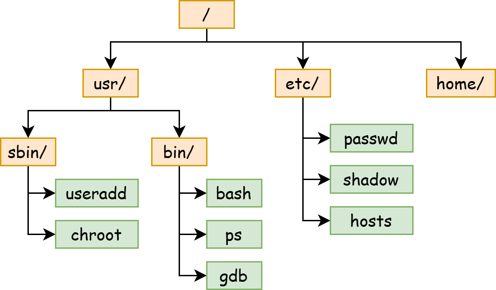
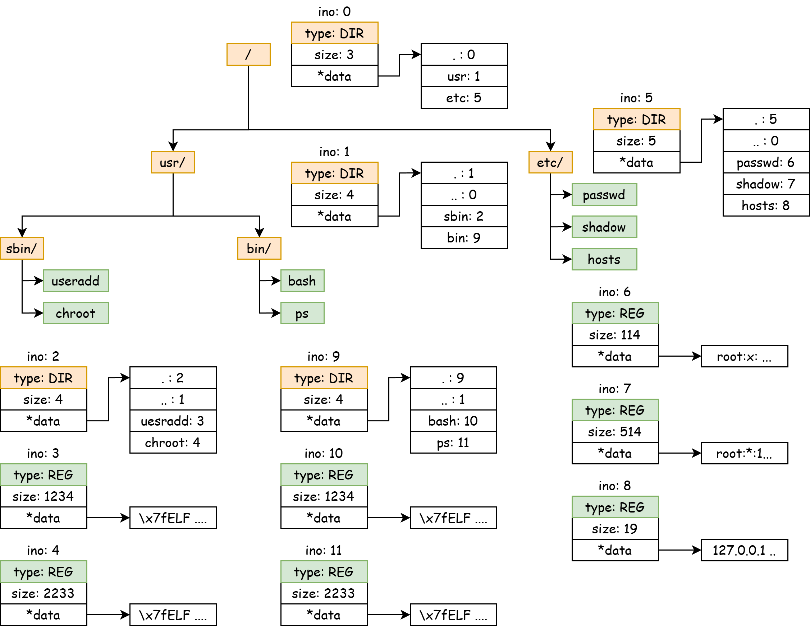

# File System 1

## Experiment Objectives

1.  Understand the two I/O access methods: Explicit I/O instructions and Memory-mapped I/O.
2.  Master the difference between Character Devices and Block Devices.
3.  Understand the design principles of a file system.

## I/O

What is an I/O device? **An I/O device is a collection of registers**. I/O devices exchange data with the CPU through registers and then complete tasks according to the requirements in the registers.

How does the CPU access I/O device registers? Through I/O instructions or Memory-Mapped Registers.

!!!success "Recall Computer Organization"
    We can first recall that in the Computer Organization course project, we used RISC-V instructions to light up an LED on an FPGA board.

    The "LED on the FPGA board" is connected to the LED light on the circuit board through the pins of the FPGA chip. When programming the FPGA, we need to use `reg led[0:7]` to create some registers and use them to drive the FPGA chip's pins.

    And how does our CPU access these registers? The computer organization course might teach two methods: creating a new instruction specifically for operating the LED lights; or mapping these LED registers to the Address Space and accessing them through normal memory access instructions.

### Character Device

A Character Device refers to an I/O device that accesses data byte by byte.

On the QEMU platform and VisionFive2, the serial port is a type of Character Device, and the device model it uses is uart8250. Its MMIO interface exposes 8 registers. For specific details, see: [https://www.lammertbies.nl/comm/info/serial-uart](https://www.lammertbies.nl/comm/info/serial-uart)

uart8250 has one read port and one write port, which are `RHR` and `THR` respectively, both being 8-bit registers. In the `LSR` register, there are bits indicating that the read port has data (Bit 0, Data available) and that the write port is idle (Bit 5, THR is empty).

We access the device's registers through Memory-mapped addresses:

```c
#define Reg(reg) ((volatile unsigned char *)(KERNEL_UART0_BASE + (reg)))

static void set_reg(uint32 reg, uint32 val) {
    writeb(val, Reg(reg));
}

static uint32 read_reg(uint32 reg) {
    return readb(Reg(reg));
}
```

For writing, we use **Polling**. As long as `LSR.THR` indicates that `THR` is idle, we write a character to `THR`.

```c
static void uart_putchar(int ch) {
    while ((read_reg(LSR) & LSR_TX_IDLE) == 0);

    set_reg(THR, ch);
}
```

For reading, we use **Interrupts**. Whenever the I/O device finishes filling `RHR`, it issues an interrupt. This interrupt will be processed by the PLIC and dispatched to a core. We read the byte in the interrupt handler function.

```c
void uart_intr() {
    while (1) {
        int c = uartgetc();
        if (c == -1)
            break;
        // infof("uart: %c", c);
        consintr(c);
    }
}
```

### Block Device

Corresponding to Character Devices that access data byte by byte, block devices access data in units of blocks. The block size is generally a power of 2, such as 512B or 4KiB. We call such devices Block Devices.
The hard drives we use, including solid-state drives and mechanical hard drives, are all block devices.

Each block has a unique number, called Logical Block Addressing (LBA). The first block is LBA 0, the second block is LBA 1, and so on.

On QEMU, block devices are generally provided by VirtIO Block-Device.

VirtIO is a very commonly used device model on virtualization platforms. It also defines a set of register interfaces and is accessed through Memory-mapped registers.

!!!info "virtio"
    VirtIO code is located in `fs/virtio.c`. You can refer to the VirtIO manual for specific details.

    https://docs.oasis-open.org/virtio/virtio/v1.3/csd01/virtio-v1.3-csd01.pdf

## File System

### What does a file system look like?

**A file system is a tree-like structure**. Each node (collectively called a **file**) is either a directory or a regular file. The root of the tree is called the **root directory**. The pathname of a file is the concatenation of all file names on the path from the root directory to that file.



Each file has a globally unique ID, which we call an inode number (ino). Each file contains some metadata, such as size, access date, permissions, etc.

Each file also contains some content: for a regular file, it is a sequence of bytes (byte array); for a directory, it is the directory's content, which includes the file name and inode number of each sub-file.

```c
struct file_content {
    union {
        char content[];
        struct {
            long ino;
            char name[32];
        } dirs[];
    };
}
```

If we use the familiar Java language to represent the relationships between objects in a file system:

```java
abstract class File {
    public long ino;
    public long size;
    // ...

    protected abstract byte[] getRawContent();
}

class RegularFile extends File {
    public byte[] getRegFileContent();
}

class Directory extends File {
    public Map<String, Long> getDirectoryContent();
}
```

### What can users do to the file system? -- File System API

The operating system needs to provide some essential file system APIs to user mode, including basic operations for querying and modifying the file system "tree".

Taking the Linux system as an example, there are the following APIs:

For the directory structure, we can use `creat` to create a file, `mkdir` to create a directory, `unlink` to delete a file, and `rmdir` to delete a directory.

```c
int creat(const char *pathname, mode_t mode);
int mkdir(const char *pathname, mode_t mode);
int unlink(const char *pathname);
int rmdir(const char *pathname);
```

We can use `read` and `write` to read and write the content of a regular file, and their return values include the number of bytes successfully read or written. To delete the content of a file, we can use `truncate` to set the file size to `length`.

```c
ssize_t read(int fd, void buf[.count], size_t count);
ssize_t write(int fd, const void buf[.count], size_t count);
int ftruncate(int fd, off_t length);
```

Note: In some APIs, we use an `int fd` to represent an **opened file object**. We use the `open` syscall to open a file located at `pathname` and return an integer file descriptor.

```c
int open(const char *pathname, int flags);
```

To list a directory, we can use `getdents64`. By passing an `fd` representing a directory, the kernel will fill the user's buffer with multiple `struct linux_dirent64` structures, which include the file name, inode number, and type.

```c
ssize_t getdents64(int fd, void dirp[.count], size_t count);

struct linux_dirent64 {
    ino64_t        d_ino;    /* 64-bit inode number */
    off64_t        d_off;    /* Not an offset; see getdents() */
    unsigned short d_reclen; /* Size of this dirent */
    unsigned char  d_type;   /* File type */
    char           d_name[]; /* Filename (null-terminated) */
};
```

### How to design an In-Memory File System?

If we want to build a file system in xv6's memory, we can use pointers or array indices learned in data structures courses to build a tree.

In the file system "tree", we call each node an `inode`, and use "index", i.e., `inode number`, to represent a pointer to an `inode`.

Each `inode` has a globally unique ID: `inode number` (`ino`), but we may not include it in its own structure `struct inode`, because we always find child inodes through parent inodes.

```c
struct inode {
    long size;
    enum { Regular, Directory } type;

    void* data;
};
```

In `struct inode`, it contains the file's type, size, and a data pointer. We stipulate that:

1.  For a regular file of type Regular, the `*data` pointer points to a `char[]` array, whose length is `size`.

2.  For a path of type Directory, the `*data` pointer points to a `struct dirent[]` array, which has `size` `struct dirent` elements, with a total size of `sizeof(struct dirent) * size`.

```c
struct dirent {
    long ino;
    char name[32];
};
```

Each `struct dirent` represents a file under this directory, which can be a regular file or a directory.

For a directory, its list of sub-files contains two special `struct dirent` entries: `.` and `..`. The former represents a directory pointing to itself, and the latter represents a directory pointing to its parent directory.



### How to implement querying and modifying the file system?

First, let's consider reading and modifying the content of Regular files. In the simple model above, the file's content is directly stored in a `char*` array. Reading and writing can be done directly using `memcpy`. Writing needs to consider an additional case: the written content may exceed the size of this array (i.e., the `size` in `struct inode`), in which case the array needs to be **expanded**.

Then, for the file's directory structure:

1.  Locating a file (regular file and directory) (`open`) is done through `pathname` (e.g., `/etc/passwd`, `/usr/bin/bash`). We can start from the root directory and search level by level, eventually finding the `struct inode` of the last file.

    For `/usr/bin/bash`, we first start from the root directory (ino 0), find the ino 1 of its next level `usr` directory in its `struct dirent[]`, then find the ino 9 of `bin` in ino 1's `struct dirent[]`, and finally find the ino 10 of `bash` in ino 9's `struct dirent[]`.

2.  Creating regular files and directories means adding a node to the tree: first **allocate a globally unique inode number**, create a `struct inode` structure, and add its file name and ino to the `struct dirent[]` of its parent directory.

    Suppose we want to create the `/etc/passwd0` file:

    1.  First, allocate an inode number 12, then create a `struct inode`.

    2.  Find the ino 5 of the `/etc/` directory, and add `passwd0: 12` to its `dirent[]`.

### How to save the in-memory file system to disk?

When we try to save the above tree (i.e., the file system) to disk (i.e., Persistence), we must first understand the characteristics and limitations of storing data structures on a disk (block device).

Memory is a Random Access model, and has a Memory Hierarchy to provide caching acceleration. Disks, however, are optimized for Sequential Access, and their Random Access performance is low.

1.  The read/write unit of a block device is the block size (512B or 4KiB), and **block devices only accept read/write operations in units of blocks**. Any read/write operation that is not on an entire block will have to be padded and aligned to the block size. Therefore, we usually align data structures to the block size to avoid needing to read across blocks when reading a data structure.

2.  It is difficult to guarantee that **free space** on a block device is contiguous, meaning it's not possible to freely **expand**.

    Suppose there are two consecutive blocks, the former allocated to `/etc/passwd`, and the latter to `/etc/passwd0`. When we want to expand the content of `/etc/passwd`, the next consecutive block is allocated to another file. We cannot expand the former block like we use `malloc` and `realloc` to automatically expand memory space.

    Therefore, we usually use a linked list to link all data blocks of a file, meaning there is an `int next[]` array. When we want to expand the data of a regular file, we expand all its data blocks and use the `next` pointer to link them.

    There are two ways to save this `next[]` array:

    1.  Divide the 512B data block into two parts, the first 4B for storing the `next` pointer, and the remaining 508B for storing the actual data.

    2.  Store the `next[]` array separately in a dedicated data block, with each data block being exactly 512B.

    

    Modern file systems all use the second method. The first method has some problems:
    
    1.  The size of each block is no longer a power of 2. If we want to read the 114514th byte of a file, we need to calculate 114514 / 508 = 225 remainder 214, so this byte is located at the 214th byte of the 225th block. Using powers of 2 can avoid division and use bit operations directly.

    2.  Low random access performance. When we need to locate the 225th block of a file, we have to go through 225 `next` pointers to find this block. If each `next` pointer is located at the head of each block, then to read 225 `next` pointers, we need to read 225 blocks. But if we pack all `next` pointers into the same block as much as possible, we only need to read 2 512B blocks.

    The second method utilizes the Locality of reference. When we read a certain block, we are likely to also read its neighboring blocks, which makes caching the `next[]` array efficient.

3.  How to allocate a free object?

    We mentioned **allocating a free object** in two places: first, allocating an inode number, and second, allocating a data block.

    If you are familiar with memory allocators, you might know that they are composed of a `freelist`, which contains a linked list of all free blocks. However, the block sizes in the `freelist` of a memory allocator may not be equal.

    

    The allocator on a block device, for allocating blocks and `struct inode`s, has the following excellent properties: **naturally equal-sized**, **finite in number**, can be located by a unique number, and the numbering is linear.

    So, we can use another more space-efficient method to represent **whether an object at a certain position has been allocated**: Bitmap.

    The core idea of a Bitmap is to use **each bit to represent whether each object is allocated**. A 512B block has 512 \* 8 = 4096 bits, so it can represent whether 4096 blocks are allocated. Specifically, we use each Byte to represent the status of 8 blocks, where the Least Significant Bit represents the status of the 0th block among these 8 blocks, and so on.


**Summary**

We have outlined how to gracefully save a tree-like data structure, our file system, on a block device.

We have two important types of objects: data blocks and `struct inode`s. They both have a globally unique linear number (`block number`, `inode number`), and we use a bitmap to allocate them.

For `data blocks`, we can use a separate `data block` as the `next[]` pointer to link all blocks together.

For `struct inode`s, we use a `children[]` list in the parent node to store pointers to child nodes.

We will learn about some real file system implementations in the next lesson.

## File Descriptor

When we discuss files in an operating system, we might be referring to two different things, both called files.

1.  When discussing files stored on the file system, **a file is a sequence of bytes**.

    Whether it's a binary file (like an ELF format executable) or a Markdown format text file, they are essentially a sequence of bytes, just interpreted differently.

    Memory space is also a sequence of bytes, so, can a part of a file be mapped into memory space? This is what the `mmap(2)` system call does.

2.  When discussing interactions between the kernel and user mode in an operating system, **a file is an object in the kernel that can interact with user programs**.

    When we use the `open(2)` system call to open a file path, the kernel returns an `int` value, which is the file descriptor.

    We can use system calls like `read(2)`, `write(2)`, `fcntl(2)`, etc., to perform read, write, and other operations on this file. Their prototypes all include an `fd` parameter.

    ```c
    ssize_t read(int fd, void buf[.count], size_t count);
    ssize_t write(int fd, const void buf[.count], size_t count);
    int fcntl(int fd, int op, ... /* arg */ );
    off_t lseek(int fd, off_t offset, int whence);
    ```

    The Unix philosophy is "Everything is a file." Of course, the kernel can create a file descriptor that does not represent a "file on the file system."

    For example, we can create an fd to receive signals\! (Just like the signal in our project)

    ```c
    int signalfd(int fd, const sigset_t *mask, int flags);
    // signalfd() creates a file descriptor that can be used to accept signals targeted at the caller.
    // This provides an alternative to the use of a signal handler or sigwaitinfo(2), and has the advantage that the
    //   file descriptor may be monitored by select(2), poll(2), and epoll(7).
    ```

    Our console's file descriptors 0 (stdin), 1 (stdout), and 2 (stderr) are also not files stored in the file system on disk.

    When xv6 starts the first process, it creates two files, stdin and stdout, and binds (installs) them to file descriptors 0 and 1 of the first process, respectively.

    When the first process (init) creates the second process `sh` through fork and exec, `sh` inherits these two files from `init` and still indexes them through file descriptors 0 and 1.

In summary, **a file descriptor is an identifier used by user programs to operate on kernel objects**. After the kernel creates an object (which may not be a "file stored on disk"), the kernel binds it to an integer in the File Descriptor Table (fdt). Users can operate on this file through system calls, specifying which file to operate on using the file descriptor.