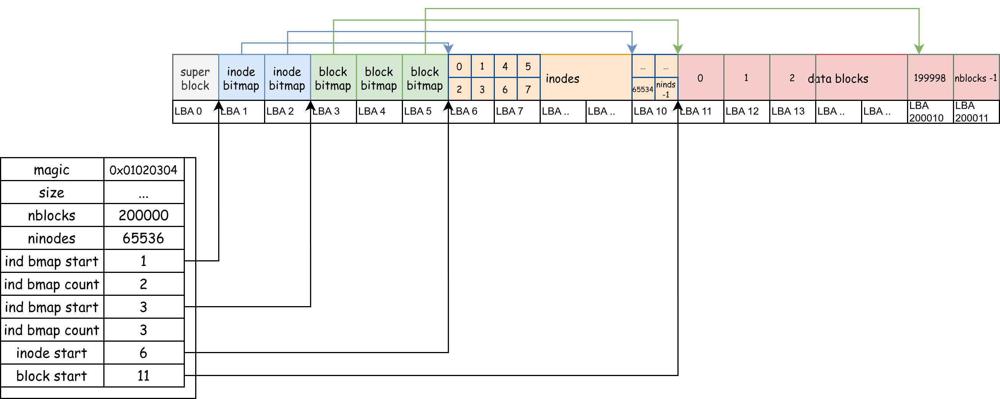

# File System 2

!!!warning "xv6-lab14 Code Branch"

    https://github.com/yuk1i/SUSTechOS/tree/fs

    Use the command `git clone https://github.com/yuk1i/SUSTechOS/ -b fs xv6-labfs` to download the xv6-labfs code.

    Use `make run` to run the kernel for this Lab. It will start a self-test of the file system, the source code of which is located in `fs/fstest.c`.

    The initial file system is built by `scripts/mkfs.c`, which is a program that runs on the host machine. The Makefile will first call it to create `fs.img`, and then start QEMU.


## Virtual File System

VFS (Virtual File System) is a key abstraction layer in the operating system kernel, mainly used to shield the differences between different file systems (such as FAT32, ext4, etc.) and provide a unified file operation interface for user-space programs.
In the last lesson, we discussed "What can users do with the file system?", which are the APIs exposed by the file system, including `open`, `creat`, `mkdir`, `unlink`, `rmdir`, etc.

To achieve abstraction for different file system implementations, we should define standard interfaces like the ones above, and have the file system implementers implement these interfaces.
This idea is what we learned in Java and Object-Oriented Programming courses about using abstract classes to separate the definition and implementation of objects.

To implement such object-orientation in C, we need to manually define a Virtual Table (vtable).

```c
// os/fs/fs.h
// struct file is an "object" in the kernel, which can be operated with "ops".
struct file {
    // freflock proctects the ref.
    int ref;          // reference count

    sleeplock_t lock;   // lock protects pos.
    loff_t pos;         // read/write position

    // --- following fields are immutable since filealloc ---
    fmode_t mode;   // file mode
    struct file_operations *ops;
    void *private;
};
```

We first define an object `struct file`. Its operations are stored in a `struct file_operations` pointer. This structure stores **function pointers**:

```c
/**
 * @brief read & write is for regular files. iterate is for directories.
 */
struct file_operations {
    int (*read)(struct file *file, void *__either buf, loff_t len);
    int (*write)(struct file *file, void *__either buf, loff_t len);
    int (*iterate)(struct file *file, void *__either buf, loff_t len);
    int (*close)(struct file *file);
};
```

When we 'new' a `struct file`, we need to make its `ops` point to a predefined structure. When we call `read` or `write` on this file, we are actually calling `pfile->ops->read(pfile, buf, len)`.

For file metadata, we store it in a `struct inode`. We can create and delete files or directories; these are operations on an `struct inode`. So we need to define a `struct inode_operations` structure to store pointers to the functions that handle these operations:

```c
// struct inode is a metadata of a file.
struct inode {
    struct superblock *sb;
    uint32 ino;   // inode number
    imode_t imode;
    struct file_operations *fops;
    struct inode_operations *iops;
    void *private;    // private data for filesystem implementation

    // --- above fields are immutable since allocation `iget` ---

    // sb->lock protects the next pointer and refcnt.
    int ref;            // reference count
    struct inode *next;   // for linked list in itable

    sleeplock_t lock;
    // sleeplock protects following fields
    loff_t size;    // file size
    uint16 nlinks;
};

struct inode_operations {
    int (*lookup)(struct inode *dir, struct dentry *dentry);
    int (*create)(struct inode *dir, struct dentry *dentry);
    int (*unlink)(struct inode *dir, struct dentry *dentry);
    int (*mkdir)(struct inode *dir, struct dentry *dentry);
    int (*rmdir)(struct inode *dir, struct dentry *dentry);
};
```

In our file system implementation (called SimpleFS, sfs), we define operations for `inode`, operations for regular files (REG), and operations for directories (DIR).

```c
int sfs_lookup(struct inode* parent, struct dentry* dentry);
int sfs_create(struct inode* parent, struct dentry* dentry);
int sfs_unlink(struct inode* parent, struct dentry* dentry);
int sfs_mkdir(struct inode* parent, struct dentry* dentry);
int sfs_rmdir(struct inode* parent, struct dentry* dentry);

static struct inode_operations sfs_inode_ops = {
    .lookup = sfs_lookup,
    .create = sfs_create,
    .unlink = sfs_unlink,
    .mkdir  = sfs_mkdir,
    .rmdir  = sfs_rmdir,
};

int sfs_read(struct file* file, void* __either buf, loff_t len);
int sfs_write(struct file* file, void* __either buf, loff_t len);

static struct file_operations sfs_regfile_ops = {
    .close = generic_file_close,
    .read = sfs_read,
    .write = sfs_write,
};

int sfs_iterate(struct file* file, void* __either buf, loff_t len);
static struct file_operations sfs_dirfile_ops = {
    .iterate = sfs_iterate,
};
```

When creating an `inode` belonging to SFS, we need to populate the `iops` structure within it.

```c
struct inode* sfs_iget(struct superblock* sb, uint32 ino) {
    struct sfs_vfs_superblock* sfs_sb = sb->private;
    if (ino >= sfs_sb->dsb->ninodes) {
        return NULL;    // inode number out of range
    }

    struct inode* ind = iget_locked(sb, ino);

    struct buf* inode_buf         = bread(0, inode_to_disk_blkno(sfs_sb->dsb, ino));
    struct sfs_dinode* disk_inode = blk_to_inode(inode_buf->data, ino);

    ind->imode = disk_inode->type;
    if (ind->imode & IMODE_DIR) {
        ind->fops = &sfs_dirfile_ops;
    } else if (ind->imode & IMODE_REG) {
        ind->fops = &sfs_regfile_ops;
    } else {
        panic("sfs_iget: unknown imode");
    }
    ind->iops     = &sfs_inode_ops;
    ind->private = NULL;
    ind->size     = disk_inode->size;
    ind->nlinks   = disk_inode->nlink;

    brelse(inode_buf);

    return ind;
}
```

This is how VFS achieves abstraction for file systems, and how object-oriented programming is implemented in C.


## bio: Block-Level IO

> fs/bio.c, fs/buf.h

In the last lesson, we mentioned that block device I/O is done in units of blocks. We use `bread`, `bwrite`, and `brelse` to abstract I/O access to block devices.

```c
// Return a locked buf with the contents of the indicated block.
struct buf *bread(uint dev, uint blockno);

// Write b's contents to disk.  Must be locked.
void bwrite(struct buf *b);

// Release a locked buffer.
// Move to the head of the most-recently-used list.
void brelse(struct buf *b)
```

Whenever we need to read or write a block, we use `bread(0, blkno)` to first read the data from block `blkno` into the returned `struct buf`. Although we might only need to read 32B of data from a 4KiB block, we still need to read the entire 4KiB block from the underlying disk device because when we write, we also need to write the entire block back.

After we modify the data in `struct buf`, we use `bwrite` to synchronize the changes to the block device. If we no longer need this `struct buf`, we use `brelse` to release it.

!!!info "`struct buf` Lock"
    When we store four pieces of data `[ A ][ B ][ C ][ D ]` on the same block, if there are two processes, one wanting to modify `[A]` to `[A']` and the other wanting to modify `[B]` to `[B']`. Without a lock, both processes would read `ABCD`, but the first process might write block `[ A'][ B ][ C ][ D ]` to the block device, while the second thread might write `[ A ][ B' ][ C ][ D ]` to the block device. If these two threads race, the data saved on the block device will be either the former or the latter; in any case, the data written by one thread will be lost.

    To prevent such data races, we make each `blkno` uniquely correspond to one `struct buf` object, and each `struct buf` object has a lock.
    When a process uses `bread` to get a `struct buf` from `bio.c`, it acquires the lock on this object. **This implies that the process has exclusive access to the block `blkno`** until it actively releases the `struct buf` using `brelse`.

    **Note! We are no longer relying on a single big lock for safety!**

    So how do we ensure that `each blkno uniquely corresponds to one struct buf object`?

    We use a linked list to chain all `struct buf`s in the kernel together. Each time, we either find an existing `struct buf` in the list or create a new one and add it to the queue. **We use a single big lock to protect this linked list**.

    When searching for a `struct buf`, we hold the big lock; during read/write operations, we only hold the small lock. We allow multiple processes to access multiple different blocks simultaneously, while ensuring the atomicity of access to each block.

!!!info "`struct buf` Cache"
    When only our operating system can access the entire block device, we will find that for the same block, the data we read is either its original data or the data we last wrote.

    Therefore, we can cache blocks from the disk into memory!

    Specifically, when process A gets the 1st block using `bread(0, 1)`, writes to it using `bwrite`, and releases it using `brelse`. We can assert that the content saved in the `struct buf` object for this block is consistent with what's on the disk. When another process B tries to read the 1st block, the operating system can directly return the in-memory `struct buf` object to B without rereading the content from disk.


## SimpleFS: On-Disk Layout

Let's first review the content from the last lesson. When implementing a file system stored on disk:

1.  We divide it into two important types of objects: `data block` and `struct inode`. Each has a linear, globally unique number (`block number`, `inode number`). We use a bitmap to allocate them.

2.  Each file has a `struct inode` object, and its content is stored in `data block`s, linked together by a separate `next[]` array.

3.  For a directory, it is also a file. It also has an `struct inode`, and its file content is an array of `children[]`, i.e., pointers to the files in the next level of the folder.



We have four contiguous regions, representing `inode bitmap`, `block bitmap`, `inodes`, and `blocks` respectively. Contiguous means we can easily locate each `inode` / `block` using `start + ino/blkno`, and the `ino/blkno` are naturally and consecutively increasing. For each `inode`/`block`, there is a corresponding bit in the preceding bitmap area indicating whether that `inode`/`block` is occupied.

For the first block (LBA 0), we use it to store some key file system information, such as the starting positions and sizes of the four contiguous regions.

```c
struct sfs_dsuperblock {
    uint32 magic;
    uint32 size;        // how many blocks in the whole fs structure? include this.
    uint32 nblocks;     // how many data blocks?
    uint32 ninodes;     // how many inodes?
    uint32 ind_bmap_starts;   // where does the bitmap of inode start?
    uint32 ind_bmap_count;  // where does the bitmap of inode start?
    uint32 blk_bmap_starts;   // where does the bitmap of inode start?
    uint32 blk_bmap_count;  // where does the bitmap of inode start?
    uint32 inodestart; // where the inodes starts.
    uint32 blockstart;  // where the blocks starts.
};
#define SFS_MAGIC 0x10203040
```

To ensure that a block can hold an integer number of `struct inode`s, we make the size of `struct inode` exactly 64 bytes. Therefore, each block contains `4096 / 64 = 64` inodes.

```c
#define NDIRECT 12

struct sfs_dinode {
    uint16 type;
    uint16 devno;   // device number, for I_DEV
    uint16 _pad;
    uint16 nlink;   // number of links to this inode
    uint32 size;    // size of this file (in bytes)
    uint32 direct[NDIRECT]; // direct pointers to data blocks
    uint32 indirect;
};  // size of the on-disk inode: 16 * uint32 = 64 bytes.
static_assert(sizeof(struct sfs_dinode) == 64);

// Inodes per block
#define IPB (BSIZE / sizeof(struct sfs_dinode))
// Inode offset in a block
#define IOFF(i) (i % IPB)
```

When we need to read an `struct inode` from the block device, we first calculate which `block` within the `inodes` group this `ino` belongs to: `ino / IPB`. Then, add `dsb->inodestart` to determine which block on the block device this `inode` is located on. Then, we read the entire block, which contains `IPB` `inode`s, so the target `ino` is the `IOFF(ino)`-th one among these `IPB` inodes.

```c
// Inode to disk block number conversion
static inline uint32 inode_to_disk_blkno(const struct sfs_dsuperblock* dsb, uint32 ino) {
    return (ino / IPB) + dsb->inodestart;
}
static inline struct sfs_dinode* blk_to_inode(void* blk, uint32 ino) {
    return &((struct sfs_dinode*)blk)[IOFF(ino)];
}

// simplefs_vfs.c: sfs_iget
struct inode* sfs_iget(struct superblock* sb, uint32 ino) {
    // ...
    struct buf* inode_buf         = bread(0, inode_to_disk_blkno(sfs_sb->dsb, ino));
    struct sfs_dinode* disk_inode = blk_to_inode(inode_buf->data, ino);

    ind->size = disk_inode->size;
    // ...
}
```

File data is stored in `data blocks`, and each `inode` has pointers to the `data blocks` it owns. In practice, we use a [**skip list**](https://oi-wiki.org/ds/skiplist/) to store pointers to `data blocks`, to balance the performance of sequential and random access, as well as the space used for storing large and small files.

For the first 12 data blocks of a file, we directly **store their blkno** in the `struct inode` structure: `uint32 direct[NDIRECT];`. We call such a `blkno` a `Direct Pointer`, and each `inode` has 12 direct pointers.

When we have this direct pointer, we only need to read one more block (the value of the direct pointer) to get the actual file content.

At the same time, we define an `Indirect Pointer`. **The block it points to does not store file data, but rather stores `Direct Pointer`s**. Each `indirect` block can store `BSIZE / sizeof(uint32)` `direct pointer`s.

When we have an `indirect pointer`, we first read this block, find the `direct pointer` within this block, and then read that block. This requires a total of two block reads to get the actual file content.

If we need to support larger files, we can also set up `doubly indirect pointer`s and `triply indirect pointer`s.


When reading or writing a file, we can calculate from the read/write position (addr) that it is in the `addr_blkno`-th block. Then, using the `direct pointer`s and `indirect pointer`s stored in the `struct inode`, we find the `blkno` of this block. Next, we calculate the LBA number of this `blkno` relative to the entire block device (`datablock_to_disk_blkno`), and finally, use `bread` to get the `struct buf` containing the data of this block.

```c
int iaddr(struct inode* inode, uint32 addr, uint32* oblkno) {
    int ret = 0;
    // read the inode
    struct buf* inode_buf           = bread(0, inode_to_disk_blkno(sb.dsb, inode->ino));
    struct sfs_dinode* disk_inode = blk_to_inode(inode_buf->data, inode->ino);
    
    uint32 blkno;
    uint32 addr_blkno = addr / BSIZE;
    if (addr_blkno < NDIRECT) {
        // in direct blocks
        blkno = disk_inode->direct[addr_blkno];
        *oblkno = blkno;
    } else {
        // in the indirect block         
        struct buf* ind_buf = bread(0, datablock_to_disk_blkno(sb.dsb, disk_inode->indirect));
        uint32* ind_data    = (uint32*)ind_buf->data;

        blkno = ind_data[addr_blkno - NDIRECT];

        brelse(ind_buf);
        *oblkno = blkno;
    }

out:
    brelse(inode_buf);
    return ret;
}
```

```c
int iread(struct inode* inode, uint32 addr, void* __either buf, loff_t len) {
    int ret = 0;
    loff_t pos = addr;
    loff_t end = MIN(addr + len, inode->size);

    while (pos < end) {
        uint32 blkno;
        ret = iaddr(inode, pos, &blkno);
        if (ret < 0) 
            goto out;

        struct buf* bp = bread(0, datablock_to_disk_blkno(sb.dsb, blkno));

        // calculate pos & len inside the block
        uint32 offset = pos % BSIZE;
        uint32 to_read = MIN(end - pos, BSIZE - offset);
        vfs_either_copy_out(buf, bp->data + offset, to_read);

        brelse(bp);
        pos += to_read;
        buf = (void*)((uint64)buf + to_read);  // move the buffer pointer
    }

out:
    return pos - addr;  // return the number of bytes read
}
```

The list of child files in a directory is stored in the content of "the directory file itself." They are arranged like an array. We set the size of each child file's structure to exactly 32 bytes, containing the child file's `ino` and its `name`.

```c
#define SIMPLEFS_DIRSIZE 28
struct sfs_dirent {
    uint32 ino;
    char name[SIMPLEFS_DIRSIZE];
};  // size of the dirent: 32 bytes
static_assert(sizeof(struct sfs_dirent) == 32);
```

Reading and writing the file list of a directory can be done just like reading and writing regular files. It is worth noting that when deleting a file, we need to maintain the contiguity of the `struct sfs_dirent` structure in the file list. If the `sfs_dirent` to be deleted is in the middle of this list, we can move the last `sfs_dirent` from the end of the list to the position of the `sfs_dirent` to be deleted (and at the same time, decrease `inode->size`).

For file writing, we have the following process:

1.  Allocate a data block using the bitmap.
2.  Save the number of this data block in the `inode`.
3.  Write to this data block.

## Reliability

Is the block device reliable? All electronic components have an expected lifespan. For SSDs, we usually calculate it by Total Bytes Written (TBW); for HDDs, we generally use operating time. When electronic components operate beyond a certain period, they may encounter unrecoverable errors. We may have learned about the Mean-Time-To-Failure (MTTF) concept in computer organization courses.

If a block device becomes unreliable, how can we make the file system stored on it reliable? Reliability here refers to what the file system should do to minimize the impact of errors when block device read/write operations might fail.

### RAID

**Redundant Array of Inexpensive (Independent) Disks (RAID)**

If a single block device can be unreliable, we can reduce the likelihood of a single point of failure and its impact by saving data to multiple block devices. Also, a single large-capacity hard drive can be expensive, so why not store data evenly across multiple inexpensive disks?

The underlying principle of RAID is XOR: Given that a, b, and c are three bits, let `x = a XOR b XOR c`, then:

  - `a = x XOR b XOR c`
  - `b = a XOR x XOR c`
  - `c = a XOR b XOR x`

**This means: if we store `x` and `abc` on 4 separate hard drives, when data on any one drive becomes unreadable (i.e., any one of a, b, c, or x is unknown), we can recover the lost bit using the data from the other three drives.** We call abc the data, and x the parity.

So, what if two drives fail at the same time?

!!!warning "RAID is not backup"
    RAID protects against single-drive failure.

    https://mirrors.tuna.tsinghua.edu.cn/tuna/tunight/2021-11-13-lto-intro/slides.html

    

### Crash Recovery

Recalling our file writing process described above, we need to modify three things: the block bitmap, the inode, and the data block.

What happens if the system suddenly loses power or the kernel crashes in the middle of a write? If a crash occurs between updating the block bitmap and the inode, we will permanently lose a block.

If the unit of writing for a block device is a block, then we can assume that each operation of writing a block to the block device is atomic. As we discussed in synchronization, since we do not want intermediate states to be visible to others, we just need to bundle several operations into "one atomic operation." However, block devices do not provide atomic multi-write.

What's more annoying is that block devices may reorder our write requests for performance reasons (imagine a spinning disk prioritizing LBAs that are about to come under the head), and may return from `bwrite` before the data is actually written to disk. Suppose the disk modifies the inode first and then the bitmap, but the former is successfully written to disk while the latter is not. This inode would then reference an unallocated block. What if this block is subsequently allocated to someone else?

To counter reordering, we can introduce a new block device I/O command: fence. It forces the block device to not process subsequent writes until the preceding writes have been committed to disk.

### Journaling

A Journaling file system is a type of file system that can record (log) the **"intent" of changes** to the file system. Before performing the actual file operations, it first writes the impending change operations to a dedicated log area (Journal). Only after the log record is successful will the main data area be actually modified.

A simple analogy: it's like before you modify a file, you first write a note in a memo "I want to change these things to look like XX," and then you execute it.

In the database field, the same technique is known as Write-Ahead-Log (WAL).


The figure above shows an on-disk layout. The blue and red blocks at the beginning are blocks, which might be used to store bitmaps, inodes, data blocks, etc.

Suppose there is a write request (`write`) for a file. After passing through the file system layer, it needs to write to LBAs 1, 2, 5, and 10 on the block device.

1.  **However, when the file system uses `bwrite` to write a block, we first cache it in memory**, represented by the orange blocks at the top of the figure, which are in-memory `struct buf`s.

2.  When this `write` operation is prepared, we first write the `struct buf`s for blocks 1, 2, 5, and 10 to the journal area as `j0`, `j1`, `j2`, and `j3`.

3.  Use a fence to ensure the above steps are committed to disk. Construct a journal header, which includes: `n` (number of entries), and that `j0` through `j3` represent our "intent," e.g., `j0` is to be written to LBA 2, `j1` to LBA 5. Write this journal header to LBA 11.

4.  Use a fence to ensure the above steps are committed to disk. Then, write `struct buf`s 1, 2, 5, and 10 to LBAs 1, 2, 5, and 10 respectively.

5.  Use a fence to ensure the above steps are committed to disk. Then, clear the journal header.

6.  Use a fence to ensure the above steps are committed to disk. `write` completes.

Now, we can analyze how the system should recover if a crash occurs during steps 1-6.

1.  At this point, all modifications are still in memory, and the on-disk data structures are complete. No recovery is needed.

2.  The data in the blocks area of the disk is complete. No recovery is needed.

3.  The data in the blocks area of the disk is complete, and we "cannot see" the metadata in the journal area (i.e., the journal header). No recovery is needed.

4.  When the system loads the file system, it reads the journal header and finds our **write intent** within it. It reads the data for the four blocks that need to be **replayed** from the journal area (`j0` to `j3`) and writes them to their final destinations in the preceding blocks area, according to the information recorded in the journal header.

    If the system crashes again at this point, we haven't modified the data in the journal area, so we can simply restart the replay from the beginning.

5.  Same as step 4, replay from the beginning.

6.  The data in the blocks area of the disk is complete and reflects the result of the write.