# Trap, Exception, and Interrupt

## Objectives of Experiment

1. Understand exceptional control flow.
2. Learn how the RISC-V architecture supports CPU interrupts.
3. Master the Trap handling process.

!!!warning "xv6-lab2 Code Branch"
    
    https://github.com/yuk1i/SUSTech-OS-2025/tree/xv6-lab2

    Use the command `git clone https://github.com/yuk1i/SUSTech-OS-2025 -b xv6-lab2 xv6lab2` to download the xv6-lab2 code.

    Run `make run` to execute the kernel for this lab, and you will encounter a Kernel Panic.

!!!info "Recommended Reading"
    
    CSAPP, Chapter 8, Exceptional Control Flow.

    https://csapp.cs.cmu.edu/2e/ch8-preview.pdf

## Exceptional Control Flow

In a normal program execution state, the control flow (which can be thought of as the sequence of the program counter, or `pc`) proceeds step-by-step according to the predefined order of the program. However, an operating system inevitably needs to handle situations that fall "outside the predefined plan," such as program errors or changes in external state—e.g., a network packet arriving at the NIC, or a user pressing a key on the keyboard. Modern operating systems manage these events by altering the control flow, and we refer to this altered control flow as **Exceptional Control Flow (ECF)**.

## Exceptions, Traps, and Interrupts

In the RISC-V architecture, we define **Exception**, **Interrupt**, and **Trap** as follows:

- **Exception**: An unusual condition that occurs at the moment of instruction execution.
- **Interrupt**: An external event that is asynchronous to the current RISC-V core’s instruction execution.
- **Trap**: A synchronous transfer of control flow caused by an exception or interrupt. **We can consider a Trap as the handling behavior for Exceptions and Interrupts.**

!!!info "What is Synchronous/Asynchronous?"
    
    Recall the single-cycle RISC-V CPU implemented in a digital logic course. We have a clock signal `clk`, and every (n) clock cycles, one instruction is executed.

    Synchronous exceptions arise during instruction execution and are thus aligned with the `clk` signal, whereas asynchronous exceptions are entirely independent of the current instruction or `clk`.

    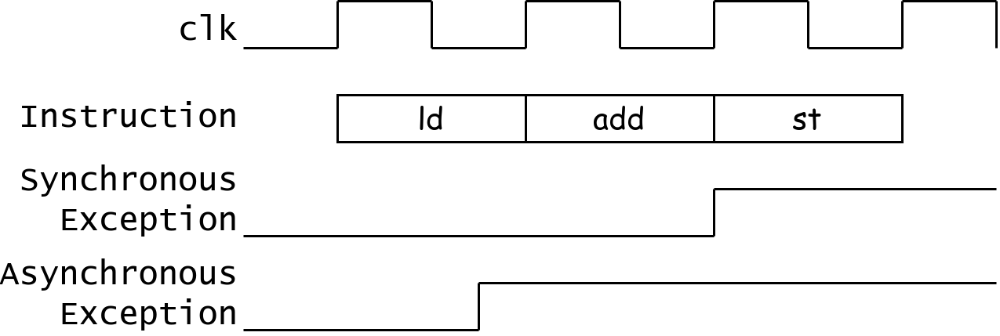

Thus, it’s clear why the control flow transfer referred to as a **Trap** is "synchronous": we must at least wait for the clock cycle to arrive before performing the control flow transfer.

We use the term **exception** to refer to an unusual condition occurring at run time associated with an instruction in the current RISC-V thread.
We use the term **trap** to refer to the synchronous transfer of control to a trap handler caused by an exceptional condition occurring within a RISC-V thread.
Trap handlers usually execute in a more privileged environment.

We use the term **interrupt** to refer to an external event that occurs asynchronously to the current RISC-V thread.
When an interrupt that must be serviced occurs, some instruction is selected to receive an interrupt exception and subsequently experiences a trap.

Source: riscv-spec-v2.1.pdf, Section 1.3 "Exceptions, Traps, and Interrupts".

!!!info "Differences Between RISC-V and x86"
    
    Different textbooks provide similar definitions for **Exception**, **Trap**, and **Interrupt**. For example, CSAPP, referencing the x86 model, describes four types of control flow interruptions. The main distinctions lie in whether the exceptional control flow is synchronous with the instruction stream and whether the control flow returns to the original program after jumping to the exceptional control flow.

    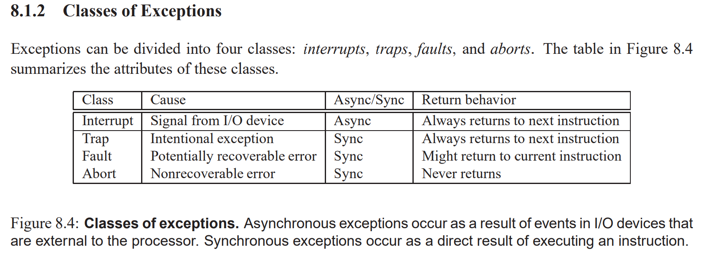

    For instance, exception types in x86 include **Page Fault** (page missing exception) and **Machine Check (Abort)** (memory or hardware error).

    However, in the RISC-V model, the return behavior mentioned above can be simulated in software. Thus, in the RISC-V hardware model, there are only two causes of control flow changes: **Exceptions** and **Interrupts**, with the result of such changes being entry into a **Trap**.

    Note: RISC-V employs an extremely minimalist design philosophy at the hardware level: anything that can be handled by software is left out of hardware.

## CSR: mstatus/sstatus

!!!info "CSR"
    
    If you’re unfamiliar with CSR, please review the slides from the previous lab session.

    You might find keywords like WPRI, WLRL, and WARL in the CSR field definitions confusing. Refer to riscv-privilege.pdf, Section 2.3 "CSR Field Specifications". For now, you can simply assume that bit fields defined by these keywords are ones we don’t need to care about or modify.

mstatus/sstatus: Machine/Supervisor Status Register. This register holds the control state of the RISC-V core. `sstatus` is essentially a Restricted View of `mstatus`.

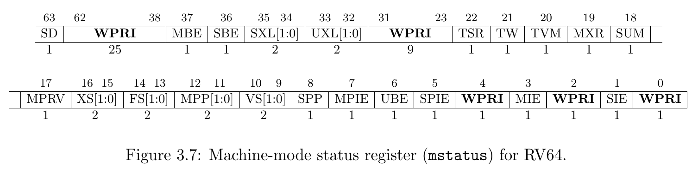

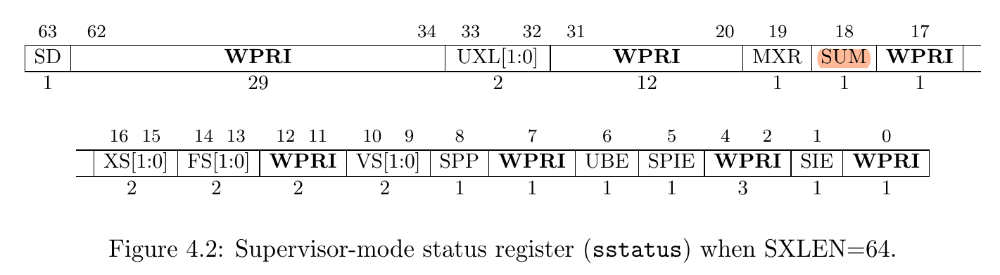

Since the RISC-V manual’s definitions for each CSR register field are notoriously hard to locate, we provide a quick reference table here:

| Field | Full Name (Guessed)                   | Meaning                                              |
| ----: | :------------------------------------ | ---------------------------------------------------- |
|   SPP | Supervisor Previous Privilege         | The privilege level of the Hart before entering Supervisor mode. |
|   SIE | Supervisor Interrupt Enabled          | Interrupt enable flag in Supervisor mode.            |
|  SPIE | Supervisor Previous Interrupt Enabled | Interrupt enable state before entering Supervisor mode. |
|   SUM | Supervisor User-Memory                | Allows Supervisor mode to access pages with the U-bit set. |

Other fields we don’t currently use are omitted here.

## Trap-Related Registers

Here’s a list of registers involved in the Trap handling process:

- **stvec**: Supervisor Trap Vector Base Address Register
    - Stores the address of the Trap handler function. Often referred to as the "interrupt vector," which we’ll explain later.
- **sip**: Supervisor Interrupt Pending
    - Indicates which interrupts are pending.
- **sie**: Supervisor Interrupt Enabled
    - Indicates which interrupts can be processed.
    - Note: Don’t confuse this with `sstatus.SIE`.
- **sepc**: Supervisor Exception Program Counter
    - The PC value at the time of the interrupt.
- **scause**: Supervisor Cause
    - The reason for the interrupt.
- **stval**: Supervisor Trap Value
    - Additional information about the interrupt.

### stvec
When an exception or interrupt occurs, a **Trap handler** is needed to process it. The `stvec` (Supervisor Trap Vector Base Address Register) serves as the base address of the so-called "Trap vector table."  
The vector table maps different types of Traps to their corresponding handlers. 
If there’s only one handler, `stvec` can directly point to that handler’s address.

!!!note "stvec"

    `stvec` mandates that the Trap handler entry must be aligned to 4 bytes (i.e., the last two bits are 0). These last two bits also indicate two modes:

    1. **Direct Mode**: All Traps enter at `pc <= BASE`.
    2. **Vectored Mode**: For asynchronous interrupts, `pc <= BASE + 4 * cause`.

    In our code, we use **Direct Mode**.

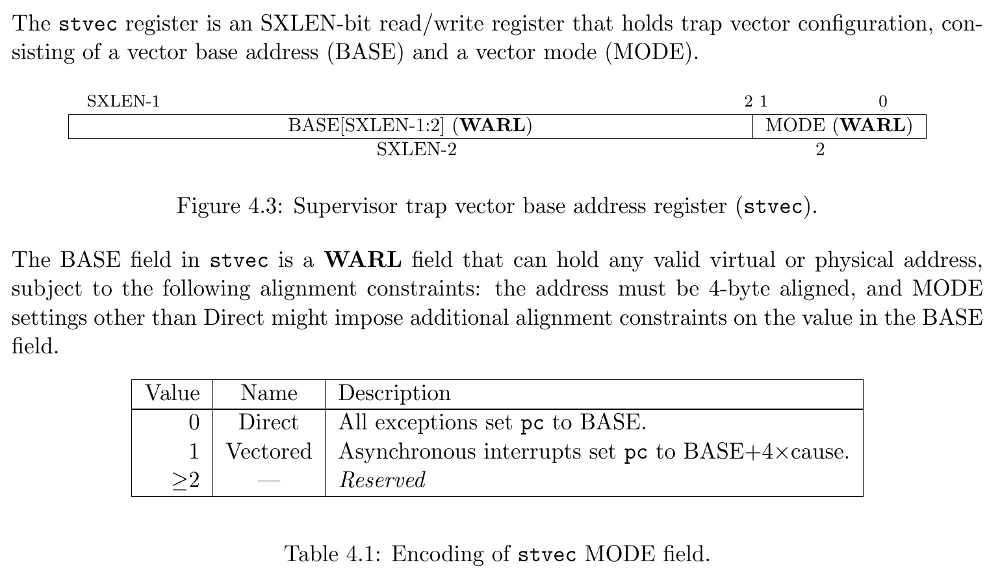

### scause

When a Trap is caught and enters Supervisor Mode (S-mode), the `scause` register is written with a code indicating the event that caused the Trap.

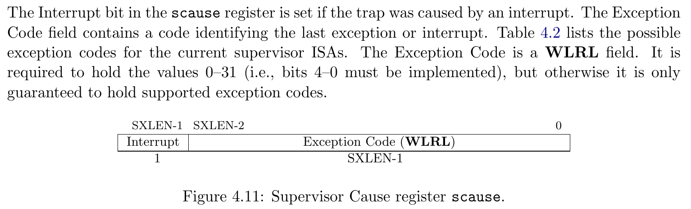

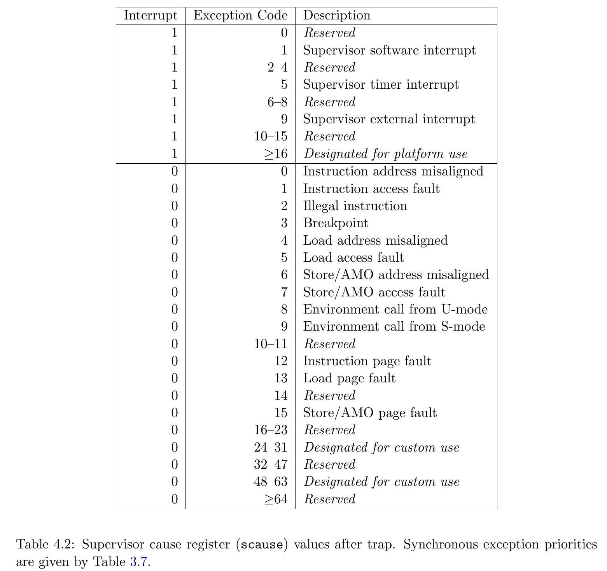

### sie & sip

The `sip` register is a 64-bit read-write register that stores information about pending interrupts, while `sie` is a corresponding 64-bit read-write register containing interrupt enable bits.

Interrupt cause number `i` (as shown in CSR `scause`) corresponds to bit `i` in the `sip` and `sie` registers.
Bits 15:0 are allocated to standard interrupt causes, while bits 16 and above are reserved for platform-specific or custom use.

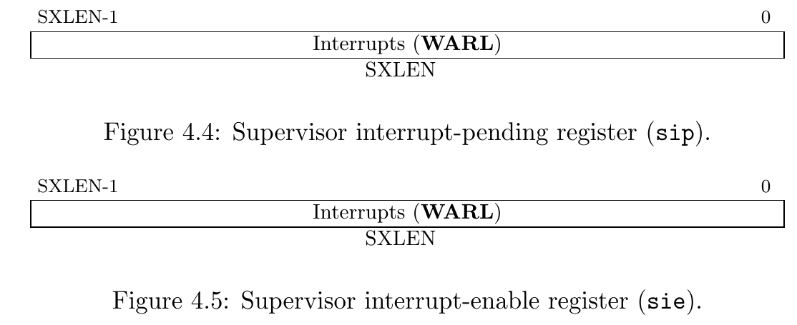

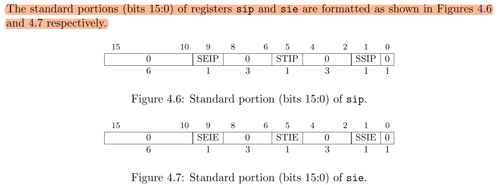

### sepc

When a Trap is caught and enters Supervisor Mode (S-mode), 
the `sepc` register is written with the virtual address of the instruction that **was interrupted or encountered an exception**.

### stval

When a Trap is caught and enters Supervisor Mode (S-mode),
the `stval` register is written with specific information related to the exception to assist software in handling the Trap.

For exceptions such as breakpoints, misaligned addresses, access faults, or page faults during instruction fetch, load, or store operations, 
`stval` is set to a non-zero value representing the virtual address that caused the exception.

## How the CPU Handles Traps

The Trap handling process can be divided into three main stages:

1. Entering the Trap
2. Trap Handler
3. Returning from the Trap

### 1. Entering the Trap

**When an Exception occurs, or the Hart is ready to handle an Interrupt**, a Trap is triggered, and the CPU performs the following actions in hardware:

1. scause <= {1b'Is_Interrupt, 63b'Cause}
2. stval <= Trap_Value
3. sepc <= pc
4. sstatus.SPP <= Current_Privilege_Level
5. sstatus.SPIE <= sstatus.SIE
6. sstatus.SIE <= 0
7. pc <= stvec

In summary: Set `scause` and `stval` => Save the PC to `sepc` => Save the current privilege level (U/S) to `sstatus.SPP` => Save the current interrupt state to `sstatus.SPIE` => Disable interrupts by setting `sstatus.SIE = 0` to prevent interrupts during Trap handling => Jump to `stvec`.

### 2. Trap Handler

The `stvec` register stores the address of the Trap handler. After the CPU records the information related to the exception or interrupt causing the Trap, the `pc` points to the address stored in `stvec`, executing the corresponding Trap handler.  
The Trap handler then processes the event based on the information stored in the registers, using different software behaviors as needed.

### 3. Returning from the Trap (`sret`)

RISC-V uses the `sret` instruction to exit a Trap in Supervisor mode, performing the following steps:

1. sstauts.SIE <= sstatus.SPIE
2. Current_Privilege_Level <= sstauts.SPP
3. pc <= epc

Restore `sstatus.SIE` from `sstatus.SPIE` => Set the privilege level (U/S) to `sstatus.SPP` => Set the PC to `sepc`.

The `sret` instruction is essentially the reverse of the three steps performed when entering a Trap: restoring `SIE`, the privilege level, and the PC register.

## Code Walkthrough

After the operating system boots, we initialize the `stvec` register to point to `kernel_trap_entry`.

```C
// trap.c
void set_kerneltrap() {
    assert(IS_ALIGNED((uint64)kernel_trap_entry, 4));
    w_stvec((uint64)kernel_trap_entry);  // DIRECT
}
```

When a Trap occurs, after the CPU stores the relevant information, it jumps to the `kernel_trap_entry` function pointed to by `stvec`, which serves as the interrupt vector entry point for S-mode.

```asm
    .globl kernel_trap_entry
    .align 2
kernel_trap_entry:
    // we store all registers in the stack
    add sp, sp, -0x100
    sd x0, 0x00(sp)
    sd x1, 0x08(sp)
    sd x2, 0x10(sp)
    // ...
    sd x30, 0xf0(sp)
    sd x31, 0xf8(sp)

    // ...
```

The entry point allocates 0x100 bytes of stack space and saves all general-purpose registers (GPRs) onto the stack.  
At this point, the stack holds 32 registers, each occupying 8 bytes, totaling 0x100 bytes, with addresses ranging from low to high corresponding to registers `x0` to `x31`.  
We define a `struct ktrapframe` whose memory layout matches the register layout on the stack. 
This allows us to dereference a `struct ktrapframe*` pointer in C to access all GPRs saved on the stack.

```C
struct ktrapframe {
    uint64 x0;  // x0
    uint64 ra;
    uint64 sp;
    uint64 gp;
    uint64 tp;
    uint64 t0;
    uint64 t1;
    uint64 t2;
    uint64 s0;
    uint64 s1;
    uint64 a0;
    uint64 a1;
    uint64 a2;
    uint64 a3;
    uint64 a4;
    uint64 a5;
    uint64 a6;
    uint64 a7;
    uint64 s2;
    uint64 s3;
    uint64 s4;
    uint64 s5;
    uint64 s6;
    uint64 s7;
    uint64 s8;
    uint64 s9;
    uint64 s10;
    uint64 s11;
    uint64 t3;
    uint64 t4;
    uint64 t5;
    uint64 t6;

    // 32 * 8 bytes = 256 (0x100) bytes
};
```

!!!note "Stack"

    Upon entering the Trap handler, we can assume the previous program was executing C code and had a valid stack.

    We naturally want the Trap handler to be written in C, which also requires a valid stack space.  
    **Thus, we can directly reuse the stack space of the program that was executing**, as long as we ensure the `sp` pointer can be restored.

    Additionally, the C compiler maintains stack balance: it deallocates as much space as it allocates.  
    Therefore, as long as our assembly-level stack operations are balanced, we can safely use the existing stack for context saving, leaving the rest to the compiler.

!!!note "Context"

    Trap handling requires "pausing the current task but being able to resume it later." For the CPU, this simply means saving the original registers, performing other tasks, and then restoring the registers.

    Upon entering the Trap handler, the 31 GPRs (`x1`-`x31`) are in use by the original program. The Trap handler must ensure that when control returns to the original program, the GPRs remain consistent with their state before the Trap. Thus, we need memory space to save these registers and restore their original values upon returning from the Trap. We refer to these registers as the **Context** of the original program.

    Therefore, we implement a context-switching mechanism in assembly, which involves two steps:

    - Save the CPU registers (context) to memory (on the stack).
    - Restore the CPU registers from memory (the stack).


Next, we set `a0` to `sp` and call `kernel_trap` to continue Trap handling in C code.


```asm
    .globl kernel_trap_entry
    .align 2
kernel_trap_entry:
    // ...

    mv a0, sp   // make a0 point to the ktrapframe structure
    call kernel_trap

    // ...
```

Since RISC-V uses `a0` to pass the first argument, `a0` now points to the `struct ktrapframe` on the stack. Thus, the first parameter of the `kernel_trap` function is `struct ktrapframe* ktf`, corresponding to the value of `a0`.

```c
void kernel_trap(struct ktrapframe *ktf) {
    assert(!intr_get());

    if ((r_sstatus() & SSTATUS_SPP) == 0)
        panic("kerneltrap: not from supervisor mode");

    uint64 cause = r_scause();
    uint64 exception_code = cause & SCAUSE_EXCEPTION_CODE_MASK;
    if (cause & SCAUSE_INTERRUPT) {
        // handle interrupt
        switch (exception_code) {
            case SupervisorTimer:
                debugf("s-timer interrupt, cycle: %d", r_time());
                set_next_timer();
                break;
            case SupervisorExternal:
                debugf("s-external interrupt.");
                plic_handle();
                break;
            default:
                errorf("unhandled interrupt: %d", cause);
                goto kernel_panic;
        }
    } else {
        // kernel exception, unexpected.
        goto kernel_panic;
    }

    assert(!intr_get());
    return;

kernel_panic:
    panicked = 1;

    errorf("=========== Kernel Panic ===========");
    print_sysregs(true);
    print_ktrapframe(ktf);

    panic("kernel panic");
}
```

Upon entering `kernel_trap`, the CPU’s interrupt bit `sstatus.SIE` should remain disabled, and the Previous Privilege should be Supervisor mode. We use assertions to ensure the code executes as expected.

!!!info "Why We Write Assertions"
    Assertions are a critical debugging and error-detection tool in operating system development.  
    They help developers catch potential logic errors early in program execution.  
    By inserting assertions in the code, we can immediately detect states or conditions that deviate from expectations, rather than waiting for a crash or unpredictable behavior and then guessing the cause.

    In other words, if we can detect at some point that the program’s state has deviated from our expectations, we can make it crash at the "first scene" to provide more effective debugging information.

Next, we read the `scause` register to determine whether the Trap was caused by an interrupt or an exception. We handle timer interrupts and PLIC-managed external interrupts. For any other unexpected Trap causes, we print the `ktrapframe` structure saved on the stack for debugging and use the `panic` macro to indicate an unrecoverable kernel error, halting the system.

Finally, we exit `kernel_trap` and return to `kernel_trap_entry` to continue execution.

```asm
    .globl kernel_trap_entry
    .align 2
kernel_trap_entry:
    // ...
    call kernel_trap

    // restore all registers
    //ld x0, 0x00(sp) // do not write to x0
    ld x1, 0x08(sp)
    ld x2, 0x10(sp)
    // ...
    ld x30, 0xf0(sp)
    ld x31, 0xf8(sp)

    // restore stack
    add sp, sp, 0x100

    // return from trap
    sret
```

After exiting the C environment, we restore all GPRs from the stack, restore the stack space, and use `sret` to exit the Trap.

The `sret` instruction restores the value of `sepc` to the PC register.

The following diagram illustrates the stack structure during the process of entering the Trap, constructing the `ktrapframe`, and then restoring and exiting with `sret`:

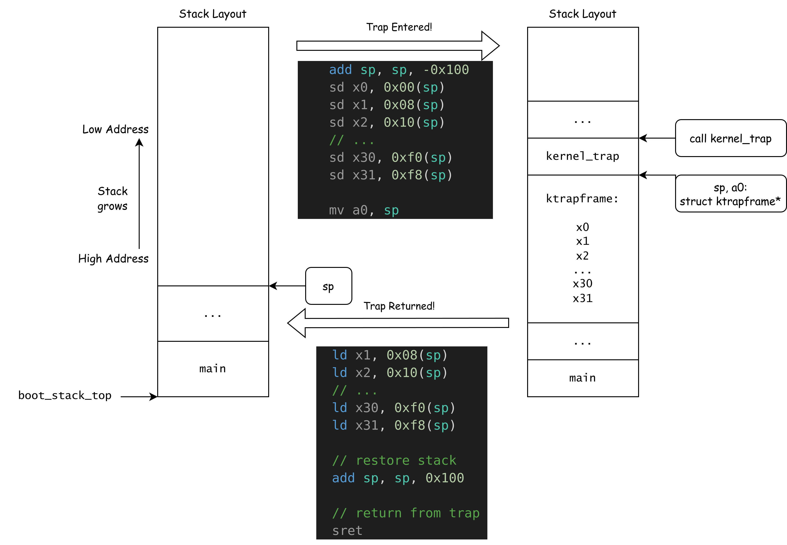

## Lab Report

!!!question "Question 1"

    Based on this week’s lab content, use the GDB debugger to print the value of `stvec` when the code from last week’s lab runs to the `main` function. Then, explain why the operating system exhibits an infinite reboot behavior after failing to read the CSR `mvendorid` value, using this `stvec` value.

    You may need to use GDB commands like `b main` (set a breakpoint at the `main` function entry), `c` (continue execution), and `print $stvec`.

!!!question "Question 2"

    In `main.c`, the `ebreak` instruction actively triggers an exception. Run the kernel with `make run`, and you’ll observe a `Kernel Panic` along with some printed CSRs.

    Refer to the RISC-V Privileged Architecture Manual, Section `4.1.1 Supervisor Status Register (sstatus)`, and extract the values of the `SIE`, `SPIE`, and `SPP` bits from the `sstatus` value printed in the Kernel Panic log. Explain their meanings.

    Referring to the description of Interrupt/Exception Codes in `scause`, **write down the meaning of the current `scause` value**.

    Next, modify the `else` branch in the `kernel_trap` function in `trap.c` so that the exception caused by `ebreak` does not jump to the `kernel_panic` label but instead exits the `kernel_trap` handler:

    ```c
    if (cause & SCAUSE_INTERRUPT) {
        // handle interrupt
        // ...
    } else {
        if (exception_code == ?) {
            debugf("breakpoint");
        } else {
            // kernel exception, unexpected.
            goto kernel_panic;
        }
    }
    ```

    Write what should replace the `?`. Run the kernel with `make run`. What do you observe? Explain the results.

!!!question "Question 3"

    The RISC-V Privileged Architecture Manual, Section `3.3.1 Environment Call and Breakpoint`, explains the `ecall` and `ebreak` instructions as follows:

    > ECALL and EBREAK cause the receiving privilege mode’s epc register to be set to the address of
    > the ECALL or EBREAK instruction itself, not the address of the following instruction. As ECALL
    > and EBREAK cause synchronous exceptions, they are not considered to retire, and should not
    > increment the minstret CSR.

    Add a line of code after `debugf("breakpoint");` to ensure that, upon exiting the Trap, the subsequent instruction is executed instead of repeatedly executing `ebreak`.

    Note: You can refer to the disassembled kernel image in `build/kernel.asm` to see the instructions at each address.

    Note 2: You can use the functions `w_sepc()` and `r_sepc()` defined in `riscv.h` to read/write the `sepc` register.

## Interrupt

The RISC-V specification defines three standard interrupts for each Hart in M/S modes: Timer Interrupt, Software Interrupt, and External Interrupt.

### When Can an Interrupt Be Handled?

RISC-V defines three standard interrupts—Software Interrupt, Timer Interrupt, and External Interrupt—corresponding to Exception Codes 1, 5, and 9 in `scause`, and bits 1, 5, and 9 in `sip`/`sie`.

<!-- The interrupt source will raise the corresponding bit in the Hart's `sip` (Supervisor Interrupt Pending) register, and the Hart will determine whether it can enter the interrupt. -->

When an interrupt arrives, the RISC-V core checks whether it can currently handle the interrupt and enter a Trap:

- (Currently running in S-mode with `sstatus.SIE == 1`) **OR** currently running in U-mode.
- The interrupt type’s bit `i` is set to 1 in both `sie` and `sip`.

> An interrupt i will trap to S-mode if both of the following are true:
>
> (a) either the current privilege mode is S and the SIE bit in the sstatus register is set, or the current privilege mode has less privilege than S-mode; and
>
> (b) bit i is set in both sip and sie.

When a Software/Timer/External Interrupt reaches the CPU, the corresponding bit in `sip` is set high. The CPU then evaluates the above conditions, entering a Trap if they are met.

### Timer Interrupt

A timer interrupt can be understood as a program that executes periodically. It triggers an interrupt at fixed intervals, during which we can perform operations like process scheduling.

The RISC-V platform provides a real-time counter, the `time` register, which increments at a constant frequency and is shared across all cores. Additionally, RISC-V provides each core with a `timecmp` register. Whenever `time >= timecmp`, the core sets the `sip.STIP` bit high for a timer interrupt. If the core meets the conditions to enter a Trap, it does so.

The SBI provides an SBI call, `SBI_SET_TIMER`, allowing Supervisor-mode software to set the `timecmp` register. Knowing the frequency of the `time` register, we can calculate how much `time` will increase in a given period (e.g., 10ms) and set `timecmp` accordingly to receive a timer interrupt after 10ms. Each time a timer interrupt occurs, we recalculate and set the next `timecmp`, achieving a timer interrupt every 10ms.

The timer-related code is located in `timer.c`.

During timer interrupt initialization, we use the SBI call `SET_TIMER` to set `timecmp` and enable the timer interrupt in `sie` with `SIE_STIE`. 

When handling a timer interrupt in `kernel_trap`, we calculate the next `timecmp` and call `SET_TIMER` again via SBI, repeating the cycle.

!!!question "Lab Report - Question 4"
    Comment out the line `asm volatile("ebreak" ::: "s11");` in `main.c` and uncomment `intr_on()`.

    Run `make run` and observe the cycle count printed each time a timer interrupt is triggered.

    Comment out the call to `set_next_timer()` in `kernel_trap` in `trap.c`, then run `make run` again and observe the cycle count printed for each timer interrupt.

    Explain the observed phenomena and why they occur.

!!!info "mtimecmp and stimecmp"
    In fact, the standard RISC-V Privileged Architecture Manual only defines the `mtimecmp` register for M-mode. S-mode software must use an SBI call to set the timer interrupt, which internally uses OpenSBI to set `mtimecmp` and sets `STIP` in `mtvec` to emulate a timer interrupt for S-mode. This reflects RISC-V’s hardware design principle of leaving tasks to software whenever possible, with M-mode emulating behavior for higher-level software.

    However, privilege mode switches are quite time-consuming. To improve Supervisor timer interrupt performance, the RISC-V Sstc extension introduces the `stimecmp` CSR, allowing Supervisor mode to directly set its timer interrupt counter.

    We can disable the Sstc extension in QEMU’s CPU flags (`-cpu rv64,sstc=off`) to observe OpenSBI’s behavior without Sstc. Use the command `qemu-system-riscv64 -nographic -machine virt -cpu rv64,svadu=off,sstc=off -m 512 -kernel build/kernel -S -gdb tcp::3333` to start QEMU with a debugger.

    After attaching GDB, use the `c` (continue) command to proceed. When QEMU outputs `kernel_trap: s-timer interrupt`, press Ctrl-C in the GDB terminal to interrupt execution. Use `print $mtvec` to get the M-mode interrupt vector address, and set a breakpoint with `b *0x800004f0` at the interrupt vector.

    Resume execution with `c`. When the breakpoint at `0x800004f0` is hit, use `print $mcause` to check the M-mode Trap cause.

    Without Sstc, you should see `mcause` alternate between `0x8000000000000007` (M-mode Timer Interrupt) and `0x9` (S-mode `ecall`). With the Sstc extension, `mcause` will only show `0x9`. In this case, OpenSBI directly sets `stimecmp` when using `SBI_SET_TIMER`, avoiding the routing of S-mode timer interrupts through OpenSBI.


### External Interrupt

When we previously described interrupts and Traps, we mentioned, "When an Interrupt arrives, the RISC-V core...". So, how do external interrupts reach each core?

The **PLIC (Platform-Level Interrupt Controller)** is an IP core on the RISC-V platform for managing external interrupts. Each RISC-V platform has multiple cores (Harts), but typically only one PLIC.

In short, each peripheral notifies the PLIC when it has an interrupt to process, with each device assigned an interrupt number. The PLIC routes the interrupt to one or more cores based on preconfigured rules, setting the `mip.MEIP` or `sip.SEIP` bit of the target core(s) to request an interrupt.

The core must **claim** the interrupt from the PLIC to handle it and **complete** it after processing.

Specification: https://github.com/riscv/riscv-plic-spec/blob/master/riscv-plic.adoc

!!!info "AMD64 and Aarch64"
    Similar global interrupt controllers exist on x86 (IA32), x86-64 (AMD64), and ARM platforms: [PIC](https://wiki.osdev.org/8259_PIC), [APIC](https://wiki.osdev.org/APIC), [GIC](https://developer.arm.com/documentation/198123/0302/What-is-a-Generic-Interrupt-Controller-)

#### PLIC Structure

The PLIC can manage 1–1023 interrupt sources, each with a priority level (**Priority**). The PLIC refers to interrupt recipients as **Hart Contexts** (where a Hart Context is a privilege mode on a given Hart). Each Context can be viewed as a tuple (Hart ID, Privilege Level), corresponding to a Hart and a privilege level. Since RISC-V does not yet specify User-Mode Interrupts (the privilege spec only defines `mie/mip` and `sie/sip` for Machine and Supervisor modes), we can assume each core has two Contexts: one for M-mode and one for S-mode external interrupts.

The PLIC can manage 0–15,871 Contexts, setting whether each interrupt source is allowed to route to a specific Context (**Enabled Bit**) and the **Priority Threshold** for each Context.

The PLIC sets the `mip.MEIP` or `sip.SEIP` bit of a Hart, and whether the Hart enters an interrupt Trap depends on the conditions described earlier.

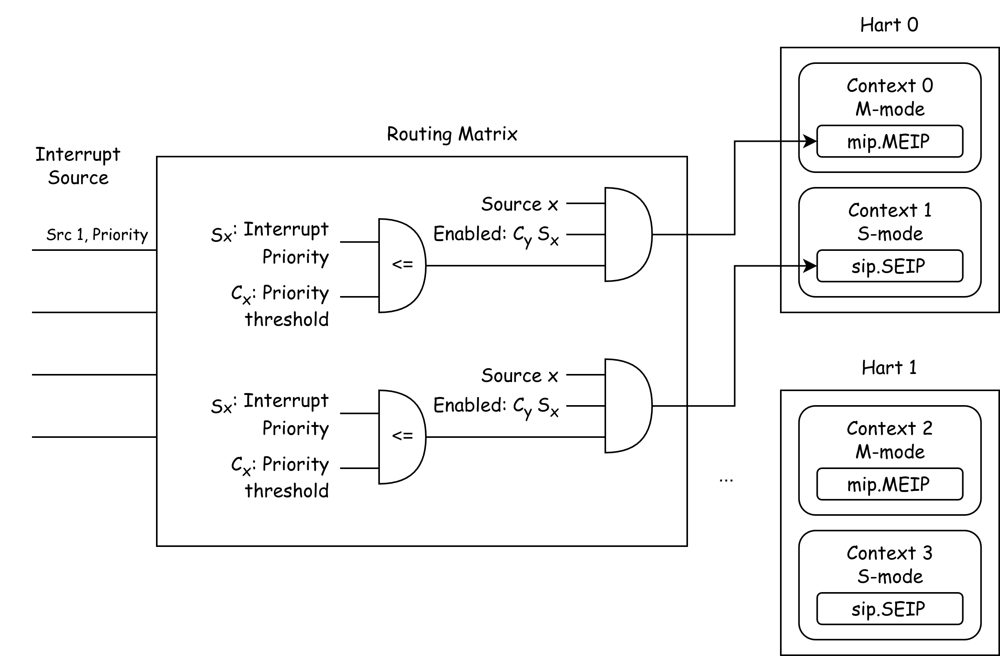

#### Memory-Mapped Registers

The PLIC exposes its management interface via **Memory-Mapped Registers**. We use offsets to locate each register. Typically, such an IP core has a fixed base address, which in QEMU is `0x0c00_0000`.

!!!info "Memory-Mapped Register, MMIO"
    **Memory-Mapped Registers** are a critical technique in computer architecture for peripheral device and hardware control.

    A Memory-Mapped Register maps a hardware device’s registers directly into the processor’s memory address space. This allows the CPU to access a specific address as if it were memory, when it actually corresponds to a register within a device.

    I/O operations using Memory-Mapped Registers are called **Memory-Mapped I/O (MMIO)**.

    ```
    gef > monitor info mtree
        000000000c000000-000000000c5fffff (prio 0, i/o): riscv.sifive.plic
    ```

For example, the Specification’s Memory Map defines `base + 0x4 * i` as the priority of interrupt source `i`:

```
base + 0x000000: Reserved (interrupt source 0 does not exist)
base + 0x000004: Interrupt source 1 priority
base + 0x000008: Interrupt source 2 priority
...
base + 0x000FFC: Interrupt source 1023 priority
```

In `plicinit`, we set the Interrupt Priority of UART0 (interrupt 10) to 1 at `base + 10*4 = 1`. In `plicinithart`, we enable the S-mode Context of the current Hart to receive interrupt 10 and set its Priority Threshold to 0. Finally, we enable the core’s `sie.SEIE` bit to allow Supervisor-Mode External Interrupts. Before the `while(1)` loop in `main.c`, we use `intr_on` to enable S-mode interrupts for the entire CPU.

#### Claim & Complete

When a Hart enters a Trap due to an External Interrupt, it must **claim** the interrupt from the PLIC to process it. After handling, it must **complete** the interrupt to notify the PLIC.


#### Serial Port Interrupt

On the QEMU platform, the serial port uses the `uart8250` device model, exposing eight MMIO registers. For details, see: https://www.lammertbies.nl/comm/info/serial-uart

The `uart8250` has a read port (`RHR`) and a write port (`THR`), with bits in the `LSR` register indicating whether the read port has data and the write port is free. Read and write functions are in `uartgetc` and `uart_putchar`.

In the serial initialization function `console_init`, we write specific flags to the `IER` register at the `uart8250`’s MMIO address, enabling the device to generate an interrupt when input is available. We then register interrupt 10 with the PLIC, routing it to the current core’s S-mode, and handle it in `kernel_trap`.

```c
if (cause & SCAUSE_INTERRUPT) {
    // handle interrupt
    switch (exception_code) {
        case SupervisorExternal:
            debugf("s-external interrupt.");
            plic_handle();
            break;
    }
}
```

The `plic_handle` function claims the current external interrupt’s source number from the PLIC. If it’s UART0’s interrupt 10, it passes it to `uart_intr()` for processing.