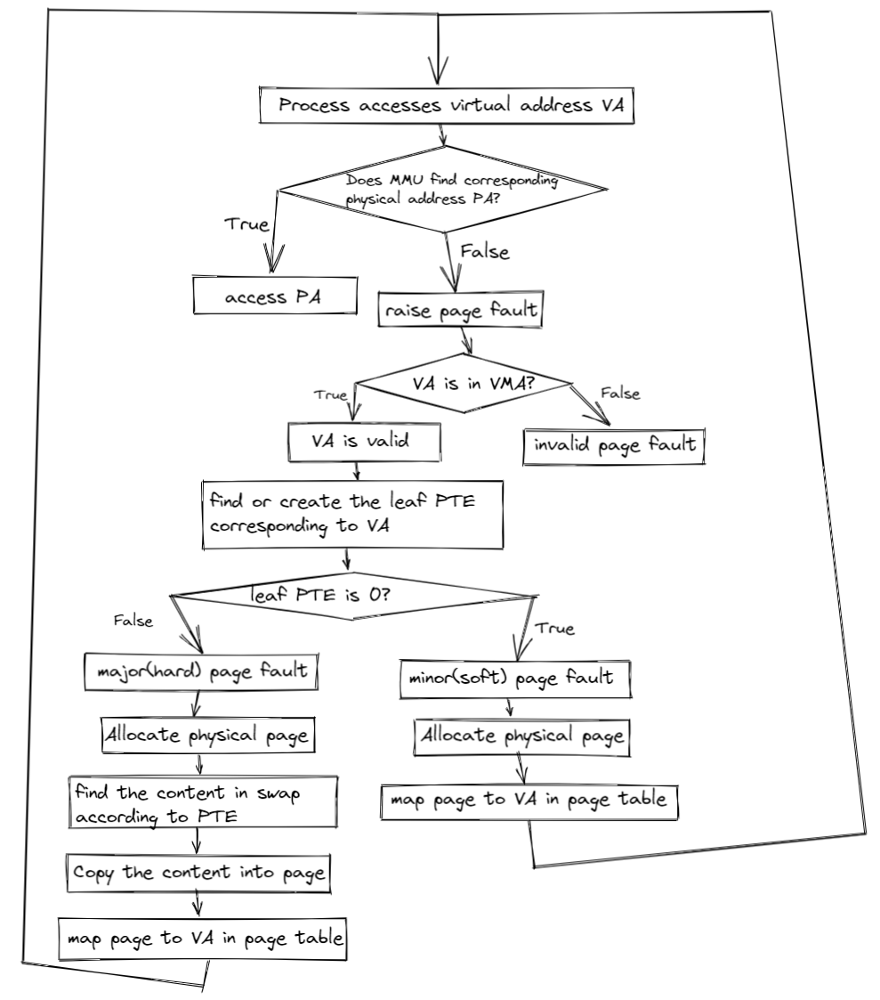
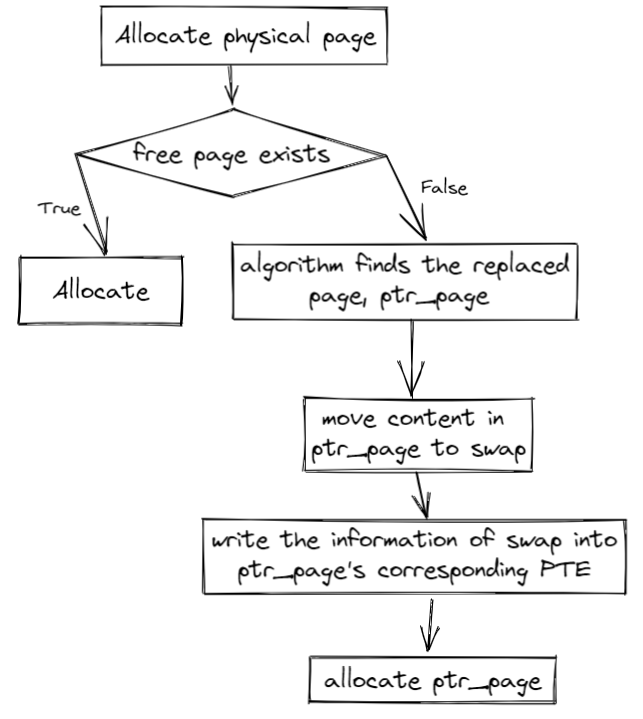

# Page Fault

## Experiment Objectives

1. Understand what a page fault is.
2. Master the three types of page fault handling methods.
3. Learn several basic page replacement algorithms.

## Page Fault

A **Page Fault** is an exception. If a requested virtual address (for instruction fetch, read, or write) does not match the page table's description, the MMU triggers a Page Fault exception. The `Exception Code` in `scause` defines three types of Page Faults: `Instruction page fault`, `Load page fault`, and `Store/AMO page fault`.

The privileged architecture manual, in section `4.3.2 Virtual Address Translation Process`, specifies all scenarios that may cause a page fault during address translation.

When an exception occurs, `stval` is set to the virtual address causing the Page Fault:

> If stval is written with a nonzero value when a breakpoint, address-misaligned, access-fault, or
> page-fault exception occurs on an instruction fetch, load, or store, then stval will contain the
> faulting virtual address.

## Demand Paging

In modern operating systems, **Demand Paging** is a memory management strategy that loads a page into memory only when a program accesses it. Unlike traditional methods that load all pages of a program into memory at once, demand paging uses memory resources more efficiently and avoids waste.

In the current xv6 system, each user process's stack is allocated 8 physical pages. But do user processes really need all 8 pages? 
The stack grows from high to low addresses, meaning it expands dynamically during execution. Early in a process's lifecycle, it may not use all allocated stack space, so allocating a large amount of memory upfront could waste resources.

Instead, we can initially allocate only 2 physical pages for the stack and **allocate additional pages when the user process needs them**.
 When a user process accesses a virtual address, the CPU may find no mapping for it in the page table, triggering a Page Fault.

Although this virtual address is invalid to the CPU, the kernel has reserved space for it. Upon receiving the Page Fault, the kernel recognizes that the process needs this page, allocates a physical page, updates the page table, and resumes execution from the faulting instruction. The CPU then finds the address valid, and to the user process, the brief pause is imperceptible.

### Page Fault

As mentioned, when a process requests memory, the operating system grants it a range of virtual addresses without allocating corresponding physical memory. When the process accesses such an address, the lack of a physical mapping triggers a **page fault**, prompting the OS to allocate physical memory and establish the address mapping in the page table.

A page fault occurs when the CPU accesses a virtual address without a corresponding physical memory mapping. Possible causes include:

1. No Page Table Entry (PTE) exists for the virtual address (invalid virtual address or valid but unmapped).
2. The current privilege level cannot access the PTE.

In Linux, page faults are categorized into three types:

1. **Major page fault (hard page fault)**  

The requested virtual address's content is not in memory and must be loaded from external storage, often because the page was swapped out to a swap space.

2. **Minor page fault (soft page fault)**  

The virtual address lacks a mapping in the page table, common when a process first accesses newly allocated memory or when multiple processes share memory without established mappings.

3. **Invalid fault**  

The accessed virtual address is illegal.

In xv6, the page fault handling process is as follows:

### Implementation

In xv6, a **user’s virtual address space** is represented in two ways: the VMA (Virtual Memory Area) structure and the page table. The latter is required by the CPU for address translation, while the former is more convenient for OS code.

When allocating virtual address space for a user, we store it in the VMA structure but do not map physical pages immediately. Physical pages are mapped only when the user accesses the address, triggering a Page Fault.

When a Page Fault occurs, we check if the virtual address in `stval` is within the VMA structure. If not, the exception indicates an illegal memory access by the user program. If it is, the address is a valid user virtual address, so we allocate a physical page and map it in the page table.

!!!info "Alternative Approach"
    Another way to mark a virtual address as "valid but unmapped" leverages the PTE structure. The 0th bit, the `V` (valid) flag, is checked by the MMU during address translation. If set to 0, the PTE is considered unusable, and the upper 63 bits are ignored.

    In the OS, memory-aligned pointers always have a 0 in the least significant bit. Thus, we can store a pointer in the PTE instead of a valid PTE, pointing to a kernel object representing a "valid but unmapped" virtual address. During a Page Fault, we can extract information from this object.

!!!info "Related Implementation"
    If interested, you can refer to MIT 6.828’s original mmap lab and implement mmap on our modified xv6 (which differs from the original xv6).  

    https://pdos.csail.mit.edu/6.828/2024/labs/mmap.html

## Page Replacement (Swap)

When allocating a physical page, we call `kallocpage`. But what happens when no free physical pages are available?

In cases of allocation failure, we can return an error to the caller, as seen in `fork` and `exec`, which return a negative number to indicate failure.

Sometimes, we want the kernel to maintain sufficient physical pages. When available physical pages fall below a threshold (referred to as low/high watermark in theory), the kernel can **swap out** pages to secondary storage (e.g., a hard disk, as per CSAPP’s Memory Hierarchy) to free up space.

**CSAPP: Memory Hierarchy**

What if a swapped-out page is needed later? Recalling Demand Paging, pages are loaded only when accessed, causing a Page Fault. For swapped-out pages, the corresponding PTE becomes invalid, triggering a Page Fault upon access. The kernel then **swaps in** the page from secondary storage, reestablishes the page table mapping, and resumes execution.

The strategy for choosing which page to swap out is called a **page replacement algorithm**.

The following flowchart illustrates when page replacement is needed:

Referring to the Memory Hierarchy, secondary storage (e.g., disks) has slower access speeds and higher latency than memory. Thus, we aim to minimize swapping. How do we choose which pages to swap out?

### Page Replacement Algorithms

For problems involving limited resources and the need to evict items, two implementation-friendly algorithms are commonly used: FIFO and LRU (e.g., in CPU L1/L2/L3 caches or TLBs).

- First In First Out (**FIFO**) Page Replacement Algorithm: This algorithm always evicts the page that entered memory first, i.e., it selects the page that has resided in memory the longest for eviction. It works by linking the pages loaded into memory during the execution of an application into a queue in the order they were loaded. The head of the queue points to the page that has been in memory the longest, while the tail points to the most recently loaded page. When a page needs to be evicted, the algorithm easily finds the target page at the head of the queue. The FIFO algorithm performs well only when the application accesses the address space in a linear sequence; otherwise, its efficiency is low. This is because frequently accessed pages often reside in memory the longest and end up being evicted due to becoming "old." Another drawback of the FIFO algorithm is its anomaly (Belady’s anomaly), where increasing the number of physical page frames can paradoxically increase the number of page faults.

- Least Recently Used (**LRU**) Algorithm: Leveraging the principle of locality, this algorithm predicts future access patterns based on past behavior. It assumes that pages accessed recently are more likely to be accessed again, while those unused for a long time are less likely to be needed. The algorithm compares the most recent access times of the pages currently in memory and evicts the one that was accessed the furthest in the past.

- Clock Page Replacement Algorithm: This is an approximate implementation of the LRU algorithm. The clock algorithm organizes pages into a circular linked list, resembling the face of a clock. A pointer (called the current pointer) points to the oldest page, i.e., the one that was loaded earliest. Additionally, the clock algorithm requires an access bit in the page table entry (PTE) to indicate whether the corresponding page has been accessed recently. When the page is accessed, the CPU’s MMU hardware sets the access bit to "1." When the operating system needs to evict a page, it checks the access bit of the page pointed to by the current pointer. If the bit is "0," the page is evicted. If the page has been modified, it must also be written back to the disk. If the access bit is "1," it is reset to "0," and the pointer moves to the next page. This algorithm approximates the LRU idea, is easy to implement, and has low overhead, though it requires hardware support to set the access bit. The clock algorithm is essentially similar to FIFO but skips pages with an access bit of "1."

- Enhanced Clock Page Replacement Algorithm: In the clock algorithm, only the access status of a page is considered during eviction. However, in practice, whether a page has been modified should also be taken into account. Evicting a modified page requires writing it back to the disk, making the replacement cost higher than for an unmodified page. Thus, the enhanced clock algorithm prioritizes evicting unmodified pages to reduce disk operations. In addition to tracking access status, this algorithm also considers modification status. It aims to evict pages that are both least recently used and unmodified during their residence in memory. This requires adding an access bit and a modified bit to each page table entry. When a page is accessed, the CPU’s MMU hardware sets the access bit to "1." When a page is written to, the modified bit is set to "1." These two bits create four possible combinations: (0, 0) indicates the page was neither accessed nor modified recently and is the first choice for eviction; (0, 1) means the page was not accessed recently but was modified, making it the second choice; (1, 0) means the page was accessed recently but not modified, the third choice; and (1, 1) means the page was both accessed and modified recently, the last choice. Compared to the basic clock algorithm, the enhanced version further reduces disk I/O operations. However, finding a suitable page for eviction may require multiple scans, increasing the algorithm’s execution overhead.

### PTE A/D

How does the OS know a page was "recently accessed"?

The PTE includes two flags: **A (Access)** and **D (Dirty)**, indicating whether the mapped virtual address was read or written, respectively. The MMU sets these bits during address translation, allowing the OS to track access.

For "recently," the OS can use an approximation. For example, it might clear all A/D bits every 10ms. If the bits are set at the next check, the page was accessed within that 10ms window.