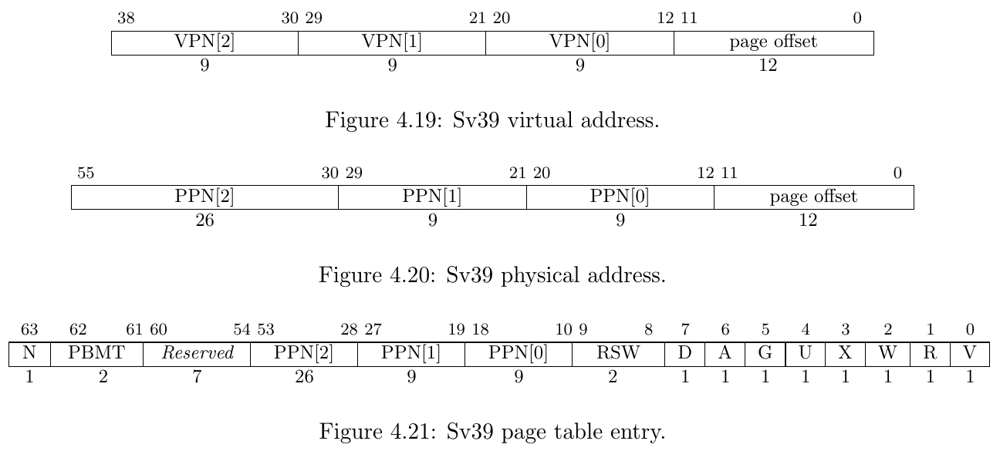

# RISC-V Page Table Model & xv6 Kernel Page Tables

## Experiment Objectives

1. Understand the RISC-V SV39 page table model.
2. Master the mechanism of virtual address to physical address translation.
3. Understand how XV6 manages memory and creates page tables.

## Segmentation

From the perspective of memory access protection, we desire memory access to be permission-protected. This involves two aspects:

1. Whether the memory address is readable, writable, or executable.
2. Whether the memory address allows access from lower privilege levels.

In other words, for each memory address, we want to verify that its operational permissions align with the original program design.

In CPU implementations, memory is addressed in byte units. Managing access permissions for every single byte would incur an unimaginable cost. 
However, we can group code and data with the same permissions together, dividing the program's memory space into several large segments. Each segment has its own base address (Base), size limit (Limit), and permission settings. This is the approach of using *Segmentation* for memory protection.

Segmentation has several disadvantages in memory space management, such as requiring contiguous physical memory, difficulty in dynamically resizing, and fragmentation issues. Therefore, modern CPUs and operating systems use the *Paging* mechanism for memory management.

## Paging

The paging mechanism divides the program space (virtual address space) into fixed-size pages and similarly splits physical memory into pages of the same size. This allows sufficient memory allocation for a process even when physical addresses are non-contiguous, while appearing contiguous from the virtual address perspective.

!!!note "Why do we need a virtual address space?"
    If we only had physical memory space, we could still write programs, but all programs—including the kernel and user programs—would operate in the same address space. The address `0x80200000` accessed by a user program would be the same as `0x80200000` accessed by the kernel. Is this a problem? If only one program is running, it’s fine. But when multiple programs share the same memory space, issues arise: how do we prevent programs from interfering with or even sabotaging each other?

    A straightforward solution is to ensure that `0x80200000` accessed by a user program and `0x80200000` accessed by the kernel are not the same address. Since we only have one physical memory, we can introduce a "translation" mechanism to create distinct address spaces: the addresses used by programs (virtual addresses) must be "translated" into actual physical memory addresses. This "translation" process is implemented using a "dictionary" (page table)—given an address before translation, the corresponding translated address can be looked up in the dictionary.

    Each program has its own unique "dictionary," and the memory it can use is limited to what’s defined in its dictionary.

    Does the "dictionary" translate every usable byte? Imagine that storing the translation result for each byte requires at least one byte. For 1MB of memory, we’d need at least a 1MB "dictionary," which is highly inefficient. In practice, a program’s memory usage is typically orders of magnitude larger than bytes—often in KB units (hence the ancient saying, "640K ought to be enough for anybody," not "640B ought to be enough for anybody"). Thus, we can group many contiguous bytes together for translation, ensuring the difference between pre- and post-translation values is consistent. This is the concept of a "page."

## Virtual Address => Physical Address

A critical aspect of the paging mechanism is how to establish and resolve the mapping from virtual addresses to physical addresses. Below, we explain this from the perspective of "how to obtain the corresponding physical address from a virtual address":

### Single-Level Page Table

The figure below illustrates a single-level page table paging mechanism (single-level refers to requiring only one layer of page table lookup to obtain the physical address, hereafter called a "single-level page table"):


Using the figure as an example, we start with a **virtual address** ( **Virtual Address** ), which is 6 bits long. Bits 5–4 (the top 2 bits) represent the **page number (VPN, Virtual Page Number)**, while bits 3–0 (the bottom 4 bits) represent the **offset (Offset)**.

Using the virtual address, we can query the **page table** ( **Page Table** ), which resides in the memory space pointed to by the **page table base address** ( **PageTablePtr, Page Table Pointer** , a physical address). The page table consists of several consecutively stored **page table entries (PTE, Page Table Entry)**. In a single-level page table, each PTE contains the **physical page number (Page Frame #) + some flag bits**. Although the figure shows each PTE seemingly containing a **page number (Page #)**, in actual designs, **the page number (VPN) is not stored in the PTE**. Since PTEs are stored contiguously, knowing the PTE size (in bits) and the virtual page number (VPN, indicating which PTE to query) allows us to calculate the PTE address as `page table base address + page number × PTE size`. The content at this address yields the physical page number. The page table base address is stored in an architecture-specified register.

After obtaining the physical page number, the physical address of the page can be calculated as `physical page number × page size` (assuming the physical space starts at 0x0). A page can be large—how do we get the address of a specific byte within it? Using the offset, the specific physical address corresponding to the virtual address is `page physical address + offset`.

!!!note "An Example"
    Suppose the page size is 4KiB. To locate each byte within a page, the offset must represent 4096 distinct positions, requiring 12 bits (2^12^ = 4096). Alternatively, if the offset is 12 bits, the page size can be deduced as 2^12^ bytes.

    In the single-level page table from the figure, the offset is 4 bits, indicating a page size of 2^4^ = 16B. Given a virtual address `100100` (binary), the page number is `10` (binary, i.e., 2 in decimal). Using page number 2, we look up the PTE content, which is `5` (binary). The physical page number is 5, and the physical page address is: physical base address + physical page number × page size = 0 + 5 × 16 = 80 (decimal). The offset from the virtual address `100100` is `0100` (4 in decimal), querying the 5th byte of the page (address 0 counts as one byte). Thus, the physical address is 80 + 4 = 84 (decimal) (5 × 16 + 4 = 0101 shifted left 4 bits + 0100 = 0101 0100 in binary). Pay attention to whether calculations use binary, decimal, or hexadecimal (storage is always binary).

### Multi-Level Page Table

In systems, the page size is typically 4KiB. In a 32-bit system with a 32-bit virtual address space (2^32 = 4GiB), a single-level page table would require 1M PTEs to map all physical pages. Assuming each PTE is 4B, the page table size would be 4MiB. Since virtual addresses are contiguous (i.e., high-order VPNs are contiguous) and PTEs are stored consecutively like an array, even if a process uses minimal space, a complete, contiguous page table is needed for address translation (unused intermediate PTEs cannot be omitted). In an OS, beyond the kernel page table, each process gets its own page table, and with many processes, the overhead of storing all page tables becomes significant.

This necessitates multi-level page tables, as shown below in a two-level page table mechanism (Sv32):


Unlike a single-level page table, Sv32 splits the virtual address into three parts: `VPN[1], VPN[0], offset`. In Sv32, each page is 4KiB, each PTE is 4 bytes, and each page table contains `2^10 = 1024` PTEs.

The translation process for a 32-bit virtual address in the figure is as follows:

```
	1. Use `PageTablePtr + VPN1 * 4` to get the first-level PTE address (`PageTablePtr` is stored in a designated register).
	2. Retrieve the PFN from the first-level PTE, representing the base address of the second-level page table. Compute the second-level page table base address as `PFN * 4Ki`.
	3. Use `second-level page table base address + VPN0 * 4` to get the second-level PTE address.
	4. Retrieve the PFN from the second-level PTE, representing the final physical page. Compute the final physical address as `PFN * 4Ki + offset`.
```

!!!note "Thinking"
    Why does a multi-level page table save space compared to a single-level page table?

    Consider a 4GiB memory space with a 4KiB page size and 4-byte PTEs. If a process only needs one 4KiB page at the high virtual address (0xffff_f000) and one at the low virtual address (0x0000_0000), we can compare the page table space required under single-level and two-level mechanisms.

    **Single-Level Page Table:**
    Despite needing only the 0th and last PTEs, a single-level page table requires 4GiB / 4KiB = 1M **contiguous** PTEs to map the entire virtual address space. Thus, the page table size is 1M * 4B = 4MiB.

    **Multi-Level Page Table:**
    In a multi-level mechanism, the address space managed by each lower-level page table increases hierarchically. 
    In Sv32, each PTE in the second-level page table manages `4KiB`, so the entire second-level table manages `1024 * 4KiB = 4MiB`. Each PTE in the first-level page table manages a second-level page table, meaning each first-level PTE effectively manages `4MiB`.

    For large, contiguous unused regions, we can avoid allocating second-level page tables, which is why multi-level page tables save space.

    In this case, we allocate two PTEs in the first-level page table to manage two second-level page tables. In the first second-level table, the 0th PTE maps virtual address `0x0000_0000`. In the second, the 1023rd PTE maps `0xffff_f000`.

    Summary:
    To manage these two virtual pages, the two-level page table requires 2 second-level tables and 1 first-level table (unused second-level PTEs can be marked invalid without allocation). Since both levels’ page tables are 4KB, the total space is 2 * 4KB + 4KB = 12KB.

    This example shows that the hierarchical management of a two-level page table significantly reduces space overhead, especially when mapping sparse memory.

!!!warning "Note"
    The translation of virtual to physical addresses is performed by the CPU’s Memory Management Unit (MMU) and does not require us to write code for it.

    Our task in the OS is to construct the "dictionary"—the page table—by allocating page table space and filling in PTEs.

### Translation Lookaside Buffer (TLB)

Physical memory access is much slower than CPU execution, often requiring hundreds of clock cycles per access (known as the "von Neumann bottleneck").

Page tables are stored in physical memory. Following the page table mechanism step-by-step, translating a virtual address to a physical one requires 3 physical memory accesses, followed by another to fetch the desired data, significantly reducing efficiency.

Fortunately, virtual address access exhibits *temporal locality* and *spatial locality*:

- *Temporal locality*: An address accessed once is likely to be accessed again soon.
- *Spatial locality*: If an address is accessed, nearby addresses are likely to be accessed soon.

Thus, CPUs use a **Translation Lookaside Buffer (TLB)** to cache recently completed virtual-to-physical page mappings. Due to locality, a mapping is likely to have been recently performed, so checking the TLB first can bypass multiple memory accesses if the mapping is found.

However, if we modify the root page table register (e.g., changing the PPN field), switching to a completely different page table, the TLB’s cached mappings become outdated and potentially incorrect. In this case, we must use a specific instruction to flush the TLB. In RISC-V, this is `sfence.vma`.

Similarly, manually modifying a PTE alters the mapping, but the TLB doesn’t automatically refresh. We must explicitly flush it.

In RISC-V, `sfence.vma` without parameters flushes the entire TLB. With a virtual address parameter, it flushes only that address’s mapping.

## RISC-V Sv39 Paging Mechanism

### satp

The *satp* (Supervisor Address Translation and Protection) register controls address translation in S-mode and U-mode, with three fields: `MODE`, `ASID`, and `PPN`.


*Mode* specifies the address translation mode. A value of 0 disables translation, treating all requested addresses as physical, while `PPN` denotes the **root page table’s base address**. In this course, we use **Sv39** as the page table mode.

We can ignore ASID for now.


### Sv39

RISC-V’s Sv39 mode supports a 39-bit virtual address space, with each page being 4KiB and each PTE 8 bytes, meaning each page table has `2^9 = 512` PTEs. Sv39 requires each page table to be a page-aligned, i.e., its base address aligns to 4KiB.

RISC-V CPUs use 64-bit virtual addresses. In Sv39, only 39 bits are effective, and bits 63–39 must match bit 38 (sign-extension). Otherwise, the virtual address is illegal. Thus, Sv39’s virtual address space totals `(1 << 39) = 512 GiB`, split into 256 GiB of low addresses (`0x0000_0000_0000_0000` - `0x0000_003f_xxxx_xxxx`) and 256 GiB of high addresses (`0xffff_ffc0_0000_0000` - `0xffff_ffff_xxxx_xxxx`).



The virtual address is divided into four parts: VPN[2-0] (Virtual Page Number) and page offset. The three-level VPNs serve as indices in the three-level page table, while the page offset indicates the address’s offset within the translated page.

An Sv39 PTE is 8 bytes, split into PPN (Physical Page Number) and Flags. The PPN, combined with the virtual address’s page offset, forms the final physical address, while Flags specify access permissions and other details.

### Flags

Flags are defined as follows:

- *D, A*: Dirty, Accessed. Indicate if the page was recently accessed/written.
- *G*: Global. Indicates the mapping exists in all page tables.
- *U*: User. Allows access in user privilege mode.
- *V*: Valid. Marks the PTE as valid; otherwise, the entire PTE is invalid.
- *R, W, X*: Read, Write, Executable permissions.

RWX is defined as shown below:
Note that `XWR == 3'b000` indicates the physical address [PPN: 12b0] is the base address of the next-level page table; otherwise, the PTE is a leaf PTE.


#### A & D

Each page PTE includes Accessed (A) and Dirty (D) bits:

- *A*: Set if the virtual page was read, written, or fetched (instruction fetch) since the last A-bit clear.
- *D*: Set if the virtual page was written since the last D-bit clear.

When accessing a virtual page with A=0 or writing with D=0, RISC-V allows two update methods:

1. Trigger a PageFault, requiring the Supervisor exception handler to manually set A/D bits.
2. Hardware automatically sets A/D bits.

Supervisor software must handle both cases correctly.

#### Permission Checks

Intuitively, a readable page needs the R bit, a writable page needs the W bit, and an executable page needs the X bit.

However, if a page has the U bit and the CPU is in S-mode, we must check the SUM (Supervisor User Memory access) bit in `sstatus`. If `sstatus.SUM == 1`, access is permitted; otherwise, it causes a Page Fault.

Typically, S-mode runs with `sstatus.SUM == 0`. To access user data via the page table, we set this flag to 1 and clear it afterward. This process is often called the **uaccess** primitive.

See also: https://github.com/torvalds/linux/blob/master/arch/riscv/include/asm/uaccess.h

<!-- !!!questions "Virtual Memory Model under AArch64 Architecture"

    AArch64 distinctly divides virtual addresses into a low-address portion and a high-address portion. (Simply put, addresses starting with `0x0000_xxxx` and those starting with `0xffff_xxxx`.)

    For low addresses, the `TTBR0_EL1` (Translation Table Base Register 0 (EL1)) register is used as a base address register, similar to the `satp` register, for address translation.  
    For high addresses, `TTBR1_EL1` is used for address translation.

    Clearly, this model is inherently suited for isolating the kernel page table from the user page table. -->

The Sv39 address translation process is shown below (L2, L1, L0 represent VPN2, VPN1, VPN0, with lower addresses at the bottom and higher at the top in the Page Directory):


See also: riscv-privilege.pdf, 4.3.2 Virtual Address Translation Process

Text description: `{xx | yy}` denotes concatenating `yy` bits to the right of `xx` bits, similar to Verilog syntax.

1. Decompose Virtual Address: `{ 25'signed_ext, 9'VPN2, 9'VPN1, 9'VPN0, 12'pgoff} = 64'VirtualAddress`
2. Use the PPN from the satp register as the first-level page table’s base address.
3. Use VPN2 as the index to find pte2 in the first-level page table.

   Equivalent C code: `uint64 pte2 = *(uint64*)(satp.base + VPN2 * 8);`

4. If `pte2.WXR != 3'b000`, it’s a 1GiB huge page mapping.

   Check if PPN is 1GiB-aligned: `pte2.PPN1 == 9'b0 && pte2.PPN0 == 9'b0`. If true, go to step 10; otherwise, Page Fault.

5. `{pte2.PPN, 12'b0}` is the second-level page table’s base address.
6. Use VPN1 as the index to find pte1 in the second-level page table.

   Equivalent C code: `uint64 pte1 = *(uint64*)((pte2.ppn << 12) + VPN1 * 8);`

7. If `pte1.WXR != 3'b000`, it’s a 2MiB huge page mapping.

   Check if PPN is 2MiB-aligned: `pte2.PPN0 == 9'b0`. If true, go to step 10; otherwise, Page Fault.

8. Otherwise, `{pte1.PPN | 12'b0}` is the third-level page table’s base address.
9. Use VPN0 as the index to find PTE in the third-level page table.

   Equivalent C code: `uint64 pte0 = *(uint64*)((pte1.ppn << 12) + VPN0 * 8);`

10. Compute the final physical address: `PA = (leaf_pte.ppn << 12) | final_page_offset`,

    For 2MiB huge pages: `final_page_offset = {9'VPN0, 12'pgoff}`.

    For 1GiB huge pages: `final_page_offset = {9'VPN1, 9'VPN0, 12'pgoff}`.

    Otherwise: `final_page_offset = 12'pgoff`.

11. Permission check: Verify `leaf_pte.rwx` matches the memory access request.

### Huge Page Mapping

When all XWR bits in Flags are 0, the PTE points to the next-level page table. If any XWR bit is non-zero, the PTE is a leaf node, meaning its PPN represents the **physical page’s** base address, not a **page table’s** base address.

For example, in Sv39, given a virtual address VA[38:0], we compute the first-level PTE address using `satp.PPN × 4096 + VPN2`. If the PTE’s XWR is 001, it’s a leaf PTE (huge page mapping). Since the first-level PTE is a leaf, the virtual address interpretation changes from:


to:


The physical address becomes `PTE.PPN × 4096 + VA[29:0]`. Here, the 30-bit offset represents a large space (2^30^ bytes = 1GiB) starting from PTE.PPN × 4096, called a **giga-page**. (Note: In architectures supporting huge pages, the base address must align to its size, e.g., giga-page base addresses must align to 1GB, meaning the lower 30 bits of PTE.PPN * 4096 must be 0.)

Similarly, if a second-level PTE is a leaf, its `[20:0]` bits represent a combined offset for a smaller huge page, called a **mega-page**. Typically, third-level PTEs are leaves, pointing to a **base page** (4KB).

## Lab Classroom Report

1. Referring to the Sv39 address translation mode, decode the following virtual addresses and write their VPN[2-0] and offset in binary. **Note: Use binary representation!**

   | vaddr                   | VPN2 | VPN1 | VPN0 | offset |
   | ----------------------- | ---- | ---- | ---- | ------ |
   | `0x0000_0000_8020_1234` |      |      |      |        |
   | `0x0000_003f_ffff_f000` |      |      |      |        |
   | `0xffff_ffd1_dead_beef` |      |      |      |        |

   Hint: Use the Windows Calculator in Programmer mode to convert between hex, decimal, and binary, or use Python3’s `bin(0x1122_3344)` to convert to binary.

2. Referring to Sv39 mode, manually perform address translation and list all valid mappings in the page table.

   `satp: 0x8000000000080400`

   Hexdump of partial memory is shown below. The left side of the colon is the address; the right side shows two `uint64_t` values in hex at that address and address + 0x8. Unspecified memory is all 0s. The hexdump is in little-endian order, so no endianness adjustment is needed.

   ```
   0x8040_0000:
   0x0000000080400000:     0x0000000020100401
   0x00000000804004a8:     0x0000000020101401
   0x00000000804007f8:     0x0000000020100c01

   0x8040_1000:
   0x0000000080401000:     0x0000000020100801

   0x8040_2000:
   0x0000000080402008:     0x000000002000001f
   0x0000000080402010:     0x000000002000041f

   0x8040_3000:
   0x0000000080403ff8:     0x0000000020101001

   0x8040_4000:
   0x0000000080404ff8:     0x000000003777400b

   0x8040_5000:
   0x00000000804056f0:     0x00000037ab400043
   ```

   **Note: All numbers are in hexadecimal; follow the format of the first row in the table.**

   | Virtual Address         | Size     | PPN  | Flags(DAGUXWRV) |
   | ----------------------- | -------- | ---- | --------------- |
   | `0xdead_beef_aabb_ccdd` | `0x00aa_eeff` | `0x8899_0000`     | `DA-UWXRV`     |

3. On the RISC-V platform, the page size is `4KiB`. In 32-bit mode, we use Sv32; in 64-bit mode, we use Sv39. Given that Sv32 PTEs are 4 bytes and Sv39 PTEs are 8 bytes:

   > Sv32 page tables consist of 2^10 page-table entries (PTEs), each of four bytes. A page table is exactly the size of a page and must always be aligned to a page boundary. The physical page number of the root page table is stored in the satp register.
   >
   > Sv39 page tables contain 2^9 page table entries (PTEs), eight bytes each. A page table is exactly the size of a page and must always be aligned to a page boundary. The physical page number of the root page table is stored in the satp register’s PPN field.

   Briefly explain why each VPN in Sv32 is 10 bits, while each VPN in Sv39 is 9 bits.

## Experiment Scenario


!!!warning "xv6-lab4 Code Branch"
    
    https://github.com/yuk1i/SUSTech-OS-2025/tree/xv6-lab4

    Use `git clone https://github.com/yuk1i/SUSTech-OS-2025 -b xv6-lab4 xv6lab4` to download the xv6-lab4 code.

    Run `make run` to start the kernel for this lab. The kernel will perform relocation and boot, eventually running with a high-address PC and SP.

    ```
    Kernel Starts Relocating...
    Kernel size: 0x000000000002e000, Rounded to 2MiB: 0x0000000000200000
    [INFO  0,-1] bootcpu_start_relocation: Kernel phy_base: 0x0000000080200000, phy_end_4k:0x000000008022e000, phy_end_2M 0x0000000080400000
    Mapping Identity: 0x0000000080200000 to 0x0000000080200000
    Mapping kernel image: 0xffffffff80200000 to 0x0000000080200000
    Mapping Direct Mapping: 0xffffffc080400000 to 0x0000000080400000
    Enable SATP on temporary pagetable.
    Boot HART Relocated. We are at high address now! PC: 0xffffffff80203d68
    [INFO  0,-1] kvm_init: boot-stage page allocator: base 0xffffffc080400000, end 0xffffffc080600000
    [INFO  0,-1] kvmmake: Memory after kernel image (phys) size = 0x0000000007c00000
    [INFO  0,-1] kvm_init: enable pageing at 0x8000000000080400
    [INFO  0,-1] kvm_init: boot-stage page allocator ends up: base 0xffffffc080400000, used: 0xffffffc080411000
    Relocated. Boot halt sp at 0xffffffffff001fb0
    ```

In this lab’s code, we will construct a virtual address space for the kernel and transition the OS from running in physical address space to virtual address space.

The code execution flow is as follows:

1. `entry.S`’s `_entry`: OS entry point.

2. `main.c`’s `bootcpu_entry`: C language entry point.

3. `main.c`’s `bootcpu_start_relocation`: Relocate PC and satp, setting a temporary page table.

4. `main.c`’s `bootcpu_relocating`: Call `kvm_init` to complete kernel page table setup and switch.

5. `main.c`’s `bootcpu_init`: Kernel initialization, jumping to `scheduler`.

To switch from running in physical address space to virtual address space, we first need to understand where the kernel resides in physical space:

## RISC-V Physical Address Layout

RISC-V maps physical memory (DDR/DRAM) starting at physical address `0x8000_0000`, not `0x0000_0000`.

For example, with 128 MiB (0x0800_0000) of DRAM, a RISC-V core maps it to `[0x8000_0000, 0x8800_0000)`.

For QEMU’s virt machine, we can examine the source code for its physical address mappings:

```c
static const MemMapEntry virt_memmap[] = {
    [VIRT_DEBUG] =        {        0x0,         0x100 },
    [VIRT_MROM] =         {     0x1000,        0xf000 },
    [VIRT_TEST] =         {   0x100000,        0x1000 },
    [VIRT_RTC] =          {   0x101000,        0x1000 },
    [VIRT_CLINT] =        {  0x2000000,       0x10000 },
    [VIRT_ACLINT_SSWI] =  {  0x2F00000,        0x4000 },
    [VIRT_PCIE_PIO] =     {  0x3000000,       0x10000 },
    [VIRT_PLATFORM_BUS] = {  0x4000000,     0x2000000 },
    [VIRT_PLIC] =         {  0xc000000, VIRT_PLIC_SIZE(VIRT_CPUS_MAX * 2) },
    [VIRT_APLIC_M] =      {  0xc000000, APLIC_SIZE(VIRT_CPUS_MAX) },
    [VIRT_APLIC_S] =      {  0xd000000, APLIC_SIZE(VIRT_CPUS_MAX) },
    [VIRT_UART0] =        { 0x10000000,         0x100 },
    [VIRT_VIRTIO] =       { 0x10001000,        0x1000 },
    [VIRT_FW_CFG] =       { 0x10100000,          0x18 },
    [VIRT_FLASH] =        { 0x20000000,     0x4000000 },
    [VIRT_IMSIC_M] =      { 0x24000000, VIRT_IMSIC_MAX_SIZE },
    [VIRT_IMSIC_S] =      { 0x28000000, VIRT_IMSIC_MAX_SIZE },
    [VIRT_PCIE_ECAM] =    { 0x30000000,    0x10000000 },
    [VIRT_PCIE_MMIO] =    { 0x40000000,    0x40000000 },
    [VIRT_DRAM] =         { 0x80000000,           0x0 },
};
```

For our OS experiments, we only need to focus on DRAM and some peripherals (PLIC, UART):

| `Base`        | Size          | Description |
| :------------ | :------------ | ----------- |
| `0x0000_1000` | `0x0000_f000` | BootROM     |
| `0x0c00_0000` | `0x0060_0000` | PLIC        |
| `0x1000_0000` | `0x0000_0100` | Serial UART |
| `0x8000_0000` | DRAM Size     | DRAM        |


Next, we need to design a memory layout determining how we establish address mappings for the kernel.

## xv6 Kernel Memory Layout

Sv39 virtual addresses use sign-extension for high bits, creating a large gap between `< 256 GiB` and `256 GiB ~ 512 GiB`. We leverage this to distinguish user addresses (low, starting with `0x0000`) from kernel addresses (high, starting with `0xffff`).

|          `Base Address` | Description                                           |
| ----------------------: | ----------------------------------------------------- |
| `0x0000_0000_xxxx_xxxx` | Userspace                                             |
| `0x0000_003f_ffff_e000` | Trapframe                                             |
| `0x0000_003f_ffff_f000` | Trampoline                                            |
| `0xffff_ffc0_0000_0000` | Kernel Direct Mapping of all available physical pages |
| `0xffff_fffd_0000_0000` | Kernel Heap (fixed-size object)                       |
| `0xffff_ffff_8020_0000` | Kernel Image (.text, .data, .bss)                     |
| `0xffff_ffff_a000_0000` | Device Memory-Mapped IO                               |
| `0xffff_ffff_d000_0000` | Kernel stack for processes                            |
| `0xffff_ffff_ff00_0000` | Kernel stack for per-cpu scheduler                    |

- *Trampoline* serves as a bridge between user and kernel space, placed at the top of the lower 128 GiB.
- The kernel image (`build/kernel` ELF file) is mapped to virtual address `0xffff_ffff_8020_0000`, offset from its physical address `0x8020_0000` by a constant `0xffff_ffff_0000_0000`.
- Additional pages needed by the kernel, such as per-CPU scheduler stacks and MMIO for peripherals, are mapped.
- All remaining available physical pages are direct-mapped to `0xffff_ffc0_80xx_xxxx` and managed by `kalloc`.


!!!note "Direct Mapping"
    For available physical memory, we use Direct Mapping: `virtual address = physical address + constant offset`.

    Direct Mapping allows the kernel to directly manipulate all available physical memory, except the kernel image itself.

    Without Direct Mapping, we’d need to map newly allocated pages into the kernel’s virtual address space to access them. With it, adding a constant offset to a physical address yields a kernel-accessible virtual address:

    ```c
    #define KERNEL_DIRECT_MAPPING_BASE 	0xffffffc000000000ull

    #define KVA_TO_PA(x) (((uint64)(x)) - KERNEL_DIRECT_MAPPING_BASE)
    #define PA_TO_KVA(x) (((uint64)(x)) + KERNEL_DIRECT_MAPPING_BASE)
    ```

After designing the kernel memory layout, we need to transition the kernel from physical to virtual address space, starting with relocation:

## Relocation

The kernel image (`build/kernel` ELF file) is initially placed at physical address `0x8020_0000`. Now, we need to map it to a high address using a fixed offset.

Symbols (variables, functions) defined in the kernel are loaded by OpenSBI to physical addresses like `0x0000_0000_8020_abcd`, and we map them to virtual addresses like `0xffff_ffff_8020_abcd`. The difference between these addresses is always a fixed value, defined as the *kernel offset*.

We define this as the macro `KERNEL_OFFSET` and provide macros `KIVA_TO_PA` and `PA_TO_KIVA` for conversion (KIVA: Kernel Image Virtual Address):

```c
#define KERNEL_VIRT_BASE 0xffffffff80200000ull
#define KERNEL_PHYS_BASE 0x80200000ull
#define KERNEL_OFFSET	 ((uint64)(KERNEL_VIRT_BASE - KERNEL_PHYS_BASE))

// (Kernel Image Virtual Address) TO (Physical Address)
#define KIVA_TO_PA(x) (((uint64)(x)) - KERNEL_OFFSET)
#define PA_TO_KIVA(x) (((uint64)(x)) + KERNEL_OFFSET)
```

Shifting the base address of the entire image doesn’t alter the distance between symbols:

1. Symbol *a* loads to PA_a `0x0000_0000_8020_dead`, symbol *b* to PA_b `0x0000_0000_8020_beef`.
2. Symbol *a* maps to VA_a `0xffff_ffff_8020_dead`, symbol *b* to VA_b `0xffff_ffff_8020_beef`.
3. `PA_a - PA_b = VA_a - VA_b`.

This property allows relocation of the kernel image using *PC-relative* addressing. With PC-relative addressing, we calculate a target symbol’s address using the current PC plus an offset (`target = pc + offset`, via `auipc` and `addi` in assembly), rather than absolute addressing (`target = immediate`). 
Thus, we can relocate the entire kernel image to any base address, as long as symbol offsets remain fixed during compilation and loading. This is also the principle behind Linux’s KASLR (Kernel Address Space Layout Randomization, see: https://lwn.net/Articles/569635/).

To relocate the kernel image, we:

1. Map the kernel image to virtual address `0xffff_ffff_8020_0000`.
2. Jump the PC to a high address like `0xffff_ffff_8020_xxxx`.

We expect the kernel to run at `0xffff_ffff_8020_0000`, so we modify `kernel.ld` to ensure the linker aligns it correctly:

```
OUTPUT_ARCH(riscv)
ENTRY(_entry)
BASE_ADDRESS = 0xffffffff80200000;
```

However, OpenSBI cannot load the kernel ELF to a physical address if the Program Header’s expected physical address (PhysAddr) is the high address `0xffff_ffff_8020_0000`, which is invalid during loading. 

Thus, we specify `AT(0x80200000)` after the `.text` section to indicate it should load to physical address `0x8020_0000`. This ensures the ELF’s Program Headers have `VirtAddr = 0xffff_ffff_8020_0000` and `PhysAddr = 0x8020_0000`:

```
BASE_ADDRESS = 0xffffffff80200000;
SECTIONS
{
    . = BASE_ADDRESS;
    skernel = .;
    s_text = .;

    .text : AT(0x80200000) {
        *(.text.entry)
        // ...
    }
    // ...
}
```

Running `make run` now shows OpenSBI correctly locating the kernel’s entry point:

```
Domain0 Next Address      : 0x0000000080200000
Domain0 Next Arg1         : 0x000000009fe00000
Domain0 Next Mode         : S-mode
...
clean bss: 0x00000000802ac000 - 0x00000000802b3000
Kernel is Relocating...
```

Next, we build page tables to enable the MMU to translate virtual addresses per our layout.

If we directly build the kernel memory layout’s page table, switching would require instructions like:

1. `csrw satp`: Set the satp register to enable Sv39 translation.
2. `...`

After executing the first instruction, the PC is at a physical address `0x8020_xxxx`.
However, after we execute the first instruction to set the `satp` register, the second instruction will immediately begin to execute. At this point, our PC still points to the physical address of the second instruction, and this physical address is invalid in the current page table.  
As a result, our second instruction will trigger an **Instruction Page Fault** exception.

In other words, after setting up the kernel page table, we cannot directly switch to a page table containing only high addresses because, at that moment, our PC pointer still points to a low address. We cannot simultaneously perform both the PC switch and the `satp` switch.  
Therefore, we need a temporary page table that includes two parts of mappings:

1. VA `0x0000_0000_8020_0000` -> PA `0x8020_0000`
2. VA `0xffff_ffff_8020_0000` -> PA `0x8020_0000`

After enabling Sv39 with the first instruction, the PC (next instruction’s physical address) remains a valid virtual address. We load an immediate value into a register and use `jr` to jump to the high address.

This process is called *Relocation*.

See also: https://0xax.gitbooks.io/linux-insides/content/Booting/linux-bootstrap-6.html

### `relocation_start` Code Explanation

In the temporary page table for `relocation_start`, we use 2 MiB huge page mappings. We allocate four aligned physical pages:

```c
static char relocate_pagetable[PGSIZE] __attribute__((aligned(PGSIZE)));
static char relocate_pagetable_level1_ident[PGSIZE] __attribute__((aligned(PGSIZE)));
static char relocate_pagetable_level1_direct_mapping[PGSIZE] __attribute__((aligned(PGSIZE)));
static char relocate_pagetable_level1_high[PGSIZE] __attribute__((aligned(PGSIZE)));
```

We compute the kernel image’s end (`ekernel`) and round it up to 2MiB, as 2 MiB huge pages require both virtual and physical addresses to be 2MiB-aligned:

```c
// Kernel Start Point must be aligned to 2MiB
assert(IS_ALIGNED(KERNEL_PHYS_BASE, PGSIZE_2M));

// Calculate Kernel image size, and round up to 2MiB.
uint64 kernel_size = (uint64)ekernel - (uint64)skernel;
uint64 kernel_size_4K = ROUNDUP_2N(kernel_size, PGSIZE);
uint64 kernel_size_2M = ROUNDUP_2N(kernel_size, PGSIZE_2M);

kernel_image_end_4k = KERNEL_PHYS_BASE + kernel_size_4K;
kernel_image_end_2M = KERNEL_PHYS_BASE + kernel_size_2M;

printf("Kernel size: %p, Rounded to 2MiB: %p\n", kernel_size, kernel_size_2M);
```

After `kernel_image_end_2M`, we allocate another 2MiB page as the first memory pool for Kernel Direct Mapping (explained later):

```c
// Calculate Kernel Mapping Base & End
uint64 kernel_phys_base = KERNEL_PHYS_BASE;
uint64 kernel_phys_end = kernel_phys_base + kernel_size_2M;
uint64 kernel_virt_base = KERNEL_VIRT_BASE;
uint64 kernel_virt_end = kernel_virt_base + kernel_size_2M;

// Calculate the first Direct Mapping Base & End
uint64 kernel_la_phy_base = kernel_image_end_2M;
uint64 kernel_la_base = KERNEL_DIRECT_MAPPING_BASE + kernel_la_phy_base;
uint64 kernel_la_end = kernel_la_base + PGSIZE_2M;
```

We then map: VA `0x0000_0000_8020_0000` -> PA `0x8020_0000`:

1. Add a PTE to `pgt_root` pointing to the first-level page table `pgt_ident`.
2. From `kernel_phys_base` to `kernel_phys_end`, add a PTE every 2 MiB.
3. Compute the virtual address (here, `va = pa`).
4. Compute `VPN1` and add the mapping to `pgt_ident`.

```c
// We will still have some instructions executed on pc 0x8020xxxx before jumping to KIVA.
// Step 2. Setup Identity Mapping for 0x80200000 -> 0x80200000, using 2MiB huge page.
{
    uint64 VPN2 = PX(2, kernel_phys_base);
    pgt_root[VPN2] = MAKE_PTE((uint64)pgt_ident, 0);

    for (uint64 pa = kernel_phys_base; pa < kernel_phys_end; pa += PGSIZE_2M) {
        uint64 va = pa;
        uint64 vpn1 = PX(1, va);
        pgt_ident[vpn1] = MAKE_PTE(pa, PTE_R | PTE_W | PTE_X | PTE_A | PTE_D);
        printf("Mapping Identity: %p to %p\n", va, pa);
    }
}
```

Next, map the kernel ELF’s virtual address: VA `0xffff_ffff_8020_0000` -> PA `0x8020_0000`
Now `va = pa + KERNEL_OFFSET`.

Finally, map the first Direct Mapping block: VA `0xffff_ffc0_80xx_0000` -> the first free 2 MiB physical page `0x80xx_0000`.

## Kernel Page Table

> code: `os/kvm.c`

After relocation, the PC is at a high address, and the SP is at a high address in `boot_stack`:

```
Mapping Identity: 0x0000000080200000 to 0x0000000080200000
Mapping kernel image: 0xffffffff80200000 to 0x0000000080200000
Mapping Direct Mapping: 0xffffffc080400000 to 0x0000000080400000
Enable SATP on temporary pagetable.
Boot HART Relocated. We are at high address now! PC: 0xffffffff80203d68, SP: 0xffffffff80223ff0
```

In `bootcpu_relocating`, we call `kvm_init()` to construct the final kernel page table and switch to it.

Building the kernel page table requires allocating physical pages for the tables, called the *boot-stage page allocator*. These pages are persistent and never freed.
Since we’ll need to access them later, we place their physical addresses in the Direct Mapping range, accessible via Direct Mapping virtual addresses.
During relocation, we borrow a 2MiB region in the Direct Mapping range: `[0x8040_0000, 0x8060_0000)` after aligning `e_kernel` (0x802x_0000) to 2MiB (0x8040_0000).
```
[INFO  0,-1] kvm_init: boot-stage page allocator: base 0xffffffc080400000, end 0xffffffc080600000
```

The `kvmmake` function calls `kvmmap` to map each region sequentially:

```c
static pagetable_t kvmmake() {
    pagetable_t kpgtbl;
    kpgtbl = (pagetable_t)allocsetuppage();
    memset(kpgtbl, 0, PGSIZE);

    // Step.1 : Kernel Image
    // Step.2 : Kernel Trampoline
    // Step.3 : Kernel Device MMIO :
    // Step.4 : Kernel Scheduler stack:
    // Step.5 : Kernel Direct Mapping
}
```

`kvmmap`’s prototype is `void kvmmap(pagetable_t kpgtbl, uint64 va, uint64 pa, uint64 sz, int perm)`, mapping `[va, va+sz)` to `[pa, pa+sz)`.

1. For the Kernel Image, we map three sections: `.text` (RX), `.rodata` (RO), `.data (.bss)` (RW). We use symbols like `e_text` from `kernel.ld` to determine start and end addresses. Referencing `s_text` directly yields its virtual address via `auipc`, convertible to physical via `KIVA_TO_PA`.

A special page in `.text`, the *trampoline*, is mapped to `0x3f_ffff_f000` (covered in the next lesson):

```c
    // map kernel text executable and read-only.
    // 0xffff_ffff_8020_0000 -> 0x8020_0000
    kvmmap(kpgtbl, (uint64)s_text, KIVA_TO_PA(s_text), (uint64)e_text - (uint64)s_text, PTE_A | PTE_R | PTE_X);
    
    // map kernel ro_data: s_rodata to e_rodata
    kvmmap(kpgtbl, (uint64)s_rodata, KIVA_TO_PA(s_rodata), (uint64)e_rodata - (uint64)s_rodata, PTE_A | PTE_R);

    // map kernel .s_data to .e_bss,
    uint64 kimage_data_size = KIVA_TO_PA(e_bss) - KIVA_TO_PA(s_data);
    kvmmap(kpgtbl, (uint64)s_data, KIVA_TO_PA(s_data), kimage_data_size, PTE_A | PTE_D | PTE_R | PTE_W);

    // map trampoline
    kvmmap(kpgtbl, (uint64)TRAMPOLINE, KIVA_TO_PA(trampoline), PGSIZE, PTE_A | PTE_R | PTE_X);
```

The `kernel_pagetable` structure looks like:

```
=== PageTable at 0xffffffc080400000 ===
[ff], pte[0xffffffc0804007f8]: 0x0000003fc0000000 -> 0x0000000080403000 -------V
  [1ff], pte[0xffffffc080403ff8]: 0x0000003fffe00000 -> 0x0000000080404000 -------V
    [1ff], pte[0xffffffc080404ff8]: 0x0000003ffffff000 -> 0x000000008020a000 -A--X-RV
[1fe], pte[0xffffffc080400ff0]: 0xffffffff80000000 -> 0x0000000080401000 -------V
  [1], pte[0xffffffc080401008]: 0xffffffff80200000 -> 0x0000000080402000 -------V
    [0], pte[0xffffffc080402000]: 0xffffffff80200000 -> 0x0000000080200000 -A--X-RV
    ...
    [9], pte[0xffffffc080402048]: 0xffffffff80209000 -> 0x0000000080209000 -A--X-RV
    [b], pte[0xffffffc080402058]: 0xffffffff8020b000 -> 0x000000008020b000 -A----RV
    ...
    [20], pte[0xffffffc080402100]: 0xffffffff80220000 -> 0x0000000080220000 -A----RV
    [21], pte[0xffffffc080402108]: 0xffffffff80221000 -> 0x0000000080221000 DA---WRV
    ...
    [2c], pte[0xffffffc080402160]: 0xffffffff8022c000 -> 0x000000008022c000 DA---WRV
=== END ===
```

2. Map MMIO regions for peripherals (PLIC and UART0):

```c
    // Step.3 : Kernel Device MMIO :
    kvmmap(kpgtbl, KERNEL_PLIC_BASE, PLIC_PHYS, KERNEL_PLIC_SIZE, PTE_A | PTE_D | PTE_R | PTE_W);
    kvmmap(kpgtbl, KERNEL_UART0_BASE, UART0_PHYS, KERNEL_UART0_SIZE, PTE_A | PTE_D | PTE_R | PTE_W);
```

3. Map each CPU’s scheduler stack, with each stack spanning two `PGSIZE` pages and separated by a *guard page* (unmapped address). Stack overflow triggers a Page Fault rather than silent errors:

```c
    // Step.4 : Kernel Scheduler stack:
    uint64 sched_stack = KERNEL_STACK_SCHED;
    for (int i = 0; i < NCPU; i++) {
        struct cpu *c = getcpu(i);
        // allocate #KERNEL_STACK_SIZE / PGSIZE pages
        for (uint64 va = sched_stack; va < sched_stack + KERNEL_STACK_SIZE; va += PGSIZE) {
            uint64 __pa newpg = KVA_TO_PA(allockernelpage());
            debugf("map halt %d, va:%p, pa:%p", i, va, newpg);
            kvmmap(kpgtbl, va, newpg, PGSIZE, PTE_A | PTE_D | PTE_R | PTE_W);
        }
        c->sched_kstack_top = sched_stack + KERNEL_STACK_SIZE;
        // double the sched_stack to make a significant gap between different cpus.
        //  if any kernel stack overflows, it will page fault.
        sched_stack += 2 * KERNEL_STACK_SIZE;
    }
```

The scheduler stack structure is:

```
[1ff], pte[0xffffffc080400ff8]: 0xffffffffc0000000 -> 0x0000000080405000 -------V
  [1f8], pte[0xffffffc080405fc0]: 0xffffffffff000000 -> 0x0000000080408000 -------V
    [0], pte[0xffffffc080408000]: 0xffffffffff000000 -> 0x0000000080407000 DA---WRV
    [1], pte[0xffffffc080408008]: 0xffffffffff001000 -> 0x0000000080409000 DA---WRV
    [4], pte[0xffffffc080408020]: 0xffffffffff004000 -> 0x000000008040a000 DA---WRV
    [5], pte[0xffffffc080408028]: 0xffffffffff005000 -> 0x000000008040b000 DA---WRV
    [8], pte[0xffffffc080408040]: 0xffffffffff008000 -> 0x000000008040c000 DA---WRV
    [9], pte[0xffffffc080408048]: 0xffffffffff009000 -> 0x000000008040d000 DA---WRV
    [c], pte[0xffffffc080408060]: 0xffffffffff00c000 -> 0x000000008040e000 DA---WRV
    [d], pte[0xffffffc080408068]: 0xffffffffff00d000 -> 0x000000008040f000 DA---WRV
```

4. Map all Direct Mapping-managed pages from `kernel_image_end_2M` to the end of physical memory, starting at `0xffffffc0_80400000 -> 0x00000000_80400000`. The `boot-stage page allocator` region (`[0x8040_0000, 0x8060_0000)`) is included. 

Remaining space is managed by `kalloc.c`'s `kpgmgr`, excluding the boot-stage allocator region:

```c
    // So page allocator should starts after these used pages.
    kpage_allocator_base = init_page_allocator;
    kpage_allocator_size = available_mems - (init_page_allocator - init_page_allocator_base);
```

### kvmmap

`kvmmap` constructs Sv39’s three-level page tables for `vaddr`, allocating physical pages and filling PTEs. For unallocated lower-level tables, it allocates a page from `allockernelpage` and sets the parent PTE (`RWX=000`). At the final level, it sets `pgtbl_level0[vpn0] = MAKE_PTE(paddr, perm)`.

For 2MiB-aligned regions, it uses a 2MiB huge page if `IS_ALIGNED(vaddr, PGSIZE_2M) && IS_ALIGNED(paddr, PGSIZE_2M) && sz >= PGSIZE_2M`:

```c
void kvmmap(pagetable_t kpgtbl, uint64 va, uint64 pa, uint64 sz, int perm) {
    assert(PGALIGNED(va));
    assert(PGALIGNED(pa));
    assert(PGALIGNED(sz));

    debugf("va:%p, pa:%p, sz:%x", va, pa, sz);

    pagetable_t __kva pgtbl_level1, pgtbl_level0;
    uint64 vpn2, vpn1, vpn0;

    uint64 __kva vaddr     = va;
    uint64 __kva paddr     = pa;
    uint64 __kva vaddr_end = vaddr + sz;

    while (vaddr < vaddr_end) {
        // try to add mapping: vaddr -> pa
        vpn2 = PX(2, vaddr);
        vpn1 = PX(1, vaddr);
        vpn0 = PX(0, vaddr);

        if (!(kpgtbl[vpn2] & PTE_V)) {
            // kpgtbl[vpn2] is not a valid PTE, allocate the level 1 pagetable.
            uint64 __kva newpg = allockernelpage();
            memset((void *)newpg, 0, PGSIZE);
            pgtbl_level1 = (pagetable_t)newpg;
            kpgtbl[vpn2] = MAKE_PTE(KVA_TO_PA(newpg), 0);
        } else {
            pte_t pte = kpgtbl[vpn2];
            // check validity: pte must points to next level page table.
            if ((pte & PTE_R) || (pte & PTE_W) || (pte & PTE_X))
                panic("kvmmap: vaddr %p already mapped at level 2", vaddr);
            pgtbl_level1 = (pagetable_t)PA_TO_KVA(PTE2PA(kpgtbl[vpn2]));
        }
        if (!(pgtbl_level1[vpn1] & PTE_V)) {
            // pgtbl_level1[vpn1] is not a valid PTE.
            //   try to allocate 2M page
            //   , or allocate the level 1 pagetable.
            if (IS_ALIGNED(vaddr, PGSIZE_2M) && IS_ALIGNED(paddr, PGSIZE_2M) && sz >= PGSIZE_2M) {
                // it's ok for a huge page.
                pgtbl_level1[vpn1] = MAKE_PTE(paddr, perm);
                vaddr += PGSIZE_2M;
                paddr += PGSIZE_2M;
                sz -= PGSIZE_2M;
                continue;
            }
            uint64 __kva newpg = allockernelpage();
            memset((void *)newpg, 0, PGSIZE);
            pgtbl_level0       = (pagetable_t)newpg;
            pgtbl_level1[vpn1] = MAKE_PTE(KVA_TO_PA(newpg), 0);
        } else {
            pte_t pte = pgtbl_level1[vpn1];
            // check validity: pte must points to next level page table.
            if ((pte & PTE_R) || (pte & PTE_W) || (pte & PTE_X))
                panic("kvmmap: vaddr %p already mapped at level 1", vaddr);
            pgtbl_level0 = (pagetable_t)PA_TO_KVA(PTE2PA(pgtbl_level1[vpn1]));
        }
        // check validity: pte must points to next level page table.
        if (pgtbl_level0[vpn0] & PTE_V)
            panic("kvmmap: vaddr %p already mapped at level 0", vaddr);
        pgtbl_level0[vpn0] = MAKE_PTE(paddr, perm);
        vaddr += PGSIZE;
        paddr += PGSIZE;
        sz -= PGSIZE;
    }
    assert(vaddr == vaddr_end);
    assert(sz == 0);
}
```

## kalloc Module

`kalloc.c` manages Direct Mapping region physical pages after boot, with two functions:

1. Physical page allocation: `void *__pa kallocpage()`, `void kfreepage(void *__pa pa)`.
2. Dynamic allocation/recycling of fixed-type objects: `allocator_init`, `kalloc`, `kfree`.

After taking over remaining physical memory (purple section in the diagram), `kalloc` allocates:

1. Memory pools for each object allocator.
2. Kernel stacks for each process.
3. Kernel stacks for each CPU scheduler.

Subsequently, user-space pages and page table configuration pages are managed by `kalloc`.

## Experiment Reflection Questions

Note: These are not required for the classroom report.

!!!warning "Question"
    In `kernel.ld`, the virtual address for `_entry` is `0xffff_ffff_8020_0000`. `entry.S` uses this code to jump:

    ```
    ────────────────────────────────────────────────────────────────────────── code:riscv:RISCV ────
    ●→  0x80200000 <skernel+0000>   auipc  sp, 0xac
        0x80200004 <skernel+0004>   mv     sp, sp
        0x80200008 <skernel+0008>   auipc  ra, 0x2
        0x8020000c <skernel+000c>   jalr   488(ra)
    ─────────────────────────────────────────────────────────────────────── source:os/entry.S+4 ────
        3  _entry:
    →   4      lla sp, boot_stack_top
        5      call bootcpu_entry
    ```

    Why, when running at `0x0000_0000_8020_0000`, can `lla` load `boot_stack_top` and `call bootcpu_entry` find the correct physical address `0x8020_416c`, instead of the invalid virtual address `0xffff_ffff_8020_416c`?

    Hint: How do we address? Recall addressing modes from computer architecture.

!!!note "Page Tables and Memory Protection"
    In `main.c`’s `bootcpu_init`, before `infof("start scheduler!");`, insert:

    ```c
    static volatile uint64 number = 0xdeadbeefaabbccdd;
    printf("addr  of number: %p\n", &number);
    printf("value of number: %p\n", number);
    *(uint64*)&number = 0xdeadbeef00100073; // 00100073 is an ebreak instruction.
    printf("changed value of number: %p\n", number);
    ((void(*)())&number)(); // execute a function, which address is &number
    panic("qwq");
    ```

    Run `make run`. You should encounter a Kernel Panic with Code = 12. Consult the manual to understand why.

    Return to the `xv6lab3` directory, run `git reset --hard da5eb84e`, make the same changes, and run `make clean && make run`. You’ll get a Kernel Panic with Code = 3, indicating the `ebreak` instruction executed.

    This demonstrates memory protection via page tables at the same privilege level: it prevents unintended behavior.

    If you change `number` to `const static volatile`, you’ll get a Code = 15 panic, as `const` places it in `.rodata` (mapped `R--`).

    Similarly, try modifying `scheduler`:

    ```c
    *(uint32*)&scheduler = 0x00100073; // 00100073: ebreak
    infof("start scheduler!");
    scheduler();
    ```

    Compare the behavior across both lab repositories.