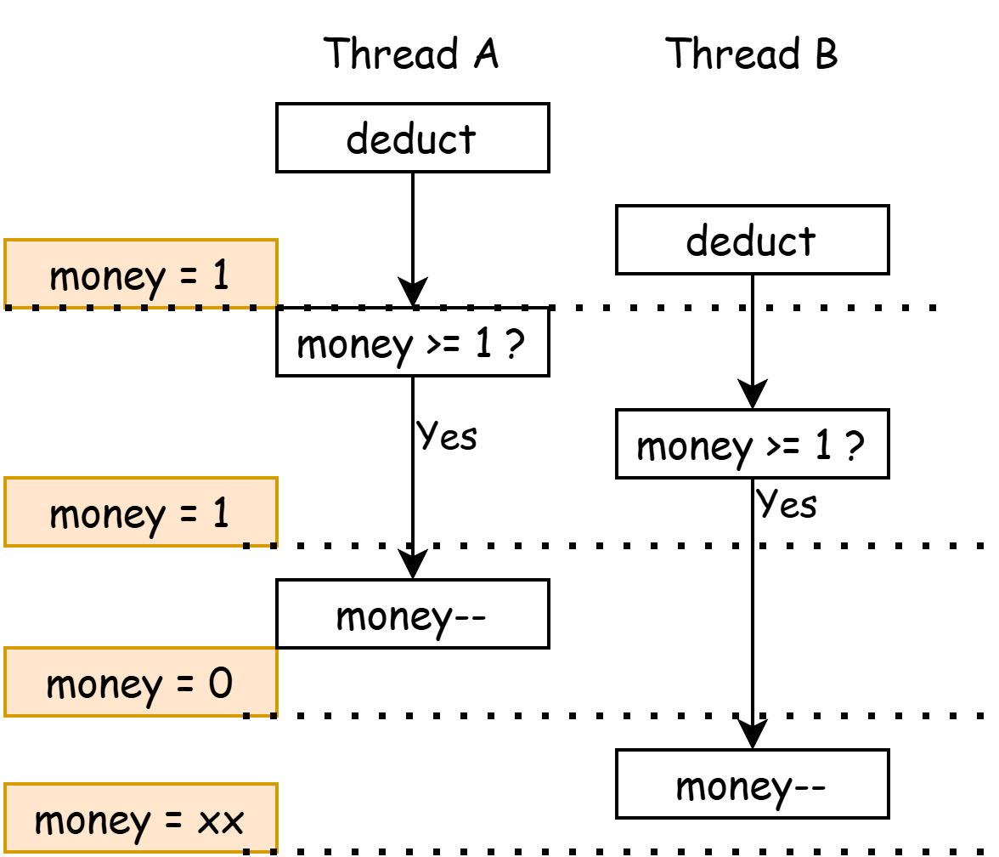

# Mutual Exclusion & Synchronization

## Multiple Processes Programming

> Multiple Processes Programming 多处理器编程，从入门到放弃。

我们常说：进程有独立的地址空间，而线程是共享地址空间。这引入了 **共享内存** 的概念：即一个进程内的多个线程，会共享一部分内存空间。

这就会引入一个问题：当一个线程在读写一个内存地址时，另一个线程也在读写同一个内存地址，那这时候会发生什么？

## 互斥 Mutual Exclusion

!!!info "函数声明"
    我们会在之后的代码中使用一些简化的函数来表示线程创建等步骤：

    - `create(func)`: 创建一个线程，它从给定的函数 `func` 起开始运行。

    - `join()`: 等待所有线程退出。

    - `usleep()`: 等待几个us。

在理解我们为什么需要互斥前，我们先要明白 Data Race (数据竞争) 是怎么回事。

### 山寨支付宝

!!!info "code"

    ```c
    #include "thread.h"

    unsigned long money = 30;

    void deduct() {
        if (money >= 1) {
            usleep(1);
            money -= 1;
        }
    }

    void main() {
        for (int i = 0; i < 100; i++) create(deduct);
        join();
        printf("money = %lu\n", money);
    }
    ```

    使用 `gcc -O2 alipay.c && ./a.out` 编译并运行，体验一把亿万富翁。

    ```
    $ gcc -O2 alipay.c && ./a.out
    money = 18446744073709551547
    ```

山寨支付宝会创建100个线程，每个线程都检查钱包中是否有钱，如果有那就扣款（局部序）。`usleep` 用于强制触发一段时间的等待。

在这个问题中，钱包 `money` 即是共享资源。我们会发现，`money` 突然变成了一个很大的值，这是因为我们对 `unsigned long` 进行减法导致了溢出。我们考虑如下运行图，对所有白色方块强制排序（全局序）：



在最坏的情况下，钱包里只剩下1元时，两个线程都检查到了钱包余额为1元，所以它们俩都进行了扣款，然后就导致了溢出。

!!!info "数学模型下的多线程"
    将 `money >= 1 ?` 和 `money--` 两步骤称为 A 与 B。A永远在B之前执行，我们写作 `A > B` （ `A` happens-before `B` ）。
    
    我们发现，多线程的运行步骤（全局序）是每个线程的运行步骤（局部序）的一个排列 (Permutation)。
    
    全局序是四个步骤 `{A1, B1, A2, B2}` 进行排列，其中满足局部序 `A1 > B1` 和 `A2 > B2` 的排列均是一个合法的全局序。
    例如，`(A1, B1, A2, B2)`, `(A2, B2, A1, B1)`, `(A1, A2, B1, B2)` 均是合法的全局序，而后者即是 bug 的根源。

    如果你感兴趣，你可以试着回答这个问题：我们可以从数学上验证一个多线程程序的正确性，即枚举所有全局序，验证它们都不会造成 bug。从计算复杂性理论 (Computational complexity theory) 的角度而言，解这个问题是 P 问题、NP 问题、还是 NP完全问题。

如果我们不在 `if (money >= 0)` 后面加上 `usleep`，我们会发现程序的运行结果 **大概率** 是正确的。这是因为检查和扣款的指令序列太短了，以至于我们不太可能会造成 data race。但是，不太可能 != 绝对不会。在考虑并发问题时，我们需要的是正确性。

数学模型中，`(A1, A2, B1, B2)` 表示线程1和线程2都识别到了 `money == 1`，并且都将执行 `money--`。所以，解决这个问题的方式就是：不要让 `(A, B)` 变得可分割。我们可以从多个视角来理解：

1. 我们不再允许 `(A1, B1)`, `(A2, B2)` 交错，即我们将 `(A1, A2, B1, B2)` 这种情况排除出“合法的全局序”中。

2. 我们可以将 `(A, B)` 打包 **一个不可中断的整体**。即，在其他CPU的视角下，这两个事件是在一瞬间就发生完了的（即原子的 (Atomic)）。也就是说，其他CPU不可能看到这个整体的中间状态。

3. 注意到第二种描述，实际上就是 Critical Section。

!!!info "Takeaway Message"
    人是一种单线程生物。在多处理器编程的模型下，单线程思维不再一定正确了，共享变量有可能在任何时刻被别人更改。

### 单核处理器

如果你成功理解了上述的三个视角，在单 CPU 下，解决方案变得非常明朗：我们不允许在 `(A, B)` 中间产生 Context Switch。这即是我们所学习的第一种实现互斥的方式：关中断。这也是内核实现 "不可中断的整体" 的方式。

但是，需要注意到关中断不是万能的。**用户模式关不了中断**。（回忆：允许 Interrupt 的条件）

### 原子 Compare-And-Swap 指令

对于山寨支付宝的例子，我们可以从另一个角度理解为什么会出问题：当线程2检查完 `money`，在进行 `money--` 前，`money`的值已经被线程1改了；这时，线程2进行 `money--` 的条件就不再满足了！

我们可以对此进行进一步抽象：要修改某个变量（内存地址）的值时，该变量的值已经不是原来的值了。

幸运的是，现代 CPU 基本都具有一种特殊的指令：当修改某个地址的值时，检查该地址的值是否为给定的原来的值。这种指令被称为 Compare-And-Swap 指令。绝大多数情况，这种指令会被以 **原子的** 方式执行；即，在其他 CPU 的眼里，该指令是 **一瞬间** 就完成的。

我们可以把 `deduct` 函数改成下面这样，它显著地区分了共享变量 `money` 和它的局部副本 `local_money`。每当想修改 `money` 的值时，我们使用 `__sync_bool_compare_and_swap(&money, local_money, local_money - 1)` 来修改 `&money` 这个内存地址的值，并且期望它现在的值和原来我们读到的值 ( `local_money` ) 一致：如果一致，则将 `&money` 修改为新值（ `local_money-1` ），并返回true; 如果不一致，则说明有其他 CPU 对该内存进行了更新，不更新值，并返回false。该函数会生成一条原子指令 `lock cmpxchg` 。在 RISC-V 平台上，这会是一条 `amoswap` 指令。

```c
// bool __sync_bool_compare_and_swap (type *ptr, type oldval, type newval). 
//   -> return true if the comparison is successful and newval is written.
unsigned long money = 30;

void deduct() {
    long local_money;
    do {
        local_money = money;
        if (local_money == 0)
            break;
        usleep(1);
    } while(!__sync_bool_compare_and_swap(&money, local_money, local_money - 1));
    // will be compiled to: 
    // 124e:       f0 48 0f b1 15 f1 2d     lock cmpxchg QWORD PTR [rip+0x2df1],rdx
}
```

gcc 下所有 __sync_ 开头的内置原子指令封装：https://gcc.gnu.org/onlinedocs/gcc-14.2.0/gcc/_005f_005fsync-Builtins.html

### 锁原语 Lock Primitive

尽管我们可以使用 __sync 等原子指令来解决山寨支付宝的例子，我们仍需要一种通用的、实现互斥的办法。

回顾 Mutual Exclusion 的最基本要求：同一时刻，有且只有一个线程能够执行。我们定义一套原语：`lock`/`unlock` （也可以写作 `acquire`/`release` ）：

1. 所有期望实现 Mutual Exclusion 的线程都需要调用 `lock` 方法。在同一时刻，只能有一个线程将从 `lock` 方法中返回。

2. 当某线程成功从 `lock` 方法中返回后，在该线程调用 `unlock` 前，其他所有线程不得从 `lock` 中返回。

我们可以发现：从 `lock` 返回后，即是 Critical Section 的开始，`unlock` 即是 Critical Section 的结束。

### 锁的实现

我们可以想当然地写出以下代码，`status` 是一个共享变量，多个线程同时调用 `lock` 方法，尝试把 `status` 改为 `LOCKED`。最终，只有一个线程成功执行到 `status = LOCKED` 处，其他线程都在 `retry` 中打转。

```c
int status = UNLOCKED;

void lock() {
retry:
    if (status != UNLOCKED) {
        goto retry;
    }
    status = LOCKED;
}

void unlock() {
    status = UNLOCKED;
}
```

但是，如果我们按照上述山寨支付宝例子进行分析，我们可以很容易地发现一处 data race：当某个线程通过了 `if (status != UNLOCKED)` 检查后，另一个线程执行了 `status = LOCKED` 处，这破坏了该线程上锁的条件。

所以，我们应该使用一个原子指令来替代 Compare and Set 这一步：每个线程都尝试原子地将 `status` 从 `UNLOCKED` 改为 `LOCKED`，CPU的实现保证了只有一个 CPU 能成功。对于那些没有成功的 CPU，它们会在这个 while 循环上一直等待。

```c
void lock() {
    while(!__sync_bool_compare_and_swap(&status, UNLOCKED, LOCKED));
}
```

!!!warning "如果没有原子指令"
    这也是为什么 Peterson 算法看起来比较复杂。在第一个正确的互斥算法(Dekker's Alg) 被发明的年代 (1960s)，CPU 还没有原子指令。

### spinlock & sleeplock

在上面的章节，我们只定义了锁的一个基本属性：实现互斥。锁还有一个属性：如果一个线程抢不到锁，那它应该怎么办。

我们可以将锁分为两类：自旋锁 (`spinlock`) 和睡眠锁 (`sleeplock`)。

`spinlock` 会在抢不到锁的时候一直尝试抢，即上述 `lock` 方法，它会在 `__sync_bool_compare_and_swap` 失败时一直执行，CPU 就会在这一条指令上打转，就好像自旋一样。这种锁适用于 Critical Section 较短、能在固定时间内执行完毕的情况。

`sleeplock` 会在抢不到锁时将该线程置于睡眠状态 `SLEEPING`，并放弃 CPU 切换到 `scheduler`。等到原来持有锁的线程释放锁时，它需要负责唤醒等待者。这种锁适用于 Critical Section 较长、有着不确定时间的情况，例如等待 I/O。

在 **唤醒等待者** 这件事情上，`sleeplock` 可以用不同的实现方式：

1. 直接唤醒所有的等待者，只有抢到锁的线程能继续执行下去，没抢到锁的重新进入睡眠。

2. 只唤醒一个等待者，其余的保持睡眠。

### xv6 spinlock

xv6 中，一个 `spinlock_t` 结构体包含最核心的一个 `locked` 标志，和其他用于调试的字段。

`acquire` 一个 `spinlock_t` 会使用 `__sync_lock_test_and_set`（原子指令 `amoswap`） 尝试将 1 写入 `locked`，并返回之前 `locked` 的值。如果返回值为0，则表示该 CPU 是唯一一个完成了将 `locked: 0->1` 的 CPU，即抢到锁了。

`release` 则原子地将 0 写入 `locked`。

```c
// Mutual exclusion lock.
struct spinlock {
    uint64 locked;  // Is the lock held?, use AMO instructions to access this field.

    // For debugging:
    char *name;       // Name of lock.
    struct cpu *cpu;  // The cpu holding the lock.
    void *where;      // who calls acquire?
};

// Acquire the lock.
// Loops (spins) until the lock is acquired.
void acquire(spinlock_t *lk)
{
	uint64 ra = r_ra();
	push_off();         // disable interrupts to avoid deadlock.
	if (holding(lk))    // check against reentrance
		panic("already acquired by %p, now %p", lk->where, ra);

	// On RISC-V, sync_lock_test_and_set turns into an atomic swap:
	//   a5 = 1
	//   s1 = &lk->locked
	//   amoswap.d.aq a5, a5, (s1)
	while (__sync_lock_test_and_set(&lk->locked, 1) != 0)
		;

	__sync_synchronize();

	// Record info about lock acquisition for holding() and debugging.
	lk->cpu = mycpu();
	lk->where = (void *)ra;
}

// Release the lock.
void release(spinlock_t *lk)
{
	if (!holding(lk))
		panic("release");

	lk->cpu = 0;
	lk->where = 0;

	__sync_synchronize();

	// Release the lock, equivalent to lk->locked = 0.
	// On RISC-V, sync_lock_release turns into an atomic swap:
	//   s1 = &lk->locked
	//   amoswap.w zero, zero, (s1)
	__sync_lock_release(&lk->locked);

	pop_off();
}

// Check whether this cpu is holding the lock.
// Interrupts must be off.
int holding(spinlock_t *lk)
{
	int r;
	r = (lk->locked && lk->cpu == mycpu());
	return r;
}
```

!!!info "__sync_synchronize() & Memory Ordering"
    我们在讲解中刻意忽略了 `__sync_synchronize()` 的细节。该函数与 CPU 的 Memory Ordering (内存序) 有关，其原理和细节已经超出了本科操作系统课程的范畴。

    简而言之，核心对内存的写入，会最终 (eventually) 对其他核心可见。Relaxed Memory Order (RISC-V, ARM) 没有保证：某核心前后两个 Store 在被其他核心 Load 时，观测到的值一定是 Store 在代码中的顺序。
    而 x86 (IA-32, amd64) 平台为 Total Store Order，核心 Store 的顺序在其他核心的视角下一定为 Store 在代码中的顺序。这也是 Windows on ARM 难以模拟 x86 软件的原因。

    再简而言之，其他核心会先观测到锁被释放，然后观测到理应在 Critical Section 中被覆盖的旧值。

    如果你对此感兴趣，推荐阅读以下材料：

    1. https://jyywiki.cn/OS/2025/lect13.md (13.4 放弃 (3)：全局的指令执行顺序)

    2. riscv-spec-v2.1.pdf, Section 6.1, Specifying Ordering of Atomic Instructions

    3. https://blog.cyyself.name/memory-ordering/

    4. https://people.mpi-sws.org/~viktor/papers/asplos2023-atomig.pdf

### 关中断

我们使用 `push_off()` 和 `pop_off()` 表示一对 关中断/开中断的操作。具体细节请参照 Context Switch 一章。

### 锁的检查

如果我们在已经持有一把锁的情况下，再尝试对这把锁上锁会怎么样？我们会永远卡在上锁的 spin loop 中。
以及，在一个进程持有一把锁并陷入睡眠时，其他进程尝试上锁也会永远卡死。

这就是为什么我们在 `sched()` 中检查了当前 CPU 持有了多少把自旋锁。

```c
void sched() {
    // ...
    
    if (mycpu()->noff != 1)
        panic("holding another locks");
    
    swtch(&p->context, &mycpu()->sched_context);
    // ...
}
```

对于 Kernel Trap，我们不希望出现嵌套中断。
我们会在 `kernel_trap` 中检查 Trap 深度，如果遇到了嵌套中断，则panic报错。

```c
void kernel_trap(struct ktrapframe *ktf) {
    mycpu()->inkernel_trap++;

    if (cause & SCAUSE_INTERRUPT) {
        if (mycpu()->inkernel_trap > 1) {
            // should never have nested interrupt
            print_sysregs(true);
            print_ktrapframe(ktf);
            panic("nested kerneltrap");
        }
    }
}
```

我们需要确保在 `kernel_trap` 下中断一直为关的。所以，当我们尝试在 Kernel Trap 上下文中通过释放锁打开中断，内核也会报错：

```c
void pop_off(void) {
    struct cpu* c = mycpu();
    c->noff -= 1;
    if (c->noff == 0 && c->interrupt_on) {
        if (c->inkernel_trap)
            panic("pop_off->intr_on happens in kernel trap");
        
        // we will enable the interrupt, must not happen in kernel trap context.
        intr_on();
    }
}
```

## 互斥与同步

互斥 (Mutual Exclusion) 是指 **在同一时刻，只有一个线程** 能够执行。

同步 (Synchronization) 是指多个线程之间的事件 **按某种顺序执行** ，我们称之为 `happens-before`。

我们可以用现实的例子来描述这两件事情。

1. 考虑有一个厕所单间，有许多人需要上厕所。但是，在同一时刻，只有一个人能呆在这个厕所单间里面。

    这个问题中，“厕所” 即是共享资源。

2. 考虑一个十字路口的红绿灯：每个方向上，有机动车道的红绿灯；与之垂直的，有人行斑马线的红绿灯。我们要求，在机动车道亮绿灯前，与之垂直的斑马线一定已经亮红灯。

    这个问题中，我们定义了 `斑马线亮绿灯` happens-before `机动车道亮红灯`。

我们需要注意到，互斥并不一定代表着同步：例如 A、B、C 三个事件互斥，这表示它们不能同时执行；但这并不代表着它们执行的顺序一定是 A > B > C。

## 同步 Synchronization

**同步** 表示我们希望控制事件发生的先后顺序：A > B > C，形成受我们控制的 "happens-before" 关系。

### 理解同步

同步通常用 **等待** 来描述。

例如，三个人一起约饭，他们先约定在一号门集合，再一起前往宝能城。在这样的表述中，三人就 "在一号门集合" 这件事情上完成了同步。对于每个人而言，它需要等待另外两个人到来，才执行下一个操作：前往宝能城。

事件即是代码的执行，而顺序则是每条代码之间的 "happens-before" 关系。

- 在单线程程序中，代码是天然地按照顺序 "happens-before"。
- 在多线程程序中，同一个线程中的事件（代码的执行）仍然保持着它们的 "happens-before" 关系；而不同线程之间的事件（代码的执行）则没有任何约束。

同步则是让不同线程之间，在某个事件（代码的执行）点上，重新构建 "happens-before" 关系。


我们依然用 `A > B` 表示 `A happens-before B`。我们可以分别列出 T1 和 T2 的内部的 "happens-before" 关系：

- T1: `A > B`, `B > sync`, `sync > C`, `C > D`

- T2: `E > F`, `F > sync`, `sync > G`, `G > H`

假设 T1 和 T2 在 `sync` 这个事件上完成了同步，那么，我们实现了不同线程之间的 "happens-before" 关系： `B > sync > G`, `F > sync > C`。

### 条件变量

假设我们有三个线程，它们各自死循环地执行 A、B、C 三个函数，我们期望这三个函数总是以 `A -> B -> C -> A` 的顺序被运行：


考虑 T2，它什么时候能执行 `B` ？我们要求 `A` happens-before `B`：**只有 `A` 事件发生后，`B` 才能得到执行**。

我们非常顺利地写出了 `B` **能够执行的条件**。我们因此也将同步问题转换成了：**检查条件是否满足**。

```c
int last = 'C';

void T1() {
    while (1) {
        while (last != 'C');    // wait for last == 'C'
        A();
        last = 'A';
    }
}

void T2() {
    while (1) {
        while (last != 'A');    // wait for last == 'A'
        B();
        last = 'B';
    }
}

void T3() {
    while (1) {
        while (last != 'B');    // wait for last == 'B'
        C();
        last = 'C';
    }
}
```

接下来，我们首先需要考虑两个问题：如何正确设置 Critical Section，以及在等待条件时应该干什么。

`last` 状态变量显然是一个共享变量，它会被三个线程分别读写。所以，对它的访问需要加锁保护。

```c
mutex_t mtx;
int last = 'C';

void T1() {
    while (1) {
        lock(&mtx);
        while (last != 'C');    // wait for last == 'C'
        A();
        last = 'A';
        unlock(&mtx);
    }
}
```

而在 `while` 等待循环中，我们 **不能一直持有互斥锁 mtx** ，因为我们需要其他线程来更改 `last` 状态变量。
所以，我们在判断条件后，如果发现条件不满足，则释放锁并将自己陷入睡眠，并在自己被唤醒后重新上锁。
因此，在修改条件后，我们需要唤醒所有人来再次检查条件。

这样的设计满足了两个要求：

1. 检查同步条件 `last` 时，当前线程持有锁。
1. 同步条件检查通过后，当前线程持有锁（即执行 `A` 的部分）。

```c
mutex_t mtx;
int last = 'C';

void T1() {
    while (1) {
        lock(&mtx);
        while (last != 'C') {
            unlock(&mtx);
            sleep(myself);
            lock(&mtx);
        }
        A();
        last = 'A';
        unlock(&mtx);
        wakeup(all);
    }
}
```

但是，这里面存在一点问题，考虑如下的执行图，黄色部分为 Critical Section，它们的执行是不可与其他线程的 Critical Section 重叠的。


在某种情况下，T1 `unlock` 后并没有立即陷入 `sleep`，反而 T2 在 `lock` 得到锁后先一步调用了 `wakeup`，而此时 T1 还没有陷入睡眠，自然也不会被唤醒。而在 T1 睡眠后，再也没有线程能够唤醒它了，至此，所有的线程都进入了睡眠模式。

我们将这种问题称为 "The Lost Wake-Up Problem".

这种问题的根本原因是：我们在标记自己为 SLEEPING 前，就将 `mtx` 解锁了。但是我们又不能先 `sleep()` 再 `unlock()`，因为 `sleep` 不会在被唤醒前返回，即 `unlock()` 永远不会被执行到。

所以，我们需要将 "标记自己为 SLEEPING" 和 "解锁 mtx" 两件事情视为一个整体，即将 "标记自己为 SLEEPING" 纳入 Critical Section。

至此，我们应该就能理解为什么 xv6 中的 `sleep` 方法，参数中包含一个 `spinlock_t*` 了。

注：在 xv6 中，访问 `p->state` 必须要持有 `p->lock`，所以 "标记自己为 SLEEPING"（或者说，别人发现我是 SLEEPING） 和 `acquire(&p->lock)` 是等价的。

```c
void sleep(void *chan, spinlock_t *lk) {
    struct proc *p = curr_proc();

    // Must acquire p->lock in order to
    // change p->state and then call sched.
    // Once we hold p->lock, we can be
    // guaranteed that we won't miss any wakeup
    // (wakeup locks p->lock),
    // so it's okay to release lk.

    acquire(&p->lock);  // DOC: sleeplock1
    release(lk);

    // Go to sleep.
    p->sleep_chan = chan;
    p->state      = SLEEPING;

    sched();

    // p get waking up, Tidy up.
    p->sleep_chan = 0;

    // Reacquire original lock.
    release(&p->lock);
    acquire(lk);
}
```


!!!info "为什么不用原子指令替代条件检查"
    因为真实情况下的条件可能没有简单到能使用一条原子指令表示，我们还是希望使用互斥锁（更加通用）来保护对条件的访问。

## Lab 练习

1. 假设 `sum` 是一个共享变量，有三个线程并发地执行 `T_sum` 函数，那么等三个线程退出后，`sum` 可能的最小值是什么？

    Hint: 怎么证明某个值是可能的最小值：1. 所有比它小的值都不可能。2. 存在某种并发顺序，使得产生该最小值的序列是合法的

    ```c
    int sum = 0;
    void T_sum() {
        for (int i = 0; i < 3; i++) {
            int t = load(sum);
            t += 1;
            store(sum, t);
        }
    }

    int main() {
        for (int i = 0; i < 3; i++) create(T_sum);
        join();
        printf("sum = %d\n", sum);
    }
    ```

2. 使用 gcc 内置的原子 CAS 函数 `__sync_bool_compare_and_swap` 来解决多线程自增的问题。

    ```c
    volatile int sum = 0;

    void T_sum() {
        for(int i=0;i < 10000; i++) {
            // your code here: increase sum atomically.

        }
    }

    int main() {
        for (int i=0;i<5;i++) create(T_sum);
        join();
        printf("sum = %d\n", sum);
    }
    ```

    gcc 的文档：https://gcc.gnu.org/onlinedocs/gcc-14.2.0/gcc/_005f_005fsync-Builtins.html


3. 在 "条件变量" 一章的末尾，T2 的 `wakeup` 可以移出 `lk` 的 Critical Section 吗？即 T2 先 `release(lk)` 再 `wakeup()`。

4. 假设有两种线程，每种线程若干个：第一种线程死循环地打印左括号 `(`，第二种线程死循环地打印右括号 `)`。现在要求：打印出来的字符串是平衡的括号（或中间状态），如 `()(())`，最多允许 N 层嵌套括号。

    例如：
    - `()((()))` 是一个合法的平衡括号。
    - `())` 不是一个合法的平衡括号。
    - `((()` 是一个嵌套深度为 2 的平衡括号的中间状态。

    已知有一个变量表示：目前左括号比右括号多了几个。请你写出这两种线程的同步条件。即，每种线程在什么时候可以打印 `(` 或 `)`。

    这两种线程会一直打印，你不需要考虑程序 Ctrl C 结束时产生的字符串是否为一个完整的平衡括号，这时的字符串可以是一个平衡括号的中间状态。