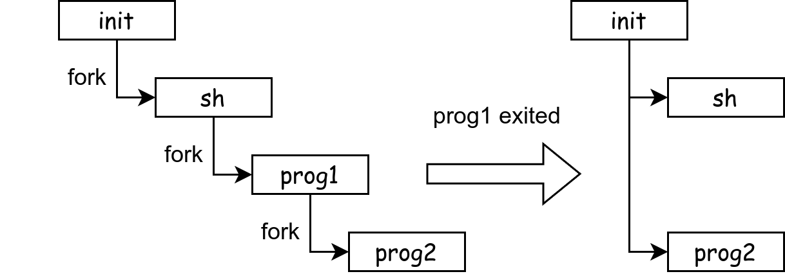
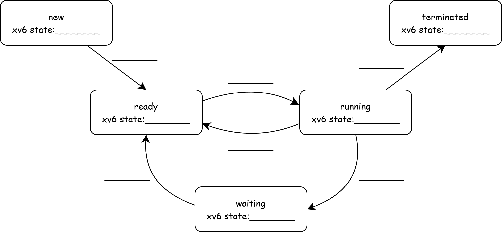
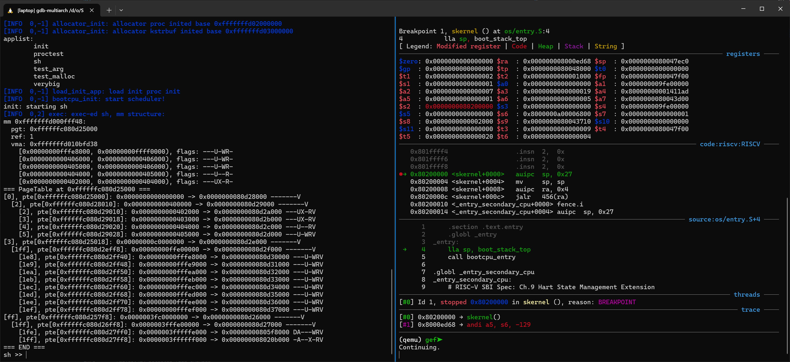
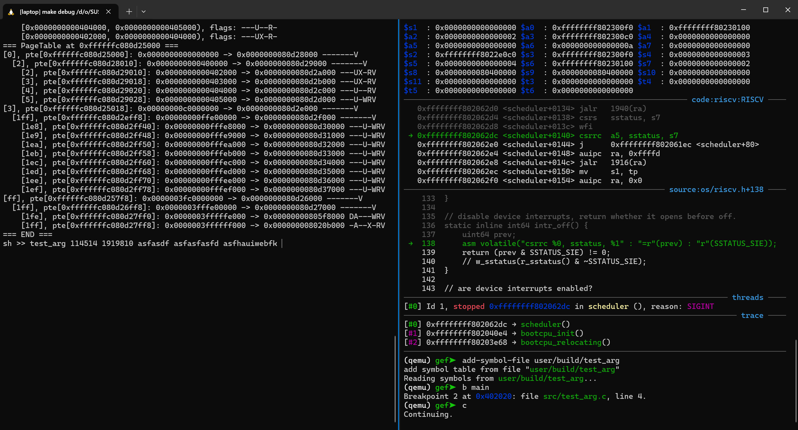
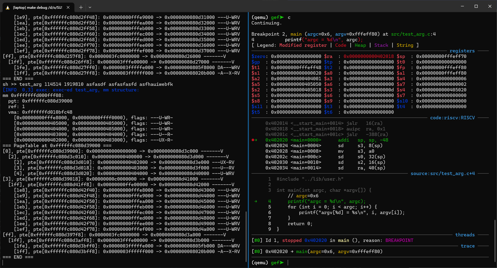

# User Process

## Lab Objectives

1. Understand user address space
2. Master the implementation principles of fork\exec\exit\wait

!!!warning "xv6-lab6 Code Branch"
    
    https://github.com/yuk1i/SUSTech-OS-2025/tree/xv6-lab6

    Use the command `git clone https://github.com/yuk1i/SUSTech-OS-2025 -b xv6-lab6 xv6lab6` to download the xv6-lab6 code.

    Use `make run` to run the kernel for this Lab, which will start the first user process `init`, and `init` will start the Shell process `sh`.

    You will see the user space structure of the `sh` process.

    ```
    init: starting sh
    [INFO  0,2] exec: exec-ed sh, mm structure:
    mm 0xfffffffd000fff48:
    pgt: 0xffffffc080d25000
    ref: 1
    vma: 0xfffffffd010bfd38
        [0x00000000fffe8000, 0x00000000ffff0000), flags: ---U-WR-
        [0x0000000000406000, 0x0000000000406000), flags: ---U-WR-
        [0x0000000000405000, 0x0000000000406000), flags: ---U-WR-
        [0x0000000000404000, 0x0000000000405000), flags: ---U--R-
        [0x0000000000402000, 0x0000000000404000), flags: ---UX-R-
    === PageTable at 0xffffffc080d25000 ===
    ...
    ```

    **Note:** The initialization code for `struct mm` in this Lab has been modified compared to the previous Lab code.

## Address Space

First, let's review how the address space in U-mode is described from the perspective of the kernel and CPU.

For the CPU, all memory accesses in U-mode, including instruction fetch (IF), memory read (LD), and memory write (ST), must go through page table address translation. The CPU uses the CSR `satp` as the base address of the page table for address translation.

Therefore, the kernel needs to set up a page table structure for user processes. In the kernel, we use `struct mm` to manage user memory, and each PCB `struct proc` has a pointer `*mm` pointing to `struct mm`.

```c
// os/vm.h
struct mm {
    spinlock_t lock;

    pagetable_t __kva pgt;
    struct vma* vma;
};
```

Each `struct mm` contains a page table `pgt`, which is the `satp` used by the user process. We can observe this in `usertrapret` and trampoline:

```c
// os/trap.c
void usertrapret() {
    // ...

    // tell trampoline.S the user page table to switch to.
    uint64 satp  = MAKE_SATP(KVA_TO_PA(curr_proc()->mm->pgt));      // <--
    uint64 stvec = (TRAMPOLINE + (uservec - trampoline)) & ~0x3;

    // jump to userret in trampoline.S at the top of memory, which
    // switches to the user page table, restores user registers,
    // and switches to user mode with sret.
    uint64 fn = TRAMPOLINE + (userret - trampoline);
    ((void (*)(uint64, uint64, uint64))fn)(TRAPFRAME, satp, stvec);
}

// os/trampoline.S
.globl userret
userret:
        # userret(TRAPFRAME, pagetable, stvec)
        # switch from kernel to user.
        # usertrapret() calls here.
        # a0: TRAPFRAME, in user page table.
        # a1: user page table, for satp.
        # a2: uservec

        # switch to the user page table.
        csrw satp, a1
        sfence.vma zero, zero
```

From the kernel's perspective, **the user's memory space consists of several contiguous virtual address regions**. Each contiguous region is represented by a `struct vma` (Virtual Memory Area), and they are linked together in a list. Each `vma` contains the start and end addresses of the region (aligned to page boundaries) and the permissions for the region.

```c
// os/vm.h
struct vma {
    struct mm* owner;
    struct vma* next;   // linked list   
    uint64 vm_start;    // start address (user virtual address)
    uint64 vm_end;      // end address   (user virtual address)
    uint64 pte_flags;   // flags
};
```

Note that `struct vma` contains a `struct mm*` pointer, indicating that each VMA belongs to a `struct mm`.

### Loading

A user **program** specifies which contiguous regions (also called segments) it needs to load during loading. 
The following is the output of `llvm-readelf-19 -a user/build/sh`, showing that the `sh` program requires three contiguous regions when loading (LOAD):

```
Elf file type is EXEC (Executable file)
Entry point 0x402000
There are 4 program headers, starting at offset 64

Program Headers:
  Type           Offset   VirtAddr           PhysAddr           FileSiz  MemSiz   Flg Align
  ATTRIBUTES     0x00c3dc 0x0000000000000000 0x0000000000000000 0x000061 0x000000 R   0x1
  LOAD           0x001000 0x0000000000402000 0x0000000000402000 0x0011f4 0x0011f4 R E 0x1000
  LOAD           0x003000 0x0000000000404000 0x0000000000404000 0x0000cd 0x0000cd R   0x1000
  LOAD           0x004000 0x0000000000405000 0x0000000000405000 0x000020 0x0007d0 RW  0x1000
```

We can use the `mm_print` function in the `exec` function in `os/proc.c` to print the `struct mm` structure and `pgt` page table of the **process** after `sh` is loaded.

```
mm 0xfffffffd000fff88:
  pgt: 0xffffffc080b14000
  ref: 1
  vma: 0xfffffffd010bfe28
    [0x00000000fffe8000, 0x00000000ffff0000), flags: ---U-WR-
    [0x0000000000406000, 0x0000000000406000), flags: ---U-WR-
    [0x0000000000405000, 0x0000000000406000), flags: ---U-WR-
    [0x0000000000404000, 0x0000000000405000), flags: ---U--R-
    [0x0000000000402000, 0x0000000000404000), flags: ---UX-R-
=== PageTable at 0xffffffc080b14000 ===
[0], pte[0xffffffc080b14000]: 0x0000000000000000 -> 0x0000000080b22000 -------V
  [2], pte[0xffffffc080b22010]: 0x0000000000400000 -> 0x0000000080b23000 -------V
    [2], pte[0xffffffc080b23010]: 0x0000000000402000 -> 0x0000000080b21000 ---UX-RV
    [3], pte[0xffffffc080b23018]: 0x0000000000403000 -> 0x0000000080b20000 ---UX-RV
    [4], pte[0xffffffc080b23020]: 0x0000000000404000 -> 0x0000000080b1f000 ---U--RV
    [5], pte[0xffffffc080b23028]: 0x0000000000405000 -> 0x0000000080b1e000 ---U-WRV
[3], pte[0xffffffc080b14018]: 0x00000000c0000000 -> 0x0000000080b18000 -------V
  [1ff], pte[0xffffffc080b18ff8]: 0x00000000ffe00000 -> 0x0000000080b19000 -------V
    [1e8], pte[0xffffffc080b19f40]: 0x00000000fffe8000 -> 0x0000000080b1d000 ---U-WRV
    [1e9], pte[0xffffffc080b19f48]: 0x00000000fffe9000 -> 0x0000000080b1c000 ---U-WRV
    [1ea], pte[0xffffffc080b19f50]: 0x00000000fffea000 -> 0x0000000080b1b000 ---U-WRV
    [1eb], pte[0xffffffc080b19f58]: 0x00000000fffeb000 -> 0x0000000080b1a000 ---U-WRV
    [1ec], pte[0xffffffc080b19f60]: 0x00000000fffec000 -> 0x0000000080b24000 ---U-WRV
    [1ed], pte[0xffffffc080b19f68]: 0x00000000fffed000 -> 0x0000000080b25000 ---U-WRV
    [1ee], pte[0xffffffc080b19f70]: 0x00000000fffee000 -> 0x0000000080b26000 ---U-WRV
    [1ef], pte[0xffffffc080b19f78]: 0x00000000fffef000 -> 0x0000000080b27000 ---U-WRV
[ff], pte[0xffffffc080b147f8]: 0x0000003fc0000000 -> 0x0000000080b15000 -------V
  [1ff], pte[0xffffffc080b15ff8]: 0x0000003fffe00000 -> 0x0000000080b16000 -------V
    [1fe], pte[0xffffffc080b16ff0]: 0x0000003fffffe000 -> 0x0000000080b17000 DA---WRV
    [1ff], pte[0xffffffc080b16ff8]: 0x0000003ffffff000 -> 0x000000008020b000 -A--X-RV
=== END === 
```

We can observe that in the vma linked list, three regions correspond to the LOAD segments in the ELF file, which are the `.text`, `.rodata`, and `.data/.bss` segments.
```
    [0x0000000000402000, 0x0000000000404000), flags: ---UX-R-
    [0x0000000000404000, 0x0000000000405000), flags: ---U--R-
    [0x0000000000405000, 0x0000000000406000), flags: ---U-WR-
```

Another address starting with `0xfffe` is the stack area of the process.
```
    [0x00000000fffe8000, 0x00000000ffff0000), flags: ---U-WR-
```

Additionally, there is a region of size 0, which follows all LOAD segments. This is the heap area (Heap, known as `Program Break` in ancient operating systems). The process needs to use the `sbrk` system call to expand or shrink the heap area.

```
    [0x0000000000406000, 0x0000000000406000), flags: ---U-WR-
```

### Overview Diagram

This diagram shows the data structures used by the kernel to manage the user address space of the `sh` process.


## fork

The fork system call is used in the operating system to create a new process. When a process calls fork, it creates a new process (called the child process) that is almost identical to the parent process. The child process copies the parent process's address space and all register values. The only difference is the return value of the fork call:

- Parent process: fork returns the PID (process ID) of the child process.

- Child process: fork returns 0.

The implementation of `fork` in xv6 is located in the `fork` function in `os/proc.c`. Here is a simplified version:

```c
int fork() {
    int ret;
    struct proc *np = allocproc();  // child process
    struct proc *p = curr_proc();   // parent process

    // create a new struct mm for child process
    np->mm = mm_create(np->trapframe);

    // Copy user memory from parent to child.
    mm_copy(p->mm, np->mm);

    // copy saved user registers.
    *(np->trapframe) = *(p->trapframe);

    // Cause fork to return 0 in the child.
    np->trapframe->a0 = 0;
    np->parent        = p;

    // add the child process to scheduler
    np->state         = RUNNABLE;
    add_task(np);

    return np->pid; // return value for the parent process
}
```

The caller of `fork` is the parent process, and the new PCB allocated with `allocproc` is the child process. We modify the trapframe of `np` to ensure that the two processes have different return values. Note that we do not modify the trapframe of `p` because the `syscall` function will write the return value of the `fork` function into the `a0` register in the trapframe when dispatching the system call. We only need to make `fork` return the PID of the child process.

The `mm_copy` function (located in `os/vm.c`) ultimately implements the copying of all `vma`s: it creates new `struct vma`s under the new `mm`, assigns the attributes in `vma`, calls `mm_mappages` to map the `vma`, and finally copies the actual memory data.

!!!warning "Trapframe and Trampoline"
    In the overview diagram, we can see that the user page table includes Trapframe and Trampoline, but the `vma` linked list does not include these two pages. This design is intentional, not a bug.

    Consider the **lifecycle** of `vma` (user's Virtual Memory Area). The `exec` system call will delete all existing user memory mappings and replace them with new ones, but the PCB (i.e., `struct proc`) object does not need to be destroyed and recreated, and the Trapframe does not seem to require reallocation of physical pages.
    
    Therefore, the lifecycle of Trapframe and Trampoline is actually consistent with the process itself, not with any `vma` entry.

    In implementation, we allocate the Trapframe page during system initialization, i.e., in `proc_init`, and map Trampoline and Trapframe in `create_mm`.

## exec

The exec system call is used to execute a new program and replace the current process's memory space with the new program. Unlike fork, exec does not create a new process but replaces the current process's code, data, and stack with a new program.

When exec is called, the current process's address space is replaced by the new program's code and data. The original process's code, data, and stack are cleared, and the new program is loaded. Then, the current process's execution flow jumps to the new program's entry point and continues executing the new program's code.

```c
int exec(char *name, char *args[]) {
    struct user_app *app = get_elf(name);

    struct proc *p = curr_proc();

    // execve does NOT preserve memory mappings:
    //  free VMAs including program_brk, and ustack
    // load_user_elf() will create a new mm for the new process and free the old one
    //  , if page allocations all succeed.
    // Otherwise, we will return to the old process.
    // However, keep the phys page of trapframe, because it belongs to struct proc.
    load_user_elf(app, p, args);

    // syscall() will overwrite trapframe->a0 to the return value.
    return p->trapframe->a0;
}
```

The `load_user_elf` function has been modified compared to the previous Lab. We need to note that **allocating physical pages may fail**. When the system does not have enough memory, the `exec` function fails to execute, and we need to return to the original process to continue execution, releasing the half-allocated memory.(Avoid memory leaks)

Therefore, we create a new `struct mm` and load the segments from the ELF file and the process stack into it. Only after we no longer need to allocate memory (`mm_mappages`) do we clear and overwrite `p->mm`.

```c
// os/loader.c, Simpilfied version.
int load_user_elf(struct user_app *app, struct proc *p, char *args[]) {

    // create a new mm for the process, including trapframe and trampoline mappings
    struct mm *new_mm = mm_create(p->trapframe);
    
    Elf64_Ehdr *ehdr      = (Elf64_Ehdr *)app->elf_address;
    for (int i = 0; i < ehdr->e_phnum; i++) {
        struct vma *vma = mm_create_vma(new_mm);
        // Load Segment from phdr.
        if (mm_mappages(vma) < 0)   // if page allocation fails, jump to bad.
            goto bad;
    }
    // setup brk: zero
    mm_mappages(vma_brk);
    // setup stack
    mm_mappages(vma_ustack);

    // from here, we are done with all page allocation 
    // (including pagetable allocation during mapping the trampoline and trapframe).

    // free the old mm.
    if (p->mm)
        mm_free(p->mm);    
    
    // we can modify p's fields because we will return to the new exec-ed process.
    p->mm      = new_mm;
    // setup trapframe
    p->trapframe->epc = ehdr->e_entry;
    
    return 0;

    // otherwise, page allocations fails. we will return to the old process.
bad:
    warnf("load (%s) failed: %d", app->name, ret);
    mm_free(new_mm);
    return ret;
}
```

## Lifecycle

## exit

The `exit` system call is used to terminate the current process and return an exit status to the operating system. The `exit` system call never returns. After calling `exit`, **some resources of the process are not immediately reclaimed by the operating system**. Moreover, `exit` does not immediately make the process disappear from the parent process's view. It remains in the "zombie process" state until the parent process obtains the child process's exit status through the `wait` system call and reclaims the process.

Here is a simplified version of `exit`. Note that we do not reclaim user resources here: up to this Lab, we have only introduced one type of user resource, namely user memory.

In `exit`, we only set our state to `ZOMBIE` and save the exit code to `p->exit_code`. Then, we use `wakeup` to **wake up** our parent process.

```c
// Exit the current process.
void exit(int code) {
    int wakeinit = 0;
    struct proc *p = curr_proc();

    acquire(&wait_lock);
    // reparent

    // wakeup wait-ing parent.
    wakeup(p->parent);

    acquire(&p->lock);
    p->exit_code = code;
    p->state     = ZOMBIE;
    release(&wait_lock);

    sched();
    panic_never_reach();
}
```

!!!warning "wakeup"
    We will explain locks and synchronization in detail in subsequent synchronization Labs, including what `wait_lock` is in the above code.

    In this Lab, we only need to know that the parent process will **sleep** when `wait` cannot find a child process in the `ZOMBIE` state. The child process `exit` will set itself to `ZOMBIE`, which breaks **the condition for the parent process to sleep**, so we wake up the parent process to prevent it from sleeping.


### reparent

"Reparent" refers to the operating system changing the parent process of a process to the init process (process with PID 1) when the parent process terminates. This is a system-level management mechanism to ensure that when the parent process terminates, the child process still has a parent process to perform necessary operations such as resource reclamation and process management.

The reparent mechanism is mainly used to avoid the "orphan process" problem and ensure that system resources are properly reclaimed. In xv6, `init` is like an "orphanage," responsible for reclaiming the grandchild processes created by child processes.



```c
// user/src/init.c

for (;;) {
    // this call to wait() returns if the shell exits,
    // or if a parentless process exits.
    wpid = wait(-1, NULL);
    if (wpid == pid) {
        // the shell exited; restart it.
        printf("init: sh exited, restarting...\n");
        break;
    } else {
        // it was a parentless process; do nothing.
        printf("init: wait a parentless process %d\n", wpid);
    }
}
```

## wait

The wait system call is a crucial function for process control in operating systems. Its primary purpose is to allow a parent process to wait for a state change in its child process (in xv6, only termination is supported) and retrieve the child's exit code.

In xv6, the prototype of `wait` resembles Linux's `waitpid(2)`. The provided `pid` can be a negative value, indicating that the parent waits for ​​any​​ child process; otherwise, it waits for a specific child process.

For simplicity, xv6 represents the parent-child relationship using only the `parent` pointer in the child's Process Control Block (PCB), without maintaining a reverse `children` list for traversal. Thus, to find a child, the implementation scans ​​all processes​​, checking whether any process's `parent` pointer points to the current process (`curr_proc()`).

When such a child process is found ​​and​​ it is in the ZOMBIE state, the system can reclaim its resources and return from the wait system call.

```c
int wait(int pid, int *code) {
    struct proc *child;
    int havekids;
    struct proc *p = curr_proc();

    acquire(&wait_lock);

    for (;;) {
        // Scan through table looking for exited children.
        havekids = 0;
        for (int i = 0; i < NPROC; i++) {
            child = pool[i];
            if (child == p)
                continue;

            acquire(&child->lock);
            if (child->parent == p) {
                havekids = 1;
                if (child->state == ZOMBIE && (pid <= 0 || child->pid == pid)) {    // condition for matching a child process
                    int cpid = child->pid;
                    // Found one.
                    if (code)
                        *code = child->exit_code;
                    freeproc(child);
                    release(&child->lock);
                    release(&wait_lock);
                    return cpid;
                }
            }
            release(&child->lock);
        }

        // No waiting if we don't have any children.
        if (!havekids || p->killed) {
            release(&wait_lock);
            return -ECHILD;
        }

        debugf("pid %d sleeps for wait", p->pid);
        // Wait for a child to exit.
        sleep(p, &wait_lock);  // DOC: wait-sleep
    }
}
```

The `freeproc` function releases the child's PCB (marking it as UNUSED) and reclaims its user memory (`mm_free`).

## Sleep Mechanism

Imagine a process is using the `read` system call to read data from stdin (i.e., the console), but at this moment, the user hasn’t input anything yet. The operating system has two options to handle this situation:

1. Temporarily suspend the process and wait until there is data available on the console before returning.
2. Continuously poll the console input and return from `read` as soon as there is input.

Clearly, the second approach is inefficient for a valuable resource like the CPU. Input/Output operations, such as those involving the console, have no upper bound on response time. Instead of letting the CPU spin idly, it’s better to yield the CPU to other processes for execution and wake up the original process once data becomes available on the console. This is why we need to put a process to sleep: because it lacks certain conditions to continue executing. Rather than wasting CPU resources, it’s more efficient to wait until the conditions are met and then wake the process up.

In the case of the console, the missing condition is that the user hasn’t provided any input. So, how does the process get woken up when there’s input on the console? Recalling our previous lessons, we should let the console send an interrupt to the CPU when data is available.


### sleep & wakeup

The implementation of the `sleep` and `wakeup` functions is as follows. We use a `void*` pointer to represent arbitrary data, indicating why the current process is entering the `SLEEPING` state.

The `sleep` function sets `curr_proc()->state` to `SLEEPING` and calls the `sched()` function to switch to the scheduler. Note that the scheduler only selects `RUNNABLE` processes to execute, so the current process will no longer be scheduled—meaning it won’t continue running.

The `wakeup` function iterates through all processes. If a process’s sleep reason (`sleep_chan`) matches the provided `chan`, its state is set back to `RUNNABLE`, allowing it to be scheduled and executed again by the scheduler.

```c
void sleep(void *chan, spinlock_t *lk) {
    struct proc *p = curr_proc();

    acquire(&p->lock);  // DOC: sleeplock1
    // Go to sleep.
    p->sleep_chan = chan;
    p->state      = SLEEPING;

    sched();
    // p get waking up, Tidy up.
    p->sleep_chan = 0;

    release(&p->lock);
}
void wakeup(void *chan) {
    for (int i = 0; i < NPROC; i++) {
        struct proc *p = pool[i];
        acquire(&p->lock);
        if (p->state == SLEEPING && p->sleep_chan == chan) {
            p->state = RUNNABLE;
            add_task(p);
        }
        release(&p->lock);
    }
}
```

!!!info "lock"
    Note that the `sleep` function takes a spinlock `spinlock_t *lk` as an argument. For this lesson, we don’t need to fully understand why it’s designed this way yet.

### Console

Taking the console as an example, the `read` system call eventually reaches the `os/console.c: user_console_read` function. If the kernel’s buffer `cons.buffer` is empty (`cons.r == cons.w`), the current process is put to sleep on `&cons`.

When there’s readable data on the console device, the console triggers an interrupt to the CPU via the PLIC. In `trap.c: plic_handle()`, we determine whether the interrupt comes from the console (UART) based on the `irq`. If it does, the interrupt is dispatched to `uart_intr` for handling. The `uart_intr` function reads a byte from the UART device using `uartgetc` and calls `consintr`. When we receive a `\n`, we wake up the processes waiting on `&cons`.

```c
static void consintr(int c) {
    if (c == '\n' || c == C('D') || cons.e - cons.r == INPUT_BUF_SIZE) {
        // wake up consoleread() if a whole line (or end-of-file)
        // has arrived.
        cons.w = cons.e;
        wakeup(&cons);
    }
}
```

## Lab Report

1. Starting from a user program calling the `fork` system call in, list in sequence the important functions that the operating system will execute, until the child process returns 0 from `fork`. These "important functions" are functions that manage the following subsystems (or features): PCB (Process Control Block), User Address Space (only `vm.c`), Trap, CPU Scheduler, and Context Switch.

   Requirements: No need to consider the parent process. No need to list operations related to locks (`acquire`, `release`). For nested function calls, only write up to the first third call-depth. You can assume memory allocation always returns successfully; no need to consider error handling paths.


2. Fill in the table below, mapping the process states (explained in theoretical classes) to the values of `enum procstate` (`os/proc.h`) in xv6 (`struct proc, state`), and describe the **events** that cause state transitions. 

   Note: The upper-left "new" state corresponds to `USED` in `enum procstate`.

    

3. In different processes, is their Trampoline the same physical page? Is their Trapframe the same physical page?

   Hint: When executing the command `test_arg 123 asd` under `sh >>`, `sh` will fork&exec to launch the `test_arg` program. The kernel will also print the page table of `test_arg`. Observe the Trapframe and Trampoline in its page table and in the page table of `sh`.


4. When using the `exec` system call, we pass the process's arguments, i.e., `int exec(char *path, char *argv[])`. In the `main` function, we receive the `argv` array: `int main(int argc, char *argv[])`, where `argv` is an array of `char*` (string pointers), and its last element is `NULL`. The `argc` represents the number of string pointers in the array.

   We know that `exec` will remove all memory mappings. So, how are the `argv` values passed from the old process to the new process when the `exec` system call is invoked?

    Hint: After running make run, `test_arg` will appear in the applists. You can test it in the `sh >>` prompt.

    Debugger Tutorial：Use `make debug` to run QEMU with a debugger, and connect to QEMU with `gdb-multiarch`. First, use `continue` twice to make the kernel run to the `sh >>` prompt.

    

    In GDB, press Ctrl+C to interrupt, then use `add-symbol-file user/build/test_arg` to add debugging symbols for the user program. Set a breakpoint at the main function of the user program by executing `b main`.

    

    Execute `continue` to resume the kernel. In the kernel command line, type `test_arg asdf asfkjls asf` (the additional arguments can be random) and press Enter. You should hit the breakpoint in GDB at the user program.

    

    Use `stack -l 20` to observe the content on the stack. (Note that addresses after `0xffff0000` are unmapped.) The value a1 on the right represents the value of the a1 register, which is the address `0x00000000fffefff0`.

    ```
    (qemu) gef➤  stack -l 20
    0x00000000fffeff70│+0x0000: 0x00000000fffeffd0  →  0x0000000000006466  →  0x0000000000006466     ← $sp
    0x00000000fffeff78│+0x0008: 0x000000000040234c  →  0x02813c8303813b83  →  0x02813c8303813b83
    0x00000000fffeff80│+0x0010: 0x00000000fffefff0  →  0x6772615f74736574  →  0x6772615f74736574     ← $fp, $a1
    0x00000000fffeff88│+0x0018: 0x00000000fffeffe8  →  0x0000343135343131  →  0x0000343135343131
    0x00000000fffeff90│+0x0020: 0x00000000fffeffe0  →  0x0030313839313931  →  0x0030313839313931
    0x00000000fffeff98│+0x0028: 0x00000000fffeffd8  →  0x0066647361667361  →  0x0066647361667361
    0x00000000fffeffa0│+0x0030: 0x00000000fffeffc8  →  0x7361667361667361  →  0x7361667361667361
    0x00000000fffeffa8│+0x0038: 0x00000000fffeffb8  →  0x7769756168667361  →  0x7769756168667361
    0x00000000fffeffb0│+0x0040: 0x0000000000000000  →  0x0000000000000000
    0x00000000fffeffb8│+0x0048: 0x7769756168667361  →  0x7769756168667361
    0x00000000fffeffc0│+0x0050: 0x000000006b666265  →  0x000000006b666265
    0x00000000fffeffc8│+0x0058: 0x7361667361667361  →  0x7361667361667361
    0x00000000fffeffd0│+0x0060: 0x0000000000006466  →  0x0000000000006466
    0x00000000fffeffd8│+0x0068: 0x0066647361667361  →  0x0066647361667361
    0x00000000fffeffe0│+0x0070: 0x0030313839313931  →  0x0030313839313931
    0x00000000fffeffe8│+0x0078: 0x0000343135343131  →  0x0000343135343131
    0x00000000fffefff0│+0x0080: 0x6772615f74736574  →  0x6772615f74736574
    0x00000000fffefff8│+0x0088: 0x0000000000000000  →  0x0000000000000000
    ```

    Notice that numbers like `0x7769756168667361` seem like ASCII codes. You can use `x/60s $sp` to print the stack content that looks like strings.

    Note: At the low level of computers, "strings" are sequences of bytes that are terminated by 0x00.

## Reading


1. Where do the physical pages for Trampoline and Trapframe come from?

    Referring to the user page table of the sh process we printed above, pay attention to the physical addresses mapped in the last two entries:

    ```
    [ff], pte[0xffffffc080b147f8]: 0x0000003fc0000000 -> 0x0000000080b15000 -------V
    [1ff], pte[0xffffffc080b15ff8]: 0x0000003fffe00000 -> 0x0000000080b16000 -------V
        [1fe], pte[0xffffffc080b16ff0]: 0x0000003fffffe000 -> 0x0000000080b17000 DA---WRV
        [1ff], pte[0xffffffc080b16ff8]: 0x0000003ffffff000 -> 0x000000008020b000 -A--X-RV
    ```

    Refer to the "xv6 Kernel Memory Layout" section from "Week 6 - Kernel Paging" to determine which physical address regions these two physical addresses belong to. Cross-check your answers with the source code in `trampoline.S` and the linker script `os/kernel.ld`.

2. Recalling last week's class report question: Trapframe and Trampoline are two pages. Should these two pages be accessible in U-mode?

    Please conduct an experiment to verify this yourself.

    For Trampoline, modify the `kvmmake` function in `kvm.c`. When calling `kvmmap` to map the trampoline, OR the PTE_U permission into the permissions.

    For Trapframe, modify the `allocproc` function in `proc.c`. At the point where mm_mappage_at is called, OR the PTE_U permission into the permissions.

    Use `make debug` and `gdb-multiarch` to attach a debugger. Set breakpoints at the kernel trap entry and at `uservec` with `b kernel_trap_entry` and `b *0x3ffffff000`. Use `print $scause` to manually inspect the trap-related CSR registers.