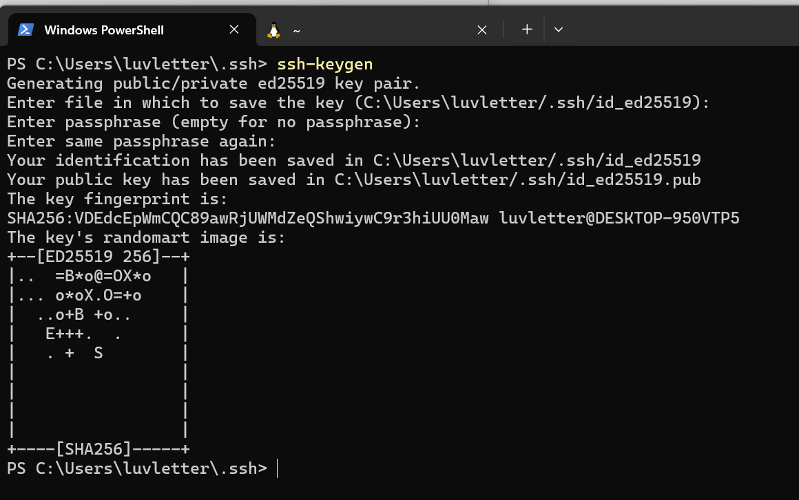

## 虚拟机 SSH 配置

SSH 是一种安全的远程登陆服务器的方式，主要有三个用途：

1. 远程登陆，打开一个 Shell
2. 使用 `scp` 进行文件传输
3. 端口转发

我们可以在物理机上使用 SSH 连接到虚拟机内部，这样我们可以在宿主机的桌面环境中使用虚拟机。

### 安装 openssh-server

在终端中输入：`sudo apt install openssh-server`

输入 y 回车确定

### 查看虚拟机 ip 地址

在终端中输入：`ip a`：

某个以 `ens` 或 `enp` 或 `eth` 开头的网卡下面，inet 后面跟的地址即是vm的ip地址。

### SSH 登陆

在你的物理机上：

- Windows 用户：打开 [Windows Terminal](https://github.com/microsoft/terminal)，进入 PowerShell

- macOS 用户：打开终端 (Terminal)

输入 `ssh oslab@vm的ip`：

首次登陆会需要确认公钥，输入y回车确认即可。

我们先使用密码登陆，oslab的默认密码是 123456。

### 设置 SSH 密钥登陆

SSH 密钥是一对非对称加密的密钥，分为公钥和私钥。

私钥是保密的，默认存储在 `$USER/.ssh/` 目录下，以 `id_` 开头。公钥是可以公开的，文件名通常是 `id_xxx.pub` ，我们将把它放到虚拟机里面，表示虚拟机将允许使用该私钥登陆。

在物理机的终端上输入 `ssh-keygen` 这将生成一对公私钥对。

输入 `cat ~/.ssh/id_ed25519.pub` ，显示其内容：

**在虚拟机中** ：`vim ~/.ssh/authorized_keys`

按 i 进入 insert mode，右键粘贴。

按 ESC 退出 insert mode，输入 `:wq` 保存并退出。

之后我们在物理机上使用 ssh 登陆不再需要密码。

### scp 拷贝文件

请查阅 `man scp`。

scp 命令的主要格式为：`scp [OPTIONS] source ... target`

如果 source 或 target 是 SSH 目标，则使用 `user@host:file_path` 的格式指定远程目标上的文件路径

例如 `scp -r oslab@192.168.231.128:~/Desktop/SUSTechOS ~/Desktop` 是将远程服务器上面的 `~/Desktop/SUSTechOS` 目录整个复制到宿主机的桌面上。

### vscode SSH 插件

在 VSCode 中安装这个插件：

使用 Ctrl + Shift + P 打开命令窗口，在 `>` 提示符后面输入 ssh

选择 `Remote-SSH: Connect to Host` 回车确认

输入 `oslab@ip地址`，并保存配置，第一次连接会选择远程服务器环境，选择 Linux。

配置完成后，可以在 VSCode 中打开 SSH 目标上的 Workspace。

例如，我们打开 `~/Desktop/SUSTechOS`，即可在宿主机上编辑我们的内核代码，并在vscode 的 terminal 窗口中使用 `make run `运行。

