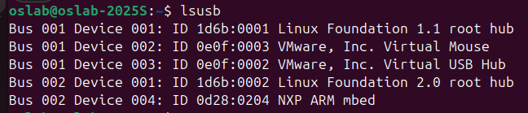
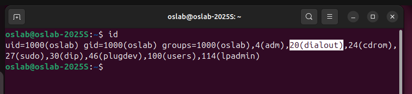
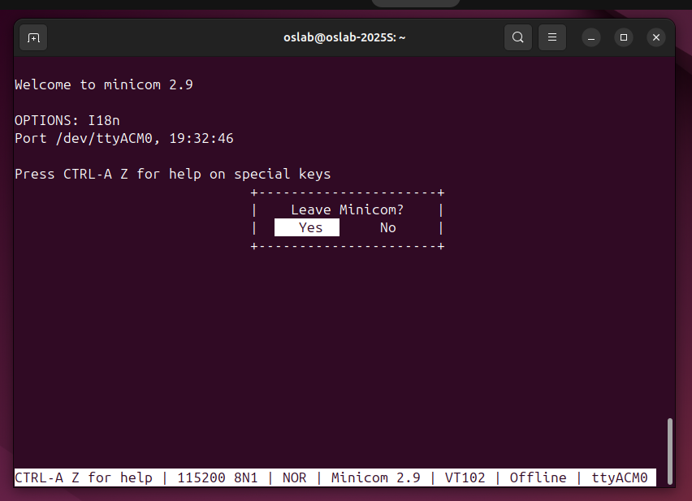
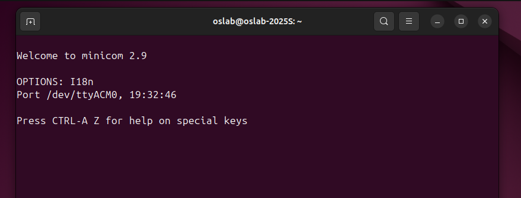
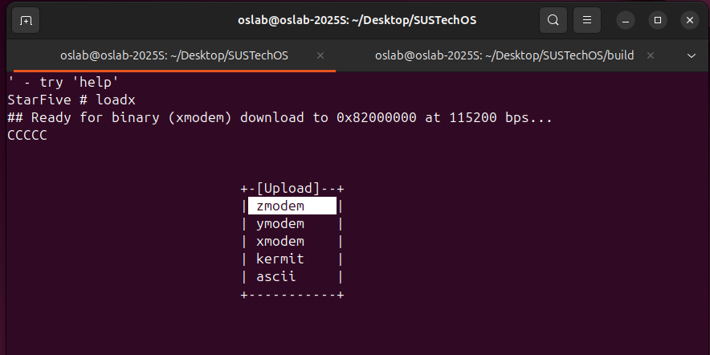

### VisionFive2 开发板使用教程

我们会发以下材料，请核对清单：

- VisionFive 2 开发板
- nanoDAP 调试器
- 杜邦线若干（10根以上）
- 一张 32G SD卡
- 一个读卡器

请你自行准备一个手机充电器头，和 Type-C 线。


拆开包装后，请你将一下内容物交还到讲台：

- 写有 “昉·星光 VisionFive 2” 的纸壳
- 黑色静电袋
- 一包装有塑料螺丝脚垫的袋子
- （如有）一个用袋子装着的 USB 网卡

其余垃圾请课后自行处理。


#### 安装工具

在 VM 中：`sudo apt install minicom` 安装串口工具 minicom。


#### 连接 UART 接口

使用 **三根** 杜邦线连接板子上的 GND, UART TX, UART RX 端口。

用右上角的 Pin 6, 8, 10。 **注意不要连接到 5V Power 上面！！**


实拍图：


将板子上的 GND, UART TX, UART RX 分别连接到调试器上的 GND, U_RX, U_TX 上面，注意 UART 的 RX 和 TX 是交叉的，调试器正反面都有端口提示。


**不要接调试器上面的 5V 和 3V3 ！！！！ 也不要试图通过调试器给 VisionFive2 板子供电！！**

#### 连接到 VM

启动 VMware 中的虚拟机。

将调试器插入电脑USB口（macOS 用户请自备 Type-C 到 USB-A 转接器），你应该会收到以下提示。


选择 `Conenct to a virtual machine`。将调试器连接至虚拟机中。如果你没有看到这个窗口或错过了，你可以在菜单栏中选择 `VM -> Removable Devices -> NXP DAPLink CMSIS-DAP -> Connect (Disconnect from Host)`。


在虚拟机的终端中，执行 `lsusb`，你应该能看到一项 "NXP ARM mbed" 的项目，如果看不到，请报告助教。



在终端中执行：`ls /dev/tty*` 你应该能看到一项为 `/dev/ttyACM0` ，这就是串口设备。如果看不到，请报告助教。

在终端中执行：`sudo usermod -aG dialout oslab`，输入密码确认后重启虚拟机。

重启后，在终端中执行：`id`，你应该会看到 gid 后面有一项 dialout。



在终端中执行 `sudo minicom -s` 设置 minicom 工具，你会进入如下界面，使用上下左右、ESC、Enter进行移动。


进入 `Serial port setup`，按 A 编辑 `Serial Device` 这一项，将其改为 `/dev/ttyACM0`


回车确认两次，回到 `configuration` 界面，选择 `Save setup as dfl` 回车确认，你应该能看到 `Configuration Saved` 提示。

选择 Exit 退出配置页面，进入 minicom 终端，使用 Ctrl A + X 退出 minicom。



使用普通用户 oslab 执行 minicom，你应该能正常打开串口。



#### 板子上电

在打开 minicom 的情况下，用 Type-C 口给板子供电。

你应该能看到板子 Type-C 接口旁边有一个红色 LED 亮起，同时串口界面有显示、调试器上闪烁绿灯：

```
U-Boot SPL 2025.01-dirty (Feb 21 2025 - 21:15:06 +0800)
DDR version: dc2e84f0.
Trying to boot from SPI

OpenSBI v1.5.1
   ____                    _____ ____ _____
  / __ \                  / ____|  _ \_   _|
 | |  | |_ __   ___ _ __ | (___ | |_) || |
 | |  | | '_ \ / _ \ '_ \ \___ \|  _ < | |
 | |__| | |_) |  __/ | | |____) | |_) || |_
  \____/| .__/ \___|_| |_|_____/|____/_____|
        | |
        |_|

Platform Name             : StarFive VisionFive 2 v1.3B                         
Platform Features         : medeleg                                             
...

U-Boot 2025.01-dirty (Feb 21 2025 - 21:15:06 +0800)                             
                                                                                
CPU:   sifive,u74-mc                                                            
Model: StarFive VisionFive 2 v1.3B                                              
DRAM:  4 GiB                                                                    
Core:  136 devices, 26 uclasses, devicetree: board                              
WDT:   Not starting watchdog@13070000                                           
MMC:   mmc@16010000: 0, mmc@16020000: 1

StarFive EEPROM format v2                                                             
                                                                                      
--------EEPROM INFO--------                                                           
Vendor : StarFive Technology Co., Ltd.                                                
Product full SN: VF7110B1-2253-D004E000-40000798                                      
data version: 0x2                                                                     
PCB revision: 0xb2                                                                    
BOM revision: A                                                                       
Ethernet MAC0 address: 6c:cf:39:00:6c:bc                                              
Ethernet MAC1 address: 6c:cf:39:00:6c:bd                                              
--------EEPROM INFO--------                                                           
..

StarFive #
```

可以看到 OpenSBI 加载和 U-Boot 加载，最后有一个 `StarFive #` 的命令提示符，我们将其称为 **uboot 终端**。

.

#### 运行 xv6 内核

在 minicom 下，板子启动完成后，出现 uboot 终端

使用另一个终端窗口，cd 到内核代码目录下，`make` 编译内核，然后 cd 到 `build` 目录下：


执行 pwd 以获取当前目录的完整路径，右键拷贝。

在 uboot 终端下执行：`loadx`：


按 Ctrl A + S，打开 `[Upload]` 提示框，



选择 `xmodem`，切换到 `[Goto]`，然后回车，在 `Goto directory` 下面粘贴我们之前复制的 build 目录的完整路径，回车确认。


左右移动光标到 `[Okay]`，上下移动光标到 `kernel` 这一项，然后空格选中，


然后回车确认，开始上传。


上传结束后，`[xmodem upload]` 窗口消失，uboot终端下会提示 `##Total Size` 和 `## Start Addr`。


执行命令 `bootelf -p`，然后执行 `go 0x80200000`

uboot 终端应该会提示 `## Starting application at 0x80200000 ...`，然后跳转到我们的内核，最终 sh 启动成功。

