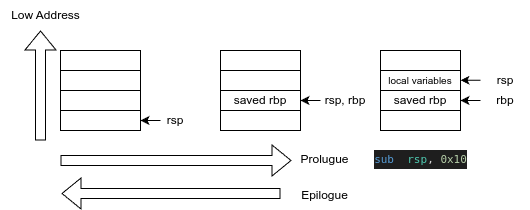

# Lab1 - C 语言基础

在本次实验中，我们将学习基本的 C 语言编程和静态链接。

## 类型

在 C 语言中，整数类型有 long, int, short, char 等。
在主流的架构上，int 类型为 32 位长，而 long 类型为 64 位长。
但是，为了避免编译目标架构的不同而导致 long、int 等类型实际长度与我们预想的不一致，在系统编程中，我们会使用定长的整形，如 uint64_t, int32_t 等。
在不同的编译器环境下，使用这一些类型保证了它们绝对是指定长度的。

例如，在 `os/types.h` 中：

```c
typedef unsigned int uint;
typedef unsigned short ushort;
typedef unsigned char uchar;
typedef unsigned char uint8;
typedef unsigned short uint16;
typedef unsigned int uint32;
typedef unsigned long uint64;
```

我们定义了 `uint64`, `uint32` 等类型分别为 `unsigned long` 和 `unsigned int`。
由于我们面向 riscv64 架构进行编程，我们可以确保它们是 64 / 32 位的。

## 空间分配

当我们定义 (Definition) 一个变量时，编译器会在合适的位置为我们开辟一块内存空间。

下面这个例子定义了一个全局变量 `a`，一个 `main` 的栈上变量 `b`，一个 `recursive` 的栈上变量 `c`，并打印它们的地址。

```c
#include <stdio.h>

int a = 0;

void recursive(int depth) {
    int c;
    if (depth == 5) return;
    printf("[%d] c is at: %p\n", depth, &c);
    recursive(depth + 1);
}

int main() {
    int b;
    printf("a is at: %p\n", &a);
    printf("b is at: %p\n", &b);
    recursive(0);
}
```

我们使用 `gcc -O0 -static a.c && ./a.out` 运行它，结果如下：

```
a is at: 0x4a0b10
b is at: 0x7ffd1404c53c
[0] c is at: 0x7ffd1404c51c
[1] c is at: 0x7ffd1404c4ec
[2] c is at: 0x7ffd1404c4bc
[3] c is at: 0x7ffd1404c48c
[4] c is at: 0x7ffd1404c45c
```

我们可以看到，`a`的地址是 `0x4a0b10` ，而 `b` 与 `c` 的地址是以 `0x7ffcc` 开头的。
并且，五个 `c` 的地址之间均相差固定的 `0x30`。

这是因为编译器将 `a` 放置到了程序的 `.data` 段，而 `b` 与 `c` 则是在程序的栈上分配的。

我们通过 `objdump` 工具查看编译产物 `a.out` 中 `main` 符号的汇编代码：

```asm
$ llvm-objdump-16 --disassemble-symbols=main

a.out:  file format elf64-x86-64

Disassembly of section .text:

00000000004017f5 <main>:
; int main() {
  4017f5: 55                            push    rbp
  4017f6: 48 89 e5                      mov     rbp, rsp
;     printf("a is at: %p\n", &a);
  4017f9: 48 8d 05 10 f3 09 00          lea     rax, [rip + 0x9f310]    # 0x4a0b10 <a>
  401800: 48 89 c6                      mov     rsi, rax
  401803: 48 8d 05 18 18 07 00          lea     rax, [rip + 0x71818]    # 0x473022 <dummy_bucket.6+0x1e>
  40180a: 48 89 c7                      mov     rdi, rax
  40180d: b8 00 00 00 00                mov     eax, 0x0
  401812: e8 e9 2d 00 00                call    0x404600 <printf>
;     recursive(0);
  401817: bf 00 00 00 00                mov     edi, 0x0
  40181c: e8 94 ff ff ff                call    0x4017b5 <recursive>
  401821: b8 00 00 00 00                mov     eax, 0x0
; }
  401826: 5d                            pop     rbp
  401827: c3                            ret
```

输出的第一行告诉我们 `a.out` 文件的格式是 `elf64-x86-64`，这代表这是一个 64 位 ELF 文件，架构为 x86-64。

我们可以看到，在 `401816` 和 `401831` 处，分别有两次 `call    0x404620 <printf>`，这代表这调用了 `printf` 函数，而 `printf` 函数地址为 `0x404620`。

```asm
  4017fd: 48 8d 05 0c f3 09 00          lea     rax, [rip + 0x9f30c]    # 0x4a0b10 <a>
  401804: 48 89 c6                      mov     rsi, rax
  401807: 48 8d 05 14 18 07 00          lea     rax, [rip + 0x71814]    # 0x473022 <dummy_bucket.6+0x1e>
  40180e: 48 89 c7                      mov     rdi, rax
  401811: b8 00 00 00 00                mov     eax, 0x0
  401816: e8 05 2e 00 00                call    0x404620 <printf>
```

根据 `call` 指令前的指令序列，我们可以推测实际调用 `printf` 时寄存器值。并且，根据 x86-64 架构下的函数调用约定 (Calling Convention, 前 6 个整数参数通过 rdi, rsi, rdx, rcx, r8, r9 传递)，我们可以得到调用 `printf` 的具体参数：

```asm
rdi:
  401807: 48 8d 05 14 18 07 00          lea     rax, [rip + 0x71814]    # 0x473022 <dummy_bucket.6+0x1e>
  40180e: 48 89 c7                      mov     rdi, rax

rsi:
  4017fd: 48 8d 05 0c f3 09 00          lea     rax, [rip + 0x9f30c]    # 0x4a0b10 <a>
  401804: 48 89 c6                      mov     rsi, rax

# printf(0x473022, 0x4a0b10)
```

`lea` 指令表示把 `rip` (即当前指令的地址) 加上一个立即数，由于这一条指令的地址是固定的，`objdump` 帮我们算出了这个地址，也就是变量 a 的地址。
我们可以看出，第一次 `printf` 时，打印出来的地址是一个固定的数 `0x4a0b10`。

类似的，我们观察`main`中第二次 `printf` 调用，以及 `recursive` 中的 `printf` 调用：

```asm
main:
  40181b: 48 8d 45 fc                   lea     rax, [rbp - 0x4]
  40181f: 48 89 c6                      mov     rsi, rax
...
  401831: e8 ea 2d 00 00                call    0x404620 <printf>

recursive:
  4017c6: 48 8d 55 fc                   lea     rdx, [rbp - 0x4]
...
  4017de: e8 3d 2e 00 00                call    0x404620 <printf>
```

我们可以看到，后续 `printf` 打印的指针均是 `[rbp - 0x4]`，这个值在六次打印中均是不一致的，这是因为这两个变量被分配在 `main` 和 `recursive` 函数的栈帧 (Stack frame) 上。

在数据结构课和计算机组成原理课上，我们学习了栈 (stack) 是一种先入后出 (FILO) 的数据结构，我们对它的操作被称为压栈(push)和弹栈(pop)，并且，它是向低地址生长的，也就是说，压栈后栈顶会变小。

在进入和离开 `main` 时，我们发现有一串指令：

```asm
main:
  4017f5: 55                            push    rbp         # 将 rbp 寄存器的值压入栈中
  4017f6: 48 89 e5                      mov     rbp, rsp    # 将 rsp 的值赋给 rbp
  4017f9: 48 83 ec 10                   sub     rsp, 0x10   # 将 rsp 减 0x10
...
  40181b: 48 8d 45 fc                   lea     rax, [rbp - 0x4]
  40181f: 48 89 c6                      mov     rsi, rax
...
  401831: e8 ea 2d 00 00                call    0x404620 <printf>
...
  401845: c9                            leave               # 将 rbp 的值赋给 rsp；弹栈，并将值赋给 rbp
  401846: c3                            ret                 # 退出函数
```

我们发现 `push rbp`, `mov     rbp, rsp` 与 `leave` 在语义上形成了相反的一对。
实际上，它们是函数的 prologue 和 epilogue。
分别是在进入函数时和在离开函数时执行的固定代码片段。
这两段片段构建了当前函数的栈帧（类似一对压栈和弹栈操作）。



我们绘制这几条指令对程序栈、`rsp`寄存器和 `rbp` 寄存器的操作，我们可以看出，`b` 的实际地址是在 saved rbp 之上，指向 local variables 区域。

实际上，这部分是编译器根据函数内定义的临时变量的大小在栈上开辟的空间。

与在 `.data` 段的变量 `a` 不同，这些临时变量的地址并不是固定的，他们只在这个栈帧有效时是合法的。

!!!question

    int 类型只占 4 个字节，为什么 `sub rsp, 0x10` 开辟了 16 个字节的空间？在 x86-64 上行为如此，在 RISC-V 64 上呢？

## 结构体

C 语言中，结构体是对一连串数据的表示。
我们通过 `struct` 关键字表示该变量是一个结构体。
通常，我们将一堆相关联的数据放置在同一个结构体上。

```c
struct proc {
	enum procstate state;   // Process state
	int pid;                // Process ID
	pagetable_t pagetable;  // User page table
	uint64 ustack;          // Virtual address of kernel stack
	uint64 kstack;          // Virtual address of kernel stack
	struct trapframe *trapframe; // data page for trampoline.S
	struct context context; // swtch() here to run process
	struct proc *parent; 	// Parent process
};
```

在我们的操作系统内核上，进程 `struct proc` 包含了 进程状态 `state`，PID,页表，用户栈和内核栈地址等信息。

在对结构体指针访问其成员变量时，我们使用 `->` 操作符。
在对结构体访问其成员变量时，我们使用 `.` 操作符。

在下面这个例子中，我们定义了一个全局变量 `current_proc`，它是一个指向 `struct proc` 的指针；我们也定义了一个 `idle` 变量，它的类型是 `struct proc`。

```c
struct proc *current_proc;
struct proc idle;

void proc_init()
{
	current_proc = &idle;
}

void yield()
{
	current_proc->state = RUNNABLE;
	add_task(current_proc);
	sched();
}
```

!!!question 

    请你思考编译器为 `current_proc` 和 `idle` 变量开辟了多少字节的空间，这一些空间是在哪开辟的？

在 `proc_init` 初始化函数中，我们将 `idle` 的地址赋予 `current_proc`（`&` 是取地址符）。此时，`current_proc` 的值即是编译器为 `idle` 变量开辟的空间的起始地址。

!!!question 

    为什么是起始地址？

    我们在计算机组成原理课程上学过，RISC-V 的寻址模式 (Addressing Mode) 包含 Base displacement addressing (基地址 + 偏移量) 模式。
    因为结构体中某个变量相对于结构体基地址的偏移量是在编译期已知的，所以我们可以通过某个寄存器保存该结构体的基地址，使用 ld/sw 指令中的立即数偏移量访问结构体中的成员变量。

    ```asm
    ;       current_proc->state = RUNNABLE;
    802013b4: 97 b7 4b 00   auipc   a5, 1211
    802013b8: 93 87 c7 c5   addi    a5, a5, -932
    802013bc: 03 b7 07 00   ld      a4, 0(a5)
    802013c0: 93 06 30 00   li      a3, 3           # RUNNABLE = 3
    802013c4: 23 20 d7 00   sw      a3, 0(a4)
    ```

    已知这一串汇编实现的是 `current_proc->state = RUNNABLE;` 语句，并且 `state` 相对于 `struct proc` 的偏移量是0。
    请你解释 `ld a4, 0(a5)` 和 `sw a3, 0(a4)` 中 a5 和 a4 的值分别指向哪个变量的地址，并解释这两句汇编的语义。

    > 如果你理解了这两句汇编的意思，你就理解了指针

### 结构体的复制

```c
#include <stdio.h>

struct mystruct {
    int a;
    long b;
};

struct mystruct s1;

int main() {
    s1.a = 114;
    s1.b = 514;

    struct mystruct *ptr = &s1;

    printf("ptr->a = %d\n", ptr->a);

    struct mystruct onstack;
    onstack = *ptr;

    printf("onstack.b = %ld\n", onstack.b);
}
```

!!!question

    请你在电脑上编译并执行以上代码，分析 `s1`, `ptr` 和 `onstack` 分别分配在哪里，其值是什么。

## 静态链接