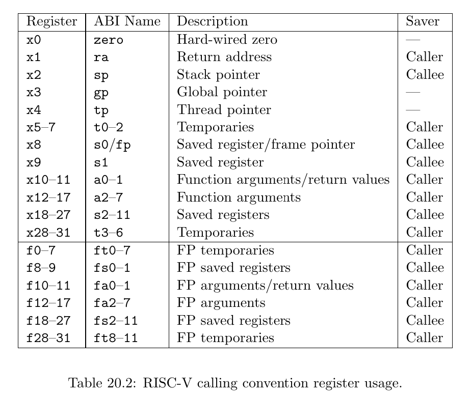
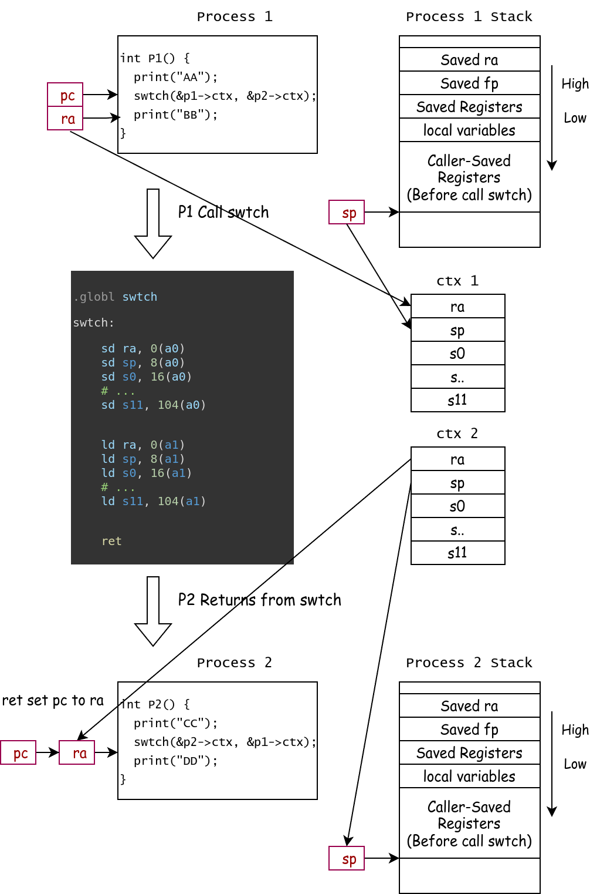
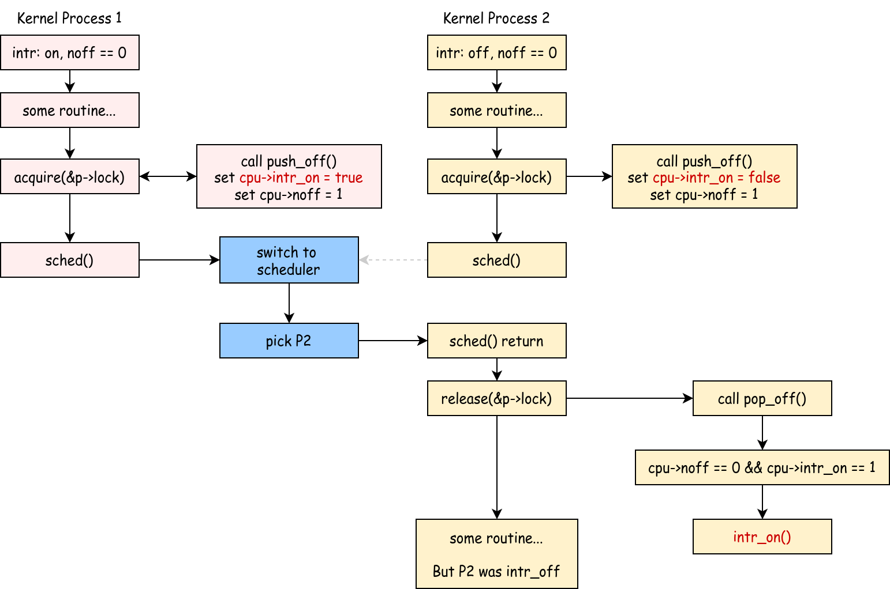

# Context Switch

上下文切换 (Context Switch) 是操作系统中的一个重要概念，本章我们将集中于 Context Switch 在技术上的实现，和 xv6 中调度器 (scheduler) 的设计。

## 什么是 Context

在操作系统中，Context (上下文) 是指在某一时刻程序运行所需的所有状态信息的集合。在 xv6 系统中，我们规定每个 Process 是一个独立的可被调度的实体，也就是说，每个 Process 拥有自己的 Context。

理解 Context 的重要性在于：当操作系统需要切换执行不同的进程时，必须保存当前进程的 Context，并加载要切换到的进程的 Context。这样才能确保进程在下次获得 CPU 时能够从之前的状态继续执行。这个保存和恢复 Context 的过程就是 Context Switch 的核心内容。

想象一下你正在读一本书，当你需要暂时去做别的事情时，你会用书签标记当前阅读的位置。这个书签就相当于保存了你的"阅读上下文"。当你回来继续读书时，通过书签就能知道从哪里继续读起。操作系统中的 Context 作用与此类似，只是需要保存和恢复的信息要复杂得多。

### 为什么要 Context Switch

从调度 (Scheduling) 的角度来看，Context Switch 是实现多任务处理和资源复用的关键机制：

1. CPU 资源的时分复用

    当系统中有多个就绪进程需要运行时，操作系统需要让它们轮流使用 CPU。即使操作系统只有单个CPU，通过时分复用轮流运行不同的进程，可以实现所有进程好像在同时运行的效果。调度器会根据调度策略（如 Round Robin、Priority Scheduling 等）决定在某个时刻应该运行哪个进程。为了切换到被调度的进程，就必须执行 Context Switch。

2. 提高系统吞吐量
    
    当一个进程因为 I/O 操作而阻塞时，CPU 会闲置。通过 Context Switch，调度器可以切换到其他就绪进程，这样 CPU 就能在等待 I/O 的同时继续执行其他任务，最终提高了整个系统的资源利用率和吞吐量。

3. 响应交互式任务

    用户交互程序需要及时响应。通过 Context Switch，调度器可以暂停当前运行的批处理任务，迅速切换到需要立即响应的交互式任务，实现更好的用户体验。

### 什么时候进行 Context Switch

通常 Context Switch 发生在以下几种情况：

1. 时间片到期时（Time Slice Expiration）

    在采用时间片轮转调度算法时，当进程用完分配的时间片，系统的时钟中断触发，操作系统强制进行 Context Switch，切换到其他就绪进程。

2. 进程进入阻塞状态时（Process Blocking）

    进程发起系统调用等待 I/O 操作，进程等待某个事件（如信号量），进程申请资源但无法立即获得。

    此时进程主动放弃 CPU，调度器选择其他就绪进程运行。

3. 进程主动让出 CPU 时（Voluntary Yield）

    进程调用 `yield` 系统调用，主动放弃剩余的时间片，通常用于进程感知到自己短期内无事可做时。

## xv6 Context Switch 实现

在 xv6 中，我们定义一个进程的内核 Context 为：

```c
// Saved registers for kernel context switches.
struct context {
    uint64 ra;
    uint64 sp;

    // callee-saved
    uint64 s0;
    uint64 s1;
    uint64 s2;
    uint64 s3;
    uint64 s4;
    uint64 s5;
    uint64 s6;
    uint64 s7;
    uint64 s8;
    uint64 s9;
    uint64 s10;
    uint64 s11;
};
```

在 `switch.S` 文件中，我们定义"函数" `swtch`，该函数的原型为 `void swtch(struct context *old, struct context *new)`。

```asm
# Context switch
#   void swtch(struct context *old, struct context *new);
# Save current registers in old. Load from new.

.globl swtch
swtch:
    sd ra, 0(a0)
    sd sp, 8(a0)
    sd s0, 16(a0)
    sd s1, 24(a0)
    sd s2, 32(a0)
    sd s3, 40(a0)
    sd s4, 48(a0)
    sd s5, 56(a0)
    sd s6, 64(a0)
    sd s7, 72(a0)
    sd s8, 80(a0)
    sd s9, 88(a0)
    sd s10, 96(a0)
    sd s11, 104(a0)

    ld ra, 0(a1)
    ld sp, 8(a1)
    ld s0, 16(a1)
    ld s1, 24(a1)
    ld s2, 32(a1)
    ld s3, 40(a1)
    ld s4, 48(a1)
    ld s5, 56(a1)
    ld s6, 64(a1)
    ld s7, 72(a1)
    ld s8, 80(a1)
    ld s9, 88(a1)
    ld s10, 96(a1)
    ld s11, 104(a1)

    ret
```

当我们需要进行上下文切换时，我们需要调用 `swtch` 函数，并给出两个 `struct context*` 指针，分别表示，当前的 Context 应该被保存到哪里 (old)，和之后应该从哪里继续执行 (new)。

由于我们是 C 语言中调用一个函数，编译器会按照 RISC-V 的 Calling Convention 构造环境，例如返回地址会被写入在 `ra` 寄存器中，这通常是通过 `jalr` 指令实现的。

而根据 RISC-V 的 Calling Convention，寄存器的值要么需要调用者自己保存 (Caller-saved register)，被调用者能够随意修改这些寄存器；要么被调用者在需要修改这些寄存器时保存 (Callee-saved register)。并且，调用者会在自己的栈帧 (Stack Frame) 上保存这些 caller-saved register (这一步是由编译器自动进行的)，所以，**我们只需要记住 `sp` 寄存器，即可再下次返回时让 `old` 找回这些 caller-saved register**。



下图展示了 P1 切换到 P2 的过程，P1 和 P2 有各自的 Stack，有各自的 Context 结构体。



P1 在执行 `P1` 函数时，会在函数开头 (prologue) 保存 `P1` 的调用者的返回地址，同时局部变量也是在栈上开辟的。在 P1 调用 `swtch` 前，编译器在已经将所有 Caller-Saved Registers 保存在栈上，然后编译器生成 `jal swtch` 的汇编，这一调汇编执行时会将 ra 设置为 `P1` 函数中 `jal` 的下一条指令。

在调用 `swtch` 时，`a0` 指向了 P1 的 `struct context` 结构体，`swtch` 使用 `sd` 指令保存 ra, sp 和 s0 - s11 寄存器。

之后，`swtch` 从 `a1` 加载即将恢复的 P2 的 Context，使用 `ld` 指令从 `struct context` 结构体中读取属于 P2 的 ra, sp 和 s0 - s11 寄存器。

在 CPU 执行到 `ret` 时，pc 被恢复为 ra 寄存器的值，此时开始执行上次 P2 调用 `swtch` 时保存的返回地址。

至此，成功完成了从 P1 到 P2 的切换。

此外，`swtch` 方法是天生成对的：如果上次使用 swtch 离开了当前进程，那么下次返回时，必定是有其他进程调用了 swtch 回到了该进程。

## xv6 Process

> 代码：`os/sched.c`, `os/smp.c`, `os/proc.h`

在 xv6 中，Process Control Block (PCB) 被定义如下：

```c
// Per-process state
struct proc {
    spinlock_t lock;
    // p->lock must be held when accessing to these fields:
    enum procstate state;  // Process state
    int pid;               // Process ID
    uint64 exit_code;
    void *sleep_chan;
    int killed;

    struct proc *parent;  // Parent process
    
    // User Memory Management
    struct mm *mm;
    struct vma *vma_ustack;
    struct vma *vma_brk;
    struct vma *vma_trapframe;
    struct vma *vma_trampoline;
    
    // User Trapframe
    struct trapframe *__kva trapframe;  // data page for trampoline.S

    uint64 __kva kstack;                // Virtual address of kernel stack
    struct context context;             // swtch() here to run process
};

enum procstate { UNUSED, USED, SLEEPING, RUNNABLE, RUNNING, ZOMBIE };
```

每个 Process 有自己的 pid, 进程状态、parent 指针、内核栈、和内核 Context。

对于有用户态的 Process，PCB 中还有负责管理内存的 `struct mm`，和保存 User mode 下 Trap 触发时数据的 Trapframe。

除此之外，每个进程都有一个自旋锁 `spinlock_t`，尽管我们目前理论课还没有接触到锁的相关知识，但是我们在 xv6 中规定：访问所有 `struct proc` 的成员时，都需要在持有 `p->lock` 的情况下进行。

!!!info "偷跑：什么是锁"
    锁 (lock) 是一种控制并发访问的基本工具。
    
    我们规定：在我们持有 (holding) 一把自旋锁时：1. 该 CPU 不能被中断，2. 其他 CPU 不能同时持有这一把锁。
    
    如果抢不到锁，那么 CPU 会进行原地空转直到抢到锁。
    
    我们使用 `acquire` 和 `release` 原语表示 上锁 和 解锁 的动作。

### `struct cpu`

在 xv6 中，我们使用 `struct cpu` 描述每个 CPU 的状态，我们是用 `mycpu()` 方法获取当前 `cpu` 对象。

```c
struct cpu {
    int mhart_id;                  // mhartid for this cpu, passed by OpenSBI
    struct proc *proc;             // current process
    struct context sched_context;  // scheduler context, swtch() here to run scheduler
    int inkernel_trap;             // whether we are in a kernel trap context
    int noff;                      // how many push-off
    int interrupt_on;              // Is the interrupt Enabled before the first push-off?
    uint64 sched_kstack_top;       // top of per-cpu sheduler kernel stack
    int cpuid;                     // for debug purpose
};
```

### 关中断

在内核代码中，我们有时会希望当前的执行不会被打断、不会被其他任务抢占，我们可以通过关闭中断来实现这一点。（当然，异常还是会直接跳入 Trap Handler 的）

我们使用 `push_off()` 和 `pop_off()` 表示一对 关中断/开中断的操作。由于我们可能会有嵌套 `push_off` 的情况，我们可以将关中断视为一种“压栈”操作，并且当且仅当栈空时才恢复原样，我们在 `struct cpu` 中记录两个变量：

1. `noff`：我们目前 `push_off`/`pop_off` 的深度是多少。

    例如 `push_off()`, `push_off()`, `pop_off()` 序列后，`noff` 应该为 1.

2. 在第一次 `push_off()` 时，即 `noff == 0` 时，CPU 的中断是开的还是关的。

```c
void push_off(void) {
    uint64 ra = r_ra();

    int old = intr_get();
    intr_off();

    if (mycpu()->noff == 0) {
        // warnf("intr on saved: %p", ra);
        mycpu()->interrupt_on = old;
    }
    mycpu()->noff += 1;
}

void pop_off(void) {
    uint64 ra = r_ra();

    struct cpu *c = mycpu();
    if (intr_get())
        panic("pop_off - interruptible");
    if (c->noff < 1)
        panic("pop_off - unpair");
    c->noff -= 1;
    if (c->noff == 0 && c->interrupt_on) {
        if (c->inkernel_trap)
            panic("pop_off->intr_on happens in kernel trap");
        // we only open the interrupt if: 
        //    1. the push-pop stack is cleared, and 
        //    2. the interrupt was on before the first push-off
        intr_on();
    }
}
```

## xv6 scheduler

xv6 中，每个 CPU 都有一个自己的 scheduler。`scheduler` 方法从不返回，其中是一个 `while(1)` 死循环。

`p = fetch_task();` ：每次循环时，scheduler 都尝试获取一个 task。

如果获取不到，检查是否所有进程都退出了。如果是，则表明系统应该结束运行了，如果不是，我们使用 `wfi` (Wait For Interrupt) 指令等待下一次时钟中断，这一步等价于用 `while(1);` 使CPU空转一段时间。

如果我们成功获取到了一个进程，则对该进程上锁 `acquire(&p->lock)`，将其状态设置为 RUNNING，将当前 cpu 正在运行的进程设为该进程，随后，**使用 `swtch` 方法跳转到该进程保存的 Context 中，并保存当前 Context 到 cpu->sched_context 中**。

```c
// Scheduler never returns.  It loops, doing:
//  - choose a process to run.
//  - swtch to start running that process.
//  - eventually that process transfers control
//    via swtch back to the scheduler.
void scheduler() {
    struct proc *p;
    struct cpu *c = mycpu();

    // We only get here once.
    // After each cpu boots, it calls scheduler().
    // If this scheduler finds any possible process to run, it will switch to it.
    // 	And the scheduler context is saved on "mycpu()->sched_context"

    for (;;) {
        // intr may be on here.

        p = fetch_task();
        if (p == NULL) {
            // if we cannot find a process in the task_queue
            //  maybe some processes are SLEEPING and some are RUNNABLE
            if (all_dead()) {
                panic("[cpu %d] scheduler dead.", c->cpuid);
            } else {
                // nothing to run; stop running on this core until an interrupt.
                intr_on();
                asm volatile("wfi");
                intr_off();
                continue;
            }
        }

        acquire(&p->lock);
        assert(p->state == RUNNABLE);
        infof("switch to proc %d(%d)", p->index, p->pid);
        p->state = RUNNING;
        c->proc  = p;
        swtch(&c->sched_context, &p->context);

        // When we get back here, someone must have called swtch(..., &c->sched_context);
        assert(c->proc == p);
        assert(!intr_get());        // scheduler should never have intr_on()
        assert(holding(&p->lock));  // whoever switch to us must acquire p->lock
        c->proc = NULL;

        if (p->state == RUNNABLE) {
            add_task(p);
        }
        release(&p->lock);
    }
}
```

当我们从 swtch 返回时，我们可以推导得出以下结论：

1. 因为 swtch 是成对的，我们上次从 swtch 离开，这次肯定是有谁调用了 swtch(... , &c->sched_context)
2. 这是个 per-cpu scheduler，而在离开时我们将该 CPU 的控制权移交给了进程 p，所以肯定是从进程 p swtch 回来的。(这里其实要求了进程只能通过 scheduler 来进行切换，而不能直接 Pa <--> Pb)。

所以，我们可以写出三行 assert 来确保我们的 scheduler 机制运行正常：

1. swtch 返回时，中断一定是关闭的
2. 我们一定持有者 p->lock 这把锁
3. 当前 cpu 正在运行的进程一定是 p

最后，我们清除 `c->proc`。如果 p 还能继续运行 (RUNNABLE)，则将其丢回队列。释放 p->lock 后，scheduler 进入下一个循环。

### sched 方法

`sched` 方法用于将 CPU 控制权由当前内核进程交还给 scheduler。

我们规定在 sched 时：

1. 必须持有 curr_proc()->lock 这把锁，因为要操作该 `struct proc` 结构体。
2. 必须只持有 curr_proc()->lock 这把锁，防止内核出现死锁

    这一步是通过检查 mycpu()->noff 实现的，因为每次 acquire 会 pushoff 一次，每次 release 会 popoff 一次。

3. 必须已经修改 p->state 为非 RUNNING。
4. 禁止在 kernel trap 环境中调用 sched。

如果检查通过，则将当前进程状态保存到 p->context, 并跳转到 scheduler 的 context 上面。

同理，如果 scheduler 还会切换回来，我们一样要求 scheduler 在给予 CPU 控制权时将 p->lock 上锁。

```c
// Switch to scheduler.  Must hold only p->lock
// and have changed proc->state. Saves and restores
// interrupt_on because interrupt_on is a property of this
// kernel thread, not this CPU. It should
// be proc->interrupt_on and proc->noff, but that would
// break in the few places where a lock is held but
// there's no process.
void sched() {
    int interrupt_on;
    struct proc *p = curr_proc();

    if (!holding(&p->lock))
        panic("not holding p->lock");
    if (mycpu()->noff != 1)
        panic("holding another locks");
    if (p->state == RUNNING)
        panic("sched running process");
    if (mycpu()->inkernel_trap)
        panic("sched should never be called in kernel trap context.");
    assert(!intr_get());

    interrupt_on = mycpu()->interrupt_on;

    infof("switch to scheduler %d(%d)", p->index, p->pid);
    swtch(&p->context, &mycpu()->sched_context);
    infof("switch back from scheduler %d(%d)", p->index, p->pid);

    mycpu()->interrupt_on = interrupt_on;

    // if scheduler returns here: p->lock must be holding.
    if (!holding(&p->lock))
        panic("not holding p->lock after sched.swtch returns");
}
```

### 为什么需要保存 `cpu->interrupt_on`

因为该属性是当前内核进程的属性，而并不是当前 cpu 的属性。因为我们会在没有 Process 的情况下使用 push_off/pop_off，所以我们必须将 `interrupt_on` 标志放置在 `struct cpu` 中，而不是 `struct proc` 中，并且在 `sched` 切换内核进程时，将该属性保存在该内核进程的栈上。

至于为什么不需要保存 noff：因为我们强制要求它为 1。

如果我们注释掉保存 `interrupt_on` 这一行，下图展示了 Kernel Process 1 (红色) 的 Interrupt On 状态是如何通过 sched 和 scheduler (蓝色) 错误影响到 Kernel Process 2 (黄色) 的：

Kernel Process 2 先运行了一段时间，此时中断为关，然后调用 sched 暂时离开(虚线)，而此时 Kernel Process 1 开始执行(实线)。P1 执行时，中断为开。在 P1 调用 sched 切换到 scheduler 时，中断状态被 acquire->push_off 保存在 `cpu->interrupt_on` 中，随后 scheduler 选择了 P2 继续执行。而 P2 在退出 sched 时调用了 `release`->`pop_off` 而错误恢复了中断开的状态。



## Lab 练习

目前，我们规定 `sched` 调度不允许发生在 kernel trap 环境中。请你修改内核代码，使得我们能在时钟中断中进行内核线程切换。