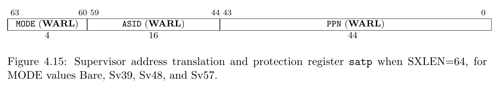
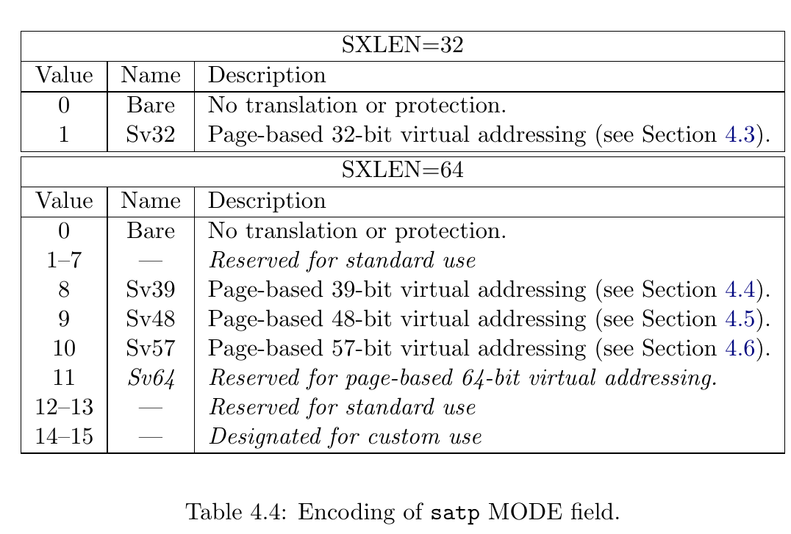
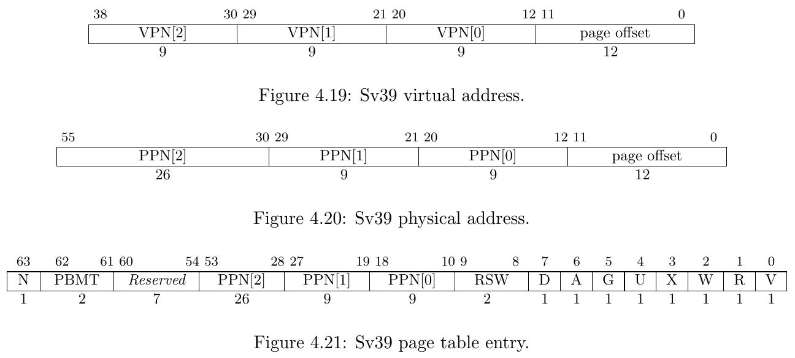
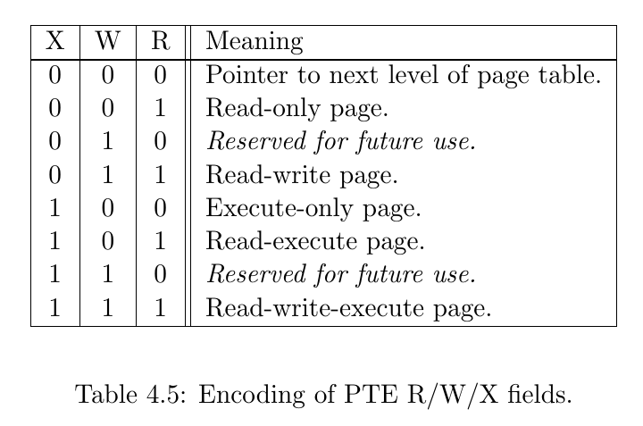
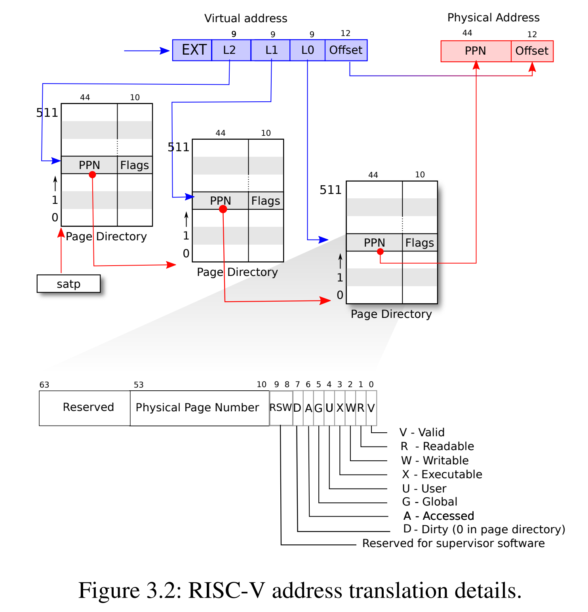
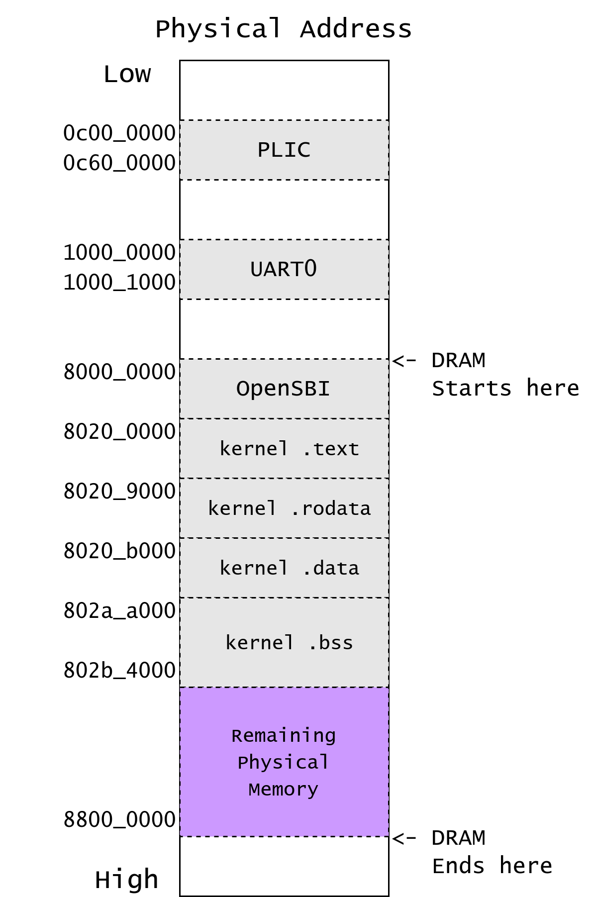
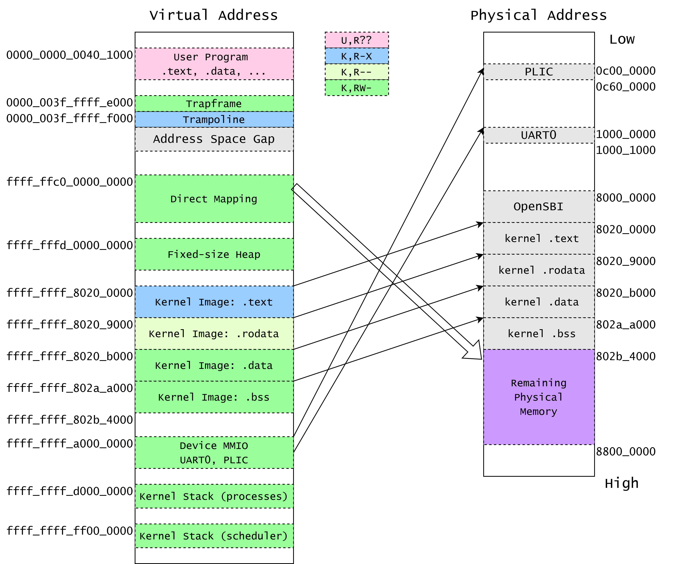
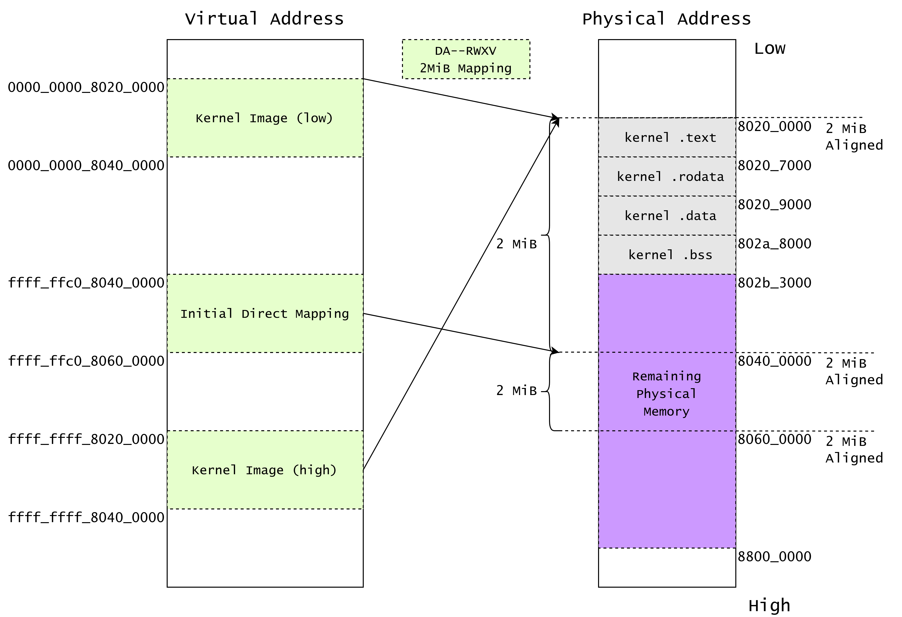

# 内核内存管理

## satp

satp (Supervisor Address Translation and Protection) 寄存器是控制 S mode 和 U mode 下地址翻译的寄存器，其中包含三个属性：`MODE`, `ASID` 和 `PPN`。

> This register holds the physical page number (PPN) of the root page table, i.e., its supervisor physical address divided by 4 KiB; an address space identifier (ASID), which facilitates address-translation fences on a per-address-space basis; and the MODE field, which selects the current address-translation scheme. Further details on the access to this register are described in Section 3.1.6.5.



Mode 表示使用的地址翻译模式，0 则表示禁用地址翻译，所有请求的地址均作为物理地址看待，`PPN` 表示根页表的基地址。在我们的课程中，我们将使用 Sv39 作为页表模式。

我们暂且不需要理解 ASID 的作用。



## Sv39

RISC-V 的 Sv39 模式支持了 39-bit 的虚拟地址空间，每个页面大小 4KiB。

有效的虚拟地址为 64 位，但是 63-39 位必须与第 38 位相同，否则会产生 Page Fault 异常。所以，Sv39 的虚拟地址空间一共为 `(1 << 39) = 512 GiB` 的空间，其中分为高地址和低地址各 `256 GiB` 的空间。

> Sv39 implementations support a 39-bit virtual address space, divided into 4 KiB pages.
> An Sv39 address is partitioned as shown in Figure 4.19.
> Instruction fetch addresses and load and store effective addresses, which are 64 bits, must have bits 63–39 all equal to bit 38, or else a page-fault exception will occur.
> The 27-bit VPN is translated into a 44-bit PPN via a three-level page table, while the 12-bit page offset is untranslated.



虚拟地址分为四部分：VPN[2-0] (Virtual Page Number) 和 page offset。三级 VPN 表示在三级页表中的 index, 而 page offset 表示当前地址在被翻译的页面中的偏移量。

Sv39 中的 PTE 长度为 8-byte，分为两部分：PPN 和 Flags。PPN (Physical Page Number) 和虚拟地址中的 page offset 组成最终的物理地址，Flags 则表示该虚拟地址页面的访问权限等信息。

Flags 定义如下：

- D, A: Dirty, Accessed。表示该页面最近被访问 / 写入过。
- G: Global。表示该映射关系在所有页表中均存在。
- U: User。表示该映射关系允许在用户权限下访问。
- V: Valid。该 bit 表示此 PTE 为有效 PTE，否则整个 PTE 视为无效。
- R, W, X: Read, Write, Executable 权限

RWX 定义如下图所示：
注意 XWR == 3b000 的情况表示物理地址 [PPN: 12b0] 为下一级页表的基地址。



地址翻译的过程如下图所示：



See also: riscv-privilege.pdf, 4.3.2 Virtual Address Translation Process

文字描述，以下 `{xx | yy}` 表示在 `xx` bit 右边并上 `yy` bit，类似于 Verilog 的写法。

1. `{ 25b'signed_ext, 9b'VPN2, 9b'VPN1, 9b'VPN0, 12b'pgoff} = 64b'VirtualAddress`
2. 将 satp 寄存器中第二级页表的基地址取出
3. 使用 VPN2 作为 index 在第二级页表中找到 PTE。
   这一步等效于 C 代码：`uint64 pte2 = *(uint64*)(satp.base + VPN2 * 8);`
4. 如果 pte2.WXR != 3b000，则表示该 PTE 为 1GiB 大页映射。
   检查 PPN 是否对齐到 1GiB，aka：`pte2.PPN1 == 9b0 && pte2.PPN0 == 9b0`。如果满足，则跳转至 10.，否则 Page Fault。
5. 否则，`{pte2.PPN, 12b'0}` 为第一级页表的基地址
6. 使用 VPN1 作为 index 在第一级页表中找到 PTE。
   这一步等效于 C 代码：`uint64 pte1 = *(uint64*)((pte2.ppn << 12) + VPN1 * 8);`
7. 如果 pte1.WXR != 3b000，则表示该 PTE 为 2MiB 大页映射。
   检查 PPN 是否对齐到 2MiB，aka：`pte2.PPN0 == 9b0`。如果满足，则跳转至 10.，否则 Page Fault。
8. 否则，`{pte1.PPN | 12b'0}` 为第零级页表的基地址
9. 使用 VPN0 作为 index 在第零级页表中找到 PTE。
   这一步等效于 C 代码：`uint64 pte0 = *(uint64*)((pte1.ppn << 12) + VPN0 * 8);`
10. 得到最终的物理地址：`PA = (final_pte.ppn << 12) | final_page_offset`，
    如果为 2MiB 大页映射，`final_page_offset = {9b'VPN0, 12b'pgoff}`。
    如果为 1GiB 大页映射，`final_page_offset = {9b'VPN1, 9b'VPN0, 12b'pgoff}`
    否则，`final_page_offset = pgoff`
11. 权限检查：检查 `final_pte.rwx` 是否与访存请求相同。

### A & D

每个叶 PTE 包含 Accessed 和 Dirty 两个 bits：

- A 表示：自从上次 A bit 被清零，该虚拟页面曾经被读取、写入、取指 （Instruction Fetch）。
- D 表示：自从上次 D bit 被清零，该虚拟页面曾经被写入。

RISC-V 硬件实现允许两种方式来更新 A & D bits:

当访问的虚拟页面被访问时，A bit 是 0、或被写入时，D bit 是 0：

1. 发出 PageFault，Supervisor 的异常处理函数需要手动设置 A / D bits.
2. 由硬件设置 A / D bits.

Supervisor 软件应当正确处理以上两种情况。

Each leaf PTE contains an accessed (A) and dirty (D) bit.

- The A bit indicates the virtual page has been read, written, or fetched from since the last time the A bit was cleared.
- The D bit indicates the virtual page has been written since the last time the D bit was cleared.

Two schemes to manage the A and D bits are permitted:

ˆ1. When a virtual page is accessed and the A bit is clear, or is written and the D bit is clear, a page-fault exception is raised.
ˆ2. When a virtual page is accessed and the A bit is clear, or is written and the D bit is clear, the implementation sets the corresponding bit(s) in the PTE.

See also: "riscv-privilege.pdf" "4.3.1 Addressing and Memory Protection"

### 权限检查

凭直觉的，读取的页面要带有 R bit，写入的页面要带有 W bit，执行的页面要带有 X bit。

但是，如果一个页面的权限带有 U bit，并且现在 CPU 核心运行在 S mode 下，我们需要对此进行额外检查：如果 `sstatus.SUM == 1` 则访问被允许，否则 Page Fault.

> The SUM (permit Supervisor User Memory access) bit modifies the privilege with which S-mode loads and stores access virtual memory.
> When SUM=0, S-mode memory accesses to pages that are accessible by U-mode (U=1 in Figure 4.18) will fault. When SUM=1, these accesses are permitted.

通常来说，S mode 一般运行在 `sstatus.SUM == 0` 的情况下，如果我们需要通过页表去访问用户数据时，我们会将该 flag 置 1，并在访问结束后清零。该过程一般被称为 uaccess 原语 (primitive).

See also: https://github.com/torvalds/linux/blob/master/arch/riscv/include/asm/uaccess.h

<!-- !!!questions "AArch64 架构下的虚拟内存模型"

    AArch64 显著地将虚拟地址分为低地址部分和高地址部分。（简单理解就是 0x0000_xxxx 开头的地址，和 0xffff_xxxx 开头的地址）

    对于低地址，使用 `TTBR0_EL1` (Translation Table Base Register 0 (EL1)) 寄存器作为类似 satp 寄存器的基地址寄存器进行地址翻译。
    对于高地址，使用 `TTBR1_EL1` 进行地址翻译。

    显然，这一种模型天生适合将内核页表和用户页表隔离。 -->

## RISC-V 物理地址布局

RISC-V 将物理内存 (DDR / DRAM) 的起始地址映射到物理地址 `0x8000_0000` 上，而不是物理地址 `0x0000_0000` 处。

也就是说，如果我们有 128 MiB (0x0800_0000) 的 DRAM 大小，RISC-V 核心会将 DRAM 空间映射到 `[0x8000_0000, 0x8800_0000)` 上面。

对于 QEMU 的 virt 机子，我们可以翻阅 qemu 的源代码找到其物理地址的映射：

```c
static const MemMapEntry virt_memmap[] = {
    [VIRT_DEBUG] =        {        0x0,         0x100 },
    [VIRT_MROM] =         {     0x1000,        0xf000 },
    [VIRT_TEST] =         {   0x100000,        0x1000 },
    [VIRT_RTC] =          {   0x101000,        0x1000 },
    [VIRT_CLINT] =        {  0x2000000,       0x10000 },
    [VIRT_ACLINT_SSWI] =  {  0x2F00000,        0x4000 },
    [VIRT_PCIE_PIO] =     {  0x3000000,       0x10000 },
    [VIRT_PLATFORM_BUS] = {  0x4000000,     0x2000000 },
    [VIRT_PLIC] =         {  0xc000000, VIRT_PLIC_SIZE(VIRT_CPUS_MAX * 2) },
    [VIRT_APLIC_M] =      {  0xc000000, APLIC_SIZE(VIRT_CPUS_MAX) },
    [VIRT_APLIC_S] =      {  0xd000000, APLIC_SIZE(VIRT_CPUS_MAX) },
    [VIRT_UART0] =        { 0x10000000,         0x100 },
    [VIRT_VIRTIO] =       { 0x10001000,        0x1000 },
    [VIRT_FW_CFG] =       { 0x10100000,          0x18 },
    [VIRT_FLASH] =        { 0x20000000,     0x4000000 },
    [VIRT_IMSIC_M] =      { 0x24000000, VIRT_IMSIC_MAX_SIZE },
    [VIRT_IMSIC_S] =      { 0x28000000, VIRT_IMSIC_MAX_SIZE },
    [VIRT_PCIE_ECAM] =    { 0x30000000,    0x10000000 },
    [VIRT_PCIE_MMIO] =    { 0x40000000,    0x40000000 },
    [VIRT_DRAM] =         { 0x80000000,           0x0 },
};
```

或者，我们可以在 gdb 连接到 qemu 上时，输入 `monitor info mtree -f` 查看 Memory Tree 的结构：

```
(qemu) gef➤  monitor info mtree -f
FlatView #0
 AS "memory", root: system
 AS "cpu-memory-0", root: system
 Root memory region: system
  0000000000001000-000000000000ffff (prio 0, rom): riscv_virt_board.mrom
  0000000000100000-0000000000100fff (prio 0, i/o): riscv.sifive.test
  0000000000101000-0000000000101023 (prio 0, i/o): goldfish_rtc
  0000000002000000-0000000002003fff (prio 0, i/o): riscv.aclint.swi
  0000000002004000-000000000200bfff (prio 0, i/o): riscv.aclint.mtimer
  0000000003000000-000000000300ffff (prio 0, i/o): gpex_ioport_window
  000000000c000000-000000000c5fffff (prio 0, i/o): riscv.sifive.plic
  0000000010000000-0000000010000007 (prio 0, i/o): serial
  0000000010001000-00000000100011ff (prio 0, i/o): virtio-mmio
  0000000010002000-00000000100021ff (prio 0, i/o): virtio-mmio
  0000000010003000-00000000100031ff (prio 0, i/o): virtio-mmio
  0000000010004000-00000000100041ff (prio 0, i/o): virtio-mmio
  0000000010005000-00000000100051ff (prio 0, i/o): virtio-mmio
  0000000010006000-00000000100061ff (prio 0, i/o): virtio-mmio
  0000000010007000-00000000100071ff (prio 0, i/o): virtio-mmio
  0000000010008000-00000000100081ff (prio 0, i/o): virtio-mmio
  0000000010100000-0000000010100007 (prio 0, i/o): fwcfg.data
  0000000010100008-0000000010100009 (prio 0, i/o): fwcfg.ctl
  0000000010100010-0000000010100017 (prio 0, i/o): fwcfg.dma
  0000000020000000-0000000021ffffff (prio 0, romd): virt.flash0
  0000000022000000-0000000023ffffff (prio 0, romd): virt.flash1
  0000000030000000-000000003fffffff (prio 0, i/o): pcie-mmcfg-mmio
  0000000040000000-000000007fffffff (prio 0, i/o): gpex_mmio_window @0000000040000000
  0000000080000000-000000009fffffff (prio 0, ram): riscv_virt_board.ram
  0000000400000000-00000007ffffffff (prio 0, i/o): gpex_mmio_window @0000000400000000

```

在我们的操作系统实验中，我们只需要关注 DRAM 空间和一些外设(PLIC, UART)即可

| `Base`        | Size          | Description |
| :------------ | :------------ | ----------- |
| `0x0000_1000` | `0x0000_f000` | BootROM     |
| `0x0c00_0000` | `0x0060_0000` | PLIC        |
| `0x1000_0000` | `0x0000_0100` | Serial UART |
| `0x8000_0000` | DRAM Size     | DRAM        |

实际上 OpenSBI 在加载时也会占用一部分 DRAM 空间，我们可以在 gdb 下用 `monitor info roms` 查看 QEMU 启动时所加载的文件：

```
(qemu) gef➤  monitor info roms
addr=0000000000001000 size=0x000028 mem=rom name="mrom.reset"
addr=0000000000001028 size=0x000030 mem=rom name="mrom.finfo"
addr=0000000080000000 size=0x042868 mem=ram name="/usr/share/qemu/opensbi-riscv64-generic-fw_dynamic.bin"
addr=0000000080200000 size=0x002790 mem=ram name="build/kernel ELF program header segment 1"
addr=0000000080203000 size=0x009048 mem=ram name="build/kernel ELF program header segment 2"
addr=000000009fe00000 size=0x0012b8 mem=ram name="fdt"
```

其中，`0x1000` 上放置的是 BootROM，是 CPU 上电后的执行的第一块代码。（类似于在组成原理课程里面使用的 BlockRAM）
OpenSBI 被加载到 DRAM 空间开始的 `0x8000_0000`。（这也是为什么我们内核的 BASE_ADDRESS 不能是 `0x8000_0000` 而得是 `0x8020_0000`）
内核ELF 被加载到 `0x8020_0000` 的地址。

| `Base`        | Size          | Description      |
| :------------ | :------------ | ---------------- |
| `0x8000_0000` | `0x0004_2868` | OpenSBI          |
| `0x8020_0000` | `0x0000_2790` | kernel segment 1 |
| `0x8020_3000` | `0x0000_9048` | kernel segment 1 |



## 内核内存布局

Sv39 虚拟地址的高位是 Sign-Extension 的，在 `< 256 GiB` 和 `256 GiB ~ 512 GiB` 之间有着巨大的 gap，我们利用此特性在地址上区分用户地址（低，以 0x0000 开头）和内核地址（高，以 0xffff 开头）。

|          `Base Address` | Description                                           |
| ----------------------: | ----------------------------------------------------- |
| `0x0000_003f_ffff_f000` | Trampoline                                            |
| `0xffff_ffc0_0000_0000` | Kernel Direct Mapping of all available physical pages |
| `0xffff_fffd_0000_0000` | Kernel Heap (fixed-size object)                       |
| `0xffff_ffff_8020_0000` | Kernel Image (.text, .data, .bss)                     |
| `0xffff_ffff_a000_0000` | Device Memory-Mapped IO                               |
| `0xffff_ffff_d000_0000` | Kernel stack for processes                            |
| `0xffff_ffff_ff00_0000` | Kernel stack for per-cpu scheduler                    |

- Trampoline (n. 蹦床) 是用户空间和内核空间的跳板，所以我们将它放在低 128 GiB 的最高处。
- 然后，我们将内核的镜像，即 build/kernel ELF 文件，映射到 `0xffff_ffff_8020_0000`。
- 其次，映射一些内核 setup 所需要的页面，如每个 CPU 的 scheduler 所用的栈，以及外设所需要的 MMIO。
- 最后，剩下的所有可用的物理页面将被 Direct Mapping 到 `0xffff_ffc0_0000_0000`，并交给 kalloc 管理。



Direct Mapping 的作用是让 Kernel 能直接操纵所有可用的物理内存，但是除了内核本身镜像以外。

如果没有 Direct Mapping，我们每次都需要将新分配的页面映射到内核虚拟地址空间上，才能通过虚拟地址去访问该物理页面。
而有了 Direct Mapping 后，我们可以直接将物理地址加上一个常量偏移量，得到一个内核可访问的虚拟地址：

```c
#define KERNEL_DIRECT_MAPPING_BASE 	0xffffffc000000000ull

#define KVA_TO_PA(x) (((uint64)(x)) - KERNEL_DIRECT_MAPPING_BASE)
#define PA_TO_KVA(x) (((uint64)(x)) + KERNEL_DIRECT_MAPPING_BASE)
```

- kalloc 包含两个功能：
    1. 对物理页面的分配
    2. 对固定大小对象的动态分配和回收
- 在 kalloc 接管剩余的物理内存后，我们需要从它分配：
    1. 每个 object allocator 的内存池
    2. 每个 process 的 kernel stack
    3. 每个 cpu 的 scheduler stack

## Relocation

对于内核本身(即编译出来的 ELF 文件：`build/kernel`，也称为 内核镜像)，我们采用基地址偏移映射。

也就是说，内核中定义 (Defined) 的符号(变量、函数)，它们会被 OpenSBI 加载到指定的物理地址 `0x0000_0000_8020_abcd`，而该符号所对应的虚拟地址是 `0xffff_ffff_8020_abcd`。对于所有符号，这两个地址之间永远相差一个固定的值。我们将该值定义为内核偏移量 (kernel offset)。

该值定义为宏 `KERNEL_OFFSET`，并定义宏 `KIVA_TO_PA` 和 `PA_TO_KIVA` 在便于两者之间转换。

```c
// (Kernel Image Virtual Address) TO (Physical Address)
#define KIVA_TO_PA(x) (((uint64)(x)) - KERNEL_OFFSET)
#define PA_TO_KIVA(x) (((uint64)(x)) + KERNEL_OFFSET)

#define KERNEL_VIRT_BASE 0xffffffff80200000ull
#define KERNEL_PHYS_BASE 0x80200000ull
#define KERNEL_OFFSET	 ((uint64)(KERNEL_VIRT_BASE - KERNEL_PHYS_BASE))
```

除此之外，偏移整个镜像文件加载的基地址并不会改变两个符号之间的距离，也就是说：

1. 符号 a 被加载到 PA_a `0x0000_0000_8020_dead`，符号 b 被加载到 PA_b `0x0000_0000_8020_beef`。
2. 符号 a 将会被映射到 VA_a `0xffff_ffff_8020_dead`，符号 b 将会被加载在 VA_b `0xffff_ffff_8020_beef`
3. `PA_a - PA_b = VA_a - VA_b`

这个性质允许我们在使用 `PC-relative` 寻址时，能不依赖链接器为符号设置的地址，而仅依赖于某条指令的 pc 和该符号地址之间的差值，而这个差值在 链接器 所看到的虚拟地址下和 实际镜像被加载的地址下一致即可。所以，我们可以将整个 ELF 镜像的基地址重定位到任何起始地址，只需要保证所有 Program Headers 之间的偏移量是固定的即可。（当然我们的内核在内存地址上是连续的，所以只需要基地址一致即可）。这一条性质也是 Linux Kernel 能实现对自身镜像的 KASLR (Kernel address space layout randomization) 的原理。

See also: https://lwn.net/Articles/569635/

我们期望内核会运行在 `0xffff_ffff_8020_0000` 的高地址上。所以，我们需要修改 `kernel.ld` 使链接器能正确链接内核。

```
OUTPUT_ARCH(riscv)
ENTRY(_entry)
BASE_ADDRESS = 0xffffffff80200000;
```

此时 OpenSBI 无法正确加载 kernel ELF 到物理地址上，因为 kernel ELF 的 Program Header 的预计加载的物理地址 (PhysAddr) 是 `0xffff_ffff_8020_0000` 的高地址，然而这个地址只能在地址翻译启用时被使用。
但是，在控制权从 OpenSBI 转交至我们的内核时，CPU 的地址翻译功能是没有启用的。

!!!warning "Question 1"

    1. 使用 `make` 编译内核，使用 `make run` 启动内核，观察内核是否能够启动。
    2. 使用 `readelf -a build/kernel` 打印出 kernel ELF 的结构，并解释里面的 Program Headers。
    
    随后，将 `kernel.ld` 的内容覆盖为 `kernel-backup.ld` 中的内容。

    1. 使用 `make` 编译内核，使用 `make run` 启动内核，观察内核是否能够启动。
    2. 使用 `readelf -a build/kernel` 打印出 kernel ELF 的结构，并解释里面的 Program Headers。

    使用 `make debug` 开启一个带调试的 qemu，并在另一个窗口启动 `gdb-multiarch`。在内核入口 `0x8020_0000` 处打上断点 (`b *0x80200000`)，断点命中后打印 satp 寄存器的值 (`print $satp`)。

所以，我们需要再次修改 `kernel.ld` 使链接器产生的 ELF 的 Program Headers 拥有 `VirtAddr = 0xffff_ffff_8020_0000`，以及 `PhysAddr = 0x8020_0000`。

我们在第一个段 `.text` 后面注明 `AT(0x80200000)`，表示这个段会被加载到物理地址 `0x8020_0000`。

```
BASE_ADDRESS = 0xffffffff80200000;
SECTIONS
{
    . = BASE_ADDRESS;
    skernel = .;
    s_text = .;

    .text : AT(0x80200000) {
        *(.text.entry)
        // ...
    }
    // ...
}
```

此时再 `make run` 运行内核，我们可以发现 OpenSBI 正确找到了我们内核的入口点：

```
Domain0 Next Address      : 0x0000000080200000
Domain0 Next Arg1         : 0x000000009fe00000
Domain0 Next Mode         : S-mode
...
clean bss: 0x00000000802ac000 - 0x00000000802b3000
Kernel is Relocating...
```

!!!warning "Question"
    我们在 `kernel.ld` 里面指定的虚拟地址是 `0xffff_ffff_8020_0000`，但是 `entry.S` 中仍然使用的是

    ```
    _entry:
        lla sp, boot_stack_top
        call main
    ```

    请思考：为什么在程序运行在 `0x0000_0000_8020_0000` 的地址上时，使用 `lla` 加载符号和 `call main` 跳转 main **能找到正确的物理地址，而不是在此时为非法的虚拟地址** `0xffff_ffff_8020_0000`？

    Hint: 我们是如何寻址的？回忆计算机组成课上学习的寻址模式。

    上述 `_entry` 代码编译后的汇编是：

    ```
    ────────────────────────────────────────────────────────────────────────── code:riscv:RISCV ────
    ●→  0x80200000 <skernel+0000>   auipc  sp, 0xac
        0x80200004 <skernel+0004>   mv     sp, sp
        0x80200008 <skernel+0008>   auipc  ra, 0x2
        0x8020000c <skernel+000c>   jalr   488(ra)
    ─────────────────────────────────────────────────────────────────────── source:os/entry.S+4 ────
        1      .section .text.entry
        2      .globl _entry
        3  _entry:
    →   4      lla sp, boot_stack_top
        5      call main
        6  
        7      .section .bss.stack
        8      .globl boot_stack
        9  boot_stack:
    ```


如果我们直接构建上图的页表，我们需要两条或更多指令来跳转到高地址：

1. `csrw satp`: 设置 satp 寄存器，启用 Sv39 地址翻译
2. `mv a0, 0xffff_ffff_8020_xxxx`
3. `jr a0`

但是，当我们执行第 1 条指令时，我们的 PC 还指向着 0x8020_xxxx 上面，当设置完 satp 后页表启用，下一条指令的寻址地址是 上一个PC + 4，仍然是在 0x8020_xxxx 的范围里面。
这样我们的第二条指令就会发生 Instruction Page Fault 异常。
也就是说，在我们设置完高地址的内核页表后，我们并不能直接切换到仅包含高地址的页表上，因为此时我们的 PC 指针还指向低地址。

所以，我们需要一个临时页表，其中包含了两份映射：

1. VA `0x0000_0000_8020_0000` -> PA `0x8020_0000`
1. VA `0xffff_ffff_8020_0000` -> PA `0x8020_0000`

当执行完上述第1条指令启用 Sv39 后，我们目前的 PC 仍然指向合法的虚拟地址，我们可以加载一个绝对地址到寄存器中，然后使用 `jr` 指令跳转到该寄存器的值，从而进入到内核的高地址。

我们将这一系列步骤称为 Relocate (重定位)。

See also: https://0xax.gitbooks.io/linux-insides/content/Booting/linux-bootstrap-6.html

### relocation_start

在 relocation_start 的临时页表中，我们使用 2 MiB 的大页映射。我们先在 .bss 段上开辟四个对齐的物理页面：

```c
static char relocate_pagetable[PGSIZE] __attribute__((aligned(PGSIZE)));
static char relocate_pagetable_level1_ident[PGSIZE] __attribute__((aligned(PGSIZE)));
static char relocate_pagetable_level1_direct_mapping[PGSIZE] __attribute__((aligned(PGSIZE)));
static char relocate_pagetable_level1_high[PGSIZE] __attribute__((aligned(PGSIZE)));
```

然后，我们计算内核镜像的终止点 `ekernel` 向上对齐到 2MiB 的大小。这是因为 2 MiB 的大页映射要求虚拟地址和物理地址同时对齐到 2MiB 上。

```c
// Kernel Start Point must be aligned to 2MiB
assert(IS_ALIGNED(KERNEL_PHYS_BASE, PGSIZE_2M));

// Calculate Kernel image size, and round up to 2MiB.
uint64 kernel_size = (uint64)ekernel - (uint64)skernel;
uint64 kernel_size_4K = ROUNDUP_2N(kernel_size, PGSIZE);
uint64 kernel_size_2M = ROUNDUP_2N(kernel_size, PGSIZE_2M);

kernel_image_end_4k = KERNEL_PHYS_BASE + kernel_size_4K;
kernel_image_end_2M = KERNEL_PHYS_BASE + kernel_size_2M;

printf("Kernel size: %p, Rounded to 2MiB: %p\n", kernel_size, kernel_size_2M);
```

在 `kernel_image_end_2M` 后面，我们再开辟一个 2MiB 的页面作为 Kernel Direct Mapping 的第一个内存池，这是为了在第二阶段中，在 `kpagemgr`还未初始化时，给`kvmmake` 提供构建页表时所需要的物理页面。

```c
// Calculate Kernel Mapping Base & End
uint64 kernel_phys_base = KERNEL_PHYS_BASE;
uint64 kernel_phys_end = kernel_phys_base + kernel_size_2M;
uint64 kernel_virt_base = KERNEL_VIRT_BASE;
uint64 kernel_virt_end = kernel_virt_base + kernel_size_2M;

// Calculate the first Direct Mapping Base & End
uint64 kernel_la_phy_base = kernel_image_end_2M;
uint64 kernel_la_base = KERNEL_DIRECT_MAPPING_BASE + kernel_la_phy_base;
uint64 kernel_la_end = kernel_la_base + PGSIZE_2M;
```

然后，我们开始映射：VA `0x0000_0000_8020_0000` -> PA `0x8020_0000`

1. 在 `pgt_root` 上添加一条PTE，使其指向第一级页表 `pgt_ident`。
2. 从 `kernel_phys_base` 到 `kernel_phys_end`，每 2 MiB 添加一个 PTE 映射
3. 计算该物理地址应该被映射到哪个虚拟地址上，在这个映射中，`va = pa`。
4. 计算 `VPN1`，并在 `pgt_ident` 中添加映射。

```c
// We will still have some instructions executed on pc 0x8020xxxx before jumping to KIVA.
// Step 2. Setup Identity Mapping for 0x80200000 -> 0x80200000, using 2MiB huge page.
{
    uint64 VPN2 = PX(2, kernel_phys_base);
    pgt_root[VPN2] = MAKE_PTE((uint64)pgt_ident, 0);

    for (uint64 pa = kernel_phys_base; pa < kernel_phys_end; pa += PGSIZE_2M) {
        uint64 va = pa;
        uint64 vpn1 = PX(1, va);
        pgt_ident[vpn1] = MAKE_PTE(pa, PTE_R | PTE_W | PTE_X | PTE_A | PTE_D);
        printf("Mapping Identity: %p to %p\n", va, pa);
    }
}
```

然后，我们开始映射内核 ELF 的虚拟地址：VA `0xffff_ffff_8020_0000` -> PA `0x8020_0000`。

此时 `va = pa + KERNEL_OFFSET`。

最后，我们映射第一块 Direct Mapping：VA `0xffff_ffc0_80xx_0000` -> 第一个空闲的 2 MiB 物理页 `0x80xx_0000`

!!!warning "Question 2"
    请你阅读 `main.c` 里面的 `relocation_start` 并正确构建临时页表。

    你可以使用 `vm_print_tmp(pgt_root)` 打印临时页表。最终，你的临时页表结构应该如下所示：
    
    

    ```
    === Temporary PageTable at 0x000000008020b000 ===
    [2], pte[0x000000008020b010]: 0x0000000080000000 -> 0x000000008020a000 -------V
        [1], pte[0x000000008020a008]: 0x0000000080200000 -> 0x0000000080200000 DA--XWRV
    [102], pte[0x000000008020b810]: 0xffffffc080000000 -> 0x0000000080209000 -------V
        [2], pte[0x0000000080209010]: 0xffffffc080400000 -> 0x0000000080400000 DA---WRV
    [1fe], pte[0x000000008020bff0]: 0xffffffff80000000 -> 0x0000000080208000 -------V
        [1], pte[0x0000000080208008]: 0xffffffff80200000 -> 0x0000000080200000 DA--XWRV
    === END === 
    ```

## 固定大小对象分配器

TODO